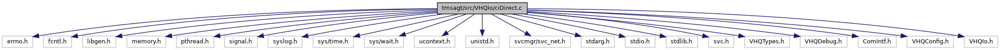

[Macros](#define-members) \| [Functions](#func-members)

`#include <errno.h>`
`#include <fcntl.h>`
`#include <libgen.h>`
`#include <memory.h>`
`#include <pthread.h>`
`#include <signal.h>`
`#include <syslog.h>`
`#include <sys/time.h>`
`#include <sys/wait.h>`
`#include <ucontext.h>`
`#include <unistd.h>`
`#include <svcmgr/svc_net.h>`
`#include <stdarg.h>`
`#include <stdio.h>`
`#include <stdlib.h>`
`#include <svc.h>`
`#include "VHQTypes.h"`
`#include "VHQDebug.h"`
`#include "ComIntf.h"`
`#include "VHQConfig.h"`
`#include "VHQIo.h"`

Include dependency graph for ciDirect.c:

|  |  |
|----|----|
| Macros |  |
| #define  | [ARRAY_SIZEOF](#a083b03c5af4ad6035a7b2879c523150c)(x)   (sizeof(x)/sizeof(x\[0\])) |

|  |  |
|----|----|
| Functions |  |
| void  | [CheckAndInitLog](#af8673306bb95c4811b31e9f1dc1a8ca3) () |
| int  | [InitVXComms](#a63a54b0dd95a1b95c327144de73f8e0b) (bool NWIF_start) |
| void  | [StartNetwork](#a14218cafcf8cb7b241304a53c65c98a9) (void) |
| void  | [StartCommEngine](#a4e9cf7d5bfbf9b781773b0f768525a5d) (void) |
| int  | [internal_GetMACAddress](#a07cc05691d9ade5eac44bf6759c347fb) (char \*pszMACAddress, int iMACAddressBufLen) |
| int  | [internal_GetIPAddress](#afb24d619e9278eec2d27a3c03376d1c3) (char \*pszIPAddress, int iIPAddressBufLen) |
| int  | [Direct_init](#aa2fc20b9443dc4d15ab2eba9b01adda5) (char \*pszSettings1, char \*pszSettings2, char \*pszSettings3, char \*pszSettings4) |
| int  | [Direct_deinit](#ab09a84c65f71594a576ecacf8e81d333) (void) |
| int  | [Direct_open](#aa81d23033a1408b30fae9c448bc7531f) (CommOpenData \*pData) |
| int  | [Direct_close](#a7954a2c6c7d3d3efda7cce26fe52209a) (CommOpenData \*pData) |
| int  | [Direct_status](#a0f3afebb197058907fc1612a1d844180) (void \*pData, bool \*bUp, char \*pszIpAddress, char \*pszMacAddr) |
| int  | [Direct_NetConn](#a4c56fad0e52ab28ecc97e80365f24812) (void) |
| int  | [Direct_NetDisconn](#a8b0c66a848f30fe9db652a958cd3fab8) (bool bForceDisconnect) |
| const char \*  | [Direct_ErrString](#a7add574cf5e9636377da0e5ed064b54f) (int err) |

## DetailedDescription {#detailed-description}

File for Direct operating mode connectivity.

## MacroDefinition Documentation {#macro-definition-documentation}

## ARRAY_SIZEOF 

#define ARRAY_SIZEOF

## FunctionDocumentation {#function-documentation}

## CheckAndInitLog() 

void CheckAndInitLog

## Direct_close() 

int Direct_close

## Direct_deinit() 

int Direct_deinit

## Direct_ErrString() 

const char\* Direct_ErrString

## Direct_init() 

int Direct_init

## Direct_NetConn() 

int Direct_NetConn

This function establishes connection to network and set the successful connection type if operating mode is direct.

### Returns

0, if network connect is successful.

## Direct_NetDisconn() 

int Direct_NetDisconn

This function is the disconnect from network if operating mode is direct.

**Parameters**

\[in\] **bForceDisconnect** =TRUE, if force disconnect is active

### Returns

0, if network disconnect is successful.

## Direct_open() 

int Direct_open

## Direct_status() 

int Direct_status

This function returns the IP address and Mac address if connection status is active

**Parameters**

\[in\] **pData** = UNUSED. \[out\] **bUp** = to store status, TRUE if active/IP address is present \[out\] **pszIpAddress** = to store IP Address \[out\] **pszMacAddr** = to store Mac address

### Returns

int -1, if not attached; 0, if connection attached

## InitVXComms() 

int InitVXComms

## internal_GetIPAddress() 

int internal_GetIPAddress

Function gather the IP address information.

**Parameters**

\[out\] **pszIPAddress** = pointer to IP address \[out\] **iIPAddressBufLen** = IP address buffer length

### Returns

int 0, if success

## internal_GetMACAddress() 

int internal_GetMACAddress

Function gather the MAC address information.

**Parameters**

\[out\] **pszMACAddress** = pointer to MAC address \[out\] **iMACAddressBufLen** = MAC address buffer length

### Returns

int 0,if success

## StartCommEngine() 

void StartCommEngine

## StartNetwork() 

void StartNetwork

