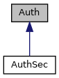

[Public Member Functions](#pub-methods) \| [Static Public Member Functions](#pub-static-methods) \| [Friends](#friends)

Inheritance diagram for Auth:

\[<a href="graph_legend.md">legend</a>\]

|  |  |
|----|----|
| Public Member Functions |  |
| bool  | [auth](#a85e67481b08ac33c3000d56d64dd2922) (enum <a href="crypt_8h.md#ab97c53cf460f4280eb94c660cb5e357d">AuthStep</a> as, unsigned char \*in, unsigned short in_size, unsigned char \*out, unsigned short \*out_size) |
| virtual bool  | [check_script](#a8cbbb48867a5f9cb2469169b1d494c07) ()=0 |
| virtual bool  | [calculate_CMAC](#a72515d1cf7bf20870d6979365f3033a9) (<a href="crypt_8h.md#adcc10b90a6f6d8e58954648e01763711">Inputype</a> type, const char \*fileToMAC, unsigned char \*dataToMAC, unsigned dataSize, unsigned char \*MAC)=0 |
| virtual bool  | [encrypt](#aaea1d16d32c15533a4083c393e6cec2c) (unsigned char \*data, unsigned long dataSize, unsigned char \*encryptedData, unsigned long \*encryptedDataSize)=0 |
| virtual bool  | [decrypt](#af520b0e5403987294b00d0128f02d26e) (unsigned char \*data, unsigned long dataSize, unsigned char \*decryptedData, unsigned long \*decryptedDataSize)=0 |

|  |  |
|----|----|
| Static Public Member Functions |  |
| static <a href="class_auth.md">Auth</a> \*  | [instance](#a34a7f34048a76d137e09e234c99a76d5) () |

|         |                                               |
|---------|-----------------------------------------------|
| Friends |                                               |
| class   | [AuthSec](#a927c4ec4747518163a64b72d48c82a18) |

## MemberFunction Documentation {#member-function-documentation}

## auth() 

bool auth

inline

## calculate_CMAC() 

virtual bool calculate_CMAC

pure virtual

Implemented in <a href="class_auth_sec.md#a72ff4516c6078c2f4ceda1515242a19d">AuthSec</a>.

## check_script() 

virtual bool check_script

pure virtual

Implemented in <a href="class_auth_sec.md#a6c0da48bde8b51d19ecb7fb4c723624a">AuthSec</a>.

## decrypt() 

virtual bool decrypt

pure virtual

Implemented in <a href="class_auth_sec.md#a1c31978e1efd0a840145ffe3ecc843c3">AuthSec</a>.

## encrypt() 

virtual bool encrypt

pure virtual

Implemented in <a href="class_auth_sec.md#a10480c2f42d70c4fc3a332d9d2bea3bf">AuthSec</a>.

## instance() 

<a href="class_auth.md">Auth</a> \* instance

static

## FriendsAnd Related Function Documentation {#friends-and-related-function-documentation}

## AuthSec 

friend class <a href="class_auth_sec.md">AuthSec</a>

friend

------------------------------------------------------------------------

The documentation for this class was generated from the following file:

- sdi/src/<a href="crypt_8cpp.md">crypt.cpp</a>
