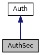

[Public Member Functions](#pub-methods) \| [Friends](#friends)

Inheritance diagram for AuthSec:

\[<a href="graph_legend.md">legend</a>\]

Collaboration diagram for AuthSec:

\[<a href="graph_legend.md">legend</a>\]

|  |  |
|----|----|
| Public Member Functions |  |
| bool  | [check_script](#a6c0da48bde8b51d19ecb7fb4c723624a) () |
| bool  | [calculate_CMAC](#a72ff4516c6078c2f4ceda1515242a19d) (<a href="crypt_8h.md#adcc10b90a6f6d8e58954648e01763711">Inputype</a> type, const char \*fileToMAC, unsigned char \*dataToMAC, unsigned dataSize, unsigned char \*MAC) |
| bool  | [encrypt](#a10480c2f42d70c4fc3a332d9d2bea3bf) (unsigned char \*data, unsigned long dataSize, unsigned char \*encryptedData, unsigned long \*encryptedDataSize) |
| bool  | [decrypt](#a1c31978e1efd0a840145ffe3ecc843c3) (unsigned char \*data, unsigned long dataSize, unsigned char \*decryptedData, unsigned long \*decryptedDataSize) |
|  Public Member Functions inherited from <a href="class_auth.md">Auth</a> |  |
| bool  | <a href="class_auth.md#a85e67481b08ac33c3000d56d64dd2922">auth</a> (enum <a href="crypt_8h.md#ab97c53cf460f4280eb94c660cb5e357d">AuthStep</a> as, unsigned char \*in, unsigned short in_size, unsigned char \*out, unsigned short \*out_size) |

|         |                                            |
|---------|--------------------------------------------|
| Friends |                                            |
| class   | [Auth](#abfe5b7d9add6f85e1fcd0b604262ccd3) |

|  |  |
|----|----|
| Additional Inherited Members |  |
|  Static Public Member Functions inherited from <a href="class_auth.md">Auth</a> |  |
| static <a href="class_auth.md">Auth</a> \*  | <a href="class_auth.md#a34a7f34048a76d137e09e234c99a76d5">instance</a> () |

## MemberFunction Documentation {#member-function-documentation}

## calculate_CMAC() 

bool calculate_CMAC

inlinevirtual

Implements <a href="class_auth.md#a72515d1cf7bf20870d6979365f3033a9">Auth</a>.

## check_script() 

bool check_script

inlinevirtual

Implements <a href="class_auth.md#a8cbbb48867a5f9cb2469169b1d494c07">Auth</a>.

## decrypt() 

bool decrypt

inlinevirtual

Implements <a href="class_auth.md#af520b0e5403987294b00d0128f02d26e">Auth</a>.

## encrypt() 

bool encrypt

inlinevirtual

Implements <a href="class_auth.md#aaea1d16d32c15533a4083c393e6cec2c">Auth</a>.

## FriendsAnd Related Function Documentation {#friends-and-related-function-documentation}

## Auth 

friend class <a href="class_auth.md">Auth</a>

friend

------------------------------------------------------------------------

The documentation for this class was generated from the following file:

- sdi/src/<a href="crypt_8cpp.md">crypt.cpp</a>
