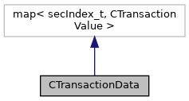

[Public Member Functions](#pub-methods) \| [Static Public Attributes](#pub-static-attribs)

`#include <`<a href="_c_transaction_data_8h_source.md">CTransactionData.h</a>`>`

Inheritance diagram for CTransactionData:

\[<a href="graph_legend.md">legend</a>\]

Collaboration diagram for CTransactionData:

\[<a href="graph_legend.md">legend</a>\]

|  |  |
|----|----|
| Public Member Functions |  |
|   | [CTransactionData](#a11419fb46b809a3ad9744800aa1e4ad2) (const std::string &jsonString) |
|   | [CTransactionData](#a67f53d824e4feb6d2bd0a835edf0e70b) () |
| virtual  | [\~CTransactionData](#a0f5b4a60590e085453de19319f1eebfc) () |
| std::string  | [dump](#a7de861082da81700dd1481385268c4ff) () const |
| void  | [load](#a52363cd24719cd696e4b260fdac780db) (const std::string &jsonString) |
| bool  | [isAvailable](#af46b3cdc245b72805647d3f73b93fdb5) (const <a href="namespacecom__adksec__cmd.md#ad15b3c697f22fd80a8a42e5547c5b8e4">secIndex_t</a> &key) const |

|  |  |
|----|----|
| Static Public Attributes |  |
| static const <a href="namespacecom__adksec__cmd.md#ad15b3c697f22fd80a8a42e5547c5b8e4">secIndex_t</a>  | [TagKeySetID](#ada66db3e2e7ffdf208da77c358a130d8) |
| static const <a href="namespacecom__adksec__cmd.md#ad15b3c697f22fd80a8a42e5547c5b8e4">secIndex_t</a>  | [TagIPPUseBinFormat](#a94a7b675572189cf4c3786b8da85f2dd) |
| static const <a href="namespacecom__adksec__cmd.md#ad15b3c697f22fd80a8a42e5547c5b8e4">secIndex_t</a>  | [TagADEEncMode](#af5e1be69936d0509ab4c7e5be5974f9d) |
| static const <a href="namespacecom__adksec__cmd.md#ad15b3c697f22fd80a8a42e5547c5b8e4">secIndex_t</a>  | [TagBendigoKEKFlag](#a06433ac0e068cf8c70d478d0512efa40) |
| static const <a href="namespacecom__adksec__cmd.md#ad15b3c697f22fd80a8a42e5547c5b8e4">secIndex_t</a>  | [TagAS2805Func](#a76a30cfa9bd719a3e5a4d6464f1a8b01) |
| static const <a href="namespacecom__adksec__cmd.md#ad15b3c697f22fd80a8a42e5547c5b8e4">secIndex_t</a>  | [TagVSSDUKPTMaskPIN](#a2184e7cd21e24db145ac95c0d4188878) |
| static const <a href="namespacecom__adksec__cmd.md#ad15b3c697f22fd80a8a42e5547c5b8e4">secIndex_t</a>  | [TagVSSDUKPTMaskMAC](#ae1f03aa34f88ca2a2d2b48d20dc42a17) |
| static const <a href="namespacecom__adksec__cmd.md#ad15b3c697f22fd80a8a42e5547c5b8e4">secIndex_t</a>  | [TagVSSDUKPTMaskENC](#aaa6658b9d075bad211bbcb692b3080c7) |
| static const <a href="namespacecom__adksec__cmd.md#ad15b3c697f22fd80a8a42e5547c5b8e4">secIndex_t</a>  | [setDUKPTmasks](#af99ef157338b014adb407416d0745b8f) |
| static const <a href="namespacecom__adksec__cmd.md#ad15b3c697f22fd80a8a42e5547c5b8e4">secIndex_t</a>  | [TagHostName](#af5bec0d34599f4c601103a062bdf69ed) |
| static const <a href="namespacecom__adksec__cmd.md#ad15b3c697f22fd80a8a42e5547c5b8e4">secIndex_t</a>  | [TagPAN](#a790affb24f06596955ee45cfdf8e7e75) |
|   | ASCII format expected. [More\...](#a790affb24f06596955ee45cfdf8e7e75)  |
| static const <a href="namespacecom__adksec__cmd.md#ad15b3c697f22fd80a8a42e5547c5b8e4">secIndex_t</a>  | [TagCHName](#ac59568cd75a9ad51d16b66886ee492ef) |
|   | ASCII format expected. [More\...](#ac59568cd75a9ad51d16b66886ee492ef)  |
| static const <a href="namespacecom__adksec__cmd.md#ad15b3c697f22fd80a8a42e5547c5b8e4">secIndex_t</a>  | [TagMID](#a8d11900f080068bd258c318d0c316701) |
|   | ASCII format expected. [More\...](#a8d11900f080068bd258c318d0c316701)  |
| static const <a href="namespacecom__adksec__cmd.md#ad15b3c697f22fd80a8a42e5547c5b8e4">secIndex_t</a>  | [TagPANandCVV](#a45d530ec3b75ebf0dde157237ce2bdc6) |
|   | ASCII format expected. [More\...](#a45d530ec3b75ebf0dde157237ce2bdc6)  |
| static const <a href="namespacecom__adksec__cmd.md#ad15b3c697f22fd80a8a42e5547c5b8e4">secIndex_t</a>  | [TagTrack1](#ad1e31d711238acdeabc67b3bc8cb3276) |
|   | ASCII format expected. [More\...](#ad1e31d711238acdeabc67b3bc8cb3276)  |
| static const <a href="namespacecom__adksec__cmd.md#ad15b3c697f22fd80a8a42e5547c5b8e4">secIndex_t</a>  | [TagTrack2](#a067a929e2de18912d1b4ef207502c62e) |
|   | ASCII format expected. [More\...](#a067a929e2de18912d1b4ef207502c62e)  |
| static const <a href="namespacecom__adksec__cmd.md#ad15b3c697f22fd80a8a42e5547c5b8e4">secIndex_t</a>  | [TagTrack3](#acc4988f66189ea867e25ee2d3a684d04) |
|   | ASCII format expected. [More\...](#acc4988f66189ea867e25ee2d3a684d04)  |
| static const <a href="namespacecom__adksec__cmd.md#ad15b3c697f22fd80a8a42e5547c5b8e4">secIndex_t</a>  | [TagAlphaNum](#a6aeff9d05a4f0cf904432b3833b3f081) |
|   | ASCII format expected. [More\...](#a6aeff9d05a4f0cf904432b3833b3f081)  |
| static const <a href="namespacecom__adksec__cmd.md#ad15b3c697f22fd80a8a42e5547c5b8e4">secIndex_t</a>  | [TagByteArray](#aa0a0a34eecf5ca7d5569f88509023c3b) |
|   | ASCII format expected. [More\...](#aa0a0a34eecf5ca7d5569f88509023c3b)  |
| static const <a href="namespacecom__adksec__cmd.md#ad15b3c697f22fd80a8a42e5547c5b8e4">secIndex_t</a>  | [TagCardDataType](#a291eba7cf1f9f49492153a2bebdfb6f0) |
|   | ASCII format expected. [More\...](#a291eba7cf1f9f49492153a2bebdfb6f0)  |
| static const <a href="namespacecom__adksec__cmd.md#ad15b3c697f22fd80a8a42e5547c5b8e4">secIndex_t</a>  | [TagObfuscatedPAN](#ab463c9122c9a52b6bc2ea1c4331dcb90) |
|   | ASCII format provided. [More\...](#ab463c9122c9a52b6bc2ea1c4331dcb90)  |
| static const <a href="namespacecom__adksec__cmd.md#ad15b3c697f22fd80a8a42e5547c5b8e4">secIndex_t</a>  | [TagObfuscatedCHName](#a26749bcf257e18f46431126e34eadbdb) |
|   | ASCII format provided. [More\...](#a26749bcf257e18f46431126e34eadbdb)  |
| static const <a href="namespacecom__adksec__cmd.md#ad15b3c697f22fd80a8a42e5547c5b8e4">secIndex_t</a>  | [TagObfuscatedTrack1](#a50a3db76f34b17c22ace8c88bfaf08fa) |
|   | ASCII format provided. [More\...](#a50a3db76f34b17c22ace8c88bfaf08fa)  |
| static const <a href="namespacecom__adksec__cmd.md#ad15b3c697f22fd80a8a42e5547c5b8e4">secIndex_t</a>  | [TagObfuscatedTrack2](#a1b980f4e82826e3c4bff07e0eec7cc2d) |
|   | ASCII format provided. [More\...](#a1b980f4e82826e3c4bff07e0eec7cc2d)  |
| static const <a href="namespacecom__adksec__cmd.md#ad15b3c697f22fd80a8a42e5547c5b8e4">secIndex_t</a>  | [TagStan](#a967306a5cbb80918a0e54cd26a5fa664) |
| static const <a href="namespacecom__adksec__cmd.md#ad15b3c697f22fd80a8a42e5547c5b8e4">secIndex_t</a>  | [TagTransAmount](#add2cc0b255a1edd21bca8c9c873201df) |
| static const <a href="namespacecom__adksec__cmd.md#ad15b3c697f22fd80a8a42e5547c5b8e4">secIndex_t</a>  | [TagVSSPropData](#a88a475df15f6326ae91556a87a8b6d56) |
|   | proprietary data passed to VSS scripts [More\...](#a88a475df15f6326ae91556a87a8b6d56)  |
| static const <a href="namespacecom__adksec__cmd.md#ad15b3c697f22fd80a8a42e5547c5b8e4">secIndex_t</a>  | [TagFlagBypassKsnIncr](#a534911360b6c2283c71eb96473875dbe) |
| static const <a href="namespacecom__adksec__cmd.md#ad15b3c697f22fd80a8a42e5547c5b8e4">secIndex_t</a>  | [TagNextKSNState](#aabd8c4732ca2db77bd843a7523863e27) |
|   | int expected [More\...](#aabd8c4732ca2db77bd843a7523863e27)  |
| static const <a href="namespacecom__adksec__cmd.md#ad15b3c697f22fd80a8a42e5547c5b8e4">secIndex_t</a>  | [Tag0PinBlockRequest](#a3a77528eab825d9fbc8df0a24cb584c2) |
|   | bool do 0PinBlockRequest [More\...](#a3a77528eab825d9fbc8df0a24cb584c2)  |
| static const <a href="namespacecom__adksec__cmd.md#ad15b3c697f22fd80a8a42e5547c5b8e4">secIndex_t</a>  | [\_TDindex](#a8f0c510e4d1b27f2aa280d53a676a001) |
|   | internally used for secEncryptTransactionData to refer TD-Value to be encrypted [More\...](#a8f0c510e4d1b27f2aa280d53a676a001)  |
| static const <a href="namespacecom__adksec__cmd.md#ad15b3c697f22fd80a8a42e5547c5b8e4">secIndex_t</a>  | [\_SessionKey](#a085856e50c4d4d2710818e103565ab53) |
|   | internally used to store SessionKey (MSK) [More\...](#a085856e50c4d4d2710818e103565ab53)  |
| static const <a href="namespacecom__adksec__cmd.md#ad15b3c697f22fd80a8a42e5547c5b8e4">secIndex_t</a>  | [TagCryptoRWLegacyDecrypt](#ab5aff0278f7b0482a946cf9008dacb7d) |
| static const <a href="namespacecom__adksec__cmd.md#ad15b3c697f22fd80a8a42e5547c5b8e4">secIndex_t</a>  | [TagTrustConn](#af27061b20519dff632029d078ec76426) |
| static const <a href="namespacecom__adksec__cmd.md#ad15b3c697f22fd80a8a42e5547c5b8e4">secIndex_t</a>  | [TagPeerUID](#ade93de6b51563a3b65ad89b55e97043b) |

## Constructor& Destructor Documentation

## CTransactionData()\[1/2\]  {#ctransactiondata-12}

<a href="classcom__adksec__cmd_1_1_c_transaction_data.md">CTransactionData</a>

## CTransactionData()\[2/2\]  {#ctransactiondata-22}

<a href="classcom__adksec__cmd_1_1_c_transaction_data.md">CTransactionData</a>

## \~CTransactionData() 

virtual \~<a href="classcom__adksec__cmd_1_1_c_transaction_data.md">CTransactionData</a>

virtual

## MemberFunction Documentation {#member-function-documentation}

## dump() 

std::string dump

## isAvailable() 

bool isAvailable

## load() 

void load

## FieldDocumentation {#field-documentation}

## \_SessionKey 

const <a href="namespacecom__adksec__cmd.md#ad15b3c697f22fd80a8a42e5547c5b8e4">secIndex_t</a> \_SessionKey

static

internally used to store SessionKey (MSK)

## \_TDindex 

const <a href="namespacecom__adksec__cmd.md#ad15b3c697f22fd80a8a42e5547c5b8e4">secIndex_t</a> \_TDindex

static

internally used for secEncryptTransactionData to refer TD-Value to be encrypted

## setDUKPTmasks 

const <a href="namespacecom__adksec__cmd.md#ad15b3c697f22fd80a8a42e5547c5b8e4">secIndex_t</a> setDUKPTmasks

static

## Tag0PinBlockRequest 

const <a href="namespacecom__adksec__cmd.md#ad15b3c697f22fd80a8a42e5547c5b8e4">secIndex_t</a> Tag0PinBlockRequest

static

bool do 0PinBlockRequest

## TagADEEncMode 

const <a href="namespacecom__adksec__cmd.md#ad15b3c697f22fd80a8a42e5547c5b8e4">secIndex_t</a> TagADEEncMode

static

## TagAlphaNum 

const <a href="namespacecom__adksec__cmd.md#ad15b3c697f22fd80a8a42e5547c5b8e4">secIndex_t</a> TagAlphaNum

static

ASCII format expected.

## TagAS2805Func 

const <a href="namespacecom__adksec__cmd.md#ad15b3c697f22fd80a8a42e5547c5b8e4">secIndex_t</a> TagAS2805Func

static

## TagBendigoKEKFlag 

const <a href="namespacecom__adksec__cmd.md#ad15b3c697f22fd80a8a42e5547c5b8e4">secIndex_t</a> TagBendigoKEKFlag

static

## TagByteArray 

const <a href="namespacecom__adksec__cmd.md#ad15b3c697f22fd80a8a42e5547c5b8e4">secIndex_t</a> TagByteArray

static

ASCII format expected.

## TagCardDataType 

const <a href="namespacecom__adksec__cmd.md#ad15b3c697f22fd80a8a42e5547c5b8e4">secIndex_t</a> TagCardDataType

static

ASCII format expected.

## TagCHName 

const <a href="namespacecom__adksec__cmd.md#ad15b3c697f22fd80a8a42e5547c5b8e4">secIndex_t</a> TagCHName

static

ASCII format expected.

## TagCryptoRWLegacyDecrypt 

const <a href="namespacecom__adksec__cmd.md#ad15b3c697f22fd80a8a42e5547c5b8e4">secIndex_t</a> TagCryptoRWLegacyDecrypt

static

## TagFlagBypassKsnIncr 

const <a href="namespacecom__adksec__cmd.md#ad15b3c697f22fd80a8a42e5547c5b8e4">secIndex_t</a> TagFlagBypassKsnIncr

static

## TagHostName 

const <a href="namespacecom__adksec__cmd.md#ad15b3c697f22fd80a8a42e5547c5b8e4">secIndex_t</a> TagHostName

static

## TagIPPUseBinFormat 

const <a href="namespacecom__adksec__cmd.md#ad15b3c697f22fd80a8a42e5547c5b8e4">secIndex_t</a> TagIPPUseBinFormat

static

## TagKeySetID 

const <a href="namespacecom__adksec__cmd.md#ad15b3c697f22fd80a8a42e5547c5b8e4">secIndex_t</a> TagKeySetID

static

## TagMID 

const <a href="namespacecom__adksec__cmd.md#ad15b3c697f22fd80a8a42e5547c5b8e4">secIndex_t</a> TagMID

static

ASCII format expected.

## TagNextKSNState 

const <a href="namespacecom__adksec__cmd.md#ad15b3c697f22fd80a8a42e5547c5b8e4">secIndex_t</a> TagNextKSNState

static

int expected

## TagObfuscatedCHName 

const <a href="namespacecom__adksec__cmd.md#ad15b3c697f22fd80a8a42e5547c5b8e4">secIndex_t</a> TagObfuscatedCHName

static

ASCII format provided.

## TagObfuscatedPAN 

const <a href="namespacecom__adksec__cmd.md#ad15b3c697f22fd80a8a42e5547c5b8e4">secIndex_t</a> TagObfuscatedPAN

static

ASCII format provided.

## TagObfuscatedTrack1 

const <a href="namespacecom__adksec__cmd.md#ad15b3c697f22fd80a8a42e5547c5b8e4">secIndex_t</a> TagObfuscatedTrack1

static

ASCII format provided.

## TagObfuscatedTrack2 

const <a href="namespacecom__adksec__cmd.md#ad15b3c697f22fd80a8a42e5547c5b8e4">secIndex_t</a> TagObfuscatedTrack2

static

ASCII format provided.

## TagPAN 

const <a href="namespacecom__adksec__cmd.md#ad15b3c697f22fd80a8a42e5547c5b8e4">secIndex_t</a> TagPAN

static

ASCII format expected.

## TagPANandCVV 

const <a href="namespacecom__adksec__cmd.md#ad15b3c697f22fd80a8a42e5547c5b8e4">secIndex_t</a> TagPANandCVV

static

ASCII format expected.

## TagPeerUID 

const <a href="namespacecom__adksec__cmd.md#ad15b3c697f22fd80a8a42e5547c5b8e4">secIndex_t</a> TagPeerUID

static

## TagStan 

const <a href="namespacecom__adksec__cmd.md#ad15b3c697f22fd80a8a42e5547c5b8e4">secIndex_t</a> TagStan

static

## TagTrack1 

const <a href="namespacecom__adksec__cmd.md#ad15b3c697f22fd80a8a42e5547c5b8e4">secIndex_t</a> TagTrack1

static

ASCII format expected.

## TagTrack2 

const <a href="namespacecom__adksec__cmd.md#ad15b3c697f22fd80a8a42e5547c5b8e4">secIndex_t</a> TagTrack2

static

ASCII format expected.

## TagTrack3 

const <a href="namespacecom__adksec__cmd.md#ad15b3c697f22fd80a8a42e5547c5b8e4">secIndex_t</a> TagTrack3

static

ASCII format expected.

## TagTransAmount 

const <a href="namespacecom__adksec__cmd.md#ad15b3c697f22fd80a8a42e5547c5b8e4">secIndex_t</a> TagTransAmount

static

## TagTrustConn 

const <a href="namespacecom__adksec__cmd.md#ad15b3c697f22fd80a8a42e5547c5b8e4">secIndex_t</a> TagTrustConn

static

## TagVSSDUKPTMaskENC 

const <a href="namespacecom__adksec__cmd.md#ad15b3c697f22fd80a8a42e5547c5b8e4">secIndex_t</a> TagVSSDUKPTMaskENC

static

## TagVSSDUKPTMaskMAC 

const <a href="namespacecom__adksec__cmd.md#ad15b3c697f22fd80a8a42e5547c5b8e4">secIndex_t</a> TagVSSDUKPTMaskMAC

static

## TagVSSDUKPTMaskPIN 

const <a href="namespacecom__adksec__cmd.md#ad15b3c697f22fd80a8a42e5547c5b8e4">secIndex_t</a> TagVSSDUKPTMaskPIN

static

## TagVSSPropData 

const <a href="namespacecom__adksec__cmd.md#ad15b3c697f22fd80a8a42e5547c5b8e4">secIndex_t</a> TagVSSPropData

static

proprietary data passed to VSS scripts

------------------------------------------------------------------------

The documentation for this class was generated from the following file:

- sec/src/api/export/sec/<a href="_c_transaction_data_8h_source.md">CTransactionData.h</a>
