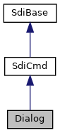

[Public Types](#pub-types) \| [Public Member Functions](#pub-methods) \| [Static Public Member Functions](#pub-static-methods) \| [Static Public Attributes](#pub-static-attribs)

`#include <`<a href="sdi__if_8h_source.md">sdi_if.h</a>`>`

Inheritance diagram for Dialog:

\[<a href="graph_legend.md">legend</a>\]

Collaboration diagram for Dialog:

\[<a href="graph_legend.md">legend</a>\]

|  |  |
|----|----|
| Public Types |  |
| enum   | [REQUEST_CARD_MODE](#af0bf6879fc4a8f67f7e97c1a942fa5f9) { [REQUEST_CARD_STANDARD](#af0bf6879fc4a8f67f7e97c1a942fa5f9a73742a81100dccb66edd3073474298a7) = 0, [REQUEST_CARD_FALLBACK](#af0bf6879fc4a8f67f7e97c1a942fa5f9a0e964199351481bf3a31c450fedb56c2) = 1, [REQUEST_CARD_RETRY](#af0bf6879fc4a8f67f7e97c1a942fa5f9ab35bdf9cd637aed737b708bf3bae3753) = 2 } |

|  |  |
|----|----|
| Public Member Functions |  |
| bool  | [clearScreen](#af2cfde46daedef459919ba6aa8a02b13) (bool epp=true) |
|   | Clear display (24 03) [More\...](#af2cfde46daedef459919ba6aa8a02b13)  |
| int  | [display](#a6c0c8abff6439cb7ff87d62cd27d0934) (const std::string &text, bool epp=true) |
|   | Call *Handle Display* (24 03) [More\...](#a6c0c8abff6439cb7ff87d62cd27d0934)  |
| int  | [secureInput](#aa009968eec1dfccd208de74b02751faf) (bool epp=true) |
|   | Start SDI command *Handle Secure Input* (24 04) [More\...](#aa009968eec1dfccd208de74b02751faf)  |
| int  | [menu](#a107276ae07528d74dcf34e02b20917a9) (bool epp=true) |
|   | Start SDI command *Handle Menu* (24 05) [More\...](#a107276ae07528d74dcf34e02b20917a9)  |
| int  | [requestCard](#a3f9167afa0b6593b06560072bf94be9e) (unsigned char technology, enum [REQUEST_CARD_MODE](#af0bf6879fc4a8f67f7e97c1a942fa5f9) mode=[REQUEST_CARD_STANDARD](#af0bf6879fc4a8f67f7e97c1a942fa5f9a73742a81100dccb66edd3073474298a7), bool epp=true) |
|   | Start SDI command *Handle Card Request Display* (24 06) [More\...](#a3f9167afa0b6593b06560072bf94be9e)  |
| bool  | [idleScreen](#a83a548ca4c3d5b5a73b8ce20bd424d27) (bool epp=true) |
|   | Send SDI command *Display Idle Screen* (24 07) [More\...](#a83a548ca4c3d5b5a73b8ce20bd424d27)  |
| int  | [captureSignature](#a41c8e442425f8a584b0c85e2837807f3) (std::vector\< unsigned char \> &signature, std::string &format, bool epp=true) |
|   | Start SDI command *Handle Signature Capture* (24 08) [More\...](#a41c8e442425f8a584b0c85e2837807f3)  |
| int  | [htmlDialog](#a5051e1a28471ee0017c86d442e2b2aaa) (const std::string &fname, bool epp=true) |
|   | Call SDI command *Handle HTML Dialog* (24 0A) [More\...](#a5051e1a28471ee0017c86d442e2b2aaa)  |
| int  | [getAsyncResult](#a5dc7bec3fd34264255ba456fb5522839) (bool epp=true) |
|   | Get result of asynchronous dialog invocation (24-0B) [More\...](#a5dc7bec3fd34264255ba456fb5522839)  |
| void  | [setTemplate](#ad1a6dff2f535efc5f3a3dd995035a0fc) (unsigned char id) |
|   | Set HTML template identifier (DFA010) [More\...](#ad1a6dff2f535efc5f3a3dd995035a0fc)  |
| void  | [setInputTemplate](#ab224393fe40a4210361e88ba0b662806) (unsigned char id) |
|   | Set input template identifier (DFA007) [More\...](#ab224393fe40a4210361e88ba0b662806)  |
| void  | [setLanguage](#a7152eb5026dd8ba38e3035c947d5d837) (unsigned char language) |
|   | Set language (DFA008) [More\...](#a7152eb5026dd8ba38e3035c947d5d837)  |
| void  | [addData](#ae7f5238392c611ff2aab5ec9c4133bb2) (const std::string &name, const std::string &<a href="_web_service_wrappers_8c.md#a6e248376c0290338633d8137822eb209">value</a>) |
|   | Add display data name-value pair (FFA011, DFA012, DFA013) [More\...](#ae7f5238392c611ff2aab5ec9c4133bb2)  |
| void  | [setTimeout](#a31aa2a3a7a9f7b520295574f62ab78e2) (int seconds) |
|   | Set dialog timeout (DFA005) [More\...](#a31aa2a3a7a9f7b520295574f62ab78e2)  |
| void  | [setOptions](#a2af1ac8a7a1e011b3cb91ed6dfed6780) (unsigned options) |
|   | Set dialog options (DFA13D) [More\...](#a2af1ac8a7a1e011b3cb91ed6dfed6780)  |
| void  | [setEnterKeyLabel](#a8940f68dab436acbc2deecd241e21fdf) (const std::string &label) |
|   | Set label for the *Enter* soft key or the key helper in the dialog control bar (DFA13E) [More\...](#a8940f68dab436acbc2deecd241e21fdf)  |
| void  | [setClearKeyLabel](#a032e7501f742161353f86d24f43b454f) (const std::string &label) |
|   | Set label for the *Clear* soft key or the key helper in the dialog control bar (DFA13F) [More\...](#a032e7501f742161353f86d24f43b454f)  |
| void  | [setCancelKeyLabel](#af3405c95bd577f766c6b1e5a81948cb7) (const std::string &label) |
|   | Set label for the *Cancel* soft key or the key helper in the dialog control bar (DFA140) [More\...](#af3405c95bd577f766c6b1e5a81948cb7)  |
| void  | [setUpKeyLabel](#a72553dc05369fb24a3fddea8ed66e1be) (const std::string &label) |
|   | Set label for the *up* soft key or the key helper in the dialog control bar (DFA141) [More\...](#a72553dc05369fb24a3fddea8ed66e1be)  |
| void  | [setDownKeyLabel](#afb1517ea2e95e7097126867fbef58ce2) (const std::string &label) |
|   | Set label for the *down* soft key or the key helper in the dialog control bar (DFA142) [More\...](#afb1517ea2e95e7097126867fbef58ce2)  |
| void  | [setHeader](#a61125086bb53688ce268bc5a2bbcede8) (const std::string &text) |
|   | Set Text shown in the header area (DFA143) [More\...](#a61125086bb53688ce268bc5a2bbcede8)  |
| void  | [setBeep](#a7fc79916b4e14b4d6ae8f74e572ac0bf) (bool active=true) |
|   | Enable/Disable a beep played when the dialog appears (DFA00D) [More\...](#a7fc79916b4e14b4d6ae8f74e572ac0bf)  |
| void  | [addAction](#a2051188a152cb63c78382dc7f86cc59d) (const std::string &key, const std::string &action) |
|   | Set additional key action (FFA106, DFA13B, DFA13C) [More\...](#a2051188a152cb63c78382dc7f86cc59d)  |
| void  | [setMaskingCharacter](#a0fa27d6c8a486d5f5b6b38475d3f6f38) (char c) |
|   | Set masking character (DFA019) [More\...](#a0fa27d6c8a486d5f5b6b38475d3f6f38)  |
| void  | [setAlternativeInputFormat](#a3e468348fad6b657f0cea8f3ccfaa6f6) (const char \*f) |
|   | Configure alternative input format string (DFA01A) [More\...](#a3e468348fad6b657f0cea8f3ccfaa6f6)  |
| void  | [setAmount](#ac0d27bf33ac613abc2f2b08af96df81c) (const unsigned char \*amount) |
|   | Configure amount (9F02) [More\...](#ac0d27bf33ac613abc2f2b08af96df81c)  |
| void  | [setCurrency](#adc08049865cac87bb09f0c5876b41f11) (const unsigned char \*currency) |
|   | Configure currency (5F2A) [More\...](#adc08049865cac87bb09f0c5876b41f11)  |
| void  | [setTransactionType](#aa956851ceaa9d0039f075d33a06b7dcb) (unsigned char txnType) |
|   | Configure transaction type (9C) for *Handle Card Request Display* [More\...](#aa956851ceaa9d0039f075d33a06b7dcb)  |
| void  | [setMenuText](#ac5ef50bbaaa52c79b16d49970b93b24d) (const std::string &text) |
|   | Set menu text prompt (DFA00A) for SDI command *Handle Menu* [More\...](#ac5ef50bbaaa52c79b16d49970b93b24d)  |
| void  | [addMenuItem](#aed5555cc6d1b19d2b0a178f35d1a27d3) (const std::string &item) |
|   | add menu item (DFA00B) for SDI command *Handle Menu* [More\...](#aed5555cc6d1b19d2b0a178f35d1a27d3)  |
| void  | [setPreSelected](#ae56dab77384736efbb904157cabb03b5) (unsigned char itemNumber) |
|   | Set a preselected item other than the first or disable pre-selection (DFA00C) [More\...](#ae56dab77384736efbb904157cabb03b5)  |
| void  | [setAdminMenu](#a01cb9f5c09499435538878fd501dd224) (unsigned char adminMenu) |
|   | Enable showing of Info/Menu softkeys/keyhelpers or control admin menu access for idle screen to display (DFA155). This tag is ignored, if administration mode is disabled (default). [More\...](#a01cb9f5c09499435538878fd501dd224)  |
| unsigned char  | [getSelected](#abd51c3d14551af1fc7277e7d261c1973) () |
|   | Get selected item number (DFA00C) from *Handle Menu* invocation. [More\...](#abd51c3d14551af1fc7277e7d261c1973)  |
| std::string  | [get](#ac964dbd8165ee6a2f065636135a95bda) (const std::string &name) |
|   | Get output data of dialog invocation (FFA014, DFA015, DFA016) [More\...](#ac964dbd8165ee6a2f065636135a95bda)  |
| std::vector\< std::string \>  | [getInputFieldNames](#a00193ad63c0bc05a78ef44ecedfa7c52) () |
|   | List up data input field names found in the dialog invocation result (FFA014, DFA015) [More\...](#a00193ad63c0bc05a78ef44ecedfa7c52)  |
|  Public Member Functions inherited from <a href="classlibsdi_1_1_sdi_cmd.md">SdiCmd</a> |  |
|   | <a href="classlibsdi_1_1_sdi_cmd.md#a9a5f0b856a4b8e0f337770f1fa841c80">SdiCmd</a> () |
| virtual  | <a href="classlibsdi_1_1_sdi_cmd.md#add17dace52a0c4b8f6004f7bcc867e3e">~SdiCmd</a> () |
| enum <a href="namespacelibsdi.md#a0af9b7a9de719071122f396865ecebc9">SDI_SW12</a>  | <a href="classlibsdi_1_1_sdi_cmd.md#a59300a399fbda10c562a2470fc4cde52">sendReceive</a> (unsigned char cla, unsigned char ins, unsigned char p1=0, unsigned char p2=0, unsigned maxResponseSize=2048) |
|   | Generic SDI command exchange function combining sending of request, waiting and receiving the response. <a href="classlibsdi_1_1_sdi_cmd.md#a59300a399fbda10c562a2470fc4cde52">More...</a>  |
| int  | <a href="classlibsdi_1_1_sdi_cmd.md#adf6959d0550be4ff756c3ee4b7f104fe">send</a> (unsigned char cla, unsigned char ins, unsigned char p1=0, unsigned char p2=0) |
|   | Like <a href="classlibsdi_1_1_sdi_cmd.md#a59300a399fbda10c562a2470fc4cde52">sendReceive()</a> but without waiting for response. <a href="classlibsdi_1_1_sdi_cmd.md#adf6959d0550be4ff756c3ee4b7f104fe">More...</a>  |
| enum <a href="namespacelibsdi.md#a0af9b7a9de719071122f396865ecebc9">SDI_SW12</a>  | <a href="classlibsdi_1_1_sdi_cmd.md#a22eddbbef80354a4641b55828346c7d7">receive</a> (unsigned maxResponseSize=2048) |
|   | Receive SDI response after request has been send with <a href="classlibsdi_1_1_sdi_cmd.md#adf6959d0550be4ff756c3ee4b7f104fe">send()</a> and data availability has been signaled. <a href="classlibsdi_1_1_sdi_cmd.md#a22eddbbef80354a4641b55828346c7d7">More...</a>  |
| void  | <a href="classlibsdi_1_1_sdi_cmd.md#ae460ac8618ec349ff0289c578539d9f2">set</a> (const char \*path, int <a href="_web_service_wrappers_8c.md#a6e248376c0290338633d8137822eb209">value</a>, unsigned fixedLength=0) |
|   | Set integer data object SDI command. <a href="classlibsdi_1_1_sdi_cmd.md#ae460ac8618ec349ff0289c578539d9f2">More...</a>  |
| void  | <a href="classlibsdi_1_1_sdi_cmd.md#a1ec79e2e0211c6c8ee229ba779ec9eff">set</a> (const char \*path, uint32_t <a href="_web_service_wrappers_8c.md#a6e248376c0290338633d8137822eb209">value</a>, unsigned fixedLength=0) |
|   | Set unsigned integer data object SDI command. <a href="classlibsdi_1_1_sdi_cmd.md#a1ec79e2e0211c6c8ee229ba779ec9eff">More...</a>  |
| void  | <a href="classlibsdi_1_1_sdi_cmd.md#ac72a9a24645c216539ab422b50a763cb">set</a> (const char \*path, const unsigned char \*data, unsigned dataLen) |
|   | Set byte array data object in SDI command. <a href="classlibsdi_1_1_sdi_cmd.md#ac72a9a24645c216539ab422b50a763cb">More...</a>  |
| void  | <a href="classlibsdi_1_1_sdi_cmd.md#acae91bc646226025ace047bdba7a2d5d">set</a> (const char \*path, unsigned char byteValue) |
|   | Set single byte value in SDI command. <a href="classlibsdi_1_1_sdi_cmd.md#acae91bc646226025ace047bdba7a2d5d">More...</a>  |
| void  | <a href="classlibsdi_1_1_sdi_cmd.md#a5c4ad2fa43dc552bccc10404a5bd28d0">set</a> (const char \*path, const std::vector\< unsigned char \> &data) |
|   | Set byte array data object in SDI command. <a href="classlibsdi_1_1_sdi_cmd.md#a5c4ad2fa43dc552bccc10404a5bd28d0">More...</a>  |
| void  | <a href="classlibsdi_1_1_sdi_cmd.md#aa6eb7cd81eecfd63f2ccb5980213e37c">set</a> (const char \*path, const std::string &<a href="_web_service_wrappers_8c.md#a6e248376c0290338633d8137822eb209">value</a>) |
|   | Set character data object in SDI command. <a href="classlibsdi_1_1_sdi_cmd.md#aa6eb7cd81eecfd63f2ccb5980213e37c">More...</a>  |
| void  | <a href="classlibsdi_1_1_sdi_cmd.md#a365ef386b964414cd160cc03e5063745">setCommandDestination</a> (bool epp, bool force=false) |
|   | Set command destination for systems with EPP Unless force the command destination is set only if parameter epp is true. <a href="classlibsdi_1_1_sdi_cmd.md#a365ef386b964414cd160cc03e5063745">More...</a>  |
| virtual void  | <a href="classlibsdi_1_1_sdi_cmd.md#aae048282c7011eedc2e0492f6421ea73">clear</a> () |
|   | Remove all SDI command command input data. <a href="classlibsdi_1_1_sdi_cmd.md#aae048282c7011eedc2e0492f6421ea73">More...</a>  |
| virtual void  | <a href="classlibsdi_1_1_sdi_cmd.md#a509a30dbc3c5bb52a8ceb38bedad6e82">clear</a> (const char \*path) |
|   | Remove single input data stored in <a href="classlibsdi_1_1_sdi_cmd.md#a2b7c2d6ae6cb8a37cd3cc6c2a053abbc">dataIn</a>. <a href="classlibsdi_1_1_sdi_cmd.md#a509a30dbc3c5bb52a8ceb38bedad6e82">More...</a>  |
| virtual void  | <a href="classlibsdi_1_1_sdi_cmd.md#a80eff6d974183e99f91c034c49d2ecde">clearResults</a> () |
|   | Remove all SDI response data. <a href="classlibsdi_1_1_sdi_cmd.md#a80eff6d974183e99f91c034c49d2ecde">More...</a>  |
| void  | <a href="classlibsdi_1_1_sdi_cmd.md#a9490be5475acb6b165642dd2c3d1caf2">importResults</a> (const <a href="classlibsdi_1_1_sdi_cmd.md">SdiCmd</a> &intermediate) |
|   | Transfer status word, client error and response data from an intermediate command while keeping command input data. <a href="classlibsdi_1_1_sdi_cmd.md#a9490be5475acb6b165642dd2c3d1caf2">More...</a>  |
| void  | <a href="classlibsdi_1_1_sdi_cmd.md#a33a1327fd18f767afb4baa2e5a814455">importResults</a> (const unsigned char \*<a href="classlibsdi_1_1_sdi_base.md#abc00684400484823da87a8e9d3f06267">sw12</a>, const unsigned char \*tlvData, unsigned tlvSize) |
|   | Inject result data from a call back. <a href="classlibsdi_1_1_sdi_cmd.md#a33a1327fd18f767afb4baa2e5a814455">More...</a>  |
| bool  | <a href="classlibsdi_1_1_sdi_cmd.md#a733bf780a710be27b4b3d95bd148e45c">get</a> (const char \*path, int &<a href="_web_service_wrappers_8c.md#a6e248376c0290338633d8137822eb209">value</a>) |
| bool  | <a href="classlibsdi_1_1_sdi_cmd.md#aacea549b9a51b2341447610bfd407f68">get</a> (const char \*path, uint32_t &<a href="_web_service_wrappers_8c.md#a6e248376c0290338633d8137822eb209">value</a>) |
| int  | <a href="classlibsdi_1_1_sdi_cmd.md#a68f21c216cef62cc1922cc25b07d241a">get</a> (const char \*path, unsigned char \*buffer, unsigned bufferSize) |
| bool  | <a href="classlibsdi_1_1_sdi_cmd.md#aa3551e32ad6b0779ce2597e502602c75">get</a> (const char \*path, unsigned char &<a href="_web_service_wrappers_8c.md#a6e248376c0290338633d8137822eb209">value</a>) |
| bool  | <a href="classlibsdi_1_1_sdi_cmd.md#a5b5da404e34fc6cc0d5f989e5a1ef75e">get</a> (const char \*path, std::vector\< unsigned char \> &buffer) |
| bool  | <a href="classlibsdi_1_1_sdi_cmd.md#acdc1d042dccffeb62ba2859c9d16a87a">get</a> (const char \*path, std::string &<a href="_web_service_wrappers_8c.md#a6e248376c0290338633d8137822eb209">value</a>) |
| std::string  | <a href="classlibsdi_1_1_sdi_cmd.md#ac8fbd8404dfbc8ef830c77842542f38d">getString</a> (const char \*path) |
|  Public Member Functions inherited from <a href="classlibsdi_1_1_sdi_base.md">SdiBase</a> |  |
|   | <a href="classlibsdi_1_1_sdi_base.md#ad34d14385bdce6579d34f049c6d8dee5">SdiBase</a> () |
| enum <a href="namespacelibsdi.md#a0af9b7a9de719071122f396865ecebc9">SDI_SW12</a>  | <a href="classlibsdi_1_1_sdi_base.md#a4058a7890507b92a38f3921ff4bf863b">getSdiSw12</a> () |
| int  | <a href="classlibsdi_1_1_sdi_base.md#a03cfc4186ba19fa866f27a0c12dbb4ad">getAdditionalResultValue</a> () |
|   | Access Additional Result Value if returned in SDI response. <a href="classlibsdi_1_1_sdi_base.md#a03cfc4186ba19fa866f27a0c12dbb4ad">More...</a>  |
| <a href="namespacelibsdi.md#a88afe55c2211351a88265153f28797e4">SDICLIENT_ERROR</a>  | <a href="classlibsdi_1_1_sdi_base.md#a167a672bfb8c6f222c4b2a255b053aec">getClientError</a> () |
|   | Access client side error codes. <a href="classlibsdi_1_1_sdi_base.md#a167a672bfb8c6f222c4b2a255b053aec">More...</a>  |
| enum <a href="namespacelibsdi.md#a0af9b7a9de719071122f396865ecebc9">SDI_SW12</a>  | <a href="classlibsdi_1_1_sdi_base.md#a23032d620c1f454fc5f00ff4f2f4ceb7">receiveSW12</a> () |
|   | Receive SDI server response with no data. <a href="classlibsdi_1_1_sdi_base.md#a23032d620c1f454fc5f00ff4f2f4ceb7">More...</a>  |
| void  | <a href="classlibsdi_1_1_sdi_base.md#ac8bb3912a3ce86b15842e79d0b421204">clear</a> () |
|   | clear result data obtained from SDI communication <a href="classlibsdi_1_1_sdi_base.md#ac8bb3912a3ce86b15842e79d0b421204">More...</a>  |
| void  | <a href="classlibsdi_1_1_sdi_base.md#a7ffb7b7b3ae189a49b5eb16b605bb574">importResults</a> (const <a href="classlibsdi_1_1_sdi_base.md">SdiBase</a> &intermediate) |
|   | set result data obtained from intermediate SDI communication <a href="classlibsdi_1_1_sdi_base.md#a7ffb7b7b3ae189a49b5eb16b605bb574">More...</a>  |

|  |  |
|----|----|
| Static Public Member Functions |  |
| static void  | [showLedArea](#a209ec1998b40502052f69f4314bc3612) (bool show) |
|   | Show or hide area with status indicators for contactless transactions by SDI command *Activate LEDs* (24-09) [More\...](#a209ec1998b40502052f69f4314bc3612)  |
| static void  | [abort](#a224765e61f087ca95b7eded9a3bf0e0c) () |
|   | Abort a dialog by sending *SDI SysAbort* (20 02) [More\...](#a224765e61f087ca95b7eded9a3bf0e0c)  |

|  |  |
|----|----|
| Static Public Attributes |  |
| const static int  | <a href="group___d_e_f___l_i_b_s_d_i_c_l_i_e_n_t___d_i_a_l_o_g___r_e_t_u_r_n___v_a_l_u_e_s.md#ga5b6b3dbaac7db77ddf61aba3e56f96a8">DIALOG_SUCCESS</a> = 0 |
|   | Dialog invocation return value on success <a href="group___d_e_f___l_i_b_s_d_i_c_l_i_e_n_t___d_i_a_l_o_g___r_e_t_u_r_n___v_a_l_u_e_s.md#ga5b6b3dbaac7db77ddf61aba3e56f96a8">More...</a>  |
| const static int  | <a href="group___d_e_f___l_i_b_s_d_i_c_l_i_e_n_t___d_i_a_l_o_g___r_e_t_u_r_n___v_a_l_u_e_s.md#ga754daf04821eeb5ba34d99aabc441ac1">DIALOG_CANCEL_PRESSED</a> = -1 |
|   | Dialog invocation return value in case of cancel key pressed <a href="group___d_e_f___l_i_b_s_d_i_c_l_i_e_n_t___d_i_a_l_o_g___r_e_t_u_r_n___v_a_l_u_e_s.md#ga754daf04821eeb5ba34d99aabc441ac1">More...</a>  |
| const static int  | <a href="group___d_e_f___l_i_b_s_d_i_c_l_i_e_n_t___d_i_a_l_o_g___r_e_t_u_r_n___v_a_l_u_e_s.md#ga278af37213f4919300755bf8538470a5">DIALOG_TIMEOUT</a> = -3 |
|   | Dialog invocation return value in case dialog timeout <a href="group___d_e_f___l_i_b_s_d_i_c_l_i_e_n_t___d_i_a_l_o_g___r_e_t_u_r_n___v_a_l_u_e_s.md#ga278af37213f4919300755bf8538470a5">More...</a>  |
| const static int  | <a href="group___d_e_f___l_i_b_s_d_i_c_l_i_e_n_t___d_i_a_l_o_g___r_e_t_u_r_n___v_a_l_u_e_s.md#gab24d917fd8f0be51dc1d3c787443343b">DIALOG_SYS_ABORT</a> = -8 |
|   | Dialog invocation return value in case of abort by *SDI Sys Abort* (20-02), e.g. [abort()](#a224765e61f087ca95b7eded9a3bf0e0c "Abort a dialog by sending SDI SysAbort (20 02)") <a href="group___d_e_f___l_i_b_s_d_i_c_l_i_e_n_t___d_i_a_l_o_g___r_e_t_u_r_n___v_a_l_u_e_s.md#gab24d917fd8f0be51dc1d3c787443343b">More...</a>  |
| const static int  | <a href="group___d_e_f___l_i_b_s_d_i_c_l_i_e_n_t___d_i_a_l_o_g___r_e_t_u_r_n___v_a_l_u_e_s.md#gaeb5d38cd30058e5f63b978b7b2b9d2d9">DIALOG_CLIENT_ERROR</a> = -14 |
|   | Dialog invocation return value in case of client side error <a href="group___d_e_f___l_i_b_s_d_i_c_l_i_e_n_t___d_i_a_l_o_g___r_e_t_u_r_n___v_a_l_u_e_s.md#gaeb5d38cd30058e5f63b978b7b2b9d2d9">More...</a>  |
| const static int  | <a href="group___d_e_f___l_i_b_s_d_i_c_l_i_e_n_t___d_i_a_l_o_g___r_e_t_u_r_n___v_a_l_u_e_s.md#gae2484756f41700172f08fdbefc82a3f8">DIALOG_SDI_SW12</a> = -15 |
|   | Dialog invocation return value in case of other SDI status word <a href="group___d_e_f___l_i_b_s_d_i_c_l_i_e_n_t___d_i_a_l_o_g___r_e_t_u_r_n___v_a_l_u_e_s.md#gae2484756f41700172f08fdbefc82a3f8">More...</a>  |
| const static int  | <a href="group___d_e_f___l_i_b_s_d_i_c_l_i_e_n_t___d_i_a_l_o_g___r_e_t_u_r_n___v_a_l_u_e_s.md#gad2238911c1c10e0e5f72ba0d930c2601">DIALOG_NO_ASYNC_DIALOG</a> = 1 |
|   | [getAsyncResult()](#a5dc7bec3fd34264255ba456fb5522839 "Get result of asynchronous dialog invocation (24-0B)") return value when there is no asynchronous dialog running <a href="group___d_e_f___l_i_b_s_d_i_c_l_i_e_n_t___d_i_a_l_o_g___r_e_t_u_r_n___v_a_l_u_e_s.md#gad2238911c1c10e0e5f72ba0d930c2601">More...</a>  |
| const static int  | <a href="group___d_e_f___l_i_b_s_d_i_c_l_i_e_n_t___d_i_a_l_o_g___r_e_t_u_r_n___v_a_l_u_e_s.md#gafe6b72ba6b4f2047874c33ab4f207997">DIALOG_IN_PROGRESS</a> = 2 |
|   | [getAsyncResult()](#a5dc7bec3fd34264255ba456fb5522839 "Get result of asynchronous dialog invocation (24-0B)") return value when the asynchronous dialog is in progress <a href="group___d_e_f___l_i_b_s_d_i_c_l_i_e_n_t___d_i_a_l_o_g___r_e_t_u_r_n___v_a_l_u_e_s.md#gafe6b72ba6b4f2047874c33ab4f207997">More...</a>  |
| const static unsigned  | <a href="group___d_e_f___l_i_b_s_d_i_c_l_i_e_n_t___d_i_a_l_o_g___o_p_t_i_o_n_s.md#gabaab93c681d50fe37def0595836a72ec">DLG_DisplayOnly</a> = 0x00000000 |
| const static unsigned  | <a href="group___d_e_f___l_i_b_s_d_i_c_l_i_e_n_t___d_i_a_l_o_g___o_p_t_i_o_n_s.md#gac6cf7c066fb1c4f8003ed891f5dafd3c">DLG_CancelKey</a> = 0x00000002 |
| const static unsigned  | <a href="group___d_e_f___l_i_b_s_d_i_c_l_i_e_n_t___d_i_a_l_o_g___o_p_t_i_o_n_s.md#gaffdb5a653253d61976412989e5235139">DLG_ClearKey</a> = 0x00000004 |
| const static unsigned  | <a href="group___d_e_f___l_i_b_s_d_i_c_l_i_e_n_t___d_i_a_l_o_g___o_p_t_i_o_n_s.md#ga1ea5fd8fc926cbdf923f8647142a9263">DLG_EnterKey</a> = 0x00000008 |
| const static unsigned  | <a href="group___d_e_f___l_i_b_s_d_i_c_l_i_e_n_t___d_i_a_l_o_g___o_p_t_i_o_n_s.md#ga0059c3f4c81a452fc98989c9226275a3">DLG_NoLEDs</a> = 0x00000010 |
| const static unsigned  | <a href="group___d_e_f___l_i_b_s_d_i_c_l_i_e_n_t___d_i_a_l_o_g___o_p_t_i_o_n_s.md#gad4ee44410b71ff91ecb097efe3d82f60">DLG_CtlsLogo</a> = 0x00000020 |
| const static unsigned  | <a href="group___d_e_f___l_i_b_s_d_i_c_l_i_e_n_t___d_i_a_l_o_g___o_p_t_i_o_n_s.md#ga862467cd7d4b602c9432188524c32cdb">DLG_QuestionLogo</a> = 0x00000040 |
| const static unsigned  | <a href="group___d_e_f___l_i_b_s_d_i_c_l_i_e_n_t___d_i_a_l_o_g___o_p_t_i_o_n_s.md#ga2576f638a5b398aa5efaf6ce4e1dd88e">DLG_WarningLogo</a> = 0x00000080 |
| const static unsigned  | <a href="group___d_e_f___l_i_b_s_d_i_c_l_i_e_n_t___d_i_a_l_o_g___o_p_t_i_o_n_s.md#ga284c51b689a86530ece463dfd5044b13">DLG_ErrorLogo</a> = 0x00000100 |
| const static unsigned  | <a href="group___d_e_f___l_i_b_s_d_i_c_l_i_e_n_t___d_i_a_l_o_g___o_p_t_i_o_n_s.md#gaaa15b4b1ee808d81403aa567774b9572">DLG_SuccessLogo</a> = 0x00000200 |
| const static unsigned  | <a href="group___d_e_f___l_i_b_s_d_i_c_l_i_e_n_t___d_i_a_l_o_g___o_p_t_i_o_n_s.md#gae744e624816119045d015c23c3648f64">DLG_WaitLogo</a> = 0x00000400 |
| const static unsigned  | <a href="group___d_e_f___l_i_b_s_d_i_c_l_i_e_n_t___d_i_a_l_o_g___o_p_t_i_o_n_s.md#ga4d125bf05a3f9b71e9b259c0a842ac0d">DLG_Async</a> = 0x00000800 |
| const static unsigned  | <a href="group___d_e_f___l_i_b_s_d_i_c_l_i_e_n_t___d_i_a_l_o_g___o_p_t_i_o_n_s.md#ga7c8973d977d8476d239730e1533dbf7c">DLG_StoreAsyncResult</a> = 0x00001000 |
| const static unsigned  | <a href="group___d_e_f___l_i_b_s_d_i_c_l_i_e_n_t___d_i_a_l_o_g___o_p_t_i_o_n_s.md#ga63bb7a7162dd1dc62b29b8c0c6cc1abe">DLG_HideSoftKeys</a> = 0x00002000 |
| const static unsigned  | <a href="group___d_e_f___l_i_b_s_d_i_c_l_i_e_n_t___d_i_a_l_o_g___o_p_t_i_o_n_s.md#gabe236bce2323a19baaef2fb0690a398d">DLG_TextAlignLeft</a> = 0x00004000 |
| const static unsigned  | <a href="group___d_e_f___l_i_b_s_d_i_c_l_i_e_n_t___d_i_a_l_o_g___o_p_t_i_o_n_s.md#ga27701f8542a4574d865c0e6e0cbb71a7">DLG_TextAlignRight</a> = 0x00008000 |
| const static unsigned  | <a href="group___d_e_f___l_i_b_s_d_i_c_l_i_e_n_t___d_i_a_l_o_g___o_p_t_i_o_n_s.md#ga1f6cec0bde3e98a24bd54aea4e871714">DLG_TextAlignTop</a> = 0x00010000 |
| const static unsigned  | <a href="group___d_e_f___l_i_b_s_d_i_c_l_i_e_n_t___d_i_a_l_o_g___o_p_t_i_o_n_s.md#ga7d044dc28eb369c17286fde22b797253">DLG_TextAlignButton</a> = 0x00020000 |
| const static unsigned  | <a href="group___d_e_f___l_i_b_s_d_i_c_l_i_e_n_t___d_i_a_l_o_g___o_p_t_i_o_n_s.md#ga2caa124d23e575e5fa2be38d872243cf">DLG_NoHeader</a> = 0x00040000 |
| const static unsigned  | <a href="group___d_e_f___l_i_b_s_d_i_c_l_i_e_n_t___d_i_a_l_o_g___o_p_t_i_o_n_s.md#gae9259189676071cbe886149be5b98d7c">DLG_ClearOnReturn</a> = 0x00100000 |
| const static unsigned  | <a href="group___d_e_f___l_i_b_s_d_i_c_l_i_e_n_t___d_i_a_l_o_g___o_p_t_i_o_n_s.md#ga6b0437461e4d4a7d98969fafcb0362f8">DLG_AbortOnCardRemove</a> = 0x00200000 |
| const static unsigned  | <a href="group___d_e_f___l_i_b_s_d_i_c_l_i_e_n_t___d_i_a_l_o_g___o_p_t_i_o_n_s.md#ga01056bab2c3bf9e7b2d68d075e5e8889">DLG_IgnoreExtAbort</a> = 0x00400000 |
| const static unsigned  | <a href="group___d_e_f___l_i_b_s_d_i_c_l_i_e_n_t___m_e_n_u___o_p_t_i_o_n_s.md#gaa10b8418d7abb86c78256b0c6ec076c1">MENU_NoOpts</a> = 0x00000000 |
| const static unsigned  | <a href="group___d_e_f___l_i_b_s_d_i_c_l_i_e_n_t___m_e_n_u___o_p_t_i_o_n_s.md#gaaa7c33fec85275413e8e1bf1e449910e">MENU_NoLEDs</a> = 0x00000002 |
| const static unsigned  | <a href="group___d_e_f___l_i_b_s_d_i_c_l_i_e_n_t___m_e_n_u___o_p_t_i_o_n_s.md#ga05465c4007b0d8ab55c7e25b790b7bdd">MENU_ClearOnReturn</a> = 0x00000004 |
| const static unsigned  | <a href="group___d_e_f___l_i_b_s_d_i_c_l_i_e_n_t___m_e_n_u___o_p_t_i_o_n_s.md#ga726a42a0c014963d617c2595666eb676">MENU_AbortOnCardRemove</a> = 0x00000008 |
| const static unsigned  | <a href="group___d_e_f___l_i_b_s_d_i_c_l_i_e_n_t___m_e_n_u___o_p_t_i_o_n_s.md#ga5446118b690b64b793684cffa927221d">MENU_IgnoreExtAbort</a> = 0x00000010 |
| const static unsigned  | <a href="group___d_e_f___l_i_b_s_d_i_c_l_i_e_n_t___m_e_n_u___o_p_t_i_o_n_s.md#gae379c86cc056cdb1b148a72a4ca203b8">MENU_NoHeader</a> = 0x00000020 |

|  |  |
|----|----|
| Additional Inherited Members |  |
|  Protected Member Functions inherited from <a href="classlibsdi_1_1_sdi_base.md">SdiBase</a> |  |
| void  | <a href="classlibsdi_1_1_sdi_base.md#a0e6f27ea2daaead68e7b246333a65bd8">setSdiSw12</a> (enum <a href="namespacelibsdi.md#a0af9b7a9de719071122f396865ecebc9">SDI_SW12</a> s) |
| void  | <a href="classlibsdi_1_1_sdi_base.md#a28b2175186ba74bace6610ded1c3c261">setClientError</a> (int libsdiprotocol_result) |
|  Protected Attributes inherited from <a href="classlibsdi_1_1_sdi_cmd.md">SdiCmd</a> |  |
| void \*  | <a href="classlibsdi_1_1_sdi_cmd.md#a2b7c2d6ae6cb8a37cd3cc6c2a053abbc">dataIn</a> |
|   | Command input buffer collecting TLV data items. <a href="classlibsdi_1_1_sdi_cmd.md#a2b7c2d6ae6cb8a37cd3cc6c2a053abbc">More...</a>  |
| void \*  | <a href="classlibsdi_1_1_sdi_cmd.md#a63c88c0318a60c296203e18195a8846a">dataOut</a> |
|   | Command response TLV data items. <a href="classlibsdi_1_1_sdi_cmd.md#a63c88c0318a60c296203e18195a8846a">More...</a>  |
|  Protected Attributes inherited from <a href="classlibsdi_1_1_sdi_base.md">SdiBase</a> |  |
| unsigned short  | <a href="classlibsdi_1_1_sdi_base.md#abc00684400484823da87a8e9d3f06267">sw12</a> |
| int  | <a href="classlibsdi_1_1_sdi_base.md#aec8bd96d4ee40a80283213584fb4ef05">additionalResultValue</a> |
| <a href="namespacelibsdi.md#a88afe55c2211351a88265153f28797e4">SDICLIENT_ERROR</a>  | <a href="classlibsdi_1_1_sdi_base.md#a1595e9ce662f397b69db2b335b6bc847">clientErr</a> |

## DetailedDescription {#detailed-description}

Interface for SDI Display Interface, command class 24. This is basically required for External PIN pad control.

This table lists up which getters and setters are relevant for a given SDI command out of

- *Handle Display* [display()](#a6c0c8abff6439cb7ff87d62cd27d0934 "Call Handle Display (24 03)")
- *Handle Secure Input* [secureInput()](#aa009968eec1dfccd208de74b02751faf "Start SDI command Handle Secure Input (24 04)")
- *Handle Menu* [menu()](#a107276ae07528d74dcf34e02b20917a9 "Start SDI command Handle Menu (24 05)")
- *Handle Card Request Display* [requestCard()](#a3f9167afa0b6593b06560072bf94be9e "Start SDI command Handle Card Request Display (24 06)")
- *Handle Signature Capture* [captureSignature()](#a41c8e442425f8a584b0c85e2837807f3 "Start SDI command Handle Signature Capture (24 08)")
- *Handle HTML Dialog* [htmlDialog()](#a5051e1a28471ee0017c86d442e2b2aaa "Call SDI command Handle HTML Dialog (24 0A)")

| Tag | Setter/Getter | Function List |
|----|----|----|
| 
DFA005
 | 
[setTimeout()](#a31aa2a3a7a9f7b520295574f62ab78e2 "Set dialog timeout (DFA005)")
 | 
[display()](#a6c0c8abff6439cb7ff87d62cd27d0934 "Call Handle Display (24 03)"), [secureInput()](#aa009968eec1dfccd208de74b02751faf "Start SDI command Handle Secure Input (24 04)"), [htmlDialog()](#a5051e1a28471ee0017c86d442e2b2aaa "Call SDI command Handle HTML Dialog (24 0A)"), [captureSignature()](#a41c8e442425f8a584b0c85e2837807f3 "Start SDI command Handle Signature Capture (24 08)")
 |
| 
DFA007
 | 
[setInputTemplate()](#ab224393fe40a4210361e88ba0b662806 "Set input template identifier (DFA007)")
 | 
[secureInput()](#aa009968eec1dfccd208de74b02751faf "Start SDI command Handle Secure Input (24 04)")
 |
| 
DFA008
 | 
[setLanguage()](#a7152eb5026dd8ba38e3035c947d5d837 "Set language (DFA008)")
 | 
[secureInput()](#aa009968eec1dfccd208de74b02751faf "Start SDI command Handle Secure Input (24 04)"), [htmlDialog()](#a5051e1a28471ee0017c86d442e2b2aaa "Call SDI command Handle HTML Dialog (24 0A)"), [captureSignature()](#a41c8e442425f8a584b0c85e2837807f3 "Start SDI command Handle Signature Capture (24 08)")
 |
| 
DFA00A
 | 
[setMenuText()](#ac5ef50bbaaa52c79b16d49970b93b24d "Set menu text prompt (DFA00A) for SDI command Handle Menu")
 | 
[menu()](#a107276ae07528d74dcf34e02b20917a9 "Start SDI command Handle Menu (24 05)")
 |
| 
DFA00B
 | 
[addMenuItem()](#aed5555cc6d1b19d2b0a178f35d1a27d3 "add menu item (DFA00B) for SDI command Handle Menu")
 | 
[menu()](#a107276ae07528d74dcf34e02b20917a9 "Start SDI command Handle Menu (24 05)")
 |
| 
DFA00C
 | 
[setPreSelected()](#ae56dab77384736efbb904157cabb03b5 "Set a preselected item other than the first or disable pre-selection (DFA00C)")
 | 
[menu()](#a107276ae07528d74dcf34e02b20917a9 "Start SDI command Handle Menu (24 05)")
 |
| 
DFA00D
 | 
[setBeep()](#a7fc79916b4e14b4d6ae8f74e572ac0bf "Enable/Disable a beep played when the dialog appears (DFA00D)")
 | 
[display()](#a6c0c8abff6439cb7ff87d62cd27d0934 "Call Handle Display (24 03)"), [secureInput()](#aa009968eec1dfccd208de74b02751faf "Start SDI command Handle Secure Input (24 04)"), [htmlDialog()](#a5051e1a28471ee0017c86d442e2b2aaa "Call SDI command Handle HTML Dialog (24 0A)"), [menu()](#a107276ae07528d74dcf34e02b20917a9 "Start SDI command Handle Menu (24 05)")
 |
| 
DFA010
 | 
[setTemplate()](#ad1a6dff2f535efc5f3a3dd995035a0fc "Set HTML template identifier (DFA010)")
 | 
[display()](#a6c0c8abff6439cb7ff87d62cd27d0934 "Call Handle Display (24 03)")
 |
| 
DFA019
 | 
[setMaskingCharacter()](#a0fa27d6c8a486d5f5b6b38475d3f6f38 "Set masking character (DFA019)")
 | 
[secureInput()](#aa009968eec1dfccd208de74b02751faf "Start SDI command Handle Secure Input (24 04)")
 |
| 
DFA01A
 | 
[setAlternativeInputFormat()](#a3e468348fad6b657f0cea8f3ccfaa6f6 "Configure alternative input format string (DFA01A)")
 | 
[secureInput()](#aa009968eec1dfccd208de74b02751faf "Start SDI command Handle Secure Input (24 04)")
 |
| 
DFA13D
 | 
[setOptions()](#a2af1ac8a7a1e011b3cb91ed6dfed6780 "Set dialog options (DFA13D)")
 | 
[display()](#a6c0c8abff6439cb7ff87d62cd27d0934 "Call Handle Display (24 03)"), [menu()](#a107276ae07528d74dcf34e02b20917a9 "Start SDI command Handle Menu (24 05)"), [htmlDialog()](#a5051e1a28471ee0017c86d442e2b2aaa "Call SDI command Handle HTML Dialog (24 0A)")
 |
| 
DFA13E
 | 
[setEnterKeyLabel()](#a8940f68dab436acbc2deecd241e21fdf "Set label for the Enter soft key or the key helper in the dialog control bar (DFA13E)")
 | 
[display()](#a6c0c8abff6439cb7ff87d62cd27d0934 "Call Handle Display (24 03)"), [menu()](#a107276ae07528d74dcf34e02b20917a9 "Start SDI command Handle Menu (24 05)")
 |
| 
DFA13F
 | 
[setClearKeyLabel()](#a032e7501f742161353f86d24f43b454f "Set label for the Clear soft key or the key helper in the dialog control bar (DFA13F)")
 | 
[display()](#a6c0c8abff6439cb7ff87d62cd27d0934 "Call Handle Display (24 03)")
 |
| 
DFA140
 | 
[setCancelKeyLabel()](#af3405c95bd577f766c6b1e5a81948cb7 "Set label for the Cancel soft key or the key helper in the dialog control bar (DFA140)")
 | 
[display()](#a6c0c8abff6439cb7ff87d62cd27d0934 "Call Handle Display (24 03)"), [menu()](#a107276ae07528d74dcf34e02b20917a9 "Start SDI command Handle Menu (24 05)")
 |
| 
DFA141
 | 
[setUpKeyLabel()](#a72553dc05369fb24a3fddea8ed66e1be "Set label for the up soft key or the key helper in the dialog control bar (DFA141)")
 | 
[menu()](#a107276ae07528d74dcf34e02b20917a9 "Start SDI command Handle Menu (24 05)")
 |
| 
DFA142
 | 
[setDownKeyLabel()](#afb1517ea2e95e7097126867fbef58ce2 "Set label for the down soft key or the key helper in the dialog control bar (DFA142)")
 | 
[menu()](#a107276ae07528d74dcf34e02b20917a9 "Start SDI command Handle Menu (24 05)")
 |
| 
DFA143
 | 
[setHeader()](#a61125086bb53688ce268bc5a2bbcede8 "Set Text shown in the header area (DFA143)")
 | 
[display()](#a6c0c8abff6439cb7ff87d62cd27d0934 "Call Handle Display (24 03)"), [menu()](#a107276ae07528d74dcf34e02b20917a9 "Start SDI command Handle Menu (24 05)")
 |
| 
FFA011
 | 
[addData()](#ae7f5238392c611ff2aab5ec9c4133bb2 "Add display data name-value pair (FFA011, DFA012, DFA013)")
 | 
[display()](#a6c0c8abff6439cb7ff87d62cd27d0934 "Call Handle Display (24 03)"), [htmlDialog()](#a5051e1a28471ee0017c86d442e2b2aaa "Call SDI command Handle HTML Dialog (24 0A)")
 |
| 
FFA106
 | 
[addAction()](#a2051188a152cb63c78382dc7f86cc59d "Set additional key action (FFA106, DFA13B, DFA13C)")
 | 
[display()](#a6c0c8abff6439cb7ff87d62cd27d0934 "Call Handle Display (24 03)"), [menu()](#a107276ae07528d74dcf34e02b20917a9 "Start SDI command Handle Menu (24 05)")
 |
| 
9F02
 | 
[setAmount()](#ac0d27bf33ac613abc2f2b08af96df81c "Configure amount (9F02)")
 | 
[secureInput()](#aa009968eec1dfccd208de74b02751faf "Start SDI command Handle Secure Input (24 04)"), [requestCard()](#a3f9167afa0b6593b06560072bf94be9e "Start SDI command Handle Card Request Display (24 06)")
 |
| 
5F2A
 | 
[setCurrency()](#adc08049865cac87bb09f0c5876b41f11 "Configure currency (5F2A)")
 | 
[secureInput()](#aa009968eec1dfccd208de74b02751faf "Start SDI command Handle Secure Input (24 04)"), [requestCard()](#a3f9167afa0b6593b06560072bf94be9e "Start SDI command Handle Card Request Display (24 06)")
 |
| 
9C
 | 
[setTransactionType()](#aa956851ceaa9d0039f075d33a06b7dcb "Configure transaction type (9C) for Handle Card Request Display")
 | 
[requestCard()](#a3f9167afa0b6593b06560072bf94be9e "Start SDI command Handle Card Request Display (24 06)")
 |

Other functions lack that any getters and setters are

- *Handle Display* without parameters [clearScreen()](#af2cfde46daedef459919ba6aa8a02b13 "Clear display (24 03)")
- *Display Idle Screen* [idleScreen()](#a83a548ca4c3d5b5a73b8ce20bd424d27 "Send SDI command Display Idle Screen (24 07)")
- *Activate LEDs* [showLedArea()](#a209ec1998b40502052f69f4314bc3612 "Show or hide area with status indicators for contactless transactions by SDI command Activate LEDs (2...")
- [abort()](#a224765e61f087ca95b7eded9a3bf0e0c "Abort a dialog by sending SDI SysAbort (20 02)")
- [getAsyncResult()](#a5dc7bec3fd34264255ba456fb5522839 "Get result of asynchronous dialog invocation (24-0B)")

## MemberEnumeration Documentation {#member-enumeration-documentation}

## REQUEST_CARD_MODE 

enum [REQUEST_CARD_MODE](#af0bf6879fc4a8f67f7e97c1a942fa5f9)

Dialog use cases for [requestCard()](#a3f9167afa0b6593b06560072bf94be9e "Start SDI command Handle Card Request Display (24 06)")

| Enumerator |  |
|----|----|
| REQUEST_CARD_STANDARD  | 
Initial request card dialog, e.g. \"please tab\".
 |
| REQUEST_CARD_FALLBACK  | 
Modified dialog for a fall back use case.
 |
| REQUEST_CARD_RETRY  | 
Modified dialog, e.g. \"please tab again\".
 |

## MemberFunction Documentation {#member-function-documentation}

## abort() 

static void abort

static

Abort a dialog by sending *SDI SysAbort* (20 02)

## addAction() 

void addAction

Set additional key action (FFA106, DFA13B, DFA13C)

### Setterfor {#setter-for}

[display()](#a6c0c8abff6439cb7ff87d62cd27d0934 "Call Handle Display (24 03)")
[menu()](#a107276ae07528d74dcf34e02b20917a9 "Start SDI command Handle Menu (24 05)")

**Parameters**

\[in\] **key** ADKGUI key code, utf-8 \[in\] **action** associated dialog action, utf-8

## addData() 

void addData

Add display data name-value pair (FFA011, DFA012, DFA013)

Adds another name-value pair for the dialog

### Setterfor {#setter-for-1}

[display()](#a6c0c8abff6439cb7ff87d62cd27d0934 "Call Handle Display (24 03)")
[htmlDialog()](#a5051e1a28471ee0017c86d442e2b2aaa "Call SDI command Handle HTML Dialog (24 0A)")

**Parameters**

\[in\] **name** variable name DFA012, ans \[in\] **value** variable value DFA013, utf-8

## addMenuItem() 

void addMenuItem

add menu item (DFA00B) for SDI command *Handle Menu*

### Setterfor {#setter-for-2}

[menu()](#a107276ae07528d74dcf34e02b20917a9 "Start SDI command Handle Menu (24 05)")

**Parameters**

\[in\] **item** menu item

## captureSignature() 

int captureSignature

Start SDI command *Handle Signature Capture* (24 08)

Send SDI command *Handle Menu* with parameters configured with this object\'s setters.

### Setters

[setLanguage()](#a7152eb5026dd8ba38e3035c947d5d837 "Set language (DFA008)")
[setTimeout()](#a31aa2a3a7a9f7b520295574f62ab78e2 "Set dialog timeout (DFA005)")

**Parameters**

\[out\] **signature** signature data (DFA01D) \[out\] **format** signature format (DFA01C) \[in\] **epp** command destination DFA150 is External PIN pad

### Returns

<a href="group___d_e_f___l_i_b_s_d_i_c_l_i_e_n_t___d_i_a_l_o_g___r_e_t_u_r_n___v_a_l_u_e_s.md">Dialog invocation return values</a>

## clearScreen() 

bool clearScreen

Clear display (24 03)

Issue *Handle Display* without parameters except destination (DFA150)

**Parameters**

\[in\] **epp** command destination (DFA150) is External PIN pad

### Returns

true for success

## display() 

int display

Call *Handle Display* (24 03)

Send SDI command *Handle Display* with parameters configured with this object\'s setters.

### Setters

[setTemplate()](#ad1a6dff2f535efc5f3a3dd995035a0fc "Set HTML template identifier (DFA010)")
[addData()](#ae7f5238392c611ff2aab5ec9c4133bb2 "Add display data name-value pair (FFA011, DFA012, DFA013)")
[setTimeout()](#a31aa2a3a7a9f7b520295574f62ab78e2 "Set dialog timeout (DFA005)")
[setOptions()](#a2af1ac8a7a1e011b3cb91ed6dfed6780 "Set dialog options (DFA13D)")
[setEnterKeyLabel()](#a8940f68dab436acbc2deecd241e21fdf "Set label for the Enter soft key or the key helper in the dialog control bar (DFA13E)")
[setClearKeyLabel()](#a032e7501f742161353f86d24f43b454f "Set label for the Clear soft key or the key helper in the dialog control bar (DFA13F)")
[setCancelKeyLabel()](#af3405c95bd577f766c6b1e5a81948cb7 "Set label for the Cancel soft key or the key helper in the dialog control bar (DFA140)")
[setHeader()](#a61125086bb53688ce268bc5a2bbcede8 "Set Text shown in the header area (DFA143)")
[setBeep()](#a7fc79916b4e14b4d6ae8f74e572ac0bf "Enable/Disable a beep played when the dialog appears (DFA00D)")
[addAction()](#a2051188a152cb63c78382dc7f86cc59d "Set additional key action (FFA106, DFA13B, DFA13C)")

**Parameters**

\[in\] **text** value for parameter text (FFA011/DFA013), utf-8 \[in\] **epp** command destination (DFA150) is External PIN pad

### Returns

<a href="group___d_e_f___l_i_b_s_d_i_c_l_i_e_n_t___d_i_a_l_o_g___r_e_t_u_r_n___v_a_l_u_e_s.md">Dialog invocation return values</a>

## get() 

std::string get

Get output data of dialog invocation (FFA014, DFA015, DFA016)

### Getterfor {#getter-for}

[secureInput()](#aa009968eec1dfccd208de74b02751faf "Start SDI command Handle Secure Input (24 04)")
[htmlDialog()](#a5051e1a28471ee0017c86d442e2b2aaa "Call SDI command Handle HTML Dialog (24 0A)")

**Parameters**

\[in\] **name** variable name (DFA015), ans

### Returns

variable value, empty string if not found

## getAsyncResult() 

int getAsyncResult

Get result of asynchronous dialog invocation (24-0B)

**Parameters**

\[in\] **epp** command destination DFA150 is External PIN pad

### Returns

dialog status
0, <a href="group___d_e_f___l_i_b_s_d_i_c_l_i_e_n_t___d_i_a_l_o_g___r_e_t_u_r_n___v_a_l_u_e_s.md#ga5b6b3dbaac7db77ddf61aba3e56f96a8">DIALOG_SUCCESS</a> Dialog finished with *UI_ERR_OK*
1, <a href="group___d_e_f___l_i_b_s_d_i_c_l_i_e_n_t___d_i_a_l_o_g___r_e_t_u_r_n___v_a_l_u_e_s.md#gad2238911c1c10e0e5f72ba0d930c2601">DIALOG_NO_ASYNC_DIALOG</a> No asynchronous dialog started
2, <a href="group___d_e_f___l_i_b_s_d_i_c_l_i_e_n_t___d_i_a_l_o_g___r_e_t_u_r_n___v_a_l_u_e_s.md#gafe6b72ba6b4f2047874c33ab4f207997">DIALOG_IN_PROGRESS</a>
or any other of <a href="group___d_e_f___l_i_b_s_d_i_c_l_i_e_n_t___d_i_a_l_o_g___r_e_t_u_r_n___v_a_l_u_e_s.md">Dialog invocation return values</a>

## getInputFieldNames() 

std::vector\<std::string\> getInputFieldNames

List up data input field names found in the dialog invocation result (FFA014, DFA015)

Can be used to iterate through all entered data in conjunction with the [get()](#ac964dbd8165ee6a2f065636135a95bda "Get output data of dialog invocation (FFA014, DFA015, DFA016)") function.

### Getterfor {#getter-for-1}

[secureInput()](#aa009968eec1dfccd208de74b02751faf "Start SDI command Handle Secure Input (24 04)")
[htmlDialog()](#a5051e1a28471ee0017c86d442e2b2aaa "Call SDI command Handle HTML Dialog (24 0A)")

### Returns

list of input field names found in the dialog result

## getSelected() 

unsigned char getSelected

Get selected item number (DFA00C) from *Handle Menu* invocation.

### Getterfor {#getter-for-2}

[menu()](#a107276ae07528d74dcf34e02b20917a9 "Start SDI command Handle Menu (24 05)")

### Returns

number of selected item, count starts with 1

## htmlDialog() 

int htmlDialog

Call SDI command *Handle HTML Dialog* (24 0A)

Send SDI command *Handle HTML Dialog* with parameters configured with this object\'s setters.

### Setters

[addData()](#ae7f5238392c611ff2aab5ec9c4133bb2 "Add display data name-value pair (FFA011, DFA012, DFA013)")
[setTimeout()](#a31aa2a3a7a9f7b520295574f62ab78e2 "Set dialog timeout (DFA005)")
[setOptions()](#a2af1ac8a7a1e011b3cb91ed6dfed6780 "Set dialog options (DFA13D)")
[setBeep()](#a7fc79916b4e14b4d6ae8f74e572ac0bf "Enable/Disable a beep played when the dialog appears (DFA00D)")
[setLanguage()](#a7152eb5026dd8ba38e3035c947d5d837 "Set language (DFA008)")

**Parameters**

\[in\] **fname** HTML file name without path (DFA020) \[in\] **epp** command destination (DFA150) is External PIN pad

### Returns

<a href="group___d_e_f___l_i_b_s_d_i_c_l_i_e_n_t___d_i_a_l_o_g___r_e_t_u_r_n___v_a_l_u_e_s.md">Dialog invocation return values</a>

### Getters

[get()](#ac964dbd8165ee6a2f065636135a95bda "Get output data of dialog invocation (FFA014, DFA015, DFA016)")

## idleScreen() 

bool idleScreen

Send SDI command *Display Idle Screen* (24 07)

**Parameters**

\[in\] **epp** command destination DFA150 is External PIN pad

### Returns

true for success

## menu() 

int menu

Start SDI command *Handle Menu* (24 05)

Send SDI command *Handle Menu* with parameters configured with this object\'s setters.

### Setters

[setMenuText()](#ac5ef50bbaaa52c79b16d49970b93b24d "Set menu text prompt (DFA00A) for SDI command Handle Menu")
[addMenuItem()](#aed5555cc6d1b19d2b0a178f35d1a27d3 "add menu item (DFA00B) for SDI command Handle Menu")
[setTimeout()](#a31aa2a3a7a9f7b520295574f62ab78e2 "Set dialog timeout (DFA005)")
[setOptions()](#a2af1ac8a7a1e011b3cb91ed6dfed6780 "Set dialog options (DFA13D)")
[setEnterKeyLabel()](#a8940f68dab436acbc2deecd241e21fdf "Set label for the Enter soft key or the key helper in the dialog control bar (DFA13E)")
[setCancelKeyLabel()](#af3405c95bd577f766c6b1e5a81948cb7 "Set label for the Cancel soft key or the key helper in the dialog control bar (DFA140)")
[setUpKeyLabel()](#a72553dc05369fb24a3fddea8ed66e1be "Set label for the up soft key or the key helper in the dialog control bar (DFA141)")
[setDownKeyLabel()](#afb1517ea2e95e7097126867fbef58ce2 "Set label for the down soft key or the key helper in the dialog control bar (DFA142)")
[setHeader()](#a61125086bb53688ce268bc5a2bbcede8 "Set Text shown in the header area (DFA143)")
[setBeep()](#a7fc79916b4e14b4d6ae8f74e572ac0bf "Enable/Disable a beep played when the dialog appears (DFA00D)")
[setPreSelected()](#ae56dab77384736efbb904157cabb03b5 "Set a preselected item other than the first or disable pre-selection (DFA00C)")
[addAction()](#a2051188a152cb63c78382dc7f86cc59d "Set additional key action (FFA106, DFA13B, DFA13C)")

**Parameters**

\[in\] **epp** command destination DFA150 is External PIN pad

### Returns

selected item index or UIError as defined in <a href="gui__error_8h.md">html/gui_error.h</a>, UI_ERR_CONNECTION_LOST for client side error - inspect with <a href="classlibsdi_1_1_sdi_base.md#a167a672bfb8c6f222c4b2a255b053aec">getClientError()</a>, UI_ERR_PROTOCOL for other SDI SW12 - inspect with <a href="classlibsdi_1_1_sdi_base.md#a4058a7890507b92a38f3921ff4bf863b">getSdiSw12()</a>

### Getters

[getSelected()](#abd51c3d14551af1fc7277e7d261c1973 "Get selected item number (DFA00C) from Handle Menu invocation.") (DFA00C)
<a href="classlibsdi_1_1_sdi_base.md#a03cfc4186ba19fa866f27a0c12dbb4ad">getAdditionalResultValue()</a> (DFA000)

## requestCard() 

int requestCard

Start SDI command *Handle Card Request Display* (24 06)

Send SDI command *Handle Menu* with parameters configured with this object\'s setters.

### Setters

[setAmount()](#ac0d27bf33ac613abc2f2b08af96df81c "Configure amount (9F02)")
[setCurrency()](#adc08049865cac87bb09f0c5876b41f11 "Configure currency (5F2A)")
[setTransactionType()](#aa956851ceaa9d0039f075d33a06b7dcb "Configure transaction type (9C) for Handle Card Request Display")

**Parameters**

\[in\] **technology** (DFA108, see Card Detection (23-01)) \[in\] **mode** use case variant out of REQUEST_CARD_MODE (DFA10A) \[in\] **epp** command destination DFA150 is External PIN pad

### Returns

<a href="group___d_e_f___l_i_b_s_d_i_c_l_i_e_n_t___d_i_a_l_o_g___r_e_t_u_r_n___v_a_l_u_e_s.md">Dialog invocation return values</a>

## secureInput() 

int secureInput

Start SDI command *Handle Secure Input* (24 04)

Send SDI command *Handle Secure Input* with parameters configured with this object\'s setters.

### Setters

[setInputTemplate()](#ab224393fe40a4210361e88ba0b662806 "Set input template identifier (DFA007)")
[setLanguage()](#a7152eb5026dd8ba38e3035c947d5d837 "Set language (DFA008)")
[setTimeout()](#a31aa2a3a7a9f7b520295574f62ab78e2 "Set dialog timeout (DFA005)")
[setBeep()](#a7fc79916b4e14b4d6ae8f74e572ac0bf "Enable/Disable a beep played when the dialog appears (DFA00D)")
[setMaskingCharacter()](#a0fa27d6c8a486d5f5b6b38475d3f6f38 "Set masking character (DFA019)")
[setAlternativeInputFormat()](#a3e468348fad6b657f0cea8f3ccfaa6f6 "Configure alternative input format string (DFA01A)")
[setAmount()](#ac0d27bf33ac613abc2f2b08af96df81c "Configure amount (9F02)")
[setCurrency()](#adc08049865cac87bb09f0c5876b41f11 "Configure currency (5F2A)")

**Parameters**

\[in\] **epp** command destination DFA150 is External PIN pad

### Returns

<a href="group___d_e_f___l_i_b_s_d_i_c_l_i_e_n_t___d_i_a_l_o_g___r_e_t_u_r_n___v_a_l_u_e_s.md">Dialog invocation return values</a>

### Getters

[get()](#ac964dbd8165ee6a2f065636135a95bda "Get output data of dialog invocation (FFA014, DFA015, DFA016)")

## setAdminMenu() 

void setAdminMenu

Enable showing of Info/Menu softkeys/keyhelpers or control admin menu access for idle screen to display (DFA155). This tag is ignored, if administration mode is disabled (default).

### Setterfor {#setter-for-3}

[idleScreen()](#a83a548ca4c3d5b5a73b8ce20bd424d27 "Send SDI command Display Idle Screen (24 07)")

**Parameters**

\[in\] **adminMenu** admin menu access mode in idle screen to display. Possible values are: 00 = Don\'t show admin menu softkeys/keyhelpers and allow to enable admin menu by key combination 2-5-8 or clockwise touch presses on four display corners (default). 01 = Don\'t show admin menu softkeys/keyhelpers, but disallow to enable admin menu. 02 = Show admin menu softkeys/keyhelpers.

## setAlternativeInputFormat() 

void setAlternativeInputFormat

Configure alternative input format string (DFA01A)

### Setterfor {#setter-for-4}

[secureInput()](#aa009968eec1dfccd208de74b02751faf "Start SDI command Handle Secure Input (24 04)")

**Parameters**

\[in\] **f** format string

## setAmount() 

void setAmount

Configure amount (9F02)

### Setterfor {#setter-for-5}

[secureInput()](#aa009968eec1dfccd208de74b02751faf "Start SDI command Handle Secure Input (24 04)")
[requestCard()](#a3f9167afa0b6593b06560072bf94be9e "Start SDI command Handle Card Request Display (24 06)")

**Parameters**

\[in\] **amount** amount in numeric format n12 (6 bytes BCD)

## setBeep() 

void setBeep

Enable/Disable a beep played when the dialog appears (DFA00D)

### Setterfor {#setter-for-6}

[display()](#a6c0c8abff6439cb7ff87d62cd27d0934 "Call Handle Display (24 03)")
[secureInput()](#aa009968eec1dfccd208de74b02751faf "Start SDI command Handle Secure Input (24 04)")
[menu()](#a107276ae07528d74dcf34e02b20917a9 "Start SDI command Handle Menu (24 05)")
[htmlDialog()](#a5051e1a28471ee0017c86d442e2b2aaa "Call SDI command Handle HTML Dialog (24 0A)")

**Parameters**

\[in\] **active** flag: True for beep, false for no beep

## setCancelKeyLabel() 

void setCancelKeyLabel

Set label for the *Cancel* soft key or the key helper in the dialog control bar (DFA140)

### Setterfor {#setter-for-7}

[display()](#a6c0c8abff6439cb7ff87d62cd27d0934 "Call Handle Display (24 03)")

**Parameters**

\[in\] **label** label, utf-8

## setClearKeyLabel() 

void setClearKeyLabel

Set label for the *Clear* soft key or the key helper in the dialog control bar (DFA13F)

### Setterfor {#setter-for-8}

[display()](#a6c0c8abff6439cb7ff87d62cd27d0934 "Call Handle Display (24 03)")
[menu()](#a107276ae07528d74dcf34e02b20917a9 "Start SDI command Handle Menu (24 05)")

**Parameters**

\[in\] **label** label, utf-8

## setCurrency() 

void setCurrency

Configure currency (5F2A)

### Setterfor {#setter-for-9}

[secureInput()](#aa009968eec1dfccd208de74b02751faf "Start SDI command Handle Secure Input (24 04)")
[requestCard()](#a3f9167afa0b6593b06560072bf94be9e "Start SDI command Handle Card Request Display (24 06)")

See <a href="pg_sdi_users_guide.md#subsec_sdi_supported_currencies">Supported Currencies</a>

**Parameters**

\[in\] **currency** currency in numeric format n3 (2 bytes BCD)

## setDownKeyLabel() 

void setDownKeyLabel

Set label for the *down* soft key or the key helper in the dialog control bar (DFA142)

### Setterfor {#setter-for-10}

[menu()](#a107276ae07528d74dcf34e02b20917a9 "Start SDI command Handle Menu (24 05)")

**Parameters**

\[in\] **label** label, utf-8

## setEnterKeyLabel() 

void setEnterKeyLabel

Set label for the *Enter* soft key or the key helper in the dialog control bar (DFA13E)

### Setterfor {#setter-for-11}

[display()](#a6c0c8abff6439cb7ff87d62cd27d0934 "Call Handle Display (24 03)")
[menu()](#a107276ae07528d74dcf34e02b20917a9 "Start SDI command Handle Menu (24 05)")

**Parameters**

\[in\] **label** label, utf-8

## setHeader() 

void setHeader

Set Text shown in the header area (DFA143)

### Setterfor {#setter-for-12}

[display()](#a6c0c8abff6439cb7ff87d62cd27d0934 "Call Handle Display (24 03)")
[menu()](#a107276ae07528d74dcf34e02b20917a9 "Start SDI command Handle Menu (24 05)")

**Parameters**

\[in\] **text** header text, utf-8

## setInputTemplate() 

void setInputTemplate

Set input template identifier (DFA007)

### Setterfor {#setter-for-13}

[secureInput()](#aa009968eec1dfccd208de74b02751faf "Start SDI command Handle Secure Input (24 04)")

**Parameters**

\[in\] **id** input template id

## setLanguage() 

void setLanguage

Set language (DFA008)

### Setterfor {#setter-for-14}

[secureInput()](#aa009968eec1dfccd208de74b02751faf "Start SDI command Handle Secure Input (24 04)")
[captureSignature()](#a41c8e442425f8a584b0c85e2837807f3 "Start SDI command Handle Signature Capture (24 08)")
[htmlDialog()](#a5051e1a28471ee0017c86d442e2b2aaa "Call SDI command Handle HTML Dialog (24 0A)")

**Parameters**

\[in\] **language** %SDI language code

## setMaskingCharacter() 

void setMaskingCharacter

Set masking character (DFA019)

### Setterfor {#setter-for-15}

[secureInput()](#aa009968eec1dfccd208de74b02751faf "Start SDI command Handle Secure Input (24 04)")

**Parameters**

\[in\] **c** character used to illustrate the input length

## setMenuText() 

void setMenuText

Set menu text prompt (DFA00A) for SDI command *Handle Menu*

### Setterfor {#setter-for-16}

[menu()](#a107276ae07528d74dcf34e02b20917a9 "Start SDI command Handle Menu (24 05)")

**Parameters**

\[in\] **text** menu text prompt

## setOptions() 

void setOptions

Set dialog options (DFA13D)

### Setterfor {#setter-for-17}

[display()](#a6c0c8abff6439cb7ff87d62cd27d0934 "Call Handle Display (24 03)") with <a href="group___d_e_f___l_i_b_s_d_i_c_l_i_e_n_t___d_i_a_l_o_g___o_p_t_i_o_n_s.md">Dialog options</a>
[menu()](#a107276ae07528d74dcf34e02b20917a9 "Start SDI command Handle Menu (24 05)") with <a href="group___d_e_f___l_i_b_s_d_i_c_l_i_e_n_t___m_e_n_u___o_p_t_i_o_n_s.md">Menu options</a>
[htmlDialog()](#a5051e1a28471ee0017c86d442e2b2aaa "Call SDI command Handle HTML Dialog (24 0A)") with <a href="group___d_e_f___l_i_b_s_d_i_c_l_i_e_n_t___d_i_a_l_o_g___o_p_t_i_o_n_s.md">Dialog options</a>

**Parameters**

\[in\] **options** dialog options, see Dialog options or Menu options

## setPreSelected() 

void setPreSelected

Set a preselected item other than the first or disable pre-selection (DFA00C)

### Setterfor {#setter-for-18}

[menu()](#a107276ae07528d74dcf34e02b20917a9 "Start SDI command Handle Menu (24 05)")

**Parameters**

\[in\] **itemNumber** number of item to select, count starts with 1, invalid value disables pre-selection

## setTemplate() 

void setTemplate

Set HTML template identifier (DFA010)

### Setterfor {#setter-for-19}

[display()](#a6c0c8abff6439cb7ff87d62cd27d0934 "Call Handle Display (24 03)")

**Parameters**

\[in\] **id** identifier \>= \'02\'

## setTimeout() 

void setTimeout

Set dialog timeout (DFA005)

### Setterfor {#setter-for-20}

[display()](#a6c0c8abff6439cb7ff87d62cd27d0934 "Call Handle Display (24 03)")
[secureInput()](#aa009968eec1dfccd208de74b02751faf "Start SDI command Handle Secure Input (24 04)")
[captureSignature()](#a41c8e442425f8a584b0c85e2837807f3 "Start SDI command Handle Signature Capture (24 08)")
[htmlDialog()](#a5051e1a28471ee0017c86d442e2b2aaa "Call SDI command Handle HTML Dialog (24 0A)")

**Parameters**

\[in\] **seconds** timeout in seconds, 0 or -1 for infinite depending on template id

## setTransactionType() 

void setTransactionType

Configure transaction type (9C) for *Handle Card Request Display*

See <a href="pg_sdi_users_guide.md#subsec_sdi_supported_currencies">Supported Currencies</a>

### Setterfor {#setter-for-21}

[requestCard()](#a3f9167afa0b6593b06560072bf94be9e "Start SDI command Handle Card Request Display (24 06)")

**Parameters**

\[in\] **txnType** transaction type

## setUpKeyLabel() 

void setUpKeyLabel

Set label for the *up* soft key or the key helper in the dialog control bar (DFA141)

### Setterfor {#setter-for-22}

[menu()](#a107276ae07528d74dcf34e02b20917a9 "Start SDI command Handle Menu (24 05)")

**Parameters**

\[in\] **label** label, utf-8

## showLedArea() 

static void showLedArea

static

Show or hide area with status indicators for contactless transactions by SDI command *Activate LEDs* (24-09)

**Parameters**

\[in\] **show** true for show, false for hide

------------------------------------------------------------------------

The documentation for this class was generated from the following file:

- sdiclient/client/<a href="sdi__if_8h_source.md">sdi_if.h</a>
