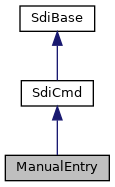

[Public Member Functions](#pub-methods)

Interface for SDI command <a href="pg_sdi_users_guide.md#subsubsec_sdi_msr_card_data_entry">MSR Card Data Entry</a> (21-02) [More\...](#details)

`#include <`<a href="sdi__if_8h_source.md">sdi_if.h</a>`>`

Inheritance diagram for ManualEntry:

\[<a href="graph_legend.md">legend</a>\]

Collaboration diagram for ManualEntry:

\[<a href="graph_legend.md">legend</a>\]

|  |  |
|----|----|
| Public Member Functions |  |
|   | [ManualEntry](#a1cbc25c4ed1b082c479f57851d707c0a) () |
|   | [\~ManualEntry](#afcfe7252125e4f2ed90a6906ff7e4c84) () |
| void  | [setLanguage](#a7152eb5026dd8ba38e3035c947d5d837) (unsigned char language) |
|   | Configure text language for manual card data entry (DFA008) [More\...](#a7152eb5026dd8ba38e3035c947d5d837)  |
| int  | [setTimeout](#a3714649e82c54dcfd608a52ab0dacd92) (unsigned seconds) |
|   | Configure timeout for manual card data entry (DFA005) [More\...](#a3714649e82c54dcfd608a52ab0dacd92)  |
| int  | [setCvvEntryDeactivation](#a24d56d662dc9e2b0e3f2966606e509f8) (unsigned char cvvEntry) |
|   | Configure temporary Card Entry Value deactivation for manual card data entry (DFA017) [More\...](#a24d56d662dc9e2b0e3f2966606e509f8)  |
| int  | [setCardDataEntryMode](#aef27966a3ebe0c4de85b9053b9868fa0) (unsigned char mode) |
|   | Configure Card Data Entry mode (DFA018) [More\...](#aef27966a3ebe0c4de85b9053b9868fa0)  |
| int  | [setCvvInputString](#a93430994a94b1088b8d130c20430c724) (const std::string &inputString) |
|   | Configure optional alternative input format string for CVV (DFA01A) [More\...](#a93430994a94b1088b8d130c20430c724)  |
| int  | [setTouchCoordinates](#a09e73f4472c0d61556457b567f886f17) (const unsigned char \*array, unsigned size) |
|   | Configure touch coordinate table for manual card entry (DFA024) [More\...](#a09e73f4472c0d61556457b567f886f17)  |
| int  | [setMimimumDigits](#ad0912191fa517caabb53076a399c2d4e) (unsigned char minimumDigits) |
|   | Configure forcing of minimum number of Pan digits to 7 instead the default of 10 digits (DFA123) [More\...](#ad0912191fa517caabb53076a399c2d4e)  |
| int  | [setDoubleConfirmationMode](#a1dbb874fa48a745c3858b13b261b7de5) (unsigned char mode) |
|   | Configure skipping of double confirmation of PAN in headless mode (DFA033) [More\...](#a1dbb874fa48a745c3858b13b261b7de5)  |
| int  | [start](#ac92d3b835636641550b12b0f93daf21d) () |
|   | Start manual card data entry (21-02) [More\...](#ac92d3b835636641550b12b0f93daf21d)  |
| int  | [receiveResult](#ae382a529a8037b1583f7e2ae89521f2d) (std::string &obfuscatedPAN, std::vector\< unsigned char \> &token) |
|   | Receive manual card data entry result. [More\...](#ae382a529a8037b1583f7e2ae89521f2d)  |
| int  | [getPluginResponseData](#a76dd851840d45388ad42ca8c1ee57074) (std::vector\< unsigned char \> &data) |
|   | Access plugin response data (DFA101) in case one plugin has been triggered. [More\...](#a76dd851840d45388ad42ca8c1ee57074)  |
| int  | [getPluginResponseData](#acfed80583b45ecca83c85e0f076d4296) (unsigned index, int32_t &pluginId, int32_t &pluginResponseCode, std::vector\< unsigned char \> &data) |
|   | Access plugin response data (FFA107, DFA101, DFA10C, DFA10D) [More\...](#acfed80583b45ecca83c85e0f076d4296)  |
| bool  | [getPluginResponseData](#aae35f08592a982e6a936085b657efd27) (std::vector\< <a href="classlibsdi_1_1_sdi_base.md#structlibsdi_1_1_sdi_base_1_1_plugin_result">PluginResult</a> \> &results) |
|   | Access plugin response data (FFA107, DFA101, DFA10C, DFA10D) [More\...](#aae35f08592a982e6a936085b657efd27)  |
|  Public Member Functions inherited from <a href="classlibsdi_1_1_sdi_cmd.md">SdiCmd</a> |  |
|   | <a href="classlibsdi_1_1_sdi_cmd.md#a9a5f0b856a4b8e0f337770f1fa841c80">SdiCmd</a> () |
| virtual  | <a href="classlibsdi_1_1_sdi_cmd.md#add17dace52a0c4b8f6004f7bcc867e3e">~SdiCmd</a> () |
| enum <a href="namespacelibsdi.md#a0af9b7a9de719071122f396865ecebc9">SDI_SW12</a>  | <a href="classlibsdi_1_1_sdi_cmd.md#a59300a399fbda10c562a2470fc4cde52">sendReceive</a> (unsigned char cla, unsigned char ins, unsigned char p1=0, unsigned char p2=0, unsigned maxResponseSize=2048) |
|   | Generic SDI command exchange function combining sending of request, waiting and receiving the response. <a href="classlibsdi_1_1_sdi_cmd.md#a59300a399fbda10c562a2470fc4cde52">More...</a>  |
| int  | <a href="classlibsdi_1_1_sdi_cmd.md#adf6959d0550be4ff756c3ee4b7f104fe">send</a> (unsigned char cla, unsigned char ins, unsigned char p1=0, unsigned char p2=0) |
|   | Like <a href="classlibsdi_1_1_sdi_cmd.md#a59300a399fbda10c562a2470fc4cde52">sendReceive()</a> but without waiting for response. <a href="classlibsdi_1_1_sdi_cmd.md#adf6959d0550be4ff756c3ee4b7f104fe">More...</a>  |
| enum <a href="namespacelibsdi.md#a0af9b7a9de719071122f396865ecebc9">SDI_SW12</a>  | <a href="classlibsdi_1_1_sdi_cmd.md#a22eddbbef80354a4641b55828346c7d7">receive</a> (unsigned maxResponseSize=2048) |
|   | Receive SDI response after request has been send with <a href="classlibsdi_1_1_sdi_cmd.md#adf6959d0550be4ff756c3ee4b7f104fe">send()</a> and data availability has been signaled. <a href="classlibsdi_1_1_sdi_cmd.md#a22eddbbef80354a4641b55828346c7d7">More...</a>  |
| void  | <a href="classlibsdi_1_1_sdi_cmd.md#ae460ac8618ec349ff0289c578539d9f2">set</a> (const char \*path, int <a href="_web_service_wrappers_8c.md#a6e248376c0290338633d8137822eb209">value</a>, unsigned fixedLength=0) |
|   | Set integer data object SDI command. <a href="classlibsdi_1_1_sdi_cmd.md#ae460ac8618ec349ff0289c578539d9f2">More...</a>  |
| void  | <a href="classlibsdi_1_1_sdi_cmd.md#a1ec79e2e0211c6c8ee229ba779ec9eff">set</a> (const char \*path, uint32_t <a href="_web_service_wrappers_8c.md#a6e248376c0290338633d8137822eb209">value</a>, unsigned fixedLength=0) |
|   | Set unsigned integer data object SDI command. <a href="classlibsdi_1_1_sdi_cmd.md#a1ec79e2e0211c6c8ee229ba779ec9eff">More...</a>  |
| void  | <a href="classlibsdi_1_1_sdi_cmd.md#ac72a9a24645c216539ab422b50a763cb">set</a> (const char \*path, const unsigned char \*data, unsigned dataLen) |
|   | Set byte array data object in SDI command. <a href="classlibsdi_1_1_sdi_cmd.md#ac72a9a24645c216539ab422b50a763cb">More...</a>  |
| void  | <a href="classlibsdi_1_1_sdi_cmd.md#acae91bc646226025ace047bdba7a2d5d">set</a> (const char \*path, unsigned char byteValue) |
|   | Set single byte value in SDI command. <a href="classlibsdi_1_1_sdi_cmd.md#acae91bc646226025ace047bdba7a2d5d">More...</a>  |
| void  | <a href="classlibsdi_1_1_sdi_cmd.md#a5c4ad2fa43dc552bccc10404a5bd28d0">set</a> (const char \*path, const std::vector\< unsigned char \> &data) |
|   | Set byte array data object in SDI command. <a href="classlibsdi_1_1_sdi_cmd.md#a5c4ad2fa43dc552bccc10404a5bd28d0">More...</a>  |
| void  | <a href="classlibsdi_1_1_sdi_cmd.md#aa6eb7cd81eecfd63f2ccb5980213e37c">set</a> (const char \*path, const std::string &<a href="_web_service_wrappers_8c.md#a6e248376c0290338633d8137822eb209">value</a>) |
|   | Set character data object in SDI command. <a href="classlibsdi_1_1_sdi_cmd.md#aa6eb7cd81eecfd63f2ccb5980213e37c">More...</a>  |
| void  | <a href="classlibsdi_1_1_sdi_cmd.md#a365ef386b964414cd160cc03e5063745">setCommandDestination</a> (bool epp, bool force=false) |
|   | Set command destination for systems with EPP Unless force the command destination is set only if parameter epp is true. <a href="classlibsdi_1_1_sdi_cmd.md#a365ef386b964414cd160cc03e5063745">More...</a>  |
| virtual void  | <a href="classlibsdi_1_1_sdi_cmd.md#aae048282c7011eedc2e0492f6421ea73">clear</a> () |
|   | Remove all SDI command command input data. <a href="classlibsdi_1_1_sdi_cmd.md#aae048282c7011eedc2e0492f6421ea73">More...</a>  |
| virtual void  | <a href="classlibsdi_1_1_sdi_cmd.md#a509a30dbc3c5bb52a8ceb38bedad6e82">clear</a> (const char \*path) |
|   | Remove single input data stored in <a href="classlibsdi_1_1_sdi_cmd.md#a2b7c2d6ae6cb8a37cd3cc6c2a053abbc">dataIn</a>. <a href="classlibsdi_1_1_sdi_cmd.md#a509a30dbc3c5bb52a8ceb38bedad6e82">More...</a>  |
| virtual void  | <a href="classlibsdi_1_1_sdi_cmd.md#a80eff6d974183e99f91c034c49d2ecde">clearResults</a> () |
|   | Remove all SDI response data. <a href="classlibsdi_1_1_sdi_cmd.md#a80eff6d974183e99f91c034c49d2ecde">More...</a>  |
| void  | <a href="classlibsdi_1_1_sdi_cmd.md#a9490be5475acb6b165642dd2c3d1caf2">importResults</a> (const <a href="classlibsdi_1_1_sdi_cmd.md">SdiCmd</a> &intermediate) |
|   | Transfer status word, client error and response data from an intermediate command while keeping command input data. <a href="classlibsdi_1_1_sdi_cmd.md#a9490be5475acb6b165642dd2c3d1caf2">More...</a>  |
| void  | <a href="classlibsdi_1_1_sdi_cmd.md#a33a1327fd18f767afb4baa2e5a814455">importResults</a> (const unsigned char \*<a href="classlibsdi_1_1_sdi_base.md#abc00684400484823da87a8e9d3f06267">sw12</a>, const unsigned char \*tlvData, unsigned tlvSize) |
|   | Inject result data from a call back. <a href="classlibsdi_1_1_sdi_cmd.md#a33a1327fd18f767afb4baa2e5a814455">More...</a>  |
| bool  | <a href="classlibsdi_1_1_sdi_cmd.md#a733bf780a710be27b4b3d95bd148e45c">get</a> (const char \*path, int &<a href="_web_service_wrappers_8c.md#a6e248376c0290338633d8137822eb209">value</a>) |
| bool  | <a href="classlibsdi_1_1_sdi_cmd.md#aacea549b9a51b2341447610bfd407f68">get</a> (const char \*path, uint32_t &<a href="_web_service_wrappers_8c.md#a6e248376c0290338633d8137822eb209">value</a>) |
| int  | <a href="classlibsdi_1_1_sdi_cmd.md#a68f21c216cef62cc1922cc25b07d241a">get</a> (const char \*path, unsigned char \*buffer, unsigned bufferSize) |
| bool  | <a href="classlibsdi_1_1_sdi_cmd.md#aa3551e32ad6b0779ce2597e502602c75">get</a> (const char \*path, unsigned char &<a href="_web_service_wrappers_8c.md#a6e248376c0290338633d8137822eb209">value</a>) |
| bool  | <a href="classlibsdi_1_1_sdi_cmd.md#a5b5da404e34fc6cc0d5f989e5a1ef75e">get</a> (const char \*path, std::vector\< unsigned char \> &buffer) |
| bool  | <a href="classlibsdi_1_1_sdi_cmd.md#acdc1d042dccffeb62ba2859c9d16a87a">get</a> (const char \*path, std::string &<a href="_web_service_wrappers_8c.md#a6e248376c0290338633d8137822eb209">value</a>) |
| std::string  | <a href="classlibsdi_1_1_sdi_cmd.md#ac8fbd8404dfbc8ef830c77842542f38d">getString</a> (const char \*path) |
|  Public Member Functions inherited from <a href="classlibsdi_1_1_sdi_base.md">SdiBase</a> |  |
|   | <a href="classlibsdi_1_1_sdi_base.md#ad34d14385bdce6579d34f049c6d8dee5">SdiBase</a> () |
| enum <a href="namespacelibsdi.md#a0af9b7a9de719071122f396865ecebc9">SDI_SW12</a>  | <a href="classlibsdi_1_1_sdi_base.md#a4058a7890507b92a38f3921ff4bf863b">getSdiSw12</a> () |
| int  | <a href="classlibsdi_1_1_sdi_base.md#a03cfc4186ba19fa866f27a0c12dbb4ad">getAdditionalResultValue</a> () |
|   | Access Additional Result Value if returned in SDI response. <a href="classlibsdi_1_1_sdi_base.md#a03cfc4186ba19fa866f27a0c12dbb4ad">More...</a>  |
| <a href="namespacelibsdi.md#a88afe55c2211351a88265153f28797e4">SDICLIENT_ERROR</a>  | <a href="classlibsdi_1_1_sdi_base.md#a167a672bfb8c6f222c4b2a255b053aec">getClientError</a> () |
|   | Access client side error codes. <a href="classlibsdi_1_1_sdi_base.md#a167a672bfb8c6f222c4b2a255b053aec">More...</a>  |
| enum <a href="namespacelibsdi.md#a0af9b7a9de719071122f396865ecebc9">SDI_SW12</a>  | <a href="classlibsdi_1_1_sdi_base.md#a23032d620c1f454fc5f00ff4f2f4ceb7">receiveSW12</a> () |
|   | Receive SDI server response with no data. <a href="classlibsdi_1_1_sdi_base.md#a23032d620c1f454fc5f00ff4f2f4ceb7">More...</a>  |
| void  | <a href="classlibsdi_1_1_sdi_base.md#ac8bb3912a3ce86b15842e79d0b421204">clear</a> () |
|   | clear result data obtained from SDI communication <a href="classlibsdi_1_1_sdi_base.md#ac8bb3912a3ce86b15842e79d0b421204">More...</a>  |
| void  | <a href="classlibsdi_1_1_sdi_base.md#a7ffb7b7b3ae189a49b5eb16b605bb574">importResults</a> (const <a href="classlibsdi_1_1_sdi_base.md">SdiBase</a> &intermediate) |
|   | set result data obtained from intermediate SDI communication <a href="classlibsdi_1_1_sdi_base.md#a7ffb7b7b3ae189a49b5eb16b605bb574">More...</a>  |

|  |  |
|----|----|
| Additional Inherited Members |  |
|  Protected Member Functions inherited from <a href="classlibsdi_1_1_sdi_base.md">SdiBase</a> |  |
| void  | <a href="classlibsdi_1_1_sdi_base.md#a0e6f27ea2daaead68e7b246333a65bd8">setSdiSw12</a> (enum <a href="namespacelibsdi.md#a0af9b7a9de719071122f396865ecebc9">SDI_SW12</a> s) |
| void  | <a href="classlibsdi_1_1_sdi_base.md#a28b2175186ba74bace6610ded1c3c261">setClientError</a> (int libsdiprotocol_result) |
|  Protected Attributes inherited from <a href="classlibsdi_1_1_sdi_cmd.md">SdiCmd</a> |  |
| void \*  | <a href="classlibsdi_1_1_sdi_cmd.md#a2b7c2d6ae6cb8a37cd3cc6c2a053abbc">dataIn</a> |
|   | Command input buffer collecting TLV data items. <a href="classlibsdi_1_1_sdi_cmd.md#a2b7c2d6ae6cb8a37cd3cc6c2a053abbc">More...</a>  |
| void \*  | <a href="classlibsdi_1_1_sdi_cmd.md#a63c88c0318a60c296203e18195a8846a">dataOut</a> |
|   | Command response TLV data items. <a href="classlibsdi_1_1_sdi_cmd.md#a63c88c0318a60c296203e18195a8846a">More...</a>  |
|  Protected Attributes inherited from <a href="classlibsdi_1_1_sdi_base.md">SdiBase</a> |  |
| unsigned short  | <a href="classlibsdi_1_1_sdi_base.md#abc00684400484823da87a8e9d3f06267">sw12</a> |
| int  | <a href="classlibsdi_1_1_sdi_base.md#aec8bd96d4ee40a80283213584fb4ef05">additionalResultValue</a> |
| <a href="namespacelibsdi.md#a88afe55c2211351a88265153f28797e4">SDICLIENT_ERROR</a>  | <a href="classlibsdi_1_1_sdi_base.md#a1595e9ce662f397b69db2b335b6bc847">clientErr</a> |

## DetailedDescription {#detailed-description}

Interface for SDI command <a href="pg_sdi_users_guide.md#subsubsec_sdi_msr_card_data_entry">MSR Card Data Entry</a> (21-02)

Use the setters to configure the command, then use <a href="sdiprotocol_8h.md#ab08218e1215675470afea05b45bdccb9">SDI_SetDataAvailableCallback()</a> to register a notification function. With [start()](#ac92d3b835636641550b12b0f93daf21d "Start manual card data entry (21-02)") the manual card data input begins. After data available notification call [receiveResult()](#ae382a529a8037b1583f7e2ae89521f2d "Receive manual card data entry result.") to read the SDI server response.

## Constructor& Destructor Documentation

## ManualEntry() 

<a href="classlibsdi_1_1_manual_entry.md">ManualEntry</a>

## \~ManualEntry() 

\~<a href="classlibsdi_1_1_manual_entry.md">ManualEntry</a>

## MemberFunction Documentation {#member-function-documentation}

## getPluginResponseData()\[1/3\]  {#getpluginresponsedata-13}

bool getPluginResponseData

Access plugin response data (FFA107, DFA101, DFA10C, DFA10D)

**Parameters**

\[out\] **results** plugin ids, response codes and response data

### Returns

true if any plugin result has been found

## getPluginResponseData()\[2/3\]  {#getpluginresponsedata-23}

int getPluginResponseData

Access plugin response data (DFA101) in case one plugin has been triggered.

**Parameters**

\[out\] **data** plugin response data (Note: Data is appended to existing content)

### Returns

length of appended data, -1 if not present

## getPluginResponseData()\[3/3\]  {#getpluginresponsedata-33}

int getPluginResponseData

Access plugin response data (FFA107, DFA101, DFA10C, DFA10D)

**Parameters**

\[in\] **index** for iterating the result data, starting with 0 \[out\] **pluginId** return value of a plugin\'s moduleID function also used as INS byte of SDI 26-xx command to invoke a plugin, 0 if not available \[out\] **pluginResponseCode** plugin\'s processTrigger function return value, SDI_SW12_NONE if not available \[out\] **data** plugin response data (Note: Data is appended to existing content)

### Returns

length of appended data, -1 if not present = end of iteration

## receiveResult() 

int receiveResult

Receive manual card data entry result.

In case of problem, when \'0\' is returned use <a href="classlibsdi_1_1_sdi_base.md#a4058a7890507b92a38f3921ff4bf863b">getSdiSw12()</a> to retrieve the SDI Server SW1 SW2.

**Parameters**

\[out\] **obfuscatedPAN** an \[7..19\] \[out\] **token** unique card specific token b20

### Returns

0 if successful, negative value if an error has occurred, e.g. return value from <a href="sdiprotocol_8h.md#aee8a61a1bccdbe552ecaf1db3e1eacf9">SDI_Receive()</a>

### Getters- Manual Card Data Entry {#getters---manual-card-data-entry}

[getPluginResponseData()](#a76dd851840d45388ad42ca8c1ee57074 "Access plugin response data (DFA101) in case one plugin has been triggered.") (DFA101)
<a href="classlibsdi_1_1_sdi_base.md#a4058a7890507b92a38f3921ff4bf863b">getSdiSw12()</a> inherited from <a href="classlibsdi_1_1_sdi_base.md">SdiBase</a>
<a href="classlibsdi_1_1_sdi_base.md#a167a672bfb8c6f222c4b2a255b053aec">getClientError()</a> inherited from <a href="classlibsdi_1_1_sdi_base.md">SdiBase</a>

## setCardDataEntryMode() 

int setCardDataEntryMode

Configure Card Data Entry mode (DFA018)

**Parameters**

\[in\] **mode** Card Data Entry mode0: Card Data Entry performed in one screen1: Card Data Entry performed in separate screens

### Returns

0

## setCvvEntryDeactivation() 

int setCvvEntryDeactivation

Configure temporary Card Entry Value deactivation for manual card data entry (DFA017)

**Parameters**

\[in\] **cvvEntry** temporary Card Entry Value deactivation during the current command execution0 perform all input1 skip card verification code2 skip expiration and verification code4 just enter CVV after card data read from mag. stripe

### Returns

0

## setCvvInputString() 

int setCvvInputString

Configure optional alternative input format string for CVV (DFA01A)

**Parameters**

\[in\] **inputString** alternative input string for CVV

### Returns

0

## setDoubleConfirmationMode() 

int setDoubleConfirmationMode

Configure skipping of double confirmation of PAN in headless mode (DFA033)

**Parameters**

\[in\] **mode** double confirmation mode of PAN0: Double confirmation active (default)1: Double Confirmation skipped

### Returns

0

## setLanguage() 

void setLanguage

Configure text language for manual card data entry (DFA008)

If not set, default is current terminal/transaction language

**Parameters**

\[in\] **language** language to be used for manual entry

## setMimimumDigits() 

int setMimimumDigits

Configure forcing of minimum number of Pan digits to 7 instead the default of 10 digits (DFA123)

**Parameters**

\[in\] **minimumDigits** minimum number of Pan digits to be entered0: Use default (10 digits)1: Force to 7 digits

### Returns

0

## setTimeout() 

int setTimeout

Configure timeout for manual card data entry (DFA005)

**Parameters**

\[in\] **seconds** PIN input dialog timeout

### Returns

0

## setTouchCoordinates() 

int setTouchCoordinates

Configure touch coordinate table for manual card entry (DFA024)

Each table entry consists of

- x-position b2
- y-position b2
- button width b2
- button height b2
- associated key ASCII code b1 (\"0\" .. \"9\" = \'30\' .. \'31\', cancel = \'1B\', correction = \'08\', enter = \'0D\')

**Parameters**

\[in\] **array** coordinate table \[in\] **size** byte count of coordinate table (= 9 \* button count)

### Returns

0

## start() 

int start

Start manual card data entry (21-02)

Before calling this function use the setters of this class to configure it and <a href="sdiprotocol_8h.md#ab08218e1215675470afea05b45bdccb9">SDI_SetDataAvailableCallback()</a> to register a notification function. Once result is available the notification function will be invoked and [receiveResult()](#ae382a529a8037b1583f7e2ae89521f2d "Receive manual card data entry result.") has to be called.

### Setters

[setLanguage()](#a7152eb5026dd8ba38e3035c947d5d837 "Configure text language for manual card data entry (DFA008)") (DFA008)
[setTimeout()](#a3714649e82c54dcfd608a52ab0dacd92 "Configure timeout for manual card data entry (DFA005)") (DFA005)
[setCvvEntryDeactivation()](#a24d56d662dc9e2b0e3f2966606e509f8 "Configure temporary Card Entry Value deactivation for manual card data entry (DFA017)") (DFA017)
[setCardDataEntryMode()](#aef27966a3ebe0c4de85b9053b9868fa0 "Configure Card Data Entry mode (DFA018)") (DFA018)
[setCvvInputString()](#a93430994a94b1088b8d130c20430c724 "Configure optional alternative input format string for CVV (DFA01A)") (DFA01A)
[setTouchCoordinates()](#a09e73f4472c0d61556457b567f886f17 "Configure touch coordinate table for manual card entry (DFA024)") (DFA024)
[setMimimumDigits()](#ad0912191fa517caabb53076a399c2d4e "Configure forcing of minimum number of Pan digits to 7 instead the default of 10 digits (DFA123)") (DFA123)
[setDoubleConfirmationMode()](#a1dbb874fa48a745c3858b13b261b7de5 "Configure skipping of double confirmation of PAN in headless mode (DFA033)") (DFA033)

### Returns

return value from <a href="sdiprotocol_8h.md#ab3428d0ca92d1516b4efaa2ed7849795">SDI_Send()</a>

------------------------------------------------------------------------

The documentation for this class was generated from the following file:

- sdiclient/client/<a href="sdi__if_8h_source.md">sdi_if.h</a>
