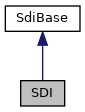

[Public Member Functions](#pub-methods)

`#include <`<a href="sdi__if_8h_source.md">sdi_if.h</a>`>`

Inheritance diagram for SDI:

\[<a href="graph_legend.md">legend</a>\]

Collaboration diagram for SDI:

\[<a href="graph_legend.md">legend</a>\]

|  |  |
|----|----|
| Public Member Functions |  |
| bool  | [getDateTime](#a15781f01b66e81a07c61124067d278d0) (unsigned char \*buffer) |
|   | Read numeric date/time. [More\...](#a15781f01b66e81a07c61124067d278d0)  |
| bool  | [setDateTime](#a7bd5eb46020f8c2248088d36f13cd647) (const unsigned char \*dateTime) |
|   | Write numeric date/time. [More\...](#a7bd5eb46020f8c2248088d36f13cd647)  |
| unsigned char  | [getLanguage](#a30396af1c4d6d99cb8185f189a6c8b74) () |
|   | Call Sys Get Status (20-04), tag \'D6\', DOL approach to read system default language. [More\...](#a30396af1c4d6d99cb8185f189a6c8b74)  |
| bool  | [setLanguage](#acbeb2c3d60685bea672b93376256ba23) (unsigned char languageId) |
|   | Call Sys Set Status (20-09), tag \'D6\', DOL approach to set system default language. [More\...](#acbeb2c3d60685bea672b93376256ba23)  |
| unsigned char  | [getCardDataEntryDeactivation](#afe1b485e3a9eb6bed1a69ad4b248e0c2) () |
|   | Call Sys Get Status (20-04), tag \'D7\', DOL approach to read system default card data entry deactivation value. [More\...](#afe1b485e3a9eb6bed1a69ad4b248e0c2)  |
| bool  | [setCardDataEntryDeactivation](#a941a9ad9c11238b150159b3d7b3be0c3) (unsigned char <a href="_web_service_wrappers_8c.md#a6e248376c0290338633d8137822eb209">value</a>) |
|   | Call Sys Set Status (20-09), tag \'D7\', DOL approach to set system default card data entry deactivation value. [More\...](#a941a9ad9c11238b150159b3d7b3be0c3)  |
| unsigned char  | [getCardDataEntryMode](#a691380011de69e7e593620d99a34a2b2) () |
|   | Call Sys Get Status (20-04), tag \'D8\', DOL approach to read system default card data entry mode. [More\...](#a691380011de69e7e593620d99a34a2b2)  |
| bool  | [setCardDataEntryMode](#aced223b555ef96db5090d8828c0446b2) (unsigned char <a href="_web_service_wrappers_8c.md#a6e248376c0290338633d8137822eb209">value</a>) |
|   | Call Sys Set Status (20-09), tag \'D8\', DOL approach to set the system default card data entry mode. [More\...](#aced223b555ef96db5090d8828c0446b2)  |
| bool  | [setIdleText](#a4fc12918919cb213d03019f140c21336) (std::string text, bool epp=true) |
|   | Command to set the idle text (20-13). [More\...](#a4fc12918919cb213d03019f140c21336)  |
| bool  | [showMacDesktop](#aaaf4e185d5f11a4571983d979672553a) (bool epp=true) |
|   | Switch from SDI to MAC Desktop (20-18). [More\...](#aaaf4e185d5f11a4571983d979672553a)  |
| int  | [getProperty](#a2aca042320f064763951085726f0f761) (enum <a href="namespacevfisysinfo.md#a53e0b4c578c61cc0de3c3daa5fee72b6">vfisysinfo::SYSPropertyInt</a> p, bool epp=false) |
|   | Get Integer Property by SYSINFO-ADK (20-1A, P2 = 00). [More\...](#a2aca042320f064763951085726f0f761)  |
| enum <a href="namespacevfisysinfo.md#aadc050f211cba10bc174fe72cc02ac09">vfisysinfo::sysError</a>  | [getProperty](#a4705eca770cacc9829e3f60e8fc49054) (enum <a href="namespacevfisysinfo.md#a53e0b4c578c61cc0de3c3daa5fee72b6">vfisysinfo::SYSPropertyInt</a> p, int &<a href="_web_service_wrappers_8c.md#a6e248376c0290338633d8137822eb209">value</a>, bool epp=false) |
|   | Get Integer Property by SYSINFO-ADK (20-1A, P2 = 00). [More\...](#a4705eca770cacc9829e3f60e8fc49054)  |
| enum <a href="namespacevfisysinfo.md#aadc050f211cba10bc174fe72cc02ac09">vfisysinfo::sysError</a>  | [setProperty](#abc1d1d67dc87829f3bd31f315577b632) (enum <a href="namespacevfisysinfo.md#a53e0b4c578c61cc0de3c3daa5fee72b6">vfisysinfo::SYSPropertyInt</a> p, int <a href="_web_service_wrappers_8c.md#a6e248376c0290338633d8137822eb209">value</a>, bool epp=false) |
|   | Set Integer Property by SYSINFO-ADK (20-19, P2 = 00). [More\...](#abc1d1d67dc87829f3bd31f315577b632)  |
| std::string  | [getProperty](#a10091b838a73997e87c6cb7ee2d572ff) (enum <a href="namespacevfisysinfo.md#aaa98bbf503c2b2cb3ebd81f35b5cb6c5">vfisysinfo::SYSPropertyString</a> p, bool epp=false) |
|   | Get String Property by SYSINFO-ADK (20-1A, P2 = 01). [More\...](#a10091b838a73997e87c6cb7ee2d572ff)  |
| enum <a href="namespacevfisysinfo.md#aadc050f211cba10bc174fe72cc02ac09">vfisysinfo::sysError</a>  | [getProperty](#a00189ec34f481a6a9527bc149f6d8ed6) (enum <a href="namespacevfisysinfo.md#aaa98bbf503c2b2cb3ebd81f35b5cb6c5">vfisysinfo::SYSPropertyString</a> p, std::string &<a href="_web_service_wrappers_8c.md#a6e248376c0290338633d8137822eb209">value</a>, bool epp=false) |
|   | Get String Property by SYSINFO-ADK (20-1A, P2 = 01). [More\...](#a00189ec34f481a6a9527bc149f6d8ed6)  |
| enum <a href="namespacevfisysinfo.md#aadc050f211cba10bc174fe72cc02ac09">vfisysinfo::sysError</a>  | [setProperty](#a6c65079ae10362180b3e2cab5f3bbd18) (enum <a href="namespacevfisysinfo.md#aaa98bbf503c2b2cb3ebd81f35b5cb6c5">vfisysinfo::SYSPropertyString</a> p, const std::string &<a href="_web_service_wrappers_8c.md#a6e248376c0290338633d8137822eb209">value</a>, bool epp=false) |
|   | Set String Property by SYSINFO-ADK (20-19, P2 = 01). [More\...](#a6c65079ae10362180b3e2cab5f3bbd18)  |
| std::string  | [getVersionInfo](#a05d9381d18c66001110ff125f9b8fe9e) (bool epp=false) |
|   | read SDI version info via Get SDI version info (20-1C). [More\...](#a05d9381d18c66001110ff125f9b8fe9e)  |
| bool  | [checkForUpdate](#a6ab3e8fc45d07275607654fb738dd8c3) (unsigned char updateKind) |
|   | Check if update available on Android platform and execute (20-1D). [More\...](#a6ab3e8fc45d07275607654fb738dd8c3)  |
| bool  | [waitCardRemoval](#a4bdd17ae8d9185a0be2ef4e2a1d2903b) (unsigned seconds) |
|   | Wait Card Removal (23-02). [More\...](#a4bdd17ae8d9185a0be2ef4e2a1d2903b)  |
| int  | [sendWaitCardRemoval](#a841f782b6c4d139914f3a2370837689f) (unsigned seconds) |
|   | Wait Card Removal (23-02), send only. [More\...](#a841f782b6c4d139914f3a2370837689f)  |
| void  | [clearDataStore](#a74ac1725f8aa985ddea24cc6755b5f85) () |
|   | Clear data, especially sensitive data related to last transaction (29-03). [More\...](#a74ac1725f8aa985ddea24cc6755b5f85)  |
| bool  | [vclRegistartSRED](#a84bb654abf9388f58e854c96f6bb33e8) (std::vector\< unsigned char \> &track1, std::vector\< unsigned char \> &track2, std::vector\< unsigned char \> &track3) |
|   | Request VCL to turn on the encryption in SRED mode (28-00). [More\...](#a84bb654abf9388f58e854c96f6bb33e8)  |
| bool  | [vclStatusRequest](#a62263d75586d6f8f4d81e6f1576f9537) (std::vector\< unsigned char \> &vclStatus) |
|   | Get the current status of VCL (28-01). [More\...](#a62263d75586d6f8f4d81e6f1576f9537)  |
| bool  | [vclAdvanceDDK](#a1cf3b5f5e00f75b8b82e5c5ba9dfe1cc) (std::vector\< unsigned char \> &track1, std::vector\< unsigned char \> &track2, std::vector\< unsigned char \> &track3) |
|   | Request VCL to turn on the encryption in SRED mode (28-02). [More\...](#a1cf3b5f5e00f75b8b82e5c5ba9dfe1cc)  |
| bool  | [vclRequestEParms](#ad4b7d516003824adc33cda3159a165a1) (std::vector\< unsigned char \> &eParms) |
|   | Get the eParms of the last encryption from VCL (28-03). [More\...](#ad4b7d516003824adc33cda3159a165a1)  |
| std::string  | [vclGetDiagnosticData](#a12c0ecba8fff6526c6a5e4792a73ceeb) (unsigned char format=1, unsigned char pageNumber=0) |
|   | Get the diagnostic data from VCL (28-06, VCL: DIAG_QUERY). [More\...](#a12c0ecba8fff6526c6a5e4792a73ceeb)  |
| int  | [vclGetKeyDerivationMode](#ab46e60a6ce8dd17f1fb24dc5e7dd9b9d) () |
|   | Extract key derivation mode from diagnostic data (28-07, VCL: DIAG_QUERY). [More\...](#ab46e60a6ce8dd17f1fb24dc5e7dd9b9d)  |
| bool  | [vclOverrideMessageQuery](#a954bd544e6fb25b844fa5d5ee7ed24c6) (std::vector\< unsigned char \> &track1, std::vector\< unsigned char \> &track2, std::vector\< unsigned char \> &track3) |
|   | VCL Override Message Query (28-08). [More\...](#a954bd544e6fb25b844fa5d5ee7ed24c6)  |
| bool  | [vclKsnRequest](#a261f6bdbcafd6c534f01c421904eccd1) (std::string &ksn) |
|   | VCL KSN Request (28-09). [More\...](#a261f6bdbcafd6c534f01c421904eccd1)  |
| bool  | [vclKmailinRequest](#a66c1988cc3ccf6ca13f8ad59450352f1) () |
|   | VCL KMAILIN Request (28-0A). [More\...](#a66c1988cc3ccf6ca13f8ad59450352f1)  |
| <a href="namespacelibsdi.md#a0af9b7a9de719071122f396865ecebc9">libsdi::SDI_SW12</a>  | [pluginCommand](#ae03cf495a6cfafebc5367b6fd50ea5cc) (const unsigned char plugin, const unsigned char cmd, const std::vector\< unsigned char \> &data, std::vector\< unsigned char \> &response) |
|   | Send a plugin specific command (26-\<plugin id\>, P2 = \<command id\>). [More\...](#ae03cf495a6cfafebc5367b6fd50ea5cc)  |
| bool  | [setManualPAN](#a9adf9253959686cdf6cd04a42a168ba1) (const std::vector\< unsigned char \> &pan) |
|   | PAN injection after manual card data entry on application\'s side for ISO-0 PIN block. [More\...](#a9adf9253959686cdf6cd04a42a168ba1)  |
| bool  | [setManualPAN](#abefabe98ef6f9fd5f12047bff79cc434) (const std::string &pan) |
|   | PAN injection after manual card data entry on application\'s side for ISO-0 PIN block. [More\...](#abefabe98ef6f9fd5f12047bff79cc434)  |
| <a href="namespacelibsdi.md#a0af9b7a9de719071122f396865ecebc9">libsdi::SDI_SW12</a>  | [performValidationChecks](#a9e2f26480c30241795d22317ac003164) (std::vector\< <a href="structlibsdi_1_1_matching_record.md">MatchingRecord</a> \> &records, const std::vector\< unsigned char \> &currentDate, const unsigned char options=0, const std::vector\< unsigned char \> IIN=std::vector\< unsigned char \>()) |
|   | Perform the validation checks for the current card using the validation table (cardranges.json) stored on the device (29-05). [More\...](#a9e2f26480c30241795d22317ac003164)  |
| <a href="namespacelibsdi.md#a0af9b7a9de719071122f396865ecebc9">libsdi::SDI_SW12</a>  | [getValidationInfo](#a9efc44d41d83ae857cc95283f1439add) (std::string &info) |
|   | Perform the get validation info command to get the header information of the validation table file (cardranges.json) stored on the device (29-06). [More\...](#a9efc44d41d83ae857cc95283f1439add)  |
| <a href="namespacelibsdi.md#a0af9b7a9de719071122f396865ecebc9">libsdi::SDI_SW12</a>  | [sysUploadStart](#ac63326457e5820ce93d974a7b7cfc00f) (const std::string &filename, <a href="namespacelibsdi.md#af55973ce01a27acae146f17b4a0366fa">SYSUploadType</a> type, bool epp=false) |
|   | Start upload of a software package or a configuration file to the SDI Server (20-14). [More\...](#ac63326457e5820ce93d974a7b7cfc00f)  |
| <a href="namespacelibsdi.md#a0af9b7a9de719071122f396865ecebc9">libsdi::SDI_SW12</a>  | [sysUploadTransfer](#a90ce3c5bc7e32c0d407bce3b122e4086) (const std::vector\< unsigned char \> &packet, unsigned packet_no, bool epp=false) |
|   | Transfer data packet to the SDI Server (20-15). [More\...](#a90ce3c5bc7e32c0d407bce3b122e4086)  |
| <a href="namespacelibsdi.md#a0af9b7a9de719071122f396865ecebc9">libsdi::SDI_SW12</a>  | [sysUploadFinalize](#a5aecfd4391c93a9240917737f3e4b073) (const std::vector\< unsigned char \> \*md5=NULL, const std::vector\< unsigned char \> \*mac=NULL, bool epp=false) |
|   | Start upload of a software package or a configuration file to the SDI Server (20-16). [More\...](#a5aecfd4391c93a9240917737f3e4b073)  |
| bool  | [sysShutdown](#a98482392d659a41ad8f6a418f320da73) (bool epp=false) |
|   | Execute a system shutdown, (20-17, P2 = 00). [More\...](#a98482392d659a41ad8f6a418f320da73)  |
| bool  | [sysReboot](#a65e916ec5e65ef99f09dcc70250d1526) (bool epp=false) |
|   | Execute a system reboot, (20-17, P2 = 01). [More\...](#a65e916ec5e65ef99f09dcc70250d1526)  |
| bool  | [sysSleep](#afa793fcaac5240500157fcf7ef457779) (bool epp=false) |
|   | Execute a system sleep, (20-17, P2 = 02). Not supported on Android. [More\...](#afa793fcaac5240500157fcf7ef457779)  |
| bool  | [sysHybernate](#ad5ce6e20c60d9e3e6d36d64ccf187a50) (bool epp=false) |
|   | Execute a system hybernate, (20-17, P2 = 03). Not supported on Android. [More\...](#ad5ce6e20c60d9e3e6d36d64ccf187a50)  |
| bool  | [installSponsorCert](#aa4ea51ced9b2affc12687ab2f03959bb) (const std::vector\< unsigned char \> &cert) |
|   | Check and Install a Sponsor Certificate (20-1B). [More\...](#aa4ea51ced9b2affc12687ab2f03959bb)  |
| bool  | [getLastInstallError](#a6135caccb89e4aa48b0df7106f2e9f97) (std::string &json, std::string &bundle, std::string &package, bool epp=false) |
|   | Get last installation error from secure installer (20-1E). [More\...](#a6135caccb89e4aa48b0df7106f2e9f97)  |
| void  | [externalButton](#a722ba5f41a2b506f89e3bc446d6aeabd) (void) |
|   | Send External Button command \'20 20\' always with P2 = 1 (suppress response) to inform the SDI-Server in Headless Mode that the external button is pressed. [More\...](#a722ba5f41a2b506f89e3bc446d6aeabd)  |
| bool  | [enableEpp](#ac278a950191d5e0d23d3b752ad9eaf04) (int &status) |
|   | Enables a connected EPP (20-21, P2 = 00). [More\...](#ac278a950191d5e0d23d3b752ad9eaf04)  |
| bool  | [disableEpp](#a3ffe1f09009b4e4f915ba920b61541b2) (int &status) |
|   | Disables a connected EPP (20-21, P2 = 01). [More\...](#a3ffe1f09009b4e4f915ba920b61541b2)  |
| bool  | [factoryReset](#a74e599790e3ef458f6b11e42c12fa9b5) () |
|   | This command resets SDI server to factory defaults (20-22) [More\...](#a74e599790e3ef458f6b11e42c12fa9b5)  |
| bool  | [readCertificate](#a9233675532dc75c48289bb0aa42241fe) (const std::string &name, std::vector\< unsigned char \> &certificate) |
|   | Read Keystore Certificate (20-23) [More\...](#a9233675532dc75c48289bb0aa42241fe)  |
| bool  | [setUseCurrencyAbbreviation](#a54b90d74ca898415489a782f231e9080) (const unsigned char \*currency, bool useAbbreviation) |
|   | Make <a href="classlibsdi_1_1_s_d_i.md">SDI</a> use ISO-4217 instead of using a symbol like \$ or € [More\...](#a54b90d74ca898415489a782f231e9080)  |
| bool  | [setUseCurrencyAbbreviation](#a8b782207edd3fe86fa373ec79094a051) (unsigned currency, bool useAbbreviation) |
|   | Make <a href="classlibsdi_1_1_s_d_i.md">SDI</a> use ISO-4217 instead of using a symbol like \$ or € [More\...](#a8b782207edd3fe86fa373ec79094a051)  |
| bool  | [msrSwitchLeds](#ae00fb39999cbdb8a8a2936ffb6e59ba0) (int led1, int led2, int led3, int duration) |
| bool  | [msrSetSensitivty](#ab81230da298c92fc2af63f2aeae58f6f) (unsigned char level, bool epp=false) |
|   | Set MSR sensitivity level. [More\...](#ab81230da298c92fc2af63f2aeae58f6f)  |
| enum <a href="namespacevfiprt.md#aabb64aaac27500bf4b3b419feff87361">vfiprt::PrtError</a>  | [setPrinterProperty](#ad0684b76e4f9887db31ce9f20cab9150) (enum <a href="namespacevfiprt.md#a5616550e7b7e340d3e599ba1aece137e">vfiprt::PrtPropertyInt</a> p, int <a href="_web_service_wrappers_8c.md#a6e248376c0290338633d8137822eb209">value</a>) |
|   | Set Integer Printer Property by GUIPRT ADK (25-00, P2 = 00). [More\...](#ad0684b76e4f9887db31ce9f20cab9150)  |
| enum <a href="namespacevfiprt.md#aabb64aaac27500bf4b3b419feff87361">vfiprt::PrtError</a>  | [setPrinterProperty](#a3ca20e1f4c769dcf5388b17460d9259d) (enum <a href="namespacevfiprt.md#a063ad187f3b6a77eca82feb4065ed489">vfiprt::PrtPropertyString</a> p, const std::string &<a href="_web_service_wrappers_8c.md#a6e248376c0290338633d8137822eb209">value</a>) |
|   | Set String Printer Property by GUIPRT ADK (25-00, P2 = 01). [More\...](#a3ca20e1f4c769dcf5388b17460d9259d)  |
| enum <a href="namespacevfiprt.md#aabb64aaac27500bf4b3b419feff87361">vfiprt::PrtError</a>  | [getPrinterProperty](#a412cd1d5894520f920fd7f7030d68f8c) (enum <a href="namespacevfiprt.md#a5616550e7b7e340d3e599ba1aece137e">vfiprt::PrtPropertyInt</a> p, int &<a href="_web_service_wrappers_8c.md#a6e248376c0290338633d8137822eb209">value</a>) |
|   | Get Integer Printer Property by GUIPRT ADK (25-01, P2 = 00). [More\...](#a412cd1d5894520f920fd7f7030d68f8c)  |
| enum <a href="namespacevfiprt.md#aabb64aaac27500bf4b3b419feff87361">vfiprt::PrtError</a>  | [getPrinterProperty](#a730b32f696fd9b9dbf0ba3ed103e4c4f) (enum <a href="namespacevfiprt.md#a063ad187f3b6a77eca82feb4065ed489">vfiprt::PrtPropertyString</a> p, std::string &<a href="_web_service_wrappers_8c.md#a6e248376c0290338633d8137822eb209">value</a>) |
|   | Get String Printer Property by GUIPRT ADK (25-01, P2 = 01). [More\...](#a730b32f696fd9b9dbf0ba3ed103e4c4f)  |
| enum <a href="namespacevfiprt.md#aabb64aaac27500bf4b3b419feff87361">vfiprt::PrtError</a>  | [printHtml](#ac94f53d810b1d23fc63ae62732e6b24a) (const std::string &html, bool landscape=false) |
|   | Perform the Print HTML command (25-02). [More\...](#ac94f53d810b1d23fc63ae62732e6b24a)  |
| enum <a href="namespacevfiprt.md#aabb64aaac27500bf4b3b419feff87361">vfiprt::PrtError</a>  | [printBitmap](#a4b6848f586bf6e2518a8d782e9774f9c) (const int width, const int height, const std::vector\< unsigned char \> &data) |
|   | Perform the Print Bitmap command (25-04). [More\...](#a4b6848f586bf6e2518a8d782e9774f9c)  |
|  Public Member Functions inherited from <a href="classlibsdi_1_1_sdi_base.md">SdiBase</a> |  |
|   | <a href="classlibsdi_1_1_sdi_base.md#ad34d14385bdce6579d34f049c6d8dee5">SdiBase</a> () |
| enum <a href="namespacelibsdi.md#a0af9b7a9de719071122f396865ecebc9">SDI_SW12</a>  | <a href="classlibsdi_1_1_sdi_base.md#a4058a7890507b92a38f3921ff4bf863b">getSdiSw12</a> () |
| int  | <a href="classlibsdi_1_1_sdi_base.md#a03cfc4186ba19fa866f27a0c12dbb4ad">getAdditionalResultValue</a> () |
|   | Access Additional Result Value if returned in SDI response. <a href="classlibsdi_1_1_sdi_base.md#a03cfc4186ba19fa866f27a0c12dbb4ad">More...</a>  |
| <a href="namespacelibsdi.md#a88afe55c2211351a88265153f28797e4">SDICLIENT_ERROR</a>  | <a href="classlibsdi_1_1_sdi_base.md#a167a672bfb8c6f222c4b2a255b053aec">getClientError</a> () |
|   | Access client side error codes. <a href="classlibsdi_1_1_sdi_base.md#a167a672bfb8c6f222c4b2a255b053aec">More...</a>  |
| enum <a href="namespacelibsdi.md#a0af9b7a9de719071122f396865ecebc9">SDI_SW12</a>  | <a href="classlibsdi_1_1_sdi_base.md#a23032d620c1f454fc5f00ff4f2f4ceb7">receiveSW12</a> () |
|   | Receive SDI server response with no data. <a href="classlibsdi_1_1_sdi_base.md#a23032d620c1f454fc5f00ff4f2f4ceb7">More...</a>  |
| void  | <a href="classlibsdi_1_1_sdi_base.md#ac8bb3912a3ce86b15842e79d0b421204">clear</a> () |
|   | clear result data obtained from SDI communication <a href="classlibsdi_1_1_sdi_base.md#ac8bb3912a3ce86b15842e79d0b421204">More...</a>  |
| void  | <a href="classlibsdi_1_1_sdi_base.md#a7ffb7b7b3ae189a49b5eb16b605bb574">importResults</a> (const <a href="classlibsdi_1_1_sdi_base.md">SdiBase</a> &intermediate) |
|   | set result data obtained from intermediate SDI communication <a href="classlibsdi_1_1_sdi_base.md#a7ffb7b7b3ae189a49b5eb16b605bb574">More...</a>  |

|  |  |
|----|----|
| Additional Inherited Members |  |
|  Protected Member Functions inherited from <a href="classlibsdi_1_1_sdi_base.md">SdiBase</a> |  |
| void  | <a href="classlibsdi_1_1_sdi_base.md#a0e6f27ea2daaead68e7b246333a65bd8">setSdiSw12</a> (enum <a href="namespacelibsdi.md#a0af9b7a9de719071122f396865ecebc9">SDI_SW12</a> s) |
| void  | <a href="classlibsdi_1_1_sdi_base.md#a28b2175186ba74bace6610ded1c3c261">setClientError</a> (int libsdiprotocol_result) |
|  Protected Attributes inherited from <a href="classlibsdi_1_1_sdi_base.md">SdiBase</a> |  |
| unsigned short  | <a href="classlibsdi_1_1_sdi_base.md#abc00684400484823da87a8e9d3f06267">sw12</a> |
| int  | <a href="classlibsdi_1_1_sdi_base.md#aec8bd96d4ee40a80283213584fb4ef05">additionalResultValue</a> |
| <a href="namespacelibsdi.md#a88afe55c2211351a88265153f28797e4">SDICLIENT_ERROR</a>  | <a href="classlibsdi_1_1_sdi_base.md#a1595e9ce662f397b69db2b335b6bc847">clientErr</a> |

## MemberFunction Documentation {#member-function-documentation}

## checkForUpdate() 

bool checkForUpdate

Check if update available on Android platform and execute (20-1D).

**Parameters**

\[in\] **updateKind** e.g. 6 for SDI user config. See SDI server documentation.

### Returns

true for success (SW12 = \'9000\'

## clearDataStore() 

void clearDataStore

Clear data, especially sensitive data related to last transaction (29-03).

## disableEpp() 

bool disableEpp

Disables a connected EPP (20-21, P2 = 01).

**Parameters**

\[out\] **status** connection states in case of error. Possible values are: 0 -\> EPP is disconnected 1 -\> EPP Sponsor Id mismatch 2 -\> EPP Exchange of certificates failed 3 -\> EPP EMV configuration problem 4 -\> EPP NFC configuration problem 5 -\> EPP SDI configuration problem

### Returns

true for success

## enableEpp() 

bool enableEpp

Enables a connected EPP (20-21, P2 = 00).

**Parameters**

\[out\] **status** connection states in case of error. Possible values are: 0 -\> EPP is disconnected 1 -\> EPP Sponsor Id mismatch 2 -\> EPP Exchange of certificates failed 3 -\> EPP EMV configuration problem 4 -\> EPP NFC configuration problem 5 -\> EPP SDI configuration problem

### Returns

true for success

## externalButton() 

void externalButton

Send External Button command \'20 20\' always with P2 = 1 (suppress response) to inform the SDI-Server in Headless Mode that the external button is pressed.

## factoryReset() 

bool factoryReset

This command resets SDI server to factory defaults (20-22)

### Returns

true for success

## getCardDataEntryDeactivation() 

unsigned char getCardDataEntryDeactivation

Call Sys Get Status (20-04), tag \'D7\', DOL approach to read system default card data entry deactivation value.

### Returns

default card data entry deactivation value current command execution
**0** perform all input
**1** skip card verification code
**2** skip expiration and verification code
**4** just enter CVV after card data read from mag. stripe
0xff error, use <a href="classlibsdi_1_1_sdi_base.md#a4058a7890507b92a38f3921ff4bf863b">getSdiSw12()</a> for further analysis

## getCardDataEntryMode() 

unsigned char getCardDataEntryMode

Call Sys Get Status (20-04), tag \'D8\', DOL approach to read system default card data entry mode.

### Returns

card data entry mode
0: Card Data Entry performed on one screen
1: Card Data Entry performed on separate screens
0xff an error occurred, use <a href="classlibsdi_1_1_sdi_base.md#a4058a7890507b92a38f3921ff4bf863b">getSdiSw12()</a> for further analysis

## getDateTime() 

bool getDateTime

Read numeric date/time.

Call Sys Get Status (20-04), tag \'D0\', DOL approach. This is an alternative to getProperty(vfisysinfo::SYS_PROP_RTC) which returns a string. NOTE: In contrast to <a href="classlibsdi_1_1_s_d_i.md">SDI</a> serial interface format is numeric (7 bytes BCD).

**Parameters**

\[out\] **buffer** for date/time n14 (length 7, \'yyyymmddHHMMSS\')

### Returns

true in case of success

## getLanguage() 

unsigned char getLanguage

Call Sys Get Status (20-04), tag \'D6\', DOL approach to read system default language.

### Returns

languageId <a href="pg_sdi_users_guide.md#subsec_sdi_supported_system_languages">%SDI language code</a> further analysis, 0xFF in case of error.

## getLastInstallError() 

bool getLastInstallError

Get last installation error from secure installer (20-1E).

**Parameters**

\[out\] **json** new API output in JSON format. \[out\] **bundle** old API output - name of failed bundle \[out\] **package** old API output - name of failed package \[in\] **epp** true if value shall be read from external PIN pad

### Returns

true for success

## getPrinterProperty()\[1/2\]  {#getprinterproperty-12}

enum <a href="namespacevfiprt.md#aabb64aaac27500bf4b3b419feff87361">vfiprt::PrtError</a> getPrinterProperty

Get Integer Printer Property by GUIPRT ADK (25-01, P2 = 00).

In case of error <a href="namespacevfiprt.md#aabb64aaac27500bf4b3b419feff87361ae4bf0cf9fc2178e4bab2ee0ddfbb1cbc">vfiprt::PRT_FAIL</a> is returned and the details can be analyzed by calling <a href="classlibsdi_1_1_sdi_base.md#a4058a7890507b92a38f3921ff4bf863b">SdiBase::getSdiSw12</a> and SdiBase::getAddtionalResultValue().

**Parameters**

\[in\] **p** integer property identifier \[out\] **value** the value of that integer property

### Returns

value returned by GUIPRT ADK, <a href="namespacevfiprt.md#aabb64aaac27500bf4b3b419feff87361ae4bf0cf9fc2178e4bab2ee0ddfbb1cbc">vfiprt::PRT_FAIL</a> in case of error

## getPrinterProperty()\[2/2\]  {#getprinterproperty-22}

enum <a href="namespacevfiprt.md#aabb64aaac27500bf4b3b419feff87361">vfiprt::PrtError</a> getPrinterProperty

Get String Printer Property by GUIPRT ADK (25-01, P2 = 01).

In case of error <a href="namespacevfiprt.md#aabb64aaac27500bf4b3b419feff87361ae4bf0cf9fc2178e4bab2ee0ddfbb1cbc">vfiprt::PRT_FAIL</a> is returned and the details can be analyzed by calling <a href="classlibsdi_1_1_sdi_base.md#a4058a7890507b92a38f3921ff4bf863b">SdiBase::getSdiSw12</a> and SdiBase::getAddtionalResultValue().

**Parameters**

\[in\] **p** string property identifier \[out\] **value** the value of that string property

### Returns

value returned by GUIPRT ADK, <a href="namespacevfiprt.md#aabb64aaac27500bf4b3b419feff87361ae4bf0cf9fc2178e4bab2ee0ddfbb1cbc">vfiprt::PRT_FAIL</a> in case of error

## getProperty()\[1/4\]  {#getproperty-14}

int getProperty

Get Integer Property by SYSINFO-ADK (20-1A, P2 = 00).

If 0 is returned, call <a href="classlibsdi_1_1_sdi_base.md#a4058a7890507b92a38f3921ff4bf863b">SdiBase::getSdiSw12()</a> to check if an error has occurred. If applicable call <a href="classlibsdi_1_1_sdi_base.md#a03cfc4186ba19fa866f27a0c12dbb4ad">SdiBase::getAdditionalResultValue()</a> to read the error raised by SYSINFO ADK.

**Parameters**

\[in\] **p** integer property identifier \[in\] **epp** true if value shall be read from external PIN pad

### Returns

property value, 0 in case of failure

## getProperty()\[2/4\]  {#getproperty-24}

enum <a href="namespacevfisysinfo.md#aadc050f211cba10bc174fe72cc02ac09">vfisysinfo::sysError</a> getProperty

Get Integer Property by SYSINFO-ADK (20-1A, P2 = 00).

In case of error <a href="namespacevfisysinfo.md#aadc050f211cba10bc174fe72cc02ac09adc4c428b31b0c7764696b3f25121a08c">vfisysinfo::SYS_ERR_FAIL</a> is returned and the details can be analyzed by calling <a href="classlibsdi_1_1_sdi_base.md#a4058a7890507b92a38f3921ff4bf863b">SdiBase::getSdiSw12</a> and SdiBase::getAddtionalResultValue().

**Parameters**

\[in\] **p** integer property identifier \[out\] **value** the value of that integer property \[in\] **epp** true if value shall be read from external PIN pad

### Returns

value returned by SYSINFO ADK, <a href="namespacevfisysinfo.md#aadc050f211cba10bc174fe72cc02ac09adc4c428b31b0c7764696b3f25121a08c">vfisysinfo::SYS_ERR_FAIL</a> in case of error

## getProperty()\[3/4\]  {#getproperty-34}

std::string getProperty

Get String Property by SYSINFO-ADK (20-1A, P2 = 01).

If empty string is returned, call <a href="classlibsdi_1_1_sdi_base.md#a4058a7890507b92a38f3921ff4bf863b">SdiBase::getSdiSw12()</a> to check if an error has occurred. If applicable call <a href="classlibsdi_1_1_sdi_base.md#a03cfc4186ba19fa866f27a0c12dbb4ad">SdiBase::getAdditionalResultValue()</a> to read the error raised by SYSINFO ADK.

**Parameters**

\[in\] **p** string property identifier \[in\] **epp** true if value shall be read from external PIN pad

### Returns

property value, empty string in case of failure

## getProperty()\[4/4\]  {#getproperty-44}

enum <a href="namespacevfisysinfo.md#aadc050f211cba10bc174fe72cc02ac09">vfisysinfo::sysError</a> getProperty

Get String Property by SYSINFO-ADK (20-1A, P2 = 01).

In case of error <a href="namespacevfisysinfo.md#aadc050f211cba10bc174fe72cc02ac09adc4c428b31b0c7764696b3f25121a08c">vfisysinfo::SYS_ERR_FAIL</a> is returned and the details can be analyzed by calling <a href="classlibsdi_1_1_sdi_base.md#a4058a7890507b92a38f3921ff4bf863b">SdiBase::getSdiSw12</a> and SdiBase::getAddtionalResultValue().

**Parameters**

\[in\] **p** string property identifier \[out\] **value** the value of that string property \[in\] **epp** true if value shall be read from external PIN pad

### Returns

value returned by SYSINFO ADK, <a href="namespacevfisysinfo.md#aadc050f211cba10bc174fe72cc02ac09adc4c428b31b0c7764696b3f25121a08c">vfisysinfo::SYS_ERR_FAIL</a> in case of error

## getValidationInfo() 

<a href="namespacelibsdi.md#a0af9b7a9de719071122f396865ecebc9">libsdi::SDI_SW12</a> getValidationInfo

Perform the get validation info command to get the header information of the validation table file (cardranges.json) stored on the device (29-06).

**Parameters**

\[out\] **info** json string containing the details section of the validation table file

### Returns

SW12 returned by the SDI Server

## getVersionInfo() 

std::string getVersionInfo

read SDI version info via Get SDI version info (20-1C).

**Parameters**

\[in\] **epp** true if value shall be read from external PIN pad

### Returns

versions a single string \"\<component A\>:\<version A\>;\<component B\>:version b\>;\...\"

## installSponsorCert() 

bool installSponsorCert

Check and Install a Sponsor Certificate (20-1B).

**Parameters**

\[in\] **cert** sponsor certification DER-encoded X.509 certificate

### Returns

true for succcess

## msrSetSensitivty() 

bool msrSetSensitivty

Set MSR sensitivity level.

**Parameters**

\[in\] **level** sensitivity level (DFA039) \[in\] **epp** command destination (DFA150), optional, default false

## msrSwitchLeds() 

bool msrSwitchLeds

Set LED states, see <a href="msr_8h.md#abca7e8953c8430d80f51c867c7699fa6">MSR_SwitchLeds()</a>

**Parameters**

\[in\] **led1** LED 1 state \[in\] **led2** LED 2 state \[in\] **led3** LED 3 state \[in\] **duration** Lighting duration in seconds. if \> 0 all LEDs are switched off after this time.

## performValidationChecks() 

<a href="namespacelibsdi.md#a0af9b7a9de719071122f396865ecebc9">libsdi::SDI_SW12</a> performValidationChecks

Perform the validation checks for the current card using the validation table (cardranges.json) stored on the device (29-05).

**Parameters**

\[out\] **records** complete matching table record, first entry in the vector is the best matching record \[in\] **currentDate** date (DDMMYY) against which the card is to be checked \[in\] **options** option to return all matching card ranges, 0 to return only the best match, 1 to return all matches \[in\] **IIN** Issuer Identification Number (IIN), this will be used as alternative for the PAN to find the best match

### Returns

SW12 returned by the SDI Server

## pluginCommand() 

<a href="namespacelibsdi.md#a0af9b7a9de719071122f396865ecebc9">libsdi::SDI_SW12</a> pluginCommand

Send a plugin specific command (26-\<plugin id\>, P2 = \<command id\>).

**Parameters**

\[in\] **plugin** id of the plugin which is supposed to execute the command (INS) \[in\] **cmd** plugin\'s command id (P2) \[in\] **data** command data \[out\] **response** entire SDI server response starting with SDI status word, followed by response data from the plugin at offset 2

### Returns

SDI response status word (SW12)

## printBitmap() 

enum <a href="namespacevfiprt.md#aabb64aaac27500bf4b3b419feff87361">vfiprt::PrtError</a> printBitmap

Perform the Print Bitmap command (25-04).

**Parameters**

\[in\] **width** bitmap width in pixel \[in\] **height** bitmap height in pixel \[in\] **data** bitmap raw data

### Returns

value returned by GUIPRT ADK, <a href="namespacevfiprt.md#aabb64aaac27500bf4b3b419feff87361ae4bf0cf9fc2178e4bab2ee0ddfbb1cbc">vfiprt::PRT_FAIL</a> in case of error

## printHtml() 

enum <a href="namespacevfiprt.md#aabb64aaac27500bf4b3b419feff87361">vfiprt::PrtError</a> printHtml

Perform the Print HTML command (25-02).

**Parameters**

\[in\] **html** html string containing the text to print \[in\] **landscape** enable landscape printing. default is false

### Returns

value returned by GUIPRT ADK, <a href="namespacevfiprt.md#aabb64aaac27500bf4b3b419feff87361ae4bf0cf9fc2178e4bab2ee0ddfbb1cbc">vfiprt::PRT_FAIL</a> in case of error

## readCertificate() 

bool readCertificate

Read Keystore Certificate (20-23)

**Parameters**

\[in\] **name** certificate reference name (DFA500) \[out\] **certificate** target buffer for placing the certification in DER format

## sendWaitCardRemoval() 

int sendWaitCardRemoval

Wait Card Removal (23-02), send only.

Send command Wait Card Removal. To be used with the data available callback. Once data is available call <a href="classlibsdi_1_1_sdi_base.md#a23032d620c1f454fc5f00ff4f2f4ceb7">receiveSW12()</a> to get the result.

**Parameters**

\[in\] **seconds** wait time in seconds

### Returns

return result of <a href="sdiprotocol_8h.md#ab3428d0ca92d1516b4efaa2ed7849795">SDI_Send()</a>

## setCardDataEntryDeactivation() 

bool setCardDataEntryDeactivation

Call Sys Set Status (20-09), tag \'D7\', DOL approach to set system default card data entry deactivation value.

**Parameters**

\[in\] **value** temporary Card Entry Value deactivation during the current command execution0 perform all input1 skip card verification code2 skip expiration and verification code4 just enter CVV after card data read from mag. stripe

### Returns

true for success

## setCardDataEntryMode() 

bool setCardDataEntryMode

Call Sys Set Status (20-09), tag \'D8\', DOL approach to set the system default card data entry mode.

**Parameters**

\[in\] **value** Card Data Entry mode0: Card Data Entry performed on one screen1: Card Data Entry performed on separate screens

### Returns

true for success

## setDateTime() 

bool setDateTime

Write numeric date/time.

Call Sys Set Status (20-09), tag \'D0\', DOL approach. This is an alternative to setProperty(vfisysinfo::SYS_PROP_RTC) which returns a string. NOTE: In contrast to <a href="classlibsdi_1_1_s_d_i.md">SDI</a> serial interface format is numeric (7 bytes BCD).

**Parameters**

\[in\] **dateTime** for date/time n14 (length 7, \'yyyymmddHHMMSS\')

### Returns

true in case of success

## setIdleText() 

bool setIdleText

Command to set the idle text (20-13).

**Parameters**

\[in\] **text** idle text UTF-8 format, empty for deletion \[in\] **epp** true if value shall be read from external PIN pad

### Returns

true for succcess

## setLanguage() 

bool setLanguage

Call Sys Set Status (20-09), tag \'D6\', DOL approach to set system default language.

**Parameters**

\[in\] **languageId** %SDI language code

### Returns

true for success

## setManualPAN()\[1/2\]  {#setmanualpan-12}

bool setManualPAN

PAN injection after manual card data entry on application\'s side for ISO-0 PIN block.


This command will fail if VOS3-CARDS plugin is not loaded.
 **Parameters**

\[in\] **pan** PAN from manual card data input (n ..19)

### Returns

true for success

## setManualPAN()\[2/2\]  {#setmanualpan-22}

bool setManualPAN

PAN injection after manual card data entry on application\'s side for ISO-0 PIN block.


This command will fail if VOS3-CARDS plugin is not loaded.
 **Parameters**

\[in\] **pan** PAN from manual card data input (cn ..19, ..10 bytes)

### Returns

true for success

## setPrinterProperty()\[1/2\]  {#setprinterproperty-12}

enum <a href="namespacevfiprt.md#aabb64aaac27500bf4b3b419feff87361">vfiprt::PrtError</a> setPrinterProperty

Set Integer Printer Property by GUIPRT ADK (25-00, P2 = 00).

In case of error <a href="namespacevfiprt.md#aabb64aaac27500bf4b3b419feff87361ae4bf0cf9fc2178e4bab2ee0ddfbb1cbc">vfiprt::PRT_FAIL</a> is returned and the details can be analyzed by calling <a href="classlibsdi_1_1_sdi_base.md#a4058a7890507b92a38f3921ff4bf863b">SdiBase::getSdiSw12</a> and SdiBase::getAddtionalResultValue().

**Parameters**

\[in\] **p** integer property identifier \[in\] **value** the value of that integer property

### Returns

value returned by GUIPRT ADK, <a href="namespacevfiprt.md#aabb64aaac27500bf4b3b419feff87361ae4bf0cf9fc2178e4bab2ee0ddfbb1cbc">vfiprt::PRT_FAIL</a> in case of error

## setPrinterProperty()\[2/2\]  {#setprinterproperty-22}

enum <a href="namespacevfiprt.md#aabb64aaac27500bf4b3b419feff87361">vfiprt::PrtError</a> setPrinterProperty

Set String Printer Property by GUIPRT ADK (25-00, P2 = 01).

In case of error <a href="namespacevfiprt.md#aabb64aaac27500bf4b3b419feff87361ae4bf0cf9fc2178e4bab2ee0ddfbb1cbc">vfiprt::PRT_FAIL</a> is returned and the details can be analyzed by calling <a href="classlibsdi_1_1_sdi_base.md#a4058a7890507b92a38f3921ff4bf863b">SdiBase::getSdiSw12</a> and SdiBase::getAddtionalResultValue().

**Parameters**

\[in\] **p** string property identifier \[in\] **value** the value of that string property

### Returns

value returned by GUIPRT ADK, <a href="namespacevfiprt.md#aabb64aaac27500bf4b3b419feff87361ae4bf0cf9fc2178e4bab2ee0ddfbb1cbc">vfiprt::PRT_FAIL</a> in case of error

## setProperty()\[1/2\]  {#setproperty-12}

enum <a href="namespacevfisysinfo.md#aadc050f211cba10bc174fe72cc02ac09">vfisysinfo::sysError</a> setProperty

Set Integer Property by SYSINFO-ADK (20-19, P2 = 00).

In case of error <a href="namespacevfisysinfo.md#aadc050f211cba10bc174fe72cc02ac09adc4c428b31b0c7764696b3f25121a08c">vfisysinfo::SYS_ERR_FAIL</a> is returned and the details can be analyzed by calling <a href="classlibsdi_1_1_sdi_base.md#a4058a7890507b92a38f3921ff4bf863b">SdiBase::getSdiSw12</a> and SdiBase::getAddtionalResultValue().

**Parameters**

\[in\] **p** integer property identifier \[in\] **value** the value of that integer property \[in\] **epp** true if value shall be read from external PIN pad

### Returns

value returned by SYSINFO ADK, <a href="namespacevfisysinfo.md#aadc050f211cba10bc174fe72cc02ac09adc4c428b31b0c7764696b3f25121a08c">vfisysinfo::SYS_ERR_FAIL</a> in case of error

## setProperty()\[2/2\]  {#setproperty-22}

enum <a href="namespacevfisysinfo.md#aadc050f211cba10bc174fe72cc02ac09">vfisysinfo::sysError</a> setProperty

Set String Property by SYSINFO-ADK (20-19, P2 = 01).

In case of error <a href="namespacevfisysinfo.md#aadc050f211cba10bc174fe72cc02ac09adc4c428b31b0c7764696b3f25121a08c">vfisysinfo::SYS_ERR_FAIL</a> is returned and the details can be analyzed by calling <a href="classlibsdi_1_1_sdi_base.md#a4058a7890507b92a38f3921ff4bf863b">SdiBase::getSdiSw12</a> and SdiBase::getAddtionalResultValue().

**Parameters**

\[in\] **p** string property identifier \[in\] **value** the value of that string property \[in\] **epp** true if value shall be read from external PIN pad

### Returns

value returned by SYSINFO ADK, <a href="namespacevfisysinfo.md#aadc050f211cba10bc174fe72cc02ac09adc4c428b31b0c7764696b3f25121a08c">vfisysinfo::SYS_ERR_FAIL</a> in case of error

## setUseCurrencyAbbreviation()\[1/2\]  {#setusecurrencyabbreviation-12}

bool setUseCurrencyAbbreviation

Make <a href="classlibsdi_1_1_s_d_i.md">SDI</a> use ISO-4217 instead of using a symbol like \$ or €

**Parameters**

\[in\] **currency** BCD encoded currency code (ISO-4217) to be configured (5F2A) \[in\] **useAbbreviation** true: Use ISO-4217 (3 letters), false: Use symbol (default)

## setUseCurrencyAbbreviation()\[2/2\]  {#setusecurrencyabbreviation-22}

bool setUseCurrencyAbbreviation

Make <a href="classlibsdi_1_1_s_d_i.md">SDI</a> use ISO-4217 instead of using a symbol like \$ or €

**Parameters**

\[in\] **currency** binary currency (ISO-4217) to be configured. Conversion to BCD is applied (5F2A). \[in\] **useAbbreviation** true: Use ISO-4217 (3 letters), false: Use symbol (default)

## showMacDesktop() 

bool showMacDesktop

Switch from SDI to MAC Desktop (20-18).

SDI is still running in background.

**Parameters**

\[in\] **epp** true if value shall be read from external PIN pad

### Returns

true for succcess

## sysHybernate() 

bool sysHybernate

Execute a system hybernate, (20-17, P2 = 03). Not supported on Android.

**Parameters**

\[in\] **epp** command destination, false for Countertop, true for EPP

### Returns

true for succcess

## sysReboot() 

bool sysReboot

Execute a system reboot, (20-17, P2 = 01).

**Parameters**

\[in\] **epp** command destination, false for Countertop, true for EPP

### Returns

true for succcess

## sysShutdown() 

bool sysShutdown

Execute a system shutdown, (20-17, P2 = 00).

**Parameters**

\[in\] **epp** command destination, false for Countertop, true for EPP

### Returns

true for succcess

## sysSleep() 

bool sysSleep

Execute a system sleep, (20-17, P2 = 02). Not supported on Android.

**Parameters**

\[in\] **epp** command destination, false for Countertop, true for EPP

### Returns

true for succcess

## sysUploadFinalize() 

<a href="namespacelibsdi.md#a0af9b7a9de719071122f396865ecebc9">libsdi::SDI_SW12</a> sysUploadFinalize

Start upload of a software package or a configuration file to the SDI Server (20-16).


For Upload type <a href="namespacelibsdi.md#af55973ce01a27acae146f17b4a0366faa45f06815e16da88212b9ee5ed2f3ddc8">SYS_UPLOAD_SOFTWARE_UPDATE</a> a post installation action might be available and can be accessed with <a href="classlibsdi_1_1_sdi_base.md#a03cfc4186ba19fa866f27a0c12dbb4ad">getAdditionalResultValue()</a>.
 **Parameters**

\[in\] **md5** MD5 check sum \[in\] **mac** MAC of the configuration file \[in\] **epp** upload destination, false for Countertop (default), true for EPP

### Returns

SW12 returned by the SDI Server

## sysUploadStart() 

<a href="namespacelibsdi.md#a0af9b7a9de719071122f396865ecebc9">libsdi::SDI_SW12</a> sysUploadStart

Start upload of a software package or a configuration file to the SDI Server (20-14).

**Parameters**

\[in\] **filename** filename including extension, mandatory in case of Software Update, not needed for configuration upload \[in\] **type** configuration type \[in\] **epp** upload destination, false for Countertop, true for EPP

### Returns

SW12 returned by the SDI Server

## sysUploadTransfer() 

<a href="namespacelibsdi.md#a0af9b7a9de719071122f396865ecebc9">libsdi::SDI_SW12</a> sysUploadTransfer

Transfer data packet to the SDI Server (20-15).

**Parameters**

\[in\] **packet** record data, size is limited to maximum message size of the underlying transport layer \[in\] **packet_no** packet number, first packet should be number 1 \[in\] **epp** upload destination, false for Countertop, true for EPP

### Returns

SW12 returned by the SDI Server

## vclAdvanceDDK() 

bool vclAdvanceDDK

Request VCL to turn on the encryption in SRED mode (28-02).

For the case of error <a href="classlibsdi_1_1_sdi_base.md#a4058a7890507b92a38f3921ff4bf863b">getSdiSw12()</a> or <a href="classlibsdi_1_1_sdi_base.md#a03cfc4186ba19fa866f27a0c12dbb4ad">getAdditionalResultValue()</a> might contain further information.

**Parameters**

\[out\] **track1** - track 1 data returned from VCL, hexadecimal \[out\] **track2** - track 2 data returned from VCL, hexadecimal \[out\] **track3** - track 3 data returned from VCL, hexadecimal

### Returns

true in case of success

## vclGetDiagnosticData() 

std::string vclGetDiagnosticData

Get the diagnostic data from VCL (28-06, VCL: DIAG_QUERY).

The diagnostic query result will be forwarded by the SDI-Server as obtained from VCL. Further processing is up to the payment application. Additional parameters can be the output format as well as the requested page number.

**Parameters**

\[in\] **format** output format, 1: verbose, 2: concise, 4:XML \[in\] **pageNumber** page number 0..127

### Returns

diagnostic data

## vclGetKeyDerivationMode() 

int vclGetKeyDerivationMode

Extract key derivation mode from diagnostic data (28-07, VCL: DIAG_QUERY).

### Returns

key derivation mode: 0: shared key, 1: unique key, -1: error (call getSdiSw12) for closer analysis)

## vclKmailinRequest() 

bool vclKmailinRequest

VCL KMAILIN Request (28-0A).

Use <a href="classlibsdi_1_1_sdi_base.md#a03cfc4186ba19fa866f27a0c12dbb4ad">getAdditionalResultValue()</a> or <a href="classlibsdi_1_1_sdi_base.md#a4058a7890507b92a38f3921ff4bf863b">getSdiSw12()</a> in case of failure.

### Returns

true in case of success

## vclKsnRequest() 

bool vclKsnRequest

VCL KSN Request (28-09).

For the case of error <a href="classlibsdi_1_1_sdi_base.md#a4058a7890507b92a38f3921ff4bf863b">getSdiSw12()</a> or <a href="classlibsdi_1_1_sdi_base.md#a03cfc4186ba19fa866f27a0c12dbb4ad">getAdditionalResultValue()</a> might contain further information.

**Parameters**

\[out\] **ksn** KSN in format ans

### Returns

true in case of success

## vclOverrideMessageQuery() 

bool vclOverrideMessageQuery

VCL Override Message Query (28-08).

For the case of error <a href="classlibsdi_1_1_sdi_base.md#a4058a7890507b92a38f3921ff4bf863b">getSdiSw12()</a> or <a href="classlibsdi_1_1_sdi_base.md#a03cfc4186ba19fa866f27a0c12dbb4ad">getAdditionalResultValue()</a> might contain further information.

**Parameters**

\[out\] **track1** - track 1 data returned from VCL, hexadecimal \[out\] **track2** - track 2 data returned from VCL, hexadecimal \[out\] **track3** - track 3 data returned from VCL, hexadecimal

### Returns

true in case of success

## vclRegistartSRED() 

bool vclRegistartSRED

Request VCL to turn on the encryption in SRED mode (28-00).

For the case of error <a href="classlibsdi_1_1_sdi_base.md#a4058a7890507b92a38f3921ff4bf863b">getSdiSw12()</a> or <a href="classlibsdi_1_1_sdi_base.md#a03cfc4186ba19fa866f27a0c12dbb4ad">getAdditionalResultValue()</a> might contain further information.

**Parameters**

\[out\] **track1** - track 1 data returned from VCL, hexadecimal \[out\] **track2** - track 2 data returned from VCL, hexadecimal \[out\] **track3** - track 3 data returned from VCL, hexadecimal

### Returns

true in case of success

## vclRequestEParms() 

bool vclRequestEParms

Get the eParms of the last encryption from VCL (28-03).

This command should be used by the payment application if eParms is activated only. The eParms will be forwarded from the SDI-Server as obtained from VCL. Further processing is up to the payment application. In case of error call <a href="classlibsdi_1_1_sdi_base.md#a4058a7890507b92a38f3921ff4bf863b">getSdiSw12()</a> or <a href="classlibsdi_1_1_sdi_base.md#a03cfc4186ba19fa866f27a0c12dbb4ad">getAdditionalResultValue()</a> for more information.

**Parameters**

\[out\] **eParms** VCL eParms

### Returns

true in case of success

## vclStatusRequest() 

bool vclStatusRequest

Get the current status of VCL (28-01).

In case of error call <a href="classlibsdi_1_1_sdi_base.md#a4058a7890507b92a38f3921ff4bf863b">getSdiSw12()</a> to get the error reason.

**Parameters**

\[out\] **vclStatus** VCL status

### Returns

true if status has been received from SDI server

## waitCardRemoval() 

bool waitCardRemoval

Wait Card Removal (23-02).

**Parameters**

\[in\] **seconds** wait time in seconds

### Returns

true if card is absent

------------------------------------------------------------------------

The documentation for this class was generated from the following file:

- sdiclient/client/<a href="sdi__if_8h_source.md">sdi_if.h</a>
