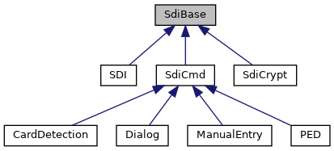

[Data Structures](#nested-classes) \| [Public Member Functions](#pub-methods) \| [Protected Member Functions](#pro-methods) \| [Protected Attributes](#pro-attribs)

`#include <`<a href="sdi__if_8h_source.md">sdi_if.h</a>`>`

Inheritance diagram for SdiBase:

\[<a href="graph_legend.md">legend</a>\]

|  |  |
|----|----|
| Data Structures |  |
| struct   | [PluginResult](#structlibsdi_1_1_sdi_base_1_1_plugin_result) |

|  |  |
|----|----|
| Public Member Functions |  |
|   | [SdiBase](#ad34d14385bdce6579d34f049c6d8dee5) () |
| enum <a href="namespacelibsdi.md#a0af9b7a9de719071122f396865ecebc9">SDI_SW12</a>  | [getSdiSw12](#a4058a7890507b92a38f3921ff4bf863b) () |
| int  | [getAdditionalResultValue](#a03cfc4186ba19fa866f27a0c12dbb4ad) () |
|   | Access Additional Result Value if returned in SDI response. [More\...](#a03cfc4186ba19fa866f27a0c12dbb4ad)  |
| <a href="namespacelibsdi.md#a88afe55c2211351a88265153f28797e4">SDICLIENT_ERROR</a>  | [getClientError](#a167a672bfb8c6f222c4b2a255b053aec) () |
|   | Access client side error codes. [More\...](#a167a672bfb8c6f222c4b2a255b053aec)  |
| enum <a href="namespacelibsdi.md#a0af9b7a9de719071122f396865ecebc9">SDI_SW12</a>  | [receiveSW12](#a23032d620c1f454fc5f00ff4f2f4ceb7) () |
|   | Receive SDI server response with no data. [More\...](#a23032d620c1f454fc5f00ff4f2f4ceb7)  |
| void  | [clear](#ac8bb3912a3ce86b15842e79d0b421204) () |
|   | clear result data obtained from SDI communication [More\...](#ac8bb3912a3ce86b15842e79d0b421204)  |
| void  | [importResults](#a7ffb7b7b3ae189a49b5eb16b605bb574) (const <a href="classlibsdi_1_1_sdi_base.md">SdiBase</a> &intermediate) |
|   | set result data obtained from intermediate SDI communication [More\...](#a7ffb7b7b3ae189a49b5eb16b605bb574)  |

|  |  |
|----|----|
| Protected Member Functions |  |
| void  | [setSdiSw12](#a0e6f27ea2daaead68e7b246333a65bd8) (enum <a href="namespacelibsdi.md#a0af9b7a9de719071122f396865ecebc9">SDI_SW12</a> s) |
| void  | [setClientError](#a28b2175186ba74bace6610ded1c3c261) (int libsdiprotocol_result) |

|  |  |
|----|----|
| Protected Attributes |  |
| unsigned short  | [sw12](#abc00684400484823da87a8e9d3f06267) |
| int  | [additionalResultValue](#aec8bd96d4ee40a80283213584fb4ef05) |
| <a href="namespacelibsdi.md#a88afe55c2211351a88265153f28797e4">SDICLIENT_ERROR</a>  | [clientErr](#a1595e9ce662f397b69db2b335b6bc847) |

## DetailedDescription {#detailed-description}

common base holding SDI messages, the result Status Word and the Additional result value if applicable

------------------------------------------------------------------------

## DataStructure Documentation {#data-structure-documentation}

## libsdi::SdiBase::PluginResult 

struct libsdi::SdiBase::PluginResult

| Data Fields |  |  |
|----|----|----|
| int32_t | pluginId | 
return value of a plugin\'s `moduleID` function also used as INS byte of SDI 26-xx command to invoke a plugin, 0 if not available
 |
| int32_t | responseCode | 
plugin\'s `processTrigger` function return value, <a href="namespacelibsdi.md#a0af9b7a9de719071122f396865ecebc9a6618acb8d68a00a36aa6aee2b0233e06">SDI_SW12_NONE</a> if not available
 |
| vector\< unsigned char \> | responseData | plugin response data |

## Constructor& Destructor Documentation

## SdiBase() 

<a href="classlibsdi_1_1_sdi_base.md">SdiBase</a>

inline

## MemberFunction Documentation {#member-function-documentation}

## clear() 

void clear

inline

clear result data obtained from SDI communication

## getAdditionalResultValue() 

int getAdditionalResultValue

inline

Access Additional Result Value if returned in SDI response.

### Returns

additionalResultValue error code of the invoked component

## getClientError() 

<a href="namespacelibsdi.md#a88afe55c2211351a88265153f28797e4">SDICLIENT_ERROR</a> getClientError

inline

Access client side error codes.

### Returns

clientErr error code of this component, valid when SDI command was not executed

## getSdiSw12() 

enum <a href="namespacelibsdi.md#a0af9b7a9de719071122f396865ecebc9">SDI_SW12</a> getSdiSw12

## importResults() 

void importResults

inline

set result data obtained from intermediate SDI communication

## receiveSW12() 

enum <a href="namespacelibsdi.md#a0af9b7a9de719071122f396865ecebc9">SDI_SW12</a> receiveSW12

Receive SDI server response with no data.

To be called when data available callback was invoked and the command was

- sendWaitCardRemoval()
- startPinInput()
- \...

### Returns

return SW12

## setClientError() 

void setClientError

protected

Setter for client error originating from libsdiprotocol function. Any negative value is an error code and goes to attribute clientErr. Any positive value will reset attribute clientErr.

**Parameters**

\[in\] **libsdiprotocol_result** return value from libsdiprotocol function

## setSdiSw12() 

void setSdiSw12

inlineprotected

## FieldDocumentation {#field-documentation}

## additionalResultValue 

int additionalResultValue

protected

## clientErr 

<a href="namespacelibsdi.md#a88afe55c2211351a88265153f28797e4">SDICLIENT_ERROR</a> clientErr

protected

## sw12 

unsigned short sw12

protected

------------------------------------------------------------------------

The documentation for this class was generated from the following file:

- sdiclient/client/<a href="sdi__if_8h_source.md">sdi_if.h</a>
