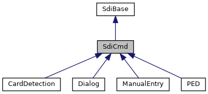
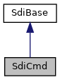

[Public Member Functions](#pub-methods) \| [Protected Attributes](#pro-attribs)

Composition for TLV based SDI commands. [More\...](#details)

`#include <`<a href="sdi__if_8h_source.md">sdi_if.h</a>`>`

Inheritance diagram for SdiCmd:



\[<a href="graph_legend.md">legend</a>\]

Collaboration diagram for SdiCmd:



\[<a href="graph_legend.md">legend</a>\]

|  |  |
|----|----|
| Public Member Functions |  |
|   | [SdiCmd](#a9a5f0b856a4b8e0f337770f1fa841c80) () |
| virtual  | [\~SdiCmd](#add17dace52a0c4b8f6004f7bcc867e3e) () |
| enum <a href="namespacelibsdi.md#a0af9b7a9de719071122f396865ecebc9">SDI_SW12</a>  | [sendReceive](#a59300a399fbda10c562a2470fc4cde52) (unsigned char cla, unsigned char ins, unsigned char p1=0, unsigned char p2=0, unsigned maxResponseSize=2048) |
|   | Generic SDI command exchange function combining sending of request, waiting and receiving the response. [More\...](#a59300a399fbda10c562a2470fc4cde52)<br/> |
| int  | [send](#adf6959d0550be4ff756c3ee4b7f104fe) (unsigned char cla, unsigned char ins, unsigned char p1=0, unsigned char p2=0) |
|   | Like [sendReceive()](#a59300a399fbda10c562a2470fc4cde52 "Generic SDI command exchange function combining sending of request, waiting and receiving the respons...") but without waiting for response. [More\...](#adf6959d0550be4ff756c3ee4b7f104fe)<br/> |
| enum <a href="namespacelibsdi.md#a0af9b7a9de719071122f396865ecebc9">SDI_SW12</a>  | [receive](#a22eddbbef80354a4641b55828346c7d7) (unsigned maxResponseSize=2048) |
|   | Receive SDI response after request has been send with [send()](#adf6959d0550be4ff756c3ee4b7f104fe "Like sendReceive() but without waiting for response.") and data availability has been signaled. [More\...](#a22eddbbef80354a4641b55828346c7d7)<br/> |
| void  | [set](#ae460ac8618ec349ff0289c578539d9f2) (const char \*path, int <a href="_web_service_wrappers_8c.md#a6e248376c0290338633d8137822eb209">value</a>, unsigned fixedLength=0) |
|   | Set integer data object SDI command. [More\...](#ae460ac8618ec349ff0289c578539d9f2)<br/> |
| void  | [set](#a1ec79e2e0211c6c8ee229ba779ec9eff) (const char \*path, uint32_t <a href="_web_service_wrappers_8c.md#a6e248376c0290338633d8137822eb209">value</a>, unsigned fixedLength=0) |
|   | Set unsigned integer data object SDI command. [More\...](#a1ec79e2e0211c6c8ee229ba779ec9eff)<br/> |
| void  | [set](#ac72a9a24645c216539ab422b50a763cb) (const char \*path, const unsigned char \*data, unsigned dataLen) |
|   | Set byte array data object in SDI command. [More\...](#ac72a9a24645c216539ab422b50a763cb)<br/> |
| void  | [set](#acae91bc646226025ace047bdba7a2d5d) (const char \*path, unsigned char byteValue) |
|   | Set single byte value in SDI command. [More\...](#acae91bc646226025ace047bdba7a2d5d)<br/> |
| void  | [set](#a5c4ad2fa43dc552bccc10404a5bd28d0) (const char \*path, const std::vector\< unsigned char \> &data) |
|   | Set byte array data object in SDI command. [More\...](#a5c4ad2fa43dc552bccc10404a5bd28d0)<br/> |
| void  | [set](#aa6eb7cd81eecfd63f2ccb5980213e37c) (const char \*path, const std::string &<a href="_web_service_wrappers_8c.md#a6e248376c0290338633d8137822eb209">value</a>) |
|   | Set character data object in SDI command. [More\...](#aa6eb7cd81eecfd63f2ccb5980213e37c)<br/> |
| void  | [setCommandDestination](#a365ef386b964414cd160cc03e5063745) (bool epp, bool force=false) |
|   | Set command destination for systems with EPP Unless force the command destination is set only if parameter epp is true. [More\...](#a365ef386b964414cd160cc03e5063745)<br/> |
| virtual void  | [clear](#aae048282c7011eedc2e0492f6421ea73) () |
|   | Remove all SDI command command input data. [More\...](#aae048282c7011eedc2e0492f6421ea73)<br/> |
| virtual void  | [clear](#a509a30dbc3c5bb52a8ceb38bedad6e82) (const char \*path) |
|   | Remove single input data stored in [dataIn](#a2b7c2d6ae6cb8a37cd3cc6c2a053abbc "Command input buffer collecting TLV data items."). [More\...](#a509a30dbc3c5bb52a8ceb38bedad6e82)<br/> |
| virtual void  | [clearResults](#a80eff6d974183e99f91c034c49d2ecde) () |
|   | Remove all SDI response data. [More\...](#a80eff6d974183e99f91c034c49d2ecde)<br/> |
| void  | [importResults](#a9490be5475acb6b165642dd2c3d1caf2) (const <a href="classlibsdi_1_1_sdi_cmd.md">SdiCmd</a> &intermediate) |
|   | Transfer status word, client error and response data from an intermediate command while keeping command input data. [More\...](#a9490be5475acb6b165642dd2c3d1caf2)<br/> |
| void  | [importResults](#a33a1327fd18f767afb4baa2e5a814455) (const unsigned char \*<a href="classlibsdi_1_1_sdi_base.md#abc00684400484823da87a8e9d3f06267">sw12</a>, const unsigned char \*tlvData, unsigned tlvSize) |
|   | Inject result data from a call back. [More\...](#a33a1327fd18f767afb4baa2e5a814455)<br/> |
| bool  | [get](#a733bf780a710be27b4b3d95bd148e45c) (const char \*path, int &<a href="_web_service_wrappers_8c.md#a6e248376c0290338633d8137822eb209">value</a>) |
| bool  | [get](#aacea549b9a51b2341447610bfd407f68) (const char \*path, uint32_t &<a href="_web_service_wrappers_8c.md#a6e248376c0290338633d8137822eb209">value</a>) |
| int  | [get](#a68f21c216cef62cc1922cc25b07d241a) (const char \*path, unsigned char \*buffer, unsigned bufferSize) |
| bool  | [get](#aa3551e32ad6b0779ce2597e502602c75) (const char \*path, unsigned char &<a href="_web_service_wrappers_8c.md#a6e248376c0290338633d8137822eb209">value</a>) |
| bool  | [get](#a5b5da404e34fc6cc0d5f989e5a1ef75e) (const char \*path, std::vector\< unsigned char \> &buffer) |
| bool  | [get](#acdc1d042dccffeb62ba2859c9d16a87a) (const char \*path, std::string &<a href="_web_service_wrappers_8c.md#a6e248376c0290338633d8137822eb209">value</a>) |
| std::string  | [getString](#ac8fbd8404dfbc8ef830c77842542f38d) (const char \*path) |
|  Public Member Functions inherited from <a href="classlibsdi_1_1_sdi_base.md">SdiBase</a> |  |
|   | <a href="classlibsdi_1_1_sdi_base.md#ad34d14385bdce6579d34f049c6d8dee5">SdiBase</a> () |
| enum <a href="namespacelibsdi.md#a0af9b7a9de719071122f396865ecebc9">SDI_SW12</a>  | <a href="classlibsdi_1_1_sdi_base.md#a4058a7890507b92a38f3921ff4bf863b">getSdiSw12</a> () |
| int  | <a href="classlibsdi_1_1_sdi_base.md#a03cfc4186ba19fa866f27a0c12dbb4ad">getAdditionalResultValue</a> () |
|   | Access Additional Result Value if returned in SDI response. <a href="classlibsdi_1_1_sdi_base.md#a03cfc4186ba19fa866f27a0c12dbb4ad">More...</a><br/> |
| <a href="namespacelibsdi.md#a88afe55c2211351a88265153f28797e4">SDICLIENT_ERROR</a>  | <a href="classlibsdi_1_1_sdi_base.md#a167a672bfb8c6f222c4b2a255b053aec">getClientError</a> () |
|   | Access client side error codes. <a href="classlibsdi_1_1_sdi_base.md#a167a672bfb8c6f222c4b2a255b053aec">More...</a><br/> |
| enum <a href="namespacelibsdi.md#a0af9b7a9de719071122f396865ecebc9">SDI_SW12</a>  | <a href="classlibsdi_1_1_sdi_base.md#a23032d620c1f454fc5f00ff4f2f4ceb7">receiveSW12</a> () |
|   | Receive SDI server response with no data. <a href="classlibsdi_1_1_sdi_base.md#a23032d620c1f454fc5f00ff4f2f4ceb7">More...</a><br/> |
| void  | <a href="classlibsdi_1_1_sdi_base.md#ac8bb3912a3ce86b15842e79d0b421204">clear</a> () |
|   | clear result data obtained from SDI communication <a href="classlibsdi_1_1_sdi_base.md#ac8bb3912a3ce86b15842e79d0b421204">More...</a><br/> |
| void  | <a href="classlibsdi_1_1_sdi_base.md#a7ffb7b7b3ae189a49b5eb16b605bb574">importResults</a> (const <a href="classlibsdi_1_1_sdi_base.md">SdiBase</a> &intermediate) |
|   | set result data obtained from intermediate SDI communication <a href="classlibsdi_1_1_sdi_base.md#a7ffb7b7b3ae189a49b5eb16b605bb574">More...</a><br/> |

|  |  |
|----|----|
| Protected Attributes |  |
| void \*  | [dataIn](#a2b7c2d6ae6cb8a37cd3cc6c2a053abbc) |
|   | Command input buffer collecting TLV data items. [More\...](#a2b7c2d6ae6cb8a37cd3cc6c2a053abbc)<br/> |
| void \*  | [dataOut](#a63c88c0318a60c296203e18195a8846a) |
|   | Command response TLV data items. [More\...](#a63c88c0318a60c296203e18195a8846a)<br/> |
|  Protected Attributes inherited from <a href="classlibsdi_1_1_sdi_base.md">SdiBase</a> |  |
| unsigned short  | <a href="classlibsdi_1_1_sdi_base.md#abc00684400484823da87a8e9d3f06267">sw12</a> |
| int  | <a href="classlibsdi_1_1_sdi_base.md#aec8bd96d4ee40a80283213584fb4ef05">additionalResultValue</a> |
| <a href="namespacelibsdi.md#a88afe55c2211351a88265153f28797e4">SDICLIENT_ERROR</a>  | <a href="classlibsdi_1_1_sdi_base.md#a1595e9ce662f397b69db2b335b6bc847">clientErr</a> |

|  |  |
|----|----|
| Additional Inherited Members |  |
|  Protected Member Functions inherited from <a href="classlibsdi_1_1_sdi_base.md">SdiBase</a> |  |
| void  | <a href="classlibsdi_1_1_sdi_base.md#a0e6f27ea2daaead68e7b246333a65bd8">setSdiSw12</a> (enum <a href="namespacelibsdi.md#a0af9b7a9de719071122f396865ecebc9">SDI_SW12</a> s) |
| void  | <a href="classlibsdi_1_1_sdi_base.md#a28b2175186ba74bace6610ded1c3c261">setClientError</a> (int libsdiprotocol_result) |

## DetailedDescription {#detailed-description}

Composition for TLV based SDI commands.

General instruction:

- Create instance of [SdiCmd](#a9a5f0b856a4b8e0f337770f1fa841c80)
- Populate input data by calling the set functions
- call [sendReceive()](#a59300a399fbda10c562a2470fc4cde52 "Generic SDI command exchange function combining sending of request, waiting and receiving the respons...") to execute the SDI command
- use the getter functions to access response data

**Path Format**
The path specification is a terminated ASCII string composed of the hexadecimal encoded tag names with \'/\' separating sub tag levels. **Note: The leading \"F0/\" is implicitly added and must not be used.**To support TLV data not enclosed in \'F0\' template the path has to start with \'/\'. Additionally a counter is possible separated by \',\' E.g \"E0,3/90,2\" gives the second primitive \'90\' in the third \'E0\' container. Note: Count starts at 1: \"90,1\" is the same as \"90,0\" and \"90\".
**Example** showing use in subclass <a href="classlibsdi_1_1_p_e_d.md">PED</a>:

``` cpp
void PED::setAmount(const unsigned char* amount)
{
   set("9F02", amount, 6);
}
```

## Constructor& Destructor Documentation

## SdiCmd() <a href="#a9a5f0b856a4b8e0f337770f1fa841c80" id="a9a5f0b856a4b8e0f337770f1fa841c80"></a>

<p><a href="classlibsdi_1_1_sdi_cmd.md">SdiCmd</a></p>

## \~SdiCmd() <a href="#add17dace52a0c4b8f6004f7bcc867e3e" id="add17dace52a0c4b8f6004f7bcc867e3e"></a>

<p>virtual \~<a href="classlibsdi_1_1_sdi_cmd.md">SdiCmd</a></p>

virtual

## MemberFunction Documentation {#member-function-documentation}

## clear()\[1/2\] <a href="#aae048282c7011eedc2e0492f6421ea73" id="aae048282c7011eedc2e0492f6421ea73"></a> {#clear-12}

<p>virtual void clear</p>

virtual

Remove all SDI command command input data.

Reimplemented in <a href="classlibsdi_1_1_card_detection.md#aae048282c7011eedc2e0492f6421ea73">CardDetection</a>.

## clear()\[2/2\] <a href="#a509a30dbc3c5bb52a8ceb38bedad6e82" id="a509a30dbc3c5bb52a8ceb38bedad6e82"></a> {#clear-22}

<p>virtual void clear</p>

virtual

Remove single input data stored in [dataIn](#a2b7c2d6ae6cb8a37cd3cc6c2a053abbc "Command input buffer collecting TLV data items.").

**Parameters**

\[in\] **path** TLV tag name path (without enclosing F0), see Path Format

## clearResults() <a href="#a80eff6d974183e99f91c034c49d2ecde" id="a80eff6d974183e99f91c034c49d2ecde"></a>

<p>virtual void clearResults</p>

virtual

Remove all SDI response data.

## get()\[1/6\] <a href="#a733bf780a710be27b4b3d95bd148e45c" id="a733bf780a710be27b4b3d95bd148e45c"></a> {#get-16}

<p>bool get</p>

Get integer value from <a href="classlibsdi_1_1_s_d_i.md">SDI</a> response

**Parameters**

\[in\] **path** TLV path (without enclosing F0), see Path Format \[out\] **value** target buffer

### Returns

true if value was found in <a href="classlibsdi_1_1_s_d_i.md">SDI</a> response

## get()\[2/6\] <a href="#acdc1d042dccffeb62ba2859c9d16a87a" id="acdc1d042dccffeb62ba2859c9d16a87a"></a> {#get-26}

<p>bool get</p>

Read text from SDI response

**Parameters**

\[in\] **path** TLV path (without enclosing F0), see Path Format \[out\] **value** string reference for the result data

### Returns

true for success

## get()\[3/6\] <a href="#a5b5da404e34fc6cc0d5f989e5a1ef75e" id="a5b5da404e34fc6cc0d5f989e5a1ef75e"></a> {#get-36}

<p>bool get</p>

Read data from SDI response

**Parameters**

\[in\] **path** TLV path (without enclosing F0), see Path Format \[out\] **buffer** target vector

### Returns

true if data was found in <a href="classlibsdi_1_1_s_d_i.md">SDI</a> response

## get()\[4/6\] <a href="#aacea549b9a51b2341447610bfd407f68" id="aacea549b9a51b2341447610bfd407f68"></a> {#get-46}

<p>bool get</p>

Get unsigned integer value from SDI response

**Parameters**

\[in\] **path** TLV path (without enclosing F0), see Path Format \[out\] **value** target buffer

### Returns

true if value was found in <a href="classlibsdi_1_1_s_d_i.md">SDI</a> response

## get()\[5/6\] <a href="#aa3551e32ad6b0779ce2597e502602c75" id="aa3551e32ad6b0779ce2597e502602c75"></a> {#get-56}

<p>bool get</p>

inline

Read single byte from SDI response

**Parameters**

\[in\] **path** TLV path (without enclosing F0), see Path Format \[out\] **value** target buffer, remains unchanged if tag not found

### Returns

true if SDI contains requested data with length 1

## get()\[6/6\] <a href="#a68f21c216cef62cc1922cc25b07d241a" id="a68f21c216cef62cc1922cc25b07d241a"></a> {#get-66}

<p>int get</p>

Read data from SDI response

**Parameters**

\[in\] **path** TLV path (without enclosing F0), see Path Format \[out\] **buffer** target buffer \[in\] **bufferSize** size of target buffer

### Returns

length of data found in <a href="classlibsdi_1_1_s_d_i.md">SDI</a> response, -1 if absent

## getString() <a href="#ac8fbd8404dfbc8ef830c77842542f38d" id="ac8fbd8404dfbc8ef830c77842542f38d"></a>

<p>std::string getString</p>

Read text from SDI response

**Parameters**

\[in\] **path** TLV path (without enclosing F0), see Path Format

### Returns

Text from <a href="classlibsdi_1_1_s_d_i.md">SDI</a> response, empty string if absent

## importResults()\[1/2\] <a href="#a9490be5475acb6b165642dd2c3d1caf2" id="a9490be5475acb6b165642dd2c3d1caf2"></a> {#importresults-12}

<p>void importResults</p>

Transfer status word, client error and response data from an intermediate command while keeping command input data.

**Parameters**

\[in\] **intermediate** reference to intermediate command that received SDI response

## importResults()\[2/2\] <a href="#a33a1327fd18f767afb4baa2e5a814455" id="a33a1327fd18f767afb4baa2e5a814455"></a> {#importresults-22}

<p>void importResults</p>

Inject result data from a call back.

**Parameters**

\[in\] **sw12** pointer to SDI status word \[in\] **tlvData** pointer to SDI TLV data (should start with F0) \[in\] **tlvSize** length of tlvData in bytes

## receive() <a href="#a22eddbbef80354a4641b55828346c7d7" id="a22eddbbef80354a4641b55828346c7d7"></a>

<p>enum <a href="namespacelibsdi.md#a0af9b7a9de719071122f396865ecebc9">SDI_SW12</a> receive</p>

Receive SDI response after request has been send with [send()](#adf6959d0550be4ff756c3ee4b7f104fe "Like sendReceive() but without waiting for response.") and data availability has been signaled.

**Parameters**

\[in\] **maxResponseSize** optional required buffer size for entire SDI response

### Returns

SDI status word (the two leading bytes of the SDI response as word)

## send() <a href="#adf6959d0550be4ff756c3ee4b7f104fe" id="adf6959d0550be4ff756c3ee4b7f104fe"></a>

<p>int send</p>

Like [sendReceive()](#a59300a399fbda10c562a2470fc4cde52 "Generic SDI command exchange function combining sending of request, waiting and receiving the respons...") but without waiting for response.

If [send()](#adf6959d0550be4ff756c3ee4b7f104fe "Like sendReceive() but without waiting for response.") succeeded (return code 0) wait for signal by data available callback. Thereafter call [receive()](#a22eddbbef80354a4641b55828346c7d7 "Receive SDI response after request has been send with send() and data availability has been signaled.") to get SDI response.

**Parameters**

\[in\] **cla** SDI command class \[in\] **ins** SDI command instruction for given class \[in\] **p1** optional SDI command parameter 1 \[in\] **p2** optional SDI command parameter 2

### Returns

0 for success, SDI_PROTOCOL_ERR_xxx on failure

## sendReceive() <a href="#a59300a399fbda10c562a2470fc4cde52" id="a59300a399fbda10c562a2470fc4cde52"></a>

<p>enum <a href="namespacelibsdi.md#a0af9b7a9de719071122f396865ecebc9">SDI_SW12</a> sendReceive</p>

Generic SDI command exchange function combining sending of request, waiting and receiving the response.

The SDI command TLV data part is created from the public [dataIn](#a2b7c2d6ae6cb8a37cd3cc6c2a053abbc "Command input buffer collecting TLV data items.") attribute, which has been populated with this classes setter functions before function invocation. The SDI response TLV data part will be imported to public dataOut attribute.

**Parameters**

\[in\] **cla** SDI command class \[in\] **ins** SDI command instruction for given class \[in\] **p1** optional SDI command parameter 1 \[in\] **p2** optional SDI command parameter 2 \[in\] **maxResponseSize** optional required buffer size for entire SDI response

### Returns

SDI status word (the two leading bytes of the SDI response as word)

## set()\[1/6\] <a href="#aa6eb7cd81eecfd63f2ccb5980213e37c" id="aa6eb7cd81eecfd63f2ccb5980213e37c"></a> {#set-16}

<p>void set</p>

Set character data object in SDI command.

Set text for TLV path (without enclosing F0). If a tags already exists it\'s data will be overwritten.

**Parameters**

**path** TLV tag name path, see Path Format **value** alpha-numeric data

## set()\[2/6\] <a href="#a5c4ad2fa43dc552bccc10404a5bd28d0" id="a5c4ad2fa43dc552bccc10404a5bd28d0"></a> {#set-26}

<p>void set</p>

Set byte array data object in SDI command.

Set binary data for TLV path (without enclosing F0). If a tags already exists it\'s data will be overwritten.

**Parameters**

**path** TLV tag name path, see Path Format **data** byte vector

## set()\[3/6\] <a href="#ac72a9a24645c216539ab422b50a763cb" id="ac72a9a24645c216539ab422b50a763cb"></a> {#set-36}

<p>void set</p>

Set byte array data object in SDI command.

Set binary data for TLV path (without enclosing F0). If a tags already exists it\'s data will be overwritten.

**Parameters**

**path** TLV tag name path, see Path Format **data** byte array **dataLen** byte count of data length

## set()\[4/6\] <a href="#ae460ac8618ec349ff0289c578539d9f2" id="ae460ac8618ec349ff0289c578539d9f2"></a> {#set-46}

<p>void set</p>

Set integer data object SDI command.

Set integer for TLV path (without enclosing F0). If a tags already exists it\'s data will be overwritten. The data length after serialisation is 1-4 bytes as needed to encode the value unless otherwise specified by parameter fixedLength.

**Parameters**

**path** TLV tag name path, see Path Format **value** signed integer value **fixedLength** optional, might be required for some parameters

## set()\[5/6\] <a href="#a1ec79e2e0211c6c8ee229ba779ec9eff" id="a1ec79e2e0211c6c8ee229ba779ec9eff"></a> {#set-56}

<p>void set</p>

Set unsigned integer data object SDI command.

Set integer for TLV path (without enclosing F0). If a tags already exists it\'s data will be overwritten. The data length after serialisation is 1-4 bytes as needed to encode the value unless otherwise specified by parameter fixedLength.

**Parameters**

**path** TLV tag name path, see Path Format **value** signed unsigned integer value **fixedLength** optional, might be required for some parameters

## set()\[6/6\] <a href="#acae91bc646226025ace047bdba7a2d5d" id="acae91bc646226025ace047bdba7a2d5d"></a> {#set-66}

<p>void set</p>

inline

Set single byte value in SDI command.

Set binary data for TLV path (without enclosing F0). If a tags already exists it\'s data will be overwritten.

**Parameters**

**path** TLV tag name path, see Path Format **byteValue** single byte

## setCommandDestination() <a href="#a365ef386b964414cd160cc03e5063745" id="a365ef386b964414cd160cc03e5063745"></a>

<p>void setCommandDestination</p>

Set command destination for systems with EPP Unless force the command destination is set only if parameter epp is true.

**Parameters**

\[in\] **epp** true if command shall be set to EPP \[in\] **force** if true do not omit command destination in case of countertop

## FieldDocumentation {#field-documentation}

## dataIn <a href="#a2b7c2d6ae6cb8a37cd3cc6c2a053abbc" id="a2b7c2d6ae6cb8a37cd3cc6c2a053abbc"></a>

<p>void\* dataIn</p>

protected

Command input buffer collecting TLV data items.

## dataOut <a href="#a63c88c0318a60c296203e18195a8846a" id="a63c88c0318a60c296203e18195a8846a"></a>

<p>void\* dataOut</p>

protected

Command response TLV data items.

------------------------------------------------------------------------

The documentation for this class was generated from the following file:

- sdiclient/client/<a href="sdi__if_8h_source.md">sdi_if.h</a>
