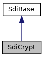

[Data Structures](#nested-classes) \| [Public Member Functions](#pub-methods) \| [Static Public Member Functions](#pub-static-methods)

`#include <`<a href="sdi__if_8h_source.md">sdi_if.h</a>`>`

Inheritance diagram for SdiCrypt:

\[<a href="graph_legend.md">legend</a>\]

Collaboration diagram for SdiCrypt:

\[<a href="graph_legend.md">legend</a>\]

|  |  |
|----|----|
| Data Structures |  |
| struct   | [Placeholder](#structlibsdi_1_1_sdi_crypt_1_1_placeholder) |

|  |  |
|----|----|
| Public Member Functions |  |
|   | [SdiCrypt](#a94c3ef347a3a089dc95b907e8904d8f5) () |
|   | [\~SdiCrypt](#ab8fdc95ada687ddd0a76870a67a625b6) () |
| bool  | [open](#ae99bad44e7039ea84f53656155edeaac) (const char \*hostName) |
|   | call SDI Crypto Open (70-00). [More\...](#ae99bad44e7039ea84f53656155edeaac)  |
| bool  | [close](#a46143fd6de3be9ab9951f140d3ae8c2f) () |
|   | call SDI Crypto Open Close (70-01). [More\...](#a46143fd6de3be9ab9951f140d3ae8c2f)  |
| bool  | [isOpen](#a002ed331862370f434b7befe331b5a0b) () const |
|   | Check if a crypto handle is present. [More\...](#a002ed331862370f434b7befe331b5a0b)  |
| uint32_t  | [getCryptoHandle](#a6970d6acf8107304fe72f56716c822fc) () |
|   | Read the crypto handle obtained by SDI Crypto Open. [More\...](#a6970d6acf8107304fe72f56716c822fc)  |
| bool  | [encrypt](#ad2ac275f8a1634eb37ec84ebf004b3cb) (const std::vector\< unsigned char \> &data, std::vector\< unsigned char \> &encrypted) |
|   | SDI Crypto Encrypt (70-02). [More\...](#ad2ac275f8a1634eb37ec84ebf004b3cb)  |
| bool  | [decrypt](#a7684301d03885939b4dccdd19d2807f4) (const std::vector\< unsigned char \> &encrypted, std::vector\< unsigned char \> &decrypted) |
|   | SDI Crypto Decrypt (70-03). [More\...](#a7684301d03885939b4dccdd19d2807f4)  |
| bool  | [sign](#a941d99efd0f797b2ea0776b80b64961a) (const std::vector\< unsigned char \> &data, std::vector\< unsigned char \> &signature) |
|   | SDI Crypto Sign (70-04). [More\...](#a941d99efd0f797b2ea0776b80b64961a)  |
| bool  | [verify](#ae60ef41731e7c9a7b9aa4b48d23b785a) (const std::vector\< unsigned char \> &data, const std::vector\< unsigned char \> &signature) |
|   | SDI Crypto Verify (70-05). [More\...](#ae60ef41731e7c9a7b9aa4b48d23b785a)  |
| bool  | [updateKey](#a1a13ac3691aa5936c2e4e0f07d32a7a7) (unsigned char keyType, const std::vector\< unsigned char \> &keyData, std::vector\< unsigned char \> \*proprietaryData=NULL, const unsigned char AS2805=0, std::vector\< unsigned char \> \*KCV=NULL) |
|   | SDI Crypto Update Key (70-06). [More\...](#a1a13ac3691aa5936c2e4e0f07d32a7a7)  |
| bool  | [setKeySetId](#af6bf6e8170adac0abf2b1f33344a8552) (uint32_t ksid, uint32_t mksid=0, bool asAttribute=false) |
|   | Set Key Set (70-07) or setter for [getEncData()](#a04dbff235d0bc2ee3965deb24c067bcb "Encryption command for card holder sensitive data (29-00)."), [getEncMsgData()](#aa3cbfa1f404ec3a00bf639440ca7d5ce "Encryption command for card holder sensitive data in host messages (29-01)") and [getMsgSignature()](#a0471fc11895a6a5cfe1c9cc927cde309 "Singing of host messages (29-04).") depending on parameter `asAttribute`. [More\...](#af6bf6e8170adac0abf2b1f33344a8552)  |
| bool  | [getEncryptedPin](#a29bc02bfa0379a16f6bd38be417b0327) (unsigned char pinBlockFormat, std::vector\< unsigned char \> &pinBlock, bool requestZeroPinBlock=false) |
|   | Get encrypted PIN (70-08). [More\...](#a29bc02bfa0379a16f6bd38be417b0327)  |
| std::string  | [getKeyInventory](#aace57550a2c64b313b9561c4d377fe34) () |
|   | Get Key Inventory (70-09). [More\...](#aace57550a2c64b313b9561c4d377fe34)  |
| bool  | [getKeyData](#a3ec32f356421fa02d7514b582326660f) (unsigned char keyType, std::vector\< unsigned char \> &keyData, unsigned char kekFlag=0) |
|   | Get Key Data (70-0A). [More\...](#a3ec32f356421fa02d7514b582326660f)  |
| std::string  | [getStatus](#a8531e732960977a2f1dfe5002bb8f6ab) () |
|   | Get Status of security module (70-0B) with handle received by [open()](#ae99bad44e7039ea84f53656155edeaac "call SDI Crypto Open (70-00)."). [More\...](#a8531e732960977a2f1dfe5002bb8f6ab)  |
| std::string  | [getStatus](#af1e8ccc56bff5b04bfa330859185b70b) (std::string hostName) |
|   | Get Status of security module (70-0B) for given host name or for all security modules. [More\...](#af1e8ccc56bff5b04bfa330859185b70b)  |
| void  | [setInitialVector](#a2c6b663bf15bb17170817a1996d3369d) (const std::vector\< unsigned char \> &iv) |
|   | Set Initial Vector for various cipher commands (DFA403) [More\...](#a2c6b663bf15bb17170817a1996d3369d)  |
| void  | [getInitialVector](#a51fc7fbde0fd878e138bf79de9a21a0d) (std::vector\< unsigned char \> &iv) const |
|   | Get Initial Vector returned by various cipher commands. [More\...](#a51fc7fbde0fd878e138bf79de9a21a0d)  |
| void  | [getKeySerialNumber](#aaf2d37c9070e17e626077e23642a3a14) (std::vector\< unsigned char \> &ksn) const |
|   | Get key serial number returned by various cipher commands. [More\...](#aaf2d37c9070e17e626077e23642a3a14)  |
| bool  | [getEncData](#a04dbff235d0bc2ee3965deb24c067bcb) (const [Placeholder](#structlibsdi_1_1_sdi_crypt_1_1_placeholder) &descriptor, std::vector\< unsigned char \> &encrypted, bool useStoredData=false, bool incrementKSN=false) |
|   | Encryption command for card holder sensitive data (29-00). [More\...](#a04dbff235d0bc2ee3965deb24c067bcb)  |
| bool  | [getEncMsgData](#aa3cbfa1f404ec3a00bf639440ca7d5ce) (const std::vector\< unsigned char \> &messageTemplate, const std::vector\< [Placeholder](#structlibsdi_1_1_sdi_crypt_1_1_placeholder) \> &placeholder, std::vector\< unsigned char \> &encrypted, bool useStoredData=false, bool incrementKSN=false) |
|   | Encryption command for card holder sensitive data in host messages (29-01) [More\...](#aa3cbfa1f404ec3a00bf639440ca7d5ce)  |
| bool  | [getMsgSignature](#a0471fc11895a6a5cfe1c9cc927cde309) (const std::vector\< unsigned char \> &messageTemplate, const std::vector\< [Placeholder](#structlibsdi_1_1_sdi_crypt_1_1_placeholder) \> &placeholder, std::vector\< unsigned char \> &signature, bool useStoredData=false, bool incrementKSN=false) |
|   | Singing of host messages (29-04). [More\...](#a0471fc11895a6a5cfe1c9cc927cde309)  |
| bool  | [getEncTrxData](#a108c80d36b5996a03c8034d04ecf9a87) (const std::vector\< unsigned long \> tags, std::vector\< unsigned char \> &data) |
|   | Perform the command to get encrypted transaction data for later use (29-07). [More\...](#a108c80d36b5996a03c8034d04ecf9a87)  |
| bool  | [setEncTrxData](#a86641b88966fb93c099c4998d6c66c5d) (const std::vector\< unsigned char \> data) |
|   | Perform the command to send encrypted transaction data back to the SDI Server (29-08). [More\...](#a86641b88966fb93c099c4998d6c66c5d)  |
| bool  | [endEncTrxData](#a000632209707b04739d161ee4dda6600) () |
|   | Perform the command to finish the encrypted transaction data procedure inside the SDI Server (29-09). [More\...](#a000632209707b04739d161ee4dda6600)  |
|  Public Member Functions inherited from <a href="classlibsdi_1_1_sdi_base.md">SdiBase</a> |  |
|   | <a href="classlibsdi_1_1_sdi_base.md#ad34d14385bdce6579d34f049c6d8dee5">SdiBase</a> () |
| enum <a href="namespacelibsdi.md#a0af9b7a9de719071122f396865ecebc9">SDI_SW12</a>  | <a href="classlibsdi_1_1_sdi_base.md#a4058a7890507b92a38f3921ff4bf863b">getSdiSw12</a> () |
| int  | <a href="classlibsdi_1_1_sdi_base.md#a03cfc4186ba19fa866f27a0c12dbb4ad">getAdditionalResultValue</a> () |
|   | Access Additional Result Value if returned in SDI response. <a href="classlibsdi_1_1_sdi_base.md#a03cfc4186ba19fa866f27a0c12dbb4ad">More...</a>  |
| <a href="namespacelibsdi.md#a88afe55c2211351a88265153f28797e4">SDICLIENT_ERROR</a>  | <a href="classlibsdi_1_1_sdi_base.md#a167a672bfb8c6f222c4b2a255b053aec">getClientError</a> () |
|   | Access client side error codes. <a href="classlibsdi_1_1_sdi_base.md#a167a672bfb8c6f222c4b2a255b053aec">More...</a>  |
| enum <a href="namespacelibsdi.md#a0af9b7a9de719071122f396865ecebc9">SDI_SW12</a>  | <a href="classlibsdi_1_1_sdi_base.md#a23032d620c1f454fc5f00ff4f2f4ceb7">receiveSW12</a> () |
|   | Receive SDI server response with no data. <a href="classlibsdi_1_1_sdi_base.md#a23032d620c1f454fc5f00ff4f2f4ceb7">More...</a>  |
| void  | <a href="classlibsdi_1_1_sdi_base.md#ac8bb3912a3ce86b15842e79d0b421204">clear</a> () |
|   | clear result data obtained from SDI communication <a href="classlibsdi_1_1_sdi_base.md#ac8bb3912a3ce86b15842e79d0b421204">More...</a>  |
| void  | <a href="classlibsdi_1_1_sdi_base.md#a7ffb7b7b3ae189a49b5eb16b605bb574">importResults</a> (const <a href="classlibsdi_1_1_sdi_base.md">SdiBase</a> &intermediate) |
|   | set result data obtained from intermediate SDI communication <a href="classlibsdi_1_1_sdi_base.md#a7ffb7b7b3ae189a49b5eb16b605bb574">More...</a>  |

|  |  |
|----|----|
| Static Public Member Functions |  |
| static std::string  | [getVersions](#a82bb8a102a935a4aba921ba0c9ecf5e7) (int &additionalResult) |
|   | Get versions of SEC ADK components (70-0C). [More\...](#a82bb8a102a935a4aba921ba0c9ecf5e7)  |

|  |  |
|----|----|
| Additional Inherited Members |  |
|  Protected Member Functions inherited from <a href="classlibsdi_1_1_sdi_base.md">SdiBase</a> |  |
| void  | <a href="classlibsdi_1_1_sdi_base.md#a0e6f27ea2daaead68e7b246333a65bd8">setSdiSw12</a> (enum <a href="namespacelibsdi.md#a0af9b7a9de719071122f396865ecebc9">SDI_SW12</a> s) |
| void  | <a href="classlibsdi_1_1_sdi_base.md#a28b2175186ba74bace6610ded1c3c261">setClientError</a> (int libsdiprotocol_result) |
|  Protected Attributes inherited from <a href="classlibsdi_1_1_sdi_base.md">SdiBase</a> |  |
| unsigned short  | <a href="classlibsdi_1_1_sdi_base.md#abc00684400484823da87a8e9d3f06267">sw12</a> |
| int  | <a href="classlibsdi_1_1_sdi_base.md#aec8bd96d4ee40a80283213584fb4ef05">additionalResultValue</a> |
| <a href="namespacelibsdi.md#a88afe55c2211351a88265153f28797e4">SDICLIENT_ERROR</a>  | <a href="classlibsdi_1_1_sdi_base.md#a1595e9ce662f397b69db2b335b6bc847">clientErr</a> |

## DetailedDescription {#detailed-description}

<a href="classlibsdi_1_1_sdi_crypt.md">SdiCrypt</a> holding the crypto handle from Crypto Open. General notes for most functions in this class:

- In case of error the SDI server\'s SW1 SW2 can be read with <a href="classlibsdi_1_1_sdi_base.md#a4058a7890507b92a38f3921ff4bf863b">getSdiSw12()</a>
- If present, additional error info can be read with <a href="classlibsdi_1_1_sdi_base.md#a03cfc4186ba19fa866f27a0c12dbb4ad">getAdditionalResultValue()</a>
- If a Initial Vector is required or received (random mode) it is managed by [getInitialVector()](#a51fc7fbde0fd878e138bf79de9a21a0d "Get Initial Vector returned by various cipher commands.") and [setInitialVector()](#a2c6b663bf15bb17170817a1996d3369d "Set Initial Vector for various cipher commands (DFA403)").
- If an KSN has been returned by the SDI server it can be read with [getKeySerialNumber()](#aaf2d37c9070e17e626077e23642a3a14 "Get key serial number returned by various cipher commands.")

------------------------------------------------------------------------

## DataStructure Documentation {#data-structure-documentation}

## libsdi::SdiCrypt::Placeholder 

struct libsdi::SdiCrypt::Placeholder

Data descriptor for [getEncData()](#a04dbff235d0bc2ee3965deb24c067bcb "Encryption command for card holder sensitive data (29-00)."), [getEncMsgData()](#aa3cbfa1f404ec3a00bf639440ca7d5ce "Encryption command for card holder sensitive data in host messages (29-01)") and [getMsgSignature()](#a0471fc11895a6a5cfe1c9cc927cde309 "Singing of host messages (29-04).")

| Data Fields |  |  |
|----|----|----|
| vector\< unsigned char \> | applicationData | data that can be referenced in [Placeholder::tagList](#ac879ba12d37171427ee000d9fa1fb6f5 "DOL format with length 0 for variable lengths (DF8F30)") (DFA120) |
| vector\< unsigned char \> | dataOptions | data formatting options (DFA121) - see SDI programmers guide, getEncData (29-00) |
| vector\< unsigned char \> | tagList | DOL format with length 0 for variable lengths (DF8F30) |

## Constructor& Destructor Documentation

## SdiCrypt() 

<a href="classlibsdi_1_1_sdi_crypt.md">SdiCrypt</a>

## \~SdiCrypt() 

\~<a href="classlibsdi_1_1_sdi_crypt.md">SdiCrypt</a>

## MemberFunction Documentation {#member-function-documentation}

## close() 

bool close

call SDI Crypto Open Close (70-01).


This funtion is called by <a href="classlibsdi_1_1_sdi_crypt.md">SdiCrypt</a>\'s destructor and [open()](#ae99bad44e7039ea84f53656155edeaac "call SDI Crypto Open (70-00).")


### Returns

true in case of success

## decrypt() 

bool decrypt

SDI Crypto Decrypt (70-03).

**Parameters**

\[in\] **encrypted** encrypted data \[out\] **decrypted** buffer for decrypted data

### Setters

[setInitialVector()](#a2c6b663bf15bb17170817a1996d3369d "Set Initial Vector for various cipher commands (DFA403)") (DFA403) **Note** Will be sent only once

### Returns

true in case of success

## encrypt() 

bool encrypt

SDI Crypto Encrypt (70-02).

**Parameters**

\[in\] **data** data for encryption \[out\] **encrypted** buffer for encrypted data

### Setters

[setInitialVector()](#a2c6b663bf15bb17170817a1996d3369d "Set Initial Vector for various cipher commands (DFA403)") (DFA403) **Note** Will be sent only once

### Returns

true in case of success

## endEncTrxData() 

bool endEncTrxData

Perform the command to finish the encrypted transaction data procedure inside the SDI Server (29-09).

### Returns

true in case of success

## getCryptoHandle() 

uint32_t getCryptoHandle

Read the crypto handle obtained by SDI Crypto Open.

Intended for commands that are not handled by this object.

### Returns

crypto handle, -1 when [open()](#ae99bad44e7039ea84f53656155edeaac "call SDI Crypto Open (70-00).") was not called or failed

## getEncData() 

bool getEncData

Encryption command for card holder sensitive data (29-00).

**Parameters**

\[in\] **descriptor** Description of data to be encrypted \[out\] **encrypted** Encrypted data \[in\] **useStoredData** flag for using stored transaction data \[in\] **incrementKSN** activate call to secIncrementKSN()

### Setters

[setInitialVector()](#a2c6b663bf15bb17170817a1996d3369d "Set Initial Vector for various cipher commands (DFA403)") (DFA403) **Note** Will be sent only once
[setKeySetId()](#af6bf6e8170adac0abf2b1f33344a8552 "Set Key Set (70-07) or setter for getEncData(), getEncMsgData() and getMsgSignature() depending on pa...") (DFA409, DFA415)

### Returns

true for success

## getEncMsgData() 

bool getEncMsgData

Encryption command for card holder sensitive data in host messages (29-01)

**Parameters**

\[in\] **messageTemplate** Message Template including place holders for sensitive data elements \[in\] **placeholder** Descriptions of data to be encrypted \[out\] **encrypted** Encrypted data \[in\] **useStoredData** flag for using stored transaction data \[in\] **incrementKSN** activate call to secIncrementKSN()

### Setters

[setInitialVector()](#a2c6b663bf15bb17170817a1996d3369d "Set Initial Vector for various cipher commands (DFA403)") (DFA403) **Note** Will be sent only once
[setKeySetId()](#af6bf6e8170adac0abf2b1f33344a8552 "Set Key Set (70-07) or setter for getEncData(), getEncMsgData() and getMsgSignature() depending on pa...") (DFA409, DFA415)

### Returns

true for success

## getEncryptedPin() 

bool getEncryptedPin

Get encrypted PIN (70-08).

**Parameters**

\[in\] **pinBlockFormat** PIN block format, 0:ISO0, 1:ISO1, 2:ISO2, 3:ISO3 \[out\] **pinBlock** encrypted PIN \[in\] **requestZeroPinBlock** true for zero PIN block

### Returns

true in case of success

## getEncTrxData() 

bool getEncTrxData

Perform the command to get encrypted transaction data for later use (29-07).

**Parameters**

\[in\] **tags** tag list including all requested data elements \[out\] **data** encrypted block containing the requested tags with the transaction data

### Returns

true in case of success

## getInitialVector() 

void getInitialVector

inline

Get Initial Vector returned by various cipher commands.

**Parameters**

\[out\] **iv** Initial Vector

## getKeyData() 

bool getKeyData

Get Key Data (70-0A).

**Parameters**

\[in\] **keyType** Key Type \[out\] **keyData** information about key data \[in\] **kekFlag** Bendigo KEK Flag 1: KEK1, 2: KEK2

### Returns

true in case of success

## getKeyInventory() 

std::string getKeyInventory

Get Key Inventory (70-09).

### Returns

json string with information about keys of the opened security module.

## getKeySerialNumber() 

void getKeySerialNumber

inline

Get key serial number returned by various cipher commands.

**Parameters**

\[out\] **ksn** Key Serial Number

## getMsgSignature() 

bool getMsgSignature

Singing of host messages (29-04).

**Parameters**

\[in\] **messageTemplate** Message Template including place holders for sensitive data elements \[in\] **placeholder** Descriptions of data to be encrypted \[out\] **signature** Signature \[in\] **useStoredData** flag for using stored transaction data \[in\] **incrementKSN** activate call to secIncrementKSN()

### Setters

[setInitialVector()](#a2c6b663bf15bb17170817a1996d3369d "Set Initial Vector for various cipher commands (DFA403)") (DFA403) **Note** Will be sent only once
[setKeySetId()](#af6bf6e8170adac0abf2b1f33344a8552 "Set Key Set (70-07) or setter for getEncData(), getEncMsgData() and getMsgSignature() depending on pa...") (DFA409, DFA415)

### Returns

true for success

## getStatus()\[1/2\]  {#getstatus-12}

std::string getStatus

Get Status of security module (70-0B) with handle received by [open()](#ae99bad44e7039ea84f53656155edeaac "call SDI Crypto Open (70-00).").

### Returns

status information as JSON string

## getStatus()\[2/2\]  {#getstatus-22}

std::string getStatus

Get Status of security module (70-0B) for given host name or for all security modules.

**Parameters**

\[in\] **hostName** configuration name. Use empty string to address all modules.

### Returns

status information as JSON string

## getVersions() 

static std::string getVersions

static

Get versions of SEC ADK components (70-0C).

**Parameters**

\[out\] **additionalResult** SDI Additional Result Value in case of error

### Returns

version information

## isOpen() 

bool isOpen

Check if a crypto handle is present.

### Returns

false if crypto handle has not been obtain or if close has been called

## open() 

bool open

call SDI Crypto Open (70-00).

The crypto handle received from SDI server is stored and used inside this object.

**Parameters**

\[in\] **hostName** host name

### Returns

true in case of success

## setEncTrxData() 

bool setEncTrxData

Perform the command to send encrypted transaction data back to the SDI Server (29-08).

**Parameters**

\[in\] **data** encrypted block containing the transaction data to be sent to the SDI Server

### Returns

true in case of success

## setInitialVector() 

void setInitialVector

inline

Set Initial Vector for various cipher commands (DFA403)

Setter for [encrypt()](#ad2ac275f8a1634eb37ec84ebf004b3cb "SDI Crypto Encrypt (70-02)."), [decrypt()](#a7684301d03885939b4dccdd19d2807f4 "SDI Crypto Decrypt (70-03)."), [sign()](#a941d99efd0f797b2ea0776b80b64961a "SDI Crypto Sign (70-04)."), [verify()](#ae60ef41731e7c9a7b9aa4b48d23b785a "SDI Crypto Verify (70-05)."), [getEncData()](#a04dbff235d0bc2ee3965deb24c067bcb "Encryption command for card holder sensitive data (29-00)."), [getEncMsgData()](#aa3cbfa1f404ec3a00bf639440ca7d5ce "Encryption command for card holder sensitive data in host messages (29-01)") and [getMsgSignature()](#a0471fc11895a6a5cfe1c9cc927cde309 "Singing of host messages (29-04).")


Sent once only, that is any call to methods listed above will clear the initial vector.
 **Parameters**

\[in\] **iv** Initial Vector

## setKeySetId() 

bool setKeySetId

Set Key Set (70-07) or setter for [getEncData()](#a04dbff235d0bc2ee3965deb24c067bcb "Encryption command for card holder sensitive data (29-00)."), [getEncMsgData()](#aa3cbfa1f404ec3a00bf639440ca7d5ce "Encryption command for card holder sensitive data in host messages (29-01)") and [getMsgSignature()](#a0471fc11895a6a5cfe1c9cc927cde309 "Singing of host messages (29-04).") depending on parameter `asAttribute`.

**Parameters**

\[in\] **ksid** Key Set Id (DF409) \[in\] **mksid** Master Key Set Id (DFA415) \[in\] **asAttribute** key set ids are stored in this object and sent with each getEncData(), getEncMsgData() and getMsgSignature(). Behavior to be reset by providing zero values.

### Returns

true in case of success

## sign() 

bool sign

SDI Crypto Sign (70-04).

**Parameters**

\[in\] **data** data to sign \[out\] **signature** MAC or signature

### Setters

[setInitialVector()](#a2c6b663bf15bb17170817a1996d3369d "Set Initial Vector for various cipher commands (DFA403)") (DFA403) **Note** Will be sent only once

### Returns

true in case of success

## updateKey() 

bool updateKey

SDI Crypto Update Key (70-06).

**Parameters**

\[in\] **keyType** SEC ADK key type \[in\] **keyData** Key Data or DUKPT Initial Key or \'KSN incrementation\' \[in\] **proprietaryData** Proprietary Data (e.g. KSN) \[in\] **AS2805** AS2805 Tag, possible valid values: 1 \... 255 \[in,out\] **KCV** Key Check Value

### Setters

[setInitialVector()](#a2c6b663bf15bb17170817a1996d3369d "Set Initial Vector for various cipher commands (DFA403)") (DFA403) **Note** Will be sent only once

### Returns

true in case of success

## verify() 

bool verify

SDI Crypto Verify (70-05).

**Parameters**

\[in\] **data** signed data \[in\] **signature** MAC or signature

### Setters

[setInitialVector()](#a2c6b663bf15bb17170817a1996d3369d "Set Initial Vector for various cipher commands (DFA403)") (DFA403) **Note** Will be sent only once

### Returns

true in case of successful positive verification

------------------------------------------------------------------------

The documentation for this class was generated from the following file:

- sdiclient/client/<a href="sdi__if_8h_source.md">sdi_if.h</a>
