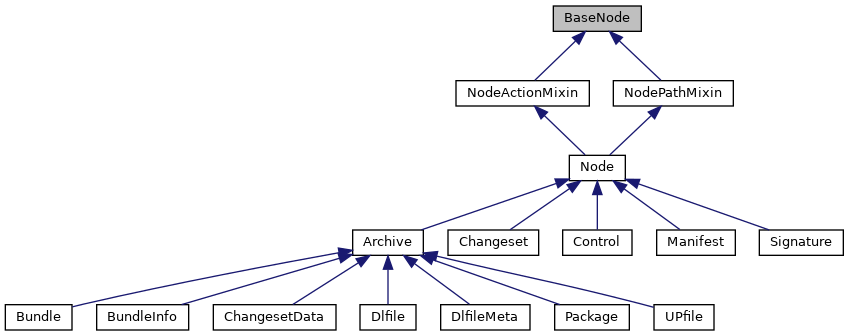

[Public Member Functions](#pub-methods) \| [Static Public Member Functions](#pub-static-methods) \| [Data Fields](#pub-attribs)

Inheritance diagram for BaseNode:



\[<a href="graph_legend.md">legend</a>\]

|  |  |
|----|----|
| Public Member Functions |  |
| def  | [\_\_init\_\_](#aee93ed72a2829b54a0e13377d0f84b6a) (self, str [name](#ab74e6bf80237ddc4109968cedc58c151)=None, <a href="classpackmanlib_1_1basenode_1_1_base_node.md">BaseNode</a> [parent](#a457d913bff1ebc8671c1eca1c9d5fc03)=None, tarfile.TarInfo [tarinfo](#ac9728b28ae902f349b97f7d526fb4885)=None) |
| str  | [get_type_str](#a97064a535f192320c134e450ac478e60) (self) |
|   | Returns node type as string Supported are: \"Package\", \"Bundle\", \"Dlfile\", \"Signature\", \"Control\", \"Manifest\", \"Dir\", \"File\", \"Symlink\". [More\...](#a97064a535f192320c134e450ac478e60)<br/> |
| bool  | [is_csd](#a40036e92a96400bbf76bacb62fc97ced) (self) |
|   | Test if node is a CSD. [More\...](#a40036e92a96400bbf76bacb62fc97ced)<br/> |
| bool  | [is_inf](#a0aa49779f6dac40e366fb98ec8ff311c) (self) |
|   | Test if node is an INF. [More\...](#a0aa49779f6dac40e366fb98ec8ff311c)<br/> |
| bool  | [is_meta](#a2d50a1b2388573865420bb7a54cf797b) (self) |
|   | Test if node is a META. [More\...](#a2d50a1b2388573865420bb7a54cf797b)<br/> |
| bool  | [is_manifest](#a03b8f2bf011d738d9c66f0d4488a03db) (self) |
|   | Test if node is a manifest. [More\...](#a03b8f2bf011d738d9c66f0d4488a03db)<br/> |
| bool  | [is_changeset](#a42def0c1678d16515df9b441fde73ba7) (self) |
|   | Test if node is a changeset. [More\...](#a42def0c1678d16515df9b441fde73ba7)<br/> |
| bool  | [is_archive](#afb49d022eb8d0e551f9c5d57872086eb) (self) |
|   | Test if node is an archive. [More\...](#afb49d022eb8d0e551f9c5d57872086eb)<br/> |
| bool  | [is_dlfile](#a6327b157864352a36826a505ee8870ad) (self) |
|   | Test if node is a dlfile. [More\...](#a6327b157864352a36826a505ee8870ad)<br/> |
| bool  | [is_upfile](#acf1c247a2b5b619a761649da45f9d974) (self) |
|   | Test if node is an upfile. [More\...](#acf1c247a2b5b619a761649da45f9d974)<br/> |
| bool  | [is_bundle](#a6c8f1769f4874c20b3dc5e7f22169c23) (self) |
|   | Test if node is a bundle. [More\...](#a6c8f1769f4874c20b3dc5e7f22169c23)<br/> |
| bool  | [is_package](#a9cf4df8f61cbc1db2e463deb9956adda) (self) |
|   | Test if node is a package. [More\...](#a9cf4df8f61cbc1db2e463deb9956adda)<br/> |
| bool  | [is_signature](#a59551a137c22107950f7fe2b4a20e247) (self) |
|   | Test if node is a signature. [More\...](#a59551a137c22107950f7fe2b4a20e247)<br/> |
| bool  | [is_control](#ad01c8a8ff3a9536ea1adbab2ddaf15f4) (self) |
|   | Test if node is a control. [More\...](#ad01c8a8ff3a9536ea1adbab2ddaf15f4)<br/> |
| def  | [mark_modified](#a5c02300a2d52e15bf94b8286acdad576) (self) |
| def  | [get_parent_archive](#a2f67b333aa5e0d678c748c2ebbdeee7f) (self) |
|   | Retrieve parent archive node. [More\...](#a2f67b333aa5e0d678c748c2ebbdeee7f)<br/> |
| def  | [get_platform](#a6199c59cb64af881cd70a380d639f62e) (self) |
|   | Retrieve platform for this node. [More\...](#a6199c59cb64af881cd70a380d639f62e)<br/> |
| def  | [get_root_archive](#acb1a58b36d03f8b533010786b27456c4) (self) |
|   | Retrieve root archive node Root archive node has no parent archive. [More\...](#acb1a58b36d03f8b533010786b27456c4)<br/> |
| int  | [get_index](#a8805808f42b6763bd9c2696d2854c7db) (self) |
|   | Retrieve index of this node in the list of its parent\'s children. [More\...](#a8805808f42b6763bd9c2696d2854c7db)<br/> |
| def  | [get_signer](#adc09e25e108582cfddcbfd41fb8298a4) (self) |
| int  | [get_mode](#a604c74b4565be8a42ee33de761c28f51) (self) |
|   | Retrieve file mode of this node. [More\...](#a604c74b4565be8a42ee33de761c28f51)<br/> |
| def  | [\_\_str\_\_](#a23e8041ce1015febe4fdace3225714f9) (self) |

|  |  |
|----|----|
| Static Public Member Functions |  |
| tarfile.TarInfo  | [create_tarinfo](#a858aac03715077f836c526caa69896c7) (str tarinfo_name, entry_type) |
|   | Tarinfo creation helper. [More\...](#a858aac03715077f836c526caa69896c7)<br/> |
| def  | [create_node](#a343e89c35fe71dea3b002b3eb444efa6) (tarinfo_name, entry_type) |

|  |  |
|----|----|
| Data Fields |  |
|   | [name](#ab74e6bf80237ddc4109968cedc58c151) |
|   | node name (str) [More\...](#ab74e6bf80237ddc4109968cedc58c151)<br/> |
|   | [parent](#a457d913bff1ebc8671c1eca1c9d5fc03) |
|   | parent node (<a href="classpackmanlib_1_1basenode_1_1_base_node.md">BaseNode</a>) [More\...](#a457d913bff1ebc8671c1eca1c9d5fc03)<br/> |
|   | [tarinfo](#ac9728b28ae902f349b97f7d526fb4885) |
|   | children of this node in order. [More\...](#ac9728b28ae902f349b97f7d526fb4885)<br/> |
|   | [file_content](#ae8834017c3a98209d379e0384e291215) |
|   | Object representing the content of the file. [More\...](#ae8834017c3a98209d379e0384e291215)<br/> |
|   | [signature_nodes](#a71101782c2fbd10a9832594113078cd2) |
|   | Nodes holding signature of this node. [More\...](#a71101782c2fbd10a9832594113078cd2)<br/> |
|   | [additional_signature_nodes](#a691c0b70ad22568ebe48b0b21b22ee2c) |
|   | Nodes holding additional signature of this node. [More\...](#a691c0b70ad22568ebe48b0b21b22ee2c)<br/> |

## DetailedDescription {#detailed-description}

``` fragment
Base node class for all nodes
```

## Constructor& Destructor Documentation

## \_\_init\_\_() <a href="#aee93ed72a2829b54a0e13377d0f84b6a" id="aee93ed72a2829b54a0e13377d0f84b6a"></a>

<p>def \_\_init\_\_</p>

## MemberFunction Documentation {#member-function-documentation}

## \_\_str\_\_() <a href="#a23e8041ce1015febe4fdace3225714f9" id="a23e8041ce1015febe4fdace3225714f9"></a>

<p>def \_\_str\_\_</p>

## create_node() <a href="#a343e89c35fe71dea3b002b3eb444efa6" id="a343e89c35fe71dea3b002b3eb444efa6"></a>

<p>def create_node</p>

static

Reimplemented in <a href="classpackmanlib_1_1node_1_1_node.md#a57ab1e1ab24335aeaf07ac3ae39c59ee">Node</a>.

## create_tarinfo() <a href="#a858aac03715077f836c526caa69896c7" id="a858aac03715077f836c526caa69896c7"></a>

<p>tarfile.TarInfo create_tarinfo</p>

static

Tarinfo creation helper.

**Parameters**

**tarinfo_name** name for tarinfo **entry_type** type of tar entry (see TarInfo)

### Returns

TarInfo instance created

## get_index() <a href="#a8805808f42b6763bd9c2696d2854c7db" id="a8805808f42b6763bd9c2696d2854c7db"></a>

<p>int get_index</p>

Retrieve index of this node in the list of its parent\'s children.

### Returns

0-based index of this node

## get_mode() <a href="#a604c74b4565be8a42ee33de761c28f51" id="a604c74b4565be8a42ee33de761c28f51"></a>

<p>int get_mode</p>

Retrieve file mode of this node.

### Returns

mode value or None if error

## get_parent_archive() <a href="#a2f67b333aa5e0d678c748c2ebbdeee7f" id="a2f67b333aa5e0d678c748c2ebbdeee7f"></a>

<p>def get_parent_archive</p>

Retrieve parent archive node.

### Returns

Parent archive node, itself if no parent

## get_platform() <a href="#a6199c59cb64af881cd70a380d639f62e" id="a6199c59cb64af881cd70a380d639f62e"></a>

<p>def get_platform</p>

Retrieve platform for this node.

### Returns

platform instance

## get_root_archive() <a href="#acb1a58b36d03f8b533010786b27456c4" id="acb1a58b36d03f8b533010786b27456c4"></a>

<p>def get_root_archive</p>

Retrieve root archive node Root archive node has no parent archive.

### Returns

Root archive node

## get_signer() <a href="#adc09e25e108582cfddcbfd41fb8298a4" id="adc09e25e108582cfddcbfd41fb8298a4"></a>

<p>def get_signer</p>

## get_type_str() <a href="#a97064a535f192320c134e450ac478e60" id="a97064a535f192320c134e450ac478e60"></a>

<p>str get_type_str</p>

Returns node type as string Supported are: \"Package\", \"Bundle\", \"Dlfile\", \"Signature\", \"Control\", \"Manifest\", \"Dir\", \"File\", \"Symlink\".

### Returns

node type string or \'Unknown\'

## is_archive() <a href="#afb49d022eb8d0e551f9c5d57872086eb" id="afb49d022eb8d0e551f9c5d57872086eb"></a>

<p>bool is_archive</p>

Test if node is an archive.

### Returns

True if it is an archive, False otherwise

## is_bundle() <a href="#a6c8f1769f4874c20b3dc5e7f22169c23" id="a6c8f1769f4874c20b3dc5e7f22169c23"></a>

<p>bool is_bundle</p>

Test if node is a bundle.

### Returns

True if it is a bundle, False otherwise

## is_changeset() <a href="#a42def0c1678d16515df9b441fde73ba7" id="a42def0c1678d16515df9b441fde73ba7"></a>

<p>bool is_changeset</p>

Test if node is a changeset.

### Returns

True if it is a changeset, False otherwise

## is_control() <a href="#ad01c8a8ff3a9536ea1adbab2ddaf15f4" id="ad01c8a8ff3a9536ea1adbab2ddaf15f4"></a>

<p>bool is_control</p>

Test if node is a control.

### Returns

True if it is a control file, False otherwise

## is_csd() <a href="#a40036e92a96400bbf76bacb62fc97ced" id="a40036e92a96400bbf76bacb62fc97ced"></a>

<p>bool is_csd</p>

Test if node is a CSD.

### Returns

True if it is a CSD archive, False otherwise

## is_dlfile() <a href="#a6327b157864352a36826a505ee8870ad" id="a6327b157864352a36826a505ee8870ad"></a>

<p>bool is_dlfile</p>

Test if node is a dlfile.

### Returns

True if it is a dlfile, False otherwise

## is_inf() <a href="#a0aa49779f6dac40e366fb98ec8ff311c" id="a0aa49779f6dac40e366fb98ec8ff311c"></a>

<p>bool is_inf</p>

Test if node is an INF.

### Returns

True if it is an INF archive, False otherwise

## is_manifest() <a href="#a03b8f2bf011d738d9c66f0d4488a03db" id="a03b8f2bf011d738d9c66f0d4488a03db"></a>

<p>bool is_manifest</p>

Test if node is a manifest.

### Returns

True if it is a manifest, False otherwise

## is_meta() <a href="#a2d50a1b2388573865420bb7a54cf797b" id="a2d50a1b2388573865420bb7a54cf797b"></a>

<p>bool is_meta</p>

Test if node is a META.

### Returns

True if it is a META archive, False otherwise

## is_package() <a href="#a9cf4df8f61cbc1db2e463deb9956adda" id="a9cf4df8f61cbc1db2e463deb9956adda"></a>

<p>bool is_package</p>

Test if node is a package.

### Returns

True if it is a package, False otherwise

## is_signature() <a href="#a59551a137c22107950f7fe2b4a20e247" id="a59551a137c22107950f7fe2b4a20e247"></a>

<p>bool is_signature</p>

Test if node is a signature.

### Returns

True if it is a signature, False otherwise

## is_upfile() <a href="#acf1c247a2b5b619a761649da45f9d974" id="acf1c247a2b5b619a761649da45f9d974"></a>

<p>bool is_upfile</p>

Test if node is an upfile.

### Returns

True if it is an upfile, False otherwise

## mark_modified() <a href="#a5c02300a2d52e15bf94b8286acdad576" id="a5c02300a2d52e15bf94b8286acdad576"></a>

<p>def mark_modified</p>

## FieldDocumentation {#field-documentation}

## additional_signature_nodes <a href="#a691c0b70ad22568ebe48b0b21b22ee2c" id="a691c0b70ad22568ebe48b0b21b22ee2c"></a>

<p>additional_signature_nodes</p>

Nodes holding additional signature of this node.

## file_content <a href="#ae8834017c3a98209d379e0384e291215" id="ae8834017c3a98209d379e0384e291215"></a>

<p>file_content</p>

Object representing the content of the file.

## name <a href="#ab74e6bf80237ddc4109968cedc58c151" id="ab74e6bf80237ddc4109968cedc58c151"></a>

<p>name</p>

node name (str)

## parent <a href="#a457d913bff1ebc8671c1eca1c9d5fc03" id="a457d913bff1ebc8671c1eca1c9d5fc03"></a>

<p>parent</p>

parent node (<a href="classpackmanlib_1_1basenode_1_1_base_node.md">BaseNode</a>)

## signature_nodes <a href="#a71101782c2fbd10a9832594113078cd2" id="a71101782c2fbd10a9832594113078cd2"></a>

<p>signature_nodes</p>

Nodes holding signature of this node.

## tarinfo <a href="#ac9728b28ae902f349b97f7d526fb4885" id="ac9728b28ae902f349b97f7d526fb4885"></a>

<p>tarinfo</p>

children of this node in order.

Keys are node name, values <a href="classpackmanlib_1_1basenode_1_1_base_node.md">BaseNode</a> instances Tarinfo object containing the type of archive entry, path, user, group, permission, etc. see TarInfo documentation

------------------------------------------------------------------------

The documentation for this class was generated from the following file:

- packman/packmanlib/<a href="basenode_8py.md">basenode.py</a>
