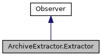

[Public Member Functions](#pub-methods) \| [Data Fields](#pub-attribs)

Inheritance diagram for ArchiveExtractor.Extractor:

\[<a href="graph_legend.md">legend</a>\]

Collaboration diagram for ArchiveExtractor.Extractor:

\[<a href="graph_legend.md">legend</a>\]

|  |  |
|----|----|
| Public Member Functions |  |
| def  | [\_\_init\_\_](#a57e3b1cf73457422dd96f3b965239f88) (self, [root_path](#ab33cf7205359ee0f91488c87df1577a0)) |
| def  | [found_node_cb](#a105daf7d38d3518013ba998c7ced4966) (self, node) |
|   | Callback for all nodes visited. [More\...](#a105daf7d38d3518013ba998c7ced4966)  |
|  Public Member Functions inherited from <a href="classpackmanlib_1_1treewalk_1_1_observer.md">Observer</a> |  |
| def  | <a href="classpackmanlib_1_1treewalk_1_1_observer.md#a4339f9ca68bfdbd28e44f729dc96986e">found_archive_cb</a> (self, archive) |
|   | Callback for all archive nodes visited. <a href="classpackmanlib_1_1treewalk_1_1_observer.md#a4339f9ca68bfdbd28e44f729dc96986e">More...</a>  |
| def  | <a href="classpackmanlib_1_1treewalk_1_1_observer.md#a4658c97464b5e6183818fca2569e7a8e">found_dlfile_cb</a> (self, dlfile) |
|   | Callback for all dlfile nodes visited. <a href="classpackmanlib_1_1treewalk_1_1_observer.md#a4658c97464b5e6183818fca2569e7a8e">More...</a>  |
| def  | <a href="classpackmanlib_1_1treewalk_1_1_observer.md#ab7683a66151046935d5fc429c51fd083">found_upfile_cb</a> (self, upfile) |
|   | Callback for all upfile nodes visited. <a href="classpackmanlib_1_1treewalk_1_1_observer.md#ab7683a66151046935d5fc429c51fd083">More...</a>  |
| def  | <a href="classpackmanlib_1_1treewalk_1_1_observer.md#ab0c64a83f57aafaaf2b5e9f5ff6c9b28">found_bundle_cb</a> (self, bundle) |
|   | Callback for all bundle nodes visited. <a href="classpackmanlib_1_1treewalk_1_1_observer.md#ab0c64a83f57aafaaf2b5e9f5ff6c9b28">More...</a>  |
| def  | <a href="classpackmanlib_1_1treewalk_1_1_observer.md#a2e71416030fe50ca62bff56697cd4ee3">found_package_cb</a> (self, package) |
|   | Callback for all package nodes visited. <a href="classpackmanlib_1_1treewalk_1_1_observer.md#a2e71416030fe50ca62bff56697cd4ee3">More...</a>  |
| def  | <a href="classpackmanlib_1_1treewalk_1_1_observer.md#ad324df3784468c2b8876d1096027bfc4">found_csd_cb</a> (self, csd) |
|   | Callback for all csd nodes visited. <a href="classpackmanlib_1_1treewalk_1_1_observer.md#ad324df3784468c2b8876d1096027bfc4">More...</a>  |
| def  | <a href="classpackmanlib_1_1treewalk_1_1_observer.md#a8af64daa34d66290c5e9b88a138abd34">found_inf_cb</a> (self, inf) |
|   | Callback for all inf nodes visited. <a href="classpackmanlib_1_1treewalk_1_1_observer.md#a8af64daa34d66290c5e9b88a138abd34">More...</a>  |
| def  | <a href="classpackmanlib_1_1treewalk_1_1_observer.md#abda2863e87d519845652d3c3f628fe3b">found_meta_cb</a> (self, meta) |
|   | Callback for all meta nodes visited. <a href="classpackmanlib_1_1treewalk_1_1_observer.md#abda2863e87d519845652d3c3f628fe3b">More...</a>  |
| def  | <a href="classpackmanlib_1_1treewalk_1_1_observer.md#a5feaf5a94cffa0c0d626f4ba4573c9b7">end_cb</a> (self, node) |
|   | Callback called once at the end of the tree walk. <a href="classpackmanlib_1_1treewalk_1_1_observer.md#a5feaf5a94cffa0c0d626f4ba4573c9b7">More...</a>  |

|             |                                                 |
|-------------|-------------------------------------------------|
| Data Fields |                                                 |
|             | [root_path](#ab33cf7205359ee0f91488c87df1577a0) |

## Constructor& Destructor Documentation

## \_\_init\_\_() 

def \_\_init\_\_

## MemberFunction Documentation {#member-function-documentation}

## found_node_cb() 

def found_node_cb

Callback for all nodes visited.

**Parameters**

**node** node visited

Reimplemented from <a href="classpackmanlib_1_1treewalk_1_1_observer.md#a105daf7d38d3518013ba998c7ced4966">Observer</a>.

## FieldDocumentation {#field-documentation}

## root_path 

root_path

------------------------------------------------------------------------

The documentation for this class was generated from the following file:

- packman/packmanlib/<a href="io_8py.md">io.py</a>
