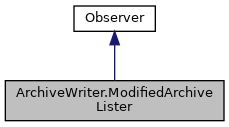

[Public Member Functions](#pub-methods) \| [Data Fields](#pub-attribs)

Inheritance diagram for ArchiveWriter.ModifiedArchiveLister:

\[<a href="graph_legend.md">legend</a>\]

Collaboration diagram for ArchiveWriter.ModifiedArchiveLister:

\[<a href="graph_legend.md">legend</a>\]

|  |  |
|----|----|
| Public Member Functions |  |
| def  | [\_\_init\_\_](#ae64f0875afe3067b97ba370b354b9213) (self) |
| def  | [get_result](#ad58623e6201bdcbab5abb2dd0536c5a5) (self) |
| def  | [found_dlfile_cb](#a4658c97464b5e6183818fca2569e7a8e) (self, dlfile) |
|   | Callback for all dlfile nodes visited. [More\...](#a4658c97464b5e6183818fca2569e7a8e)  |
| def  | [found_upfile_cb](#ab7683a66151046935d5fc429c51fd083) (self, upfile) |
|   | Callback for all upfile nodes visited. [More\...](#ab7683a66151046935d5fc429c51fd083)  |
| def  | [found_bundle_cb](#ab0c64a83f57aafaaf2b5e9f5ff6c9b28) (self, bundle) |
|   | Callback for all bundle nodes visited. [More\...](#ab0c64a83f57aafaaf2b5e9f5ff6c9b28)  |
| def  | [found_package_cb](#a2e71416030fe50ca62bff56697cd4ee3) (self, package) |
|   | Callback for all package nodes visited. [More\...](#a2e71416030fe50ca62bff56697cd4ee3)  |
| def  | [found_csd_cb](#ad324df3784468c2b8876d1096027bfc4) (self, csd) |
|   | Callback for all csd nodes visited. [More\...](#ad324df3784468c2b8876d1096027bfc4)  |
| def  | [found_inf_cb](#a8af64daa34d66290c5e9b88a138abd34) (self, inf) |
|   | Callback for all inf nodes visited. [More\...](#a8af64daa34d66290c5e9b88a138abd34)  |
| def  | [found_meta_cb](#abda2863e87d519845652d3c3f628fe3b) (self, meta) |
|   | Callback for all meta nodes visited. [More\...](#abda2863e87d519845652d3c3f628fe3b)  |
|  Public Member Functions inherited from <a href="classpackmanlib_1_1treewalk_1_1_observer.md">Observer</a> |  |
| def  | <a href="classpackmanlib_1_1treewalk_1_1_observer.md#a105daf7d38d3518013ba998c7ced4966">found_node_cb</a> (self, node) |
|   | Callback for all nodes visited. <a href="classpackmanlib_1_1treewalk_1_1_observer.md#a105daf7d38d3518013ba998c7ced4966">More...</a>  |
| def  | <a href="classpackmanlib_1_1treewalk_1_1_observer.md#a4339f9ca68bfdbd28e44f729dc96986e">found_archive_cb</a> (self, archive) |
|   | Callback for all archive nodes visited. <a href="classpackmanlib_1_1treewalk_1_1_observer.md#a4339f9ca68bfdbd28e44f729dc96986e">More...</a>  |
| def  | <a href="classpackmanlib_1_1treewalk_1_1_observer.md#a5feaf5a94cffa0c0d626f4ba4573c9b7">end_cb</a> (self, node) |
|   | Callback called once at the end of the tree walk. <a href="classpackmanlib_1_1treewalk_1_1_observer.md#a5feaf5a94cffa0c0d626f4ba4573c9b7">More...</a>  |

|             |                                              |
|-------------|----------------------------------------------|
| Data Fields |                                              |
|             | [level0](#a20e65575e9ad90a51ba246aa3f79156c) |
|             | [level1](#aac80cb3d7ae72728550539fc8ba688cf) |
|             | [level2](#a86a12c7f54a0862cbb39e10282fb92ce) |

## Constructor& Destructor Documentation

## \_\_init\_\_() 

def \_\_init\_\_

## MemberFunction Documentation {#member-function-documentation}

## found_bundle_cb() 

def found_bundle_cb

Callback for all bundle nodes visited.

**Parameters**

**bundle** bundle visited

Reimplemented from <a href="classpackmanlib_1_1treewalk_1_1_observer.md#ab0c64a83f57aafaaf2b5e9f5ff6c9b28">Observer</a>.

## found_csd_cb() 

def found_csd_cb

Callback for all csd nodes visited.

**Parameters**

**csd** csd visited

Reimplemented from <a href="classpackmanlib_1_1treewalk_1_1_observer.md#ad324df3784468c2b8876d1096027bfc4">Observer</a>.

## found_dlfile_cb() 

def found_dlfile_cb

Callback for all dlfile nodes visited.

**Parameters**

**dlfile** dlfile visited

Reimplemented from <a href="classpackmanlib_1_1treewalk_1_1_observer.md#a4658c97464b5e6183818fca2569e7a8e">Observer</a>.

## found_inf_cb() 

def found_inf_cb

Callback for all inf nodes visited.

**Parameters**

**inf** inf visited

Reimplemented from <a href="classpackmanlib_1_1treewalk_1_1_observer.md#a8af64daa34d66290c5e9b88a138abd34">Observer</a>.

## found_meta_cb() 

def found_meta_cb

Callback for all meta nodes visited.

**Parameters**

**meta** meta visited

Reimplemented from <a href="classpackmanlib_1_1treewalk_1_1_observer.md#abda2863e87d519845652d3c3f628fe3b">Observer</a>.

## found_package_cb() 

def found_package_cb

Callback for all package nodes visited.

**Parameters**

**package** package visited

Reimplemented from <a href="classpackmanlib_1_1treewalk_1_1_observer.md#a2e71416030fe50ca62bff56697cd4ee3">Observer</a>.

## found_upfile_cb() 

def found_upfile_cb

Callback for all upfile nodes visited.

**Parameters**

**upfile** upfile visited

Reimplemented from <a href="classpackmanlib_1_1treewalk_1_1_observer.md#ab7683a66151046935d5fc429c51fd083">Observer</a>.

## get_result() 

def get_result

## FieldDocumentation {#field-documentation}

## level0 

level0

## level1 

level1

## level2 

level2

------------------------------------------------------------------------

The documentation for this class was generated from the following file:

- packman/packmanlib/<a href="io_8py.md">io.py</a>
