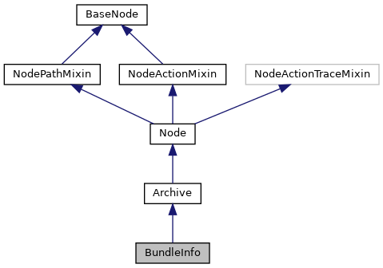

[Public Member Functions](#pub-methods) \| [Static Public Member Functions](#pub-static-methods)

Inheritance diagram for BundleInfo:



\[<a href="graph_legend.md">legend</a>\]

Collaboration diagram for BundleInfo:


\[<a href="graph_legend.md">legend</a>\]

|  |  |
|----|----|
| Public Member Functions |  |
| def  | [\_\_init\_\_](#ae600ba809e4424260c4afe6a05a1bd03) (self, <a href="classpackmanlib_1_1node_1_1_archive.md#adc3a21ccb616231a81529950cab007f4">platform</a>) |
| def  | [changeset_node](#ab89e16edb2fb4efbdbf224e7a220b430) (self) |
| def  | [manifest_node](#a307abafd25c9c436ce102070a64c55fd) (self) |
| def  | [get_base_name](#aa185b21fc1ecb1d1d61259f392e29586) (self) |
| def  | [get_csd_node](#a3cdb01987792486365849fccedaec538) (self) |
|  Public Member Functions inherited from <a href="classpackmanlib_1_1node_1_1_archive.md">Archive</a> |  |
| def  | <a href="classpackmanlib_1_1node_1_1_archive.md#a5da205bce20bfb9621d50c96891b0fd4">control_node</a> (self) |
| def  | <a href="classpackmanlib_1_1node_1_1_archive.md#a727991055fddd86898908f93796d2224">control</a> (self) |
| def  | <a href="classpackmanlib_1_1node_1_1_archive.md#aa59a8569269025cc5dbffaa48cefcc29">set_signer</a> (self, signer_type) |
|  Public Member Functions inherited from <a href="classpackmanlib_1_1node_1_1_node.md">Node</a> |  |
| def  | <a href="classpackmanlib_1_1node_1_1_node.md#a727cb9769de881c9c73a873635d8248e">__init__</a> (self, <a href="classpackmanlib_1_1nodeaction_1_1_node_action_mixin.md#ab74e6bf80237ddc4109968cedc58c151">name</a>=None, <a href="classpackmanlib_1_1nodeaction_1_1_node_action_mixin.md#a457d913bff1ebc8671c1eca1c9d5fc03">parent</a>=None, <a href="classpackmanlib_1_1basenode_1_1_base_node.md#ac9728b28ae902f349b97f7d526fb4885">tarinfo</a>=None) |
|  Public Member Functions inherited from <a href="classpackmanlib_1_1nodepath_1_1_node_path_mixin.md">NodePathMixin</a> |  |
| def  | <a href="classpackmanlib_1_1nodepath_1_1_node_path_mixin.md#a90b48062a797319956c8709266a69bac">get_path_nodes</a> (self, include_root=False, within_archive=False) |
| str  | <a href="classpackmanlib_1_1nodepath_1_1_node_path_mixin.md#ab2255afca64a863f2ec99ec620989e40">get_path</a> (self, include_root=False, within_archive=False) |
|   | Retrieve path of this node within the archive or withing whole tree of archives Separator \'/\' is used within archives and for recursion into archives. <a href="classpackmanlib_1_1nodepath_1_1_node_path_mixin.md#ab2255afca64a863f2ec99ec620989e40">More...</a><br/> |
| int  | <a href="classpackmanlib_1_1nodepath_1_1_node_path_mixin.md#ac26736fbf81b8e69cdf63c98c8a47c67">get_depth</a> (self, within_archive=False) |
|   | Retrieve depth of node within the archive or within whole tree of archives. <a href="classpackmanlib_1_1nodepath_1_1_node_path_mixin.md#ac26736fbf81b8e69cdf63c98c8a47c67">More...</a><br/> |
| def  | <a href="classpackmanlib_1_1nodepath_1_1_node_path_mixin.md#aedc1244bbf30d7e02332d97b105e4fe2">find</a> (self, str node_path) |
|   | Find node according to node path provided. <a href="classpackmanlib_1_1nodepath_1_1_node_path_mixin.md#aedc1244bbf30d7e02332d97b105e4fe2">More...</a><br/> |
| def  | <a href="classpackmanlib_1_1nodepath_1_1_node_path_mixin.md#a4c21f678e8e3fe263962b7f38733124c">find_re</a> (self, str node_path_re) |
|   | Find node according to regular expression node path provided Search will look for regex matching node name match along the path. <a href="classpackmanlib_1_1nodepath_1_1_node_path_mixin.md#a4c21f678e8e3fe263962b7f38733124c">More...</a><br/> |
| bool  | <a href="classpackmanlib_1_1nodepath_1_1_node_path_mixin.md#ad79ec1eccbcc7f72ba14c3c50b91dde1">has_ancestor</a> (self, ancestor) |
|   | Find if node has another node as ancestor. <a href="classpackmanlib_1_1nodepath_1_1_node_path_mixin.md#ad79ec1eccbcc7f72ba14c3c50b91dde1">More...</a><br/> |
|  Public Member Functions inherited from <a href="classpackmanlib_1_1basenode_1_1_base_node.md">BaseNode</a> |  |
| def  | <a href="classpackmanlib_1_1basenode_1_1_base_node.md#aee93ed72a2829b54a0e13377d0f84b6a">__init__</a> (self, str <a href="classpackmanlib_1_1basenode_1_1_base_node.md#ab74e6bf80237ddc4109968cedc58c151">name</a>=None, <a href="classpackmanlib_1_1basenode_1_1_base_node.md">BaseNode</a> <a href="classpackmanlib_1_1basenode_1_1_base_node.md#a457d913bff1ebc8671c1eca1c9d5fc03">parent</a>=None, tarfile.TarInfo <a href="classpackmanlib_1_1basenode_1_1_base_node.md#ac9728b28ae902f349b97f7d526fb4885">tarinfo</a>=None) |
| str  | <a href="classpackmanlib_1_1basenode_1_1_base_node.md#a97064a535f192320c134e450ac478e60">get_type_str</a> (self) |
|   | Returns node type as string Supported are: \"Package\", \"Bundle\", \"Dlfile\", \"Signature\", \"Control\", \"Manifest\", \"Dir\", \"File\", \"Symlink\". <a href="classpackmanlib_1_1basenode_1_1_base_node.md#a97064a535f192320c134e450ac478e60">More...</a><br/> |
| bool  | <a href="classpackmanlib_1_1basenode_1_1_base_node.md#a40036e92a96400bbf76bacb62fc97ced">is_csd</a> (self) |
|   | Test if node is a CSD. <a href="classpackmanlib_1_1basenode_1_1_base_node.md#a40036e92a96400bbf76bacb62fc97ced">More...</a><br/> |
| bool  | <a href="classpackmanlib_1_1basenode_1_1_base_node.md#a0aa49779f6dac40e366fb98ec8ff311c">is_inf</a> (self) |
|   | Test if node is an INF. <a href="classpackmanlib_1_1basenode_1_1_base_node.md#a0aa49779f6dac40e366fb98ec8ff311c">More...</a><br/> |
| bool  | <a href="classpackmanlib_1_1basenode_1_1_base_node.md#a2d50a1b2388573865420bb7a54cf797b">is_meta</a> (self) |
|   | Test if node is a META. <a href="classpackmanlib_1_1basenode_1_1_base_node.md#a2d50a1b2388573865420bb7a54cf797b">More...</a><br/> |
| bool  | <a href="classpackmanlib_1_1basenode_1_1_base_node.md#a03b8f2bf011d738d9c66f0d4488a03db">is_manifest</a> (self) |
|   | Test if node is a manifest. <a href="classpackmanlib_1_1basenode_1_1_base_node.md#a03b8f2bf011d738d9c66f0d4488a03db">More...</a><br/> |
| bool  | <a href="classpackmanlib_1_1basenode_1_1_base_node.md#a42def0c1678d16515df9b441fde73ba7">is_changeset</a> (self) |
|   | Test if node is a changeset. <a href="classpackmanlib_1_1basenode_1_1_base_node.md#a42def0c1678d16515df9b441fde73ba7">More...</a><br/> |
| bool  | <a href="classpackmanlib_1_1basenode_1_1_base_node.md#afb49d022eb8d0e551f9c5d57872086eb">is_archive</a> (self) |
|   | Test if node is an archive. <a href="classpackmanlib_1_1basenode_1_1_base_node.md#afb49d022eb8d0e551f9c5d57872086eb">More...</a><br/> |
| bool  | <a href="classpackmanlib_1_1basenode_1_1_base_node.md#a6327b157864352a36826a505ee8870ad">is_dlfile</a> (self) |
|   | Test if node is a dlfile. <a href="classpackmanlib_1_1basenode_1_1_base_node.md#a6327b157864352a36826a505ee8870ad">More...</a><br/> |
| bool  | <a href="classpackmanlib_1_1basenode_1_1_base_node.md#acf1c247a2b5b619a761649da45f9d974">is_upfile</a> (self) |
|   | Test if node is an upfile. <a href="classpackmanlib_1_1basenode_1_1_base_node.md#acf1c247a2b5b619a761649da45f9d974">More...</a><br/> |
| bool  | <a href="classpackmanlib_1_1basenode_1_1_base_node.md#a6c8f1769f4874c20b3dc5e7f22169c23">is_bundle</a> (self) |
|   | Test if node is a bundle. <a href="classpackmanlib_1_1basenode_1_1_base_node.md#a6c8f1769f4874c20b3dc5e7f22169c23">More...</a><br/> |
| bool  | <a href="classpackmanlib_1_1basenode_1_1_base_node.md#a9cf4df8f61cbc1db2e463deb9956adda">is_package</a> (self) |
|   | Test if node is a package. <a href="classpackmanlib_1_1basenode_1_1_base_node.md#a9cf4df8f61cbc1db2e463deb9956adda">More...</a><br/> |
| bool  | <a href="classpackmanlib_1_1basenode_1_1_base_node.md#a59551a137c22107950f7fe2b4a20e247">is_signature</a> (self) |
|   | Test if node is a signature. <a href="classpackmanlib_1_1basenode_1_1_base_node.md#a59551a137c22107950f7fe2b4a20e247">More...</a><br/> |
| bool  | <a href="classpackmanlib_1_1basenode_1_1_base_node.md#ad01c8a8ff3a9536ea1adbab2ddaf15f4">is_control</a> (self) |
|   | Test if node is a control. <a href="classpackmanlib_1_1basenode_1_1_base_node.md#ad01c8a8ff3a9536ea1adbab2ddaf15f4">More...</a><br/> |
| def  | <a href="classpackmanlib_1_1basenode_1_1_base_node.md#a5c02300a2d52e15bf94b8286acdad576">mark_modified</a> (self) |
| def  | <a href="classpackmanlib_1_1basenode_1_1_base_node.md#a2f67b333aa5e0d678c748c2ebbdeee7f">get_parent_archive</a> (self) |
|   | Retrieve parent archive node. <a href="classpackmanlib_1_1basenode_1_1_base_node.md#a2f67b333aa5e0d678c748c2ebbdeee7f">More...</a><br/> |
| def  | <a href="classpackmanlib_1_1basenode_1_1_base_node.md#a6199c59cb64af881cd70a380d639f62e">get_platform</a> (self) |
|   | Retrieve platform for this node. <a href="classpackmanlib_1_1basenode_1_1_base_node.md#a6199c59cb64af881cd70a380d639f62e">More...</a><br/> |
| def  | <a href="classpackmanlib_1_1basenode_1_1_base_node.md#acb1a58b36d03f8b533010786b27456c4">get_root_archive</a> (self) |
|   | Retrieve root archive node Root archive node has no parent archive. <a href="classpackmanlib_1_1basenode_1_1_base_node.md#acb1a58b36d03f8b533010786b27456c4">More...</a><br/> |
| int  | <a href="classpackmanlib_1_1basenode_1_1_base_node.md#a8805808f42b6763bd9c2696d2854c7db">get_index</a> (self) |
|   | Retrieve index of this node in the list of its parent\'s children. <a href="classpackmanlib_1_1basenode_1_1_base_node.md#a8805808f42b6763bd9c2696d2854c7db">More...</a><br/> |
| def  | <a href="classpackmanlib_1_1basenode_1_1_base_node.md#adc09e25e108582cfddcbfd41fb8298a4">get_signer</a> (self) |
| int  | <a href="classpackmanlib_1_1basenode_1_1_base_node.md#a604c74b4565be8a42ee33de761c28f51">get_mode</a> (self) |
|   | Retrieve file mode of this node. <a href="classpackmanlib_1_1basenode_1_1_base_node.md#a604c74b4565be8a42ee33de761c28f51">More...</a><br/> |
| def  | <a href="classpackmanlib_1_1basenode_1_1_base_node.md#a23e8041ce1015febe4fdace3225714f9">__str__</a> (self) |
|  Public Member Functions inherited from <a href="classpackmanlib_1_1nodeaction_1_1_node_action_mixin.md">NodeActionMixin</a> |  |
| def  | <a href="classpackmanlib_1_1nodeaction_1_1_node_action_mixin.md#ae1d4914f90457a3ead581dff3517a9c9">unlink</a> (self) |
|   | Remove this node from tree. <a href="classpackmanlib_1_1nodeaction_1_1_node_action_mixin.md#ae1d4914f90457a3ead581dff3517a9c9">More...</a><br/> |
| def  | <a href="classpackmanlib_1_1nodeaction_1_1_node_action_mixin.md#a997ac515f8cd659ce5e5eabf1d6c3bd2">destroy</a> (self) |
|   | Remove and destroy this node and all its children. <a href="classpackmanlib_1_1nodeaction_1_1_node_action_mixin.md#a997ac515f8cd659ce5e5eabf1d6c3bd2">More...</a><br/> |
| def  | <a href="classpackmanlib_1_1nodeaction_1_1_node_action_mixin.md#ac677e661c13c724e1fcc4f565cd7616d">add_child</a> (self, child_node, index=None) |
|   | Add a child node. <a href="classpackmanlib_1_1nodeaction_1_1_node_action_mixin.md#ac677e661c13c724e1fcc4f565cd7616d">More...</a><br/> |
| def  | <a href="classpackmanlib_1_1nodeaction_1_1_node_action_mixin.md#a4437d79802d682f8b1e0f396cd1cff5a">create_dir</a> (self, dir_name) |
|   | Add a child directory If same child name exists, it will be replaced. <a href="classpackmanlib_1_1nodeaction_1_1_node_action_mixin.md#a4437d79802d682f8b1e0f396cd1cff5a">More...</a><br/> |
| def  | <a href="classpackmanlib_1_1nodeaction_1_1_node_action_mixin.md#a51ad047a52fc93584d61631c49d6b34f">create_file</a> (self, file_name, content=b\'\') |
|   | Add a child file. <a href="classpackmanlib_1_1nodeaction_1_1_node_action_mixin.md#a51ad047a52fc93584d61631c49d6b34f">More...</a><br/> |
| def  | <a href="classpackmanlib_1_1nodeaction_1_1_node_action_mixin.md#aeb2b80d1ea897e663737503cc6272939">set_content</a> (self, content) |
|   | Set the content of this file node. <a href="classpackmanlib_1_1nodeaction_1_1_node_action_mixin.md#aeb2b80d1ea897e663737503cc6272939">More...</a><br/> |
| def  | <a href="classpackmanlib_1_1nodeaction_1_1_node_action_mixin.md#a0c4ac8fd259814e6e7bc817276841e6c">set_mode</a> (self, mode) |
|   | Set the mode of this file/directory. <a href="classpackmanlib_1_1nodeaction_1_1_node_action_mixin.md#a0c4ac8fd259814e6e7bc817276841e6c">More...</a><br/> |
| def  | <a href="classpackmanlib_1_1nodeaction_1_1_node_action_mixin.md#a0fce3dbdea1e301de08dcc5416de18fa">set_user_name</a> (self, <a href="classpackmanlib_1_1nodeaction_1_1_node_action_mixin.md#ab74e6bf80237ddc4109968cedc58c151">name</a>) |
|   | Set the user name of this file/directory. <a href="classpackmanlib_1_1nodeaction_1_1_node_action_mixin.md#a0fce3dbdea1e301de08dcc5416de18fa">More...</a><br/> |
| def  | <a href="classpackmanlib_1_1nodeaction_1_1_node_action_mixin.md#af9676e075896e55fbf0ba87c438390e7">set_group_name</a> (self, <a href="classpackmanlib_1_1nodeaction_1_1_node_action_mixin.md#ab74e6bf80237ddc4109968cedc58c151">name</a>) |
|   | Set the group name of this file/directory. <a href="classpackmanlib_1_1nodeaction_1_1_node_action_mixin.md#af9676e075896e55fbf0ba87c438390e7">More...</a><br/> |
| def  | <a href="classpackmanlib_1_1nodeaction_1_1_node_action_mixin.md#aebf6261b742ae694c16790726a8c77c5">copy</a> (self) |
|   | Make a deep copy of this node and its content, children and attributes. <a href="classpackmanlib_1_1nodeaction_1_1_node_action_mixin.md#aebf6261b742ae694c16790726a8c77c5">More...</a><br/> |
| def  | <a href="classpackmanlib_1_1nodeaction_1_1_node_action_mixin.md#a10e06ee65b46422469910ecd7e4568c6">move</a> (self, <a href="classpackmanlib_1_1nodeaction_1_1_node_action_mixin.md#a457d913bff1ebc8671c1eca1c9d5fc03">parent</a>) |
|   | Move this node to another parent. <a href="classpackmanlib_1_1nodeaction_1_1_node_action_mixin.md#a10e06ee65b46422469910ecd7e4568c6">More...</a><br/> |
| def  | <a href="classpackmanlib_1_1nodeaction_1_1_node_action_mixin.md#a188c163d171ffd6fd7df2efd434a498d">rename</a> (self, newname) |
|   | Rename this node and underlying tarinfo name. <a href="classpackmanlib_1_1nodeaction_1_1_node_action_mixin.md#a188c163d171ffd6fd7df2efd434a498d">More...</a><br/> |

|  |  |
|----|----|
| Static Public Member Functions |  |
| def  | [create](#a0c739af4297e818893bd4bee1d6e855e) (<a href="classpackmanlib_1_1node_1_1_archive.md#adc3a21ccb616231a81529950cab007f4">platform</a>, base_name) |
|  Static Public Member Functions inherited from <a href="classpackmanlib_1_1node_1_1_archive.md">Archive</a> |  |
| def  | <a href="classpackmanlib_1_1node_1_1_archive.md#a59598acf9b5b82cb9c891b6defd1f6fe">setup_archive</a> (archive, full_name) |
|  Static Public Member Functions inherited from <a href="classpackmanlib_1_1node_1_1_node.md">Node</a> |  |
| def  | <a href="classpackmanlib_1_1node_1_1_node.md#a57ab1e1ab24335aeaf07ac3ae39c59ee">create_node</a> (<a href="classpackmanlib_1_1nodeaction_1_1_node_action_mixin.md#ab74e6bf80237ddc4109968cedc58c151">name</a>, entry_type) |
|  Static Public Member Functions inherited from <a href="classpackmanlib_1_1basenode_1_1_base_node.md">BaseNode</a> |  |
| tarfile.TarInfo  | <a href="classpackmanlib_1_1basenode_1_1_base_node.md#a858aac03715077f836c526caa69896c7">create_tarinfo</a> (str tarinfo_name, entry_type) |
|   | Tarinfo creation helper. <a href="classpackmanlib_1_1basenode_1_1_base_node.md#a858aac03715077f836c526caa69896c7">More...</a><br/> |

|  |  |
|----|----|
| Additional Inherited Members |  |
|  Data Fields inherited from <a href="classpackmanlib_1_1node_1_1_archive.md">Archive</a> |  |
|   | <a href="classpackmanlib_1_1node_1_1_archive.md#adc3a21ccb616231a81529950cab007f4">platform</a> |
|   | <a href="classpackmanlib_1_1node_1_1_archive.md#a9117d20b4ea4cd7380d2fbb8543e0679">tar</a> |
|   | <a href="classpackmanlib_1_1node_1_1_archive.md#a349cae7dff2780ce4842fb34efeee737">is_gzip</a> |
|   | <a href="classpackmanlib_1_1node_1_1_archive.md#a83d5b9606bd143755d31a92ca1a4498a">pax_headers_found</a> |
|   | <a href="classpackmanlib_1_1node_1_1_archive.md#a190b6c8ded058ff6d61077c95679c16b">signer</a> |
|   | <a href="classpackmanlib_1_1node_1_1_archive.md#a4b7febb5dfb963ed99f5e7870abce71b">report</a> |
|  Data Fields inherited from <a href="classpackmanlib_1_1basenode_1_1_base_node.md">BaseNode</a> |  |
|   | <a href="classpackmanlib_1_1basenode_1_1_base_node.md#ab74e6bf80237ddc4109968cedc58c151">name</a> |
|   | node name (str) <a href="classpackmanlib_1_1basenode_1_1_base_node.md#ab74e6bf80237ddc4109968cedc58c151">More...</a><br/> |
|   | <a href="classpackmanlib_1_1basenode_1_1_base_node.md#a457d913bff1ebc8671c1eca1c9d5fc03">parent</a> |
|   | parent node (<a href="classpackmanlib_1_1basenode_1_1_base_node.md">BaseNode</a>) <a href="classpackmanlib_1_1basenode_1_1_base_node.md#a457d913bff1ebc8671c1eca1c9d5fc03">More...</a><br/> |
|   | <a href="classpackmanlib_1_1basenode_1_1_base_node.md#ac9728b28ae902f349b97f7d526fb4885">tarinfo</a> |
|   | children of this node in order. <a href="classpackmanlib_1_1basenode_1_1_base_node.md#ac9728b28ae902f349b97f7d526fb4885">More...</a><br/> |
|   | <a href="classpackmanlib_1_1basenode_1_1_base_node.md#ae8834017c3a98209d379e0384e291215">file_content</a> |
|   | Object representing the content of the file. <a href="classpackmanlib_1_1basenode_1_1_base_node.md#ae8834017c3a98209d379e0384e291215">More...</a><br/> |
|   | <a href="classpackmanlib_1_1basenode_1_1_base_node.md#a71101782c2fbd10a9832594113078cd2">signature_nodes</a> |
|   | Nodes holding signature of this node. <a href="classpackmanlib_1_1basenode_1_1_base_node.md#a71101782c2fbd10a9832594113078cd2">More...</a><br/> |
|   | <a href="classpackmanlib_1_1basenode_1_1_base_node.md#a691c0b70ad22568ebe48b0b21b22ee2c">additional_signature_nodes</a> |
|   | Nodes holding additional signature of this node. <a href="classpackmanlib_1_1basenode_1_1_base_node.md#a691c0b70ad22568ebe48b0b21b22ee2c">More...</a><br/> |
|  Data Fields inherited from <a href="classpackmanlib_1_1nodeaction_1_1_node_action_mixin.md">NodeActionMixin</a> |  |
|   | <a href="classpackmanlib_1_1nodeaction_1_1_node_action_mixin.md#a457d913bff1ebc8671c1eca1c9d5fc03">parent</a> |
|   | <a href="classpackmanlib_1_1nodeaction_1_1_node_action_mixin.md#a0ad3c9f0298ae46424fb2461b3e2d506">children</a> |
|   | <a href="classpackmanlib_1_1nodeaction_1_1_node_action_mixin.md#ae8834017c3a98209d379e0384e291215">file_content</a> |
|   | <a href="classpackmanlib_1_1nodeaction_1_1_node_action_mixin.md#ab74e6bf80237ddc4109968cedc58c151">name</a> |
|   | <a href="classpackmanlib_1_1nodeaction_1_1_node_action_mixin.md#a71101782c2fbd10a9832594113078cd2">signature_nodes</a> |

## DetailedDescription {#detailed-description}

``` fragment
Represents a INF node (vos3)
```

## Constructor& Destructor Documentation

## \_\_init\_\_() <a href="#ae600ba809e4424260c4afe6a05a1bd03" id="ae600ba809e4424260c4afe6a05a1bd03"></a>

<p>def \_\_init\_\_</p>

Reimplemented from <a href="classpackmanlib_1_1node_1_1_archive.md#ae600ba809e4424260c4afe6a05a1bd03">Archive</a>.

## MemberFunction Documentation {#member-function-documentation}

## changeset_node() <a href="#ab89e16edb2fb4efbdbf224e7a220b430" id="ab89e16edb2fb4efbdbf224e7a220b430"></a>

<p>def changeset_node</p>

## create() <a href="#a0c739af4297e818893bd4bee1d6e855e" id="a0c739af4297e818893bd4bee1d6e855e"></a>

<p>def create</p>

static

## get_base_name() <a href="#aa185b21fc1ecb1d1d61259f392e29586" id="aa185b21fc1ecb1d1d61259f392e29586"></a>

<p>def get_base_name</p>

## get_csd_node() <a href="#a3cdb01987792486365849fccedaec538" id="a3cdb01987792486365849fccedaec538"></a>

<p>def get_csd_node</p>

## manifest_node() <a href="#a307abafd25c9c436ce102070a64c55fd" id="a307abafd25c9c436ce102070a64c55fd"></a>

<p>def manifest_node</p>

------------------------------------------------------------------------

The documentation for this class was generated from the following file:

- packman/packmanlib/<a href="node_8py.md">node.py</a>
