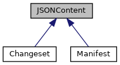

[Public Member Functions](#pub-methods) \| [Data Fields](#pub-attribs)

Inheritance diagram for JSONContent:



\[<a href="graph_legend.md">legend</a>\]

|  |  |
|----|----|
| Public Member Functions |  |
| def  | [\_\_init\_\_](#ae64f0875afe3067b97ba370b354b9213) (self) |
| def  | [set_jsoncontent_from_dict](#afa290894a22415ef36180fef33c45fb3) (self) |
| def  | [set_dict_from_jsoncontent](#af2af7ce2df5cb0b0bb0d45f259dc1b33) (self) |
| def  | [dict](#afa69507b8ff9910c7903732047fbba87) (self) |

|             |                                         |
|-------------|-----------------------------------------|
| Data Fields |                                         |
|             | [d](#a1aabac6d068eef6a7bad3fdf50a05cc8) |

## DetailedDescription {#detailed-description}

``` fragment
Common class for json files 
```

## Constructor& Destructor Documentation

## \_\_init\_\_() <a href="#ae64f0875afe3067b97ba370b354b9213" id="ae64f0875afe3067b97ba370b354b9213"></a>

<p>def \_\_init\_\_</p>

## MemberFunction Documentation {#member-function-documentation}

## dict() <a href="#afa69507b8ff9910c7903732047fbba87" id="afa69507b8ff9910c7903732047fbba87"></a>

<p>def dict</p>

## set_dict_from_jsoncontent() <a href="#af2af7ce2df5cb0b0bb0d45f259dc1b33" id="af2af7ce2df5cb0b0bb0d45f259dc1b33"></a>

<p>def set_dict_from_jsoncontent</p>

## set_jsoncontent_from_dict() <a href="#afa290894a22415ef36180fef33c45fb3" id="afa290894a22415ef36180fef33c45fb3"></a>

<p>def set_jsoncontent_from_dict</p>

## FieldDocumentation {#field-documentation}

## d <a href="#a1aabac6d068eef6a7bad3fdf50a05cc8" id="a1aabac6d068eef6a7bad3fdf50a05cc8"></a>

<p>d</p>

------------------------------------------------------------------------

The documentation for this class was generated from the following file:

- packman/packmanlib/<a href="node_8py.md">node.py</a>
