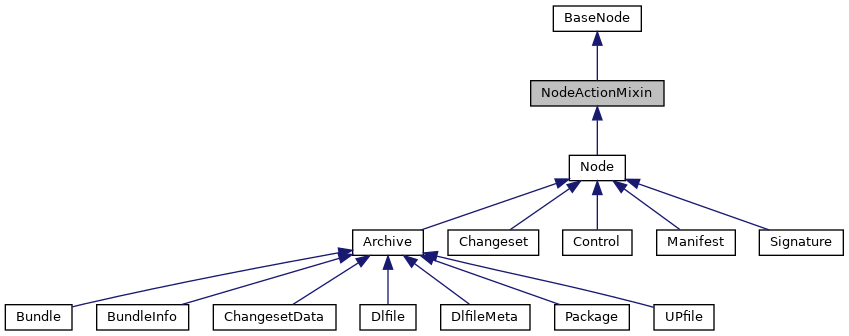
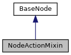

[Data Structures](#nested-classes) \| [Public Member Functions](#pub-methods) \| [Data Fields](#pub-attribs)

Inheritance diagram for NodeActionMixin:

\[<a href="graph_legend.md">legend</a>\]

Collaboration diagram for NodeActionMixin:

\[<a href="graph_legend.md">legend</a>\]

|  |  |
|----|----|
| Public Member Functions |  |
| def  | [unlink](#ae1d4914f90457a3ead581dff3517a9c9) (self) |
|   | Remove this node from tree. [More\...](#ae1d4914f90457a3ead581dff3517a9c9)  |
| def  | [destroy](#a997ac515f8cd659ce5e5eabf1d6c3bd2) (self) |
|   | Remove and destroy this node and all its children. [More\...](#a997ac515f8cd659ce5e5eabf1d6c3bd2)  |
| def  | [add_child](#ac677e661c13c724e1fcc4f565cd7616d) (self, child_node, index=None) |
|   | Add a child node. [More\...](#ac677e661c13c724e1fcc4f565cd7616d)  |
| def  | [create_dir](#a4437d79802d682f8b1e0f396cd1cff5a) (self, dir_name) |
|   | Add a child directory If same child name exists, it will be replaced. [More\...](#a4437d79802d682f8b1e0f396cd1cff5a)  |
| def  | [create_file](#a51ad047a52fc93584d61631c49d6b34f) (self, file_name, content=b\'\') |
|   | Add a child file. [More\...](#a51ad047a52fc93584d61631c49d6b34f)  |
| def  | [set_content](#aeb2b80d1ea897e663737503cc6272939) (self, content) |
|   | Set the content of this file node. [More\...](#aeb2b80d1ea897e663737503cc6272939)  |
| def  | [set_mode](#a0c4ac8fd259814e6e7bc817276841e6c) (self, mode) |
|   | Set the mode of this file/directory. [More\...](#a0c4ac8fd259814e6e7bc817276841e6c)  |
| def  | [set_user_name](#a0fce3dbdea1e301de08dcc5416de18fa) (self, [name](#ab74e6bf80237ddc4109968cedc58c151)) |
|   | Set the user name of this file/directory. [More\...](#a0fce3dbdea1e301de08dcc5416de18fa)  |
| def  | [set_group_name](#af9676e075896e55fbf0ba87c438390e7) (self, [name](#ab74e6bf80237ddc4109968cedc58c151)) |
|   | Set the group name of this file/directory. [More\...](#af9676e075896e55fbf0ba87c438390e7)  |
| def  | [copy](#aebf6261b742ae694c16790726a8c77c5) (self) |
|   | Make a deep copy of this node and its content, children and attributes. [More\...](#aebf6261b742ae694c16790726a8c77c5)  |
| def  | [move](#a10e06ee65b46422469910ecd7e4568c6) (self, [parent](#a457d913bff1ebc8671c1eca1c9d5fc03)) |
|   | Move this node to another parent. [More\...](#a10e06ee65b46422469910ecd7e4568c6)  |
| def  | [rename](#a188c163d171ffd6fd7df2efd434a498d) (self, newname) |
|   | Rename this node and underlying tarinfo name. [More\...](#a188c163d171ffd6fd7df2efd434a498d)  |
|  Public Member Functions inherited from <a href="classpackmanlib_1_1basenode_1_1_base_node.md">BaseNode</a> |  |
| def  | <a href="classpackmanlib_1_1basenode_1_1_base_node.md#aee93ed72a2829b54a0e13377d0f84b6a">__init__</a> (self, str <a href="classpackmanlib_1_1basenode_1_1_base_node.md#ab74e6bf80237ddc4109968cedc58c151">name</a>=None, <a href="classpackmanlib_1_1basenode_1_1_base_node.md">BaseNode</a> <a href="classpackmanlib_1_1basenode_1_1_base_node.md#a457d913bff1ebc8671c1eca1c9d5fc03">parent</a>=None, tarfile.TarInfo <a href="classpackmanlib_1_1basenode_1_1_base_node.md#ac9728b28ae902f349b97f7d526fb4885">tarinfo</a>=None) |
| str  | <a href="classpackmanlib_1_1basenode_1_1_base_node.md#a97064a535f192320c134e450ac478e60">get_type_str</a> (self) |
|   | Returns node type as string Supported are: \"Package\", \"Bundle\", \"Dlfile\", \"Signature\", \"Control\", \"Manifest\", \"Dir\", \"File\", \"Symlink\". <a href="classpackmanlib_1_1basenode_1_1_base_node.md#a97064a535f192320c134e450ac478e60">More...</a>  |
| bool  | <a href="classpackmanlib_1_1basenode_1_1_base_node.md#a40036e92a96400bbf76bacb62fc97ced">is_csd</a> (self) |
|   | Test if node is a CSD. <a href="classpackmanlib_1_1basenode_1_1_base_node.md#a40036e92a96400bbf76bacb62fc97ced">More...</a>  |
| bool  | <a href="classpackmanlib_1_1basenode_1_1_base_node.md#a0aa49779f6dac40e366fb98ec8ff311c">is_inf</a> (self) |
|   | Test if node is an INF. <a href="classpackmanlib_1_1basenode_1_1_base_node.md#a0aa49779f6dac40e366fb98ec8ff311c">More...</a>  |
| bool  | <a href="classpackmanlib_1_1basenode_1_1_base_node.md#a2d50a1b2388573865420bb7a54cf797b">is_meta</a> (self) |
|   | Test if node is a META. <a href="classpackmanlib_1_1basenode_1_1_base_node.md#a2d50a1b2388573865420bb7a54cf797b">More...</a>  |
| bool  | <a href="classpackmanlib_1_1basenode_1_1_base_node.md#a03b8f2bf011d738d9c66f0d4488a03db">is_manifest</a> (self) |
|   | Test if node is a manifest. <a href="classpackmanlib_1_1basenode_1_1_base_node.md#a03b8f2bf011d738d9c66f0d4488a03db">More...</a>  |
| bool  | <a href="classpackmanlib_1_1basenode_1_1_base_node.md#a42def0c1678d16515df9b441fde73ba7">is_changeset</a> (self) |
|   | Test if node is a changeset. <a href="classpackmanlib_1_1basenode_1_1_base_node.md#a42def0c1678d16515df9b441fde73ba7">More...</a>  |
| bool  | <a href="classpackmanlib_1_1basenode_1_1_base_node.md#afb49d022eb8d0e551f9c5d57872086eb">is_archive</a> (self) |
|   | Test if node is an archive. <a href="classpackmanlib_1_1basenode_1_1_base_node.md#afb49d022eb8d0e551f9c5d57872086eb">More...</a>  |
| bool  | <a href="classpackmanlib_1_1basenode_1_1_base_node.md#a6327b157864352a36826a505ee8870ad">is_dlfile</a> (self) |
|   | Test if node is a dlfile. <a href="classpackmanlib_1_1basenode_1_1_base_node.md#a6327b157864352a36826a505ee8870ad">More...</a>  |
| bool  | <a href="classpackmanlib_1_1basenode_1_1_base_node.md#acf1c247a2b5b619a761649da45f9d974">is_upfile</a> (self) |
|   | Test if node is an upfile. <a href="classpackmanlib_1_1basenode_1_1_base_node.md#acf1c247a2b5b619a761649da45f9d974">More...</a>  |
| bool  | <a href="classpackmanlib_1_1basenode_1_1_base_node.md#a6c8f1769f4874c20b3dc5e7f22169c23">is_bundle</a> (self) |
|   | Test if node is a bundle. <a href="classpackmanlib_1_1basenode_1_1_base_node.md#a6c8f1769f4874c20b3dc5e7f22169c23">More...</a>  |
| bool  | <a href="classpackmanlib_1_1basenode_1_1_base_node.md#a9cf4df8f61cbc1db2e463deb9956adda">is_package</a> (self) |
|   | Test if node is a package. <a href="classpackmanlib_1_1basenode_1_1_base_node.md#a9cf4df8f61cbc1db2e463deb9956adda">More...</a>  |
| bool  | <a href="classpackmanlib_1_1basenode_1_1_base_node.md#a59551a137c22107950f7fe2b4a20e247">is_signature</a> (self) |
|   | Test if node is a signature. <a href="classpackmanlib_1_1basenode_1_1_base_node.md#a59551a137c22107950f7fe2b4a20e247">More...</a>  |
| bool  | <a href="classpackmanlib_1_1basenode_1_1_base_node.md#ad01c8a8ff3a9536ea1adbab2ddaf15f4">is_control</a> (self) |
|   | Test if node is a control. <a href="classpackmanlib_1_1basenode_1_1_base_node.md#ad01c8a8ff3a9536ea1adbab2ddaf15f4">More...</a>  |
| def  | <a href="classpackmanlib_1_1basenode_1_1_base_node.md#a5c02300a2d52e15bf94b8286acdad576">mark_modified</a> (self) |
| def  | <a href="classpackmanlib_1_1basenode_1_1_base_node.md#a2f67b333aa5e0d678c748c2ebbdeee7f">get_parent_archive</a> (self) |
|   | Retrieve parent archive node. <a href="classpackmanlib_1_1basenode_1_1_base_node.md#a2f67b333aa5e0d678c748c2ebbdeee7f">More...</a>  |
| def  | <a href="classpackmanlib_1_1basenode_1_1_base_node.md#a6199c59cb64af881cd70a380d639f62e">get_platform</a> (self) |
|   | Retrieve platform for this node. <a href="classpackmanlib_1_1basenode_1_1_base_node.md#a6199c59cb64af881cd70a380d639f62e">More...</a>  |
| def  | <a href="classpackmanlib_1_1basenode_1_1_base_node.md#acb1a58b36d03f8b533010786b27456c4">get_root_archive</a> (self) |
|   | Retrieve root archive node Root archive node has no parent archive. <a href="classpackmanlib_1_1basenode_1_1_base_node.md#acb1a58b36d03f8b533010786b27456c4">More...</a>  |
| int  | <a href="classpackmanlib_1_1basenode_1_1_base_node.md#a8805808f42b6763bd9c2696d2854c7db">get_index</a> (self) |
|   | Retrieve index of this node in the list of its parent\'s children. <a href="classpackmanlib_1_1basenode_1_1_base_node.md#a8805808f42b6763bd9c2696d2854c7db">More...</a>  |
| def  | <a href="classpackmanlib_1_1basenode_1_1_base_node.md#adc09e25e108582cfddcbfd41fb8298a4">get_signer</a> (self) |
| int  | <a href="classpackmanlib_1_1basenode_1_1_base_node.md#a604c74b4565be8a42ee33de761c28f51">get_mode</a> (self) |
|   | Retrieve file mode of this node. <a href="classpackmanlib_1_1basenode_1_1_base_node.md#a604c74b4565be8a42ee33de761c28f51">More...</a>  |
| def  | <a href="classpackmanlib_1_1basenode_1_1_base_node.md#a23e8041ce1015febe4fdace3225714f9">__str__</a> (self) |

|  |  |
|----|----|
| Data Fields |  |
|   | [parent](#a457d913bff1ebc8671c1eca1c9d5fc03) |
|   | [children](#a0ad3c9f0298ae46424fb2461b3e2d506) |
|   | [file_content](#ae8834017c3a98209d379e0384e291215) |
|   | [name](#ab74e6bf80237ddc4109968cedc58c151) |
|   | [signature_nodes](#a71101782c2fbd10a9832594113078cd2) |
|  Data Fields inherited from <a href="classpackmanlib_1_1basenode_1_1_base_node.md">BaseNode</a> |  |
|   | <a href="classpackmanlib_1_1basenode_1_1_base_node.md#ab74e6bf80237ddc4109968cedc58c151">name</a> |
|   | node name (str) <a href="classpackmanlib_1_1basenode_1_1_base_node.md#ab74e6bf80237ddc4109968cedc58c151">More...</a>  |
|   | <a href="classpackmanlib_1_1basenode_1_1_base_node.md#a457d913bff1ebc8671c1eca1c9d5fc03">parent</a> |
|   | parent node (<a href="classpackmanlib_1_1basenode_1_1_base_node.md">BaseNode</a>) <a href="classpackmanlib_1_1basenode_1_1_base_node.md#a457d913bff1ebc8671c1eca1c9d5fc03">More...</a>  |
|   | <a href="classpackmanlib_1_1basenode_1_1_base_node.md#ac9728b28ae902f349b97f7d526fb4885">tarinfo</a> |
|   | children of this node in order. <a href="classpackmanlib_1_1basenode_1_1_base_node.md#ac9728b28ae902f349b97f7d526fb4885">More...</a>  |
|   | <a href="classpackmanlib_1_1basenode_1_1_base_node.md#ae8834017c3a98209d379e0384e291215">file_content</a> |
|   | Object representing the content of the file. <a href="classpackmanlib_1_1basenode_1_1_base_node.md#ae8834017c3a98209d379e0384e291215">More...</a>  |
|   | <a href="classpackmanlib_1_1basenode_1_1_base_node.md#a71101782c2fbd10a9832594113078cd2">signature_nodes</a> |
|   | Nodes holding signature of this node. <a href="classpackmanlib_1_1basenode_1_1_base_node.md#a71101782c2fbd10a9832594113078cd2">More...</a>  |
|   | <a href="classpackmanlib_1_1basenode_1_1_base_node.md#a691c0b70ad22568ebe48b0b21b22ee2c">additional_signature_nodes</a> |
|   | Nodes holding additional signature of this node. <a href="classpackmanlib_1_1basenode_1_1_base_node.md#a691c0b70ad22568ebe48b0b21b22ee2c">More...</a>  |

|  |  |
|----|----|
| Additional Inherited Members |  |
|  Static Public Member Functions inherited from <a href="classpackmanlib_1_1basenode_1_1_base_node.md">BaseNode</a> |  |
| tarfile.TarInfo  | <a href="classpackmanlib_1_1basenode_1_1_base_node.md#a858aac03715077f836c526caa69896c7">create_tarinfo</a> (str tarinfo_name, entry_type) |
|   | Tarinfo creation helper. <a href="classpackmanlib_1_1basenode_1_1_base_node.md#a858aac03715077f836c526caa69896c7">More...</a>  |
| def  | <a href="classpackmanlib_1_1basenode_1_1_base_node.md#a343e89c35fe71dea3b002b3eb444efa6">create_node</a> (tarinfo_name, entry_type) |

## MemberFunction Documentation {#member-function-documentation}

## add_child() 

def add_child

Add a child node.

If same child name exists, it will be replaced

**Parameters**

**child_node** node to be added **index** index where to insert node, None means append

### Returns

added node or None if it could not be added

## copy() 

def copy

Make a deep copy of this node and its content, children and attributes.

### Returns

copied node

## create_dir() 

def create_dir

Add a child directory If same child name exists, it will be replaced.

**Parameters**

**dir_name** name of the directory

### Returns

created node

## create_file() 

def create_file

Add a child file.

**Parameters**

**file_name** name of the file **content** content of file

### Returns

created node

## destroy() 

def destroy

Remove and destroy this node and all its children.

### Returns

removed node

## move() 

def move

Move this node to another parent.

**Parameters**

**parent** new parent node

### Returns

this node

## rename() 

def rename

Rename this node and underlying tarinfo name.

**Parameters**

**newname** new name for the node

### Returns

this renamed node

## set_content() 

def set_content

Set the content of this file node.

**Parameters**

**content** content of file

### Returns

this node

## set_group_name() 

def set_group_name

Set the group name of this file/directory.

**Parameters**

**name** group name

### Returns

this node

## set_mode() 

def set_mode

Set the mode of this file/directory.

**Parameters**

**mode** octal mode value

### Returns

this node

## set_user_name() 

def set_user_name

Set the user name of this file/directory.

**Parameters**

**name** user name

### Returns

this node

## unlink() 

def unlink

Remove this node from tree.

Node and children are not destroyed.

### Returns

removed node

## FieldDocumentation {#field-documentation}

## children 

children

## file_content 

file_content

## name 

name

## parent 

parent

## signature_nodes 

signature_nodes

------------------------------------------------------------------------

The documentation for this class was generated from the following file:

- packman/packmanlib/<a href="nodeaction_8py.md">nodeaction.py</a>
