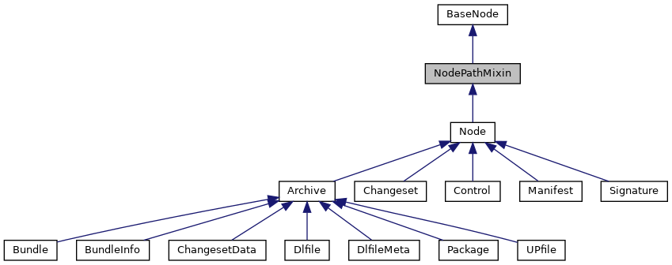
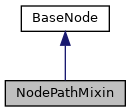

[Public Member Functions](#pub-methods)

Inheritance diagram for NodePathMixin:

\[<a href="graph_legend.md">legend</a>\]

Collaboration diagram for NodePathMixin:

\[<a href="graph_legend.md">legend</a>\]

|  |  |
|----|----|
| Public Member Functions |  |
| def  | [get_path_nodes](#a90b48062a797319956c8709266a69bac) (self, include_root=False, within_archive=False) |
| str  | [get_path](#ab2255afca64a863f2ec99ec620989e40) (self, include_root=False, within_archive=False) |
|   | Retrieve path of this node within the archive or withing whole tree of archives Separator \'/\' is used within archives and for recursion into archives. [More\...](#ab2255afca64a863f2ec99ec620989e40)  |
| int  | [get_depth](#ac26736fbf81b8e69cdf63c98c8a47c67) (self, within_archive=False) |
|   | Retrieve depth of node within the archive or within whole tree of archives. [More\...](#ac26736fbf81b8e69cdf63c98c8a47c67)  |
| def  | [find](#aedc1244bbf30d7e02332d97b105e4fe2) (self, str node_path) |
|   | Find node according to node path provided. [More\...](#aedc1244bbf30d7e02332d97b105e4fe2)  |
| def  | [find_re](#a4c21f678e8e3fe263962b7f38733124c) (self, str node_path_re) |
|   | Find node according to regular expression node path provided Search will look for regex matching node name match along the path. [More\...](#a4c21f678e8e3fe263962b7f38733124c)  |
| bool  | [has_ancestor](#ad79ec1eccbcc7f72ba14c3c50b91dde1) (self, ancestor) |
|   | Find if node has another node as ancestor. [More\...](#ad79ec1eccbcc7f72ba14c3c50b91dde1)  |
|  Public Member Functions inherited from <a href="classpackmanlib_1_1basenode_1_1_base_node.md">BaseNode</a> |  |
| def  | <a href="classpackmanlib_1_1basenode_1_1_base_node.md#aee93ed72a2829b54a0e13377d0f84b6a">__init__</a> (self, str <a href="classpackmanlib_1_1basenode_1_1_base_node.md#ab74e6bf80237ddc4109968cedc58c151">name</a>=None, <a href="classpackmanlib_1_1basenode_1_1_base_node.md">BaseNode</a> <a href="classpackmanlib_1_1basenode_1_1_base_node.md#a457d913bff1ebc8671c1eca1c9d5fc03">parent</a>=None, tarfile.TarInfo <a href="classpackmanlib_1_1basenode_1_1_base_node.md#ac9728b28ae902f349b97f7d526fb4885">tarinfo</a>=None) |
| str  | <a href="classpackmanlib_1_1basenode_1_1_base_node.md#a97064a535f192320c134e450ac478e60">get_type_str</a> (self) |
|   | Returns node type as string Supported are: \"Package\", \"Bundle\", \"Dlfile\", \"Signature\", \"Control\", \"Manifest\", \"Dir\", \"File\", \"Symlink\". <a href="classpackmanlib_1_1basenode_1_1_base_node.md#a97064a535f192320c134e450ac478e60">More...</a>  |
| bool  | <a href="classpackmanlib_1_1basenode_1_1_base_node.md#a40036e92a96400bbf76bacb62fc97ced">is_csd</a> (self) |
|   | Test if node is a CSD. <a href="classpackmanlib_1_1basenode_1_1_base_node.md#a40036e92a96400bbf76bacb62fc97ced">More...</a>  |
| bool  | <a href="classpackmanlib_1_1basenode_1_1_base_node.md#a0aa49779f6dac40e366fb98ec8ff311c">is_inf</a> (self) |
|   | Test if node is an INF. <a href="classpackmanlib_1_1basenode_1_1_base_node.md#a0aa49779f6dac40e366fb98ec8ff311c">More...</a>  |
| bool  | <a href="classpackmanlib_1_1basenode_1_1_base_node.md#a2d50a1b2388573865420bb7a54cf797b">is_meta</a> (self) |
|   | Test if node is a META. <a href="classpackmanlib_1_1basenode_1_1_base_node.md#a2d50a1b2388573865420bb7a54cf797b">More...</a>  |
| bool  | <a href="classpackmanlib_1_1basenode_1_1_base_node.md#a03b8f2bf011d738d9c66f0d4488a03db">is_manifest</a> (self) |
|   | Test if node is a manifest. <a href="classpackmanlib_1_1basenode_1_1_base_node.md#a03b8f2bf011d738d9c66f0d4488a03db">More...</a>  |
| bool  | <a href="classpackmanlib_1_1basenode_1_1_base_node.md#a42def0c1678d16515df9b441fde73ba7">is_changeset</a> (self) |
|   | Test if node is a changeset. <a href="classpackmanlib_1_1basenode_1_1_base_node.md#a42def0c1678d16515df9b441fde73ba7">More...</a>  |
| bool  | <a href="classpackmanlib_1_1basenode_1_1_base_node.md#afb49d022eb8d0e551f9c5d57872086eb">is_archive</a> (self) |
|   | Test if node is an archive. <a href="classpackmanlib_1_1basenode_1_1_base_node.md#afb49d022eb8d0e551f9c5d57872086eb">More...</a>  |
| bool  | <a href="classpackmanlib_1_1basenode_1_1_base_node.md#a6327b157864352a36826a505ee8870ad">is_dlfile</a> (self) |
|   | Test if node is a dlfile. <a href="classpackmanlib_1_1basenode_1_1_base_node.md#a6327b157864352a36826a505ee8870ad">More...</a>  |
| bool  | <a href="classpackmanlib_1_1basenode_1_1_base_node.md#acf1c247a2b5b619a761649da45f9d974">is_upfile</a> (self) |
|   | Test if node is an upfile. <a href="classpackmanlib_1_1basenode_1_1_base_node.md#acf1c247a2b5b619a761649da45f9d974">More...</a>  |
| bool  | <a href="classpackmanlib_1_1basenode_1_1_base_node.md#a6c8f1769f4874c20b3dc5e7f22169c23">is_bundle</a> (self) |
|   | Test if node is a bundle. <a href="classpackmanlib_1_1basenode_1_1_base_node.md#a6c8f1769f4874c20b3dc5e7f22169c23">More...</a>  |
| bool  | <a href="classpackmanlib_1_1basenode_1_1_base_node.md#a9cf4df8f61cbc1db2e463deb9956adda">is_package</a> (self) |
|   | Test if node is a package. <a href="classpackmanlib_1_1basenode_1_1_base_node.md#a9cf4df8f61cbc1db2e463deb9956adda">More...</a>  |
| bool  | <a href="classpackmanlib_1_1basenode_1_1_base_node.md#a59551a137c22107950f7fe2b4a20e247">is_signature</a> (self) |
|   | Test if node is a signature. <a href="classpackmanlib_1_1basenode_1_1_base_node.md#a59551a137c22107950f7fe2b4a20e247">More...</a>  |
| bool  | <a href="classpackmanlib_1_1basenode_1_1_base_node.md#ad01c8a8ff3a9536ea1adbab2ddaf15f4">is_control</a> (self) |
|   | Test if node is a control. <a href="classpackmanlib_1_1basenode_1_1_base_node.md#ad01c8a8ff3a9536ea1adbab2ddaf15f4">More...</a>  |
| def  | <a href="classpackmanlib_1_1basenode_1_1_base_node.md#a5c02300a2d52e15bf94b8286acdad576">mark_modified</a> (self) |
| def  | <a href="classpackmanlib_1_1basenode_1_1_base_node.md#a2f67b333aa5e0d678c748c2ebbdeee7f">get_parent_archive</a> (self) |
|   | Retrieve parent archive node. <a href="classpackmanlib_1_1basenode_1_1_base_node.md#a2f67b333aa5e0d678c748c2ebbdeee7f">More...</a>  |
| def  | <a href="classpackmanlib_1_1basenode_1_1_base_node.md#a6199c59cb64af881cd70a380d639f62e">get_platform</a> (self) |
|   | Retrieve platform for this node. <a href="classpackmanlib_1_1basenode_1_1_base_node.md#a6199c59cb64af881cd70a380d639f62e">More...</a>  |
| def  | <a href="classpackmanlib_1_1basenode_1_1_base_node.md#acb1a58b36d03f8b533010786b27456c4">get_root_archive</a> (self) |
|   | Retrieve root archive node Root archive node has no parent archive. <a href="classpackmanlib_1_1basenode_1_1_base_node.md#acb1a58b36d03f8b533010786b27456c4">More...</a>  |
| int  | <a href="classpackmanlib_1_1basenode_1_1_base_node.md#a8805808f42b6763bd9c2696d2854c7db">get_index</a> (self) |
|   | Retrieve index of this node in the list of its parent\'s children. <a href="classpackmanlib_1_1basenode_1_1_base_node.md#a8805808f42b6763bd9c2696d2854c7db">More...</a>  |
| def  | <a href="classpackmanlib_1_1basenode_1_1_base_node.md#adc09e25e108582cfddcbfd41fb8298a4">get_signer</a> (self) |
| int  | <a href="classpackmanlib_1_1basenode_1_1_base_node.md#a604c74b4565be8a42ee33de761c28f51">get_mode</a> (self) |
|   | Retrieve file mode of this node. <a href="classpackmanlib_1_1basenode_1_1_base_node.md#a604c74b4565be8a42ee33de761c28f51">More...</a>  |
| def  | <a href="classpackmanlib_1_1basenode_1_1_base_node.md#a23e8041ce1015febe4fdace3225714f9">__str__</a> (self) |

|  |  |
|----|----|
| Additional Inherited Members |  |
|  Static Public Member Functions inherited from <a href="classpackmanlib_1_1basenode_1_1_base_node.md">BaseNode</a> |  |
| tarfile.TarInfo  | <a href="classpackmanlib_1_1basenode_1_1_base_node.md#a858aac03715077f836c526caa69896c7">create_tarinfo</a> (str tarinfo_name, entry_type) |
|   | Tarinfo creation helper. <a href="classpackmanlib_1_1basenode_1_1_base_node.md#a858aac03715077f836c526caa69896c7">More...</a>  |
| def  | <a href="classpackmanlib_1_1basenode_1_1_base_node.md#a343e89c35fe71dea3b002b3eb444efa6">create_node</a> (tarinfo_name, entry_type) |
|  Data Fields inherited from <a href="classpackmanlib_1_1basenode_1_1_base_node.md">BaseNode</a> |  |
|   | <a href="classpackmanlib_1_1basenode_1_1_base_node.md#ab74e6bf80237ddc4109968cedc58c151">name</a> |
|   | node name (str) <a href="classpackmanlib_1_1basenode_1_1_base_node.md#ab74e6bf80237ddc4109968cedc58c151">More...</a>  |
|   | <a href="classpackmanlib_1_1basenode_1_1_base_node.md#a457d913bff1ebc8671c1eca1c9d5fc03">parent</a> |
|   | parent node (<a href="classpackmanlib_1_1basenode_1_1_base_node.md">BaseNode</a>) <a href="classpackmanlib_1_1basenode_1_1_base_node.md#a457d913bff1ebc8671c1eca1c9d5fc03">More...</a>  |
|   | <a href="classpackmanlib_1_1basenode_1_1_base_node.md#ac9728b28ae902f349b97f7d526fb4885">tarinfo</a> |
|   | children of this node in order. <a href="classpackmanlib_1_1basenode_1_1_base_node.md#ac9728b28ae902f349b97f7d526fb4885">More...</a>  |
|   | <a href="classpackmanlib_1_1basenode_1_1_base_node.md#ae8834017c3a98209d379e0384e291215">file_content</a> |
|   | Object representing the content of the file. <a href="classpackmanlib_1_1basenode_1_1_base_node.md#ae8834017c3a98209d379e0384e291215">More...</a>  |
|   | <a href="classpackmanlib_1_1basenode_1_1_base_node.md#a71101782c2fbd10a9832594113078cd2">signature_nodes</a> |
|   | Nodes holding signature of this node. <a href="classpackmanlib_1_1basenode_1_1_base_node.md#a71101782c2fbd10a9832594113078cd2">More...</a>  |
|   | <a href="classpackmanlib_1_1basenode_1_1_base_node.md#a691c0b70ad22568ebe48b0b21b22ee2c">additional_signature_nodes</a> |
|   | Nodes holding additional signature of this node. <a href="classpackmanlib_1_1basenode_1_1_base_node.md#a691c0b70ad22568ebe48b0b21b22ee2c">More...</a>  |

## MemberFunction Documentation {#member-function-documentation}

## find() 

def find

Find node according to node path provided.

Search will look for exact node name match along the path. Example: dlfile.find(\"mybundle.tgz/mypackage.tgz/dir/file\")

**Parameters**

**node_path** node path

### Returns

node (BaseNode) if found, None if not

## find_re() 

def find_re

Find node according to regular expression node path provided Search will look for regex matching node name match along the path.

Only the leaf node is accepted to have multiple matches

**Parameters**

**node_path_re** node path regex

### Returns

a list of nodes matching, None if none found

## get_depth() 

int get_depth

Retrieve depth of node within the archive or within whole tree of archives.

Example for \'dlfile.tgz/bundle.tgz/package.tgz/dir/file\':

- within_archive=False: -\> 4

- within_archive=True: -\> 2 **Parameters**

  **within_archive** stop at first parent archive

  ### Returns

  depth of node

## get_path() 

str get_path

Retrieve path of this node within the archive or withing whole tree of archives Separator \'/\' is used within archives and for recursion into archives.

Example for \'dlfile.tgz/bundle.tgz/package.tgz/dir/file\':

- include_root=False, within_archive=False -\> \'bundle.tgz/package.tgz/dir/file\'

- include_root=True, within_archive=False -\> \'dlfile.tgz/bundle.tgz/package.tgz/dir/file\'

- include_root=True/False, within_archive=True -\> \'dir/file\' **Parameters**

  **include_root** include root in path **within_archive** stop at first parent archive

  ### Returns

  path of the node

## get_path_nodes() 

def get_path_nodes

## has_ancestor() 

bool has_ancestor

Find if node has another node as ancestor.

**Parameters**

**ancestor** ancestor (BaseNode) to look for

### Returns

return True if ancestor is found

------------------------------------------------------------------------

The documentation for this class was generated from the following file:

- packman/packmanlib/<a href="nodepath_8py.md">nodepath.py</a>
