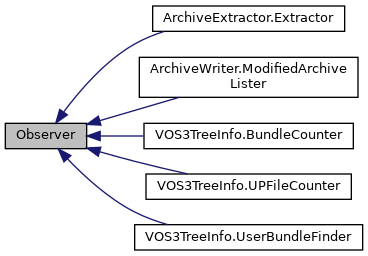

[Public Member Functions](#pub-methods)

Inheritance diagram for Observer:

\[<a href="graph_legend.md">legend</a>\]

|  |  |
|----|----|
| Public Member Functions |  |
| def  | [found_node_cb](#a105daf7d38d3518013ba998c7ced4966) (self, node) |
|   | Callback for all nodes visited. [More\...](#a105daf7d38d3518013ba998c7ced4966)  |
| def  | [found_archive_cb](#a4339f9ca68bfdbd28e44f729dc96986e) (self, archive) |
|   | Callback for all archive nodes visited. [More\...](#a4339f9ca68bfdbd28e44f729dc96986e)  |
| def  | [found_dlfile_cb](#a4658c97464b5e6183818fca2569e7a8e) (self, dlfile) |
|   | Callback for all dlfile nodes visited. [More\...](#a4658c97464b5e6183818fca2569e7a8e)  |
| def  | [found_upfile_cb](#ab7683a66151046935d5fc429c51fd083) (self, upfile) |
|   | Callback for all upfile nodes visited. [More\...](#ab7683a66151046935d5fc429c51fd083)  |
| def  | [found_bundle_cb](#ab0c64a83f57aafaaf2b5e9f5ff6c9b28) (self, bundle) |
|   | Callback for all bundle nodes visited. [More\...](#ab0c64a83f57aafaaf2b5e9f5ff6c9b28)  |
| def  | [found_package_cb](#a2e71416030fe50ca62bff56697cd4ee3) (self, package) |
|   | Callback for all package nodes visited. [More\...](#a2e71416030fe50ca62bff56697cd4ee3)  |
| def  | [found_csd_cb](#ad324df3784468c2b8876d1096027bfc4) (self, csd) |
|   | Callback for all csd nodes visited. [More\...](#ad324df3784468c2b8876d1096027bfc4)  |
| def  | [found_inf_cb](#a8af64daa34d66290c5e9b88a138abd34) (self, inf) |
|   | Callback for all inf nodes visited. [More\...](#a8af64daa34d66290c5e9b88a138abd34)  |
| def  | [found_meta_cb](#abda2863e87d519845652d3c3f628fe3b) (self, meta) |
|   | Callback for all meta nodes visited. [More\...](#abda2863e87d519845652d3c3f628fe3b)  |
| def  | [end_cb](#a5feaf5a94cffa0c0d626f4ba4573c9b7) (self, node) |
|   | Callback called once at the end of the tree walk. [More\...](#a5feaf5a94cffa0c0d626f4ba4573c9b7)  |

## MemberFunction Documentation {#member-function-documentation}

## end_cb() 

def end_cb

Callback called once at the end of the tree walk.

**Parameters**

**node** node on which walk was started

## found_archive_cb() 

def found_archive_cb

Callback for all archive nodes visited.

**Parameters**

**archive** archive visited

## found_bundle_cb() 

def found_bundle_cb

Callback for all bundle nodes visited.

**Parameters**

**bundle** bundle visited

Reimplemented in <a href="classpackmanlib_1_1io_1_1_archive_writer_1_1_modified_archive_lister.md#ab0c64a83f57aafaaf2b5e9f5ff6c9b28">ArchiveWriter.ModifiedArchiveLister</a>.

## found_csd_cb() 

def found_csd_cb

Callback for all csd nodes visited.

**Parameters**

**csd** csd visited

Reimplemented in <a href="classpackmanlib_1_1io_1_1_archive_writer_1_1_modified_archive_lister.md#ad324df3784468c2b8876d1096027bfc4">ArchiveWriter.ModifiedArchiveLister</a>.

## found_dlfile_cb() 

def found_dlfile_cb

Callback for all dlfile nodes visited.

**Parameters**

**dlfile** dlfile visited

Reimplemented in <a href="classpackmanlib_1_1io_1_1_archive_writer_1_1_modified_archive_lister.md#a4658c97464b5e6183818fca2569e7a8e">ArchiveWriter.ModifiedArchiveLister</a>.

## found_inf_cb() 

def found_inf_cb

Callback for all inf nodes visited.

**Parameters**

**inf** inf visited

Reimplemented in <a href="classpackmanlib_1_1io_1_1_archive_writer_1_1_modified_archive_lister.md#a8af64daa34d66290c5e9b88a138abd34">ArchiveWriter.ModifiedArchiveLister</a>, <a href="classpackmanlib_1_1treeinfo_1_1_v_o_s3_tree_info_1_1_bundle_counter.md#a8af64daa34d66290c5e9b88a138abd34">VOS3TreeInfo.BundleCounter</a>, and <a href="classpackmanlib_1_1treeinfo_1_1_v_o_s3_tree_info_1_1_user_bundle_finder.md#a8af64daa34d66290c5e9b88a138abd34">VOS3TreeInfo.UserBundleFinder</a>.

## found_meta_cb() 

def found_meta_cb

Callback for all meta nodes visited.

**Parameters**

**meta** meta visited

Reimplemented in <a href="classpackmanlib_1_1io_1_1_archive_writer_1_1_modified_archive_lister.md#abda2863e87d519845652d3c3f628fe3b">ArchiveWriter.ModifiedArchiveLister</a>.

## found_node_cb() 

def found_node_cb

Callback for all nodes visited.

**Parameters**

**node** node visited

Reimplemented in <a href="classpackmanlib_1_1io_1_1_archive_extractor_1_1_extractor.md#a105daf7d38d3518013ba998c7ced4966">ArchiveExtractor.Extractor</a>.

## found_package_cb() 

def found_package_cb

Callback for all package nodes visited.

**Parameters**

**package** package visited

Reimplemented in <a href="classpackmanlib_1_1io_1_1_archive_writer_1_1_modified_archive_lister.md#a2e71416030fe50ca62bff56697cd4ee3">ArchiveWriter.ModifiedArchiveLister</a>.

## found_upfile_cb() 

def found_upfile_cb

Callback for all upfile nodes visited.

**Parameters**

**upfile** upfile visited

Reimplemented in <a href="classpackmanlib_1_1io_1_1_archive_writer_1_1_modified_archive_lister.md#ab7683a66151046935d5fc429c51fd083">ArchiveWriter.ModifiedArchiveLister</a>, and <a href="classpackmanlib_1_1treeinfo_1_1_v_o_s3_tree_info_1_1_u_p_file_counter.md#ab7683a66151046935d5fc429c51fd083">VOS3TreeInfo.UPFileCounter</a>.

------------------------------------------------------------------------

The documentation for this class was generated from the following file:

- packman/packmanlib/<a href="treewalk_8py.md">treewalk.py</a>
