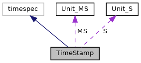

[Data Structures](#nested-classes) \| [Public Member Functions](#pub-methods) \| [Static Public Member Functions](#pub-static-methods) \| [Static Public Attributes](#pub-static-attribs)

`#include <`<a href="sdi_2src_2timestamp_8h_source.md">timestamp.h</a>`>`

Inheritance diagram for TimeStamp:

\[<a href="graph_legend.md">legend</a>\]

Collaboration diagram for TimeStamp:

\[<a href="graph_legend.md">legend</a>\]

|                 |                                                    |
|-----------------|----------------------------------------------------|
| Data Structures |                                                    |
| class           | [Unit_MS](#classsdi_1_1_time_stamp_1_1_unit___m_s) |
| class           | [Unit_S](#classsdi_1_1_time_stamp_1_1_unit___s)    |

|  |  |
|----|----|
| Public Member Functions |  |
|   | [TimeStamp](#a9b9283e7c6c516e9b5af4c4c572272fb) (time_t sec, long nsec) |
|   | [TimeStamp](#ab2ba7ae29a942d1f8c877bbf7cb52c72) (char sec) |
|   | [TimeStamp](#a14104c0dc2882a7e92791e4ae5dae397) (unsigned char sec) |
|   | [TimeStamp](#ae3a8cbeed587317ec470d73a917235d0) (short sec) |
|   | [TimeStamp](#ad142366537fd6c90f004a7e7e5fe76b3) (unsigned short sec) |
|   | [TimeStamp](#a8c53f124e0a56739dddf21f5dbc09a70) (int sec) |
|   | [TimeStamp](#aa765877a40bab49a4ac7edae54037ace) (unsigned sec) |
|   | [TimeStamp](#a1e6ced60d3f8ed8145b1174670041b91) (long sec=0) |
|   | [TimeStamp](#a4bdcc7c53fd88e093a7704f97e33f1a6) (unsigned long sec) |
|   | [TimeStamp](#a09ee54474a3cf2a0dcb44c3bba1d93f0) (float t) |
|   | [TimeStamp](#a0562a683beb2e90aad6d80115ff34922) (double t) |
| <a href="classsdi_1_1_time_stamp.md">TimeStamp</a> &  | [operator=](#a6b8cf0214a5543eef3359c68908c8cb1) (time_t sec) |
| <a href="classsdi_1_1_time_stamp.md">TimeStamp</a> &  | [operator=](#a220b30dc8ef7ce4318d91a730018108a) (double t) |
| <a href="classsdi_1_1_time_stamp.md">TimeStamp</a> &  | [operator+=](#a0f92836fe65f6dff8f6dd9a57263efef) (const <a href="classsdi_1_1_time_stamp.md">TimeStamp</a> &o) |
| <a href="classsdi_1_1_time_stamp.md">TimeStamp</a> &  | [operator-=](#a6a8198da471ba013e2782a227b9827e1) (const <a href="classsdi_1_1_time_stamp.md">TimeStamp</a> &o) |
| double  | [get](#af53ec2e557ea14cce1373e0f77954c82) () const |
| void  | [set](#a2e41358ea1b66ce29560cff3e3f8107f) (double t) |
| time_t  | [s](#a1531798c1dbb04cecaa02940a60db134) () const |
| long  | [ms](#a08c27c4fe2b5cab5ef3744e02994c70f) () const |
| void  | [normalize](#acd0de676568888d848beb97dcc53ae47) () |
| void  | [clear](#ac8bb3912a3ce86b15842e79d0b421204) () |

|  |  |
|----|----|
| Static Public Member Functions |  |
| static <a href="classsdi_1_1_time_stamp.md">TimeStamp</a>  | [Clock](#af6793cbedf60ccb7568f45922dcc37df) () |
| static <a href="classsdi_1_1_time_stamp.md">TimeStamp</a>  | [Monotonic](#aaf8485a75440007e7a7a67303cb050f8) () |

|  |  |
|----|----|
| Static Public Attributes |  |
| static [Unit_MS](#classsdi_1_1_time_stamp_1_1_unit___m_s)  | [MS](#af8efbdf5651c7a9db8f251bbae6a395a) |
| static [Unit_S](#classsdi_1_1_time_stamp_1_1_unit___s)  | [S](#afbc12be2aec255bec764c345ba4154bc) |

## DetailedDescription {#detailed-description}

time utility class

------------------------------------------------------------------------

## DataStructure Documentation {#data-structure-documentation}

## sdi::TimeStamp::Unit_MS 

class sdi::TimeStamp::Unit_MS

helper class for unit conversion

## sdi::TimeStamp::Unit_S 

class sdi::TimeStamp::Unit_S

helper class for unit conversion

## Constructor& Destructor Documentation

## TimeStamp()\[1/11\]  {#timestamp-111}

<a href="classsdi_1_1_time_stamp.md">TimeStamp</a>

constuctor

**Parameters**

\[in\] **sec** seconds \[in\] **nsec** nanoseconds

## TimeStamp()\[2/11\]  {#timestamp-211}

<a href="classsdi_1_1_time_stamp.md">TimeStamp</a>

inline

constuctor

**Parameters**

\[in\] **sec** seconds

## TimeStamp()\[3/11\]  {#timestamp-311}

<a href="classsdi_1_1_time_stamp.md">TimeStamp</a>

inline

constuctor

**Parameters**

\[in\] **sec** seconds

## TimeStamp()\[4/11\]  {#timestamp-411}

<a href="classsdi_1_1_time_stamp.md">TimeStamp</a>

inline

constuctor

**Parameters**

\[in\] **sec** seconds

## TimeStamp()\[5/11\]  {#timestamp-511}

<a href="classsdi_1_1_time_stamp.md">TimeStamp</a>

inline

constuctor

**Parameters**

\[in\] **sec** seconds

## TimeStamp()\[6/11\]  {#timestamp-611}

<a href="classsdi_1_1_time_stamp.md">TimeStamp</a>

inline

constuctor

**Parameters**

\[in\] **sec** seconds

## TimeStamp()\[7/11\]  {#timestamp-711}

<a href="classsdi_1_1_time_stamp.md">TimeStamp</a>

inline

constuctor

**Parameters**

\[in\] **sec** seconds

## TimeStamp()\[8/11\]  {#timestamp-811}

<a href="classsdi_1_1_time_stamp.md">TimeStamp</a>

inline

constuctor

**Parameters**

\[in\] **sec** seconds

## TimeStamp()\[9/11\]  {#timestamp-911}

<a href="classsdi_1_1_time_stamp.md">TimeStamp</a>

inline

constuctor

**Parameters**

\[in\] **sec** seconds

## TimeStamp()\[10/11\]  {#timestamp-1011}

<a href="classsdi_1_1_time_stamp.md">TimeStamp</a>

constuctor

**Parameters**

\[in\] **t** seconds

## TimeStamp()\[11/11\]  {#timestamp-1111}

<a href="classsdi_1_1_time_stamp.md">TimeStamp</a>

constuctor

**Parameters**

\[in\] **t** seconds

## MemberFunction Documentation {#member-function-documentation}

## clear() 

void clear

inline

reset to 0

## Clock() 

<a href="classsdi_1_1_time_stamp.md">TimeStamp</a> Clock

static

read realtime clock

### Returns

unix time

## get() 

double get

inline

get time

## Monotonic() 

<a href="classsdi_1_1_time_stamp.md">TimeStamp</a> Monotonic

static

read monotonic clock

### Returns

monitonic time

## ms() 

long ms

inline

create millisecond based time stamp

### Returns

time stamp

## normalize() 

void normalize

normalize time representation

## operator+=() 

<a href="classsdi_1_1_time_stamp.md">TimeStamp</a> & operator+=

## operator-=() 

<a href="classsdi_1_1_time_stamp.md">TimeStamp</a> & operator-=

## operator=()\[1/2\]  {#operator-12}

<a href="classsdi_1_1_time_stamp.md">TimeStamp</a> & operator=

assignment operator

**Parameters**

\[in\] **t** seconds

## operator=()\[2/2\]  {#operator-22}

<a href="classsdi_1_1_time_stamp.md">TimeStamp</a>& operator=

inline

assignment operator

**Parameters**

\[in\] **sec** seconds

## s() 

time_t s

inline

create second based time stamp

### Returns

time stamp

## set() 

void set

inline

set time

## FieldDocumentation {#field-documentation}

## MS 

[TimeStamp::Unit_MS](#classsdi_1_1_time_stamp_1_1_unit___m_s) MS

static

Millisecond unit

## S 

[TimeStamp::Unit_S](#classsdi_1_1_time_stamp_1_1_unit___s) S

static

Second unit

------------------------------------------------------------------------

The documentation for this class was generated from the following files:

- sdi/src/<a href="sdi_2src_2timestamp_8h_source.md">timestamp.h</a>
- sdi/src/<a href="timestamp_8cpp.md">timestamp.cpp</a>
