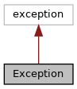

[Public Member Functions](#pub-methods)

<a href="classvficom_1_1_exception.md">Exception</a> type thrown by constructors in classes in this file. [More\...](#details)

`#include <`<a href="libcom3_8h_source.md">libcom3.h</a>`>`

Inheritance diagram for Exception:

\[<a href="graph_legend.md">legend</a>\]

Collaboration diagram for Exception:

\[<a href="graph_legend.md">legend</a>\]

|  |  |
|----|----|
| Public Member Functions |  |
|   | [Exception](#a6305a17f2ed7981afc9ab66ebfc0f2fd) (enum <a href="namespacevficom_1_1status.md#ae7ba2f563df916ce3ce6be92a19d2bbc">status::PipeStatus</a> error, const char \*description) |
| virtual const char \*  | [what](#ad62489809e3df568e973597b928d6d9b) () const throw () |
|   | retrieve an error description [More\...](#ad62489809e3df568e973597b928d6d9b)  |
| <a href="namespacevficom_1_1status.md#ae7ba2f563df916ce3ce6be92a19d2bbc">status::PipeStatus</a>  | [getError](#a525b39dd291368956cb3b122d6009de5) () const |
|   | retrieve status code [More\...](#a525b39dd291368956cb3b122d6009de5)  |

## DetailedDescription {#detailed-description}

<a href="classvficom_1_1_exception.md">Exception</a> type thrown by constructors in classes in this file.

## Constructor& Destructor Documentation

## Exception() 

<a href="classvficom_1_1_exception.md">Exception</a>

## MemberFunction Documentation {#member-function-documentation}

## getError() 

<a href="namespacevficom_1_1status.md#ae7ba2f563df916ce3ce6be92a19d2bbc">status::PipeStatus</a> getError

retrieve status code

## what() 

virtual const char\* what

virtual

retrieve an error description

------------------------------------------------------------------------

The documentation for this class was generated from the following file:

- com/src/<a href="libcom3_8h_source.md">libcom3.h</a>
