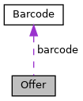

[Public Member Functions](#pub-methods) \| [Static Public Member Functions](#pub-static-methods) \| [Data Fields](#pub-attribs)

Represents the <a href="classvficpl_1_1_offer.md">Offer</a> object on CP-Payment communication. [More\...](#details)

`#include <`<a href="_commerce_8h_source.md">Commerce.h</a>`>`

Collaboration diagram for Offer:

\[<a href="graph_legend.md">legend</a>\]

|  |  |
|----|----|
| Public Member Functions |  |
|   | [Offer](#ad667d9529368d5af4f11f7feba038cca) () |
| virtual  | [\~Offer](#acbf0934c1a96aa46bb57812f65634813) () |
| std::string  | [getTypeStr](#a59926ec0b852831afe279203afec4fee) () |

|  |  |
|----|----|
| Static Public Member Functions |  |
| static <a href="namespacevficpl.md#ad7c9d0eab3af08a96ce9fd9ce293de88">OFFER_TYPE</a>  | [getTypeEnum](#a6b9933d428cd020b0db71d4efcb4dcac) (const std::string &strType) |

|  |  |
|----|----|
| Data Fields |  |
| std::string  | [id](#afd0d68c6d31ff249f3ae8662162663c3) |
| std::string  | [programId](#aa42859632a896c98d08cbaedec1d49c2) |
| <a href="namespacevficpl.md#ad7c9d0eab3af08a96ce9fd9ce293de88">OFFER_TYPE</a>  | [type](#a3aaf0a4dcdc323f9cd1c01da2b0403c6) |
| std::string  | [description](#a2e1454f6988673f814408646edaeb320) |
| bool  | [isRefundable](#a92e5fafebe1a48d5e2178455f5da580c) |
| bool  | [isCombinable](#a3415ce6ebd812fa283fdd354ef9b022b) |
| float  | [percentDiscount](#a29b54999df7a47aac8155a2f7497cf17) |
| std::string  | [amountDiscount](#a6e452768110873b84929491272eb17ec) |
| std::string  | [merchantOfferCode](#ace13e5fcdda9ab438a0f5fceeb17f637) |
| std::string  | [productCode](#af2f2e75f77ffd28349457519ed490b02) |
| std::string  | [associatedProductCode](#a53b0e916b8b1e8b387db308375892db2) |
| std::string  | [specialProductCode](#aa6ad9e0193f578ff3e098cc5e435e3ce) |
| <a href="classvficpl_1_1_barcode.md">Barcode</a>  | [barcode](#ad87311e613f049d9667c826c40465949) |

## DetailedDescription {#detailed-description}

Represents the <a href="classvficpl_1_1_offer.md">Offer</a> object on CP-Payment communication.

## Constructor& Destructor Documentation

## Offer() 

<a href="classvficpl_1_1_offer.md">Offer</a>

constructor of <a href="classvficpl_1_1_offer.md">Offer</a> object

## \~Offer() 

virtual \~<a href="classvficpl_1_1_offer.md">Offer</a>

virtual

destructor of <a href="classvficpl_1_1_offer.md">Offer</a> object

## MemberFunction Documentation {#member-function-documentation}

## getTypeEnum() 

static <a href="namespacevficpl.md#ad7c9d0eab3af08a96ce9fd9ce293de88">OFFER_TYPE</a> getTypeEnum

static

getTypeEnum - get enum from given offer type String.

**Parameters**

**strType** - string which shall be converted to enumeration value

### Returns

OFFER_TYPE - corresponding enum entry to strType

## getTypeStr() 

std::string getTypeStr

getTypeStr - get type of OFFER_TYPE as string

## FieldDocumentation {#field-documentation}

## amountDiscount 

std::string amountDiscount

amountDiscount - Discount in currency specified in the trigger Payload. This is represented as negative amount. String amount formatting applies. This affects the price by Adjusted_Amount = Adjusted_Amount + Offer_Discount

## associatedProductCode 

std::string associatedProductCode

associatedProductCode - Only applies to special product offers

## barcode 

<a href="classvficpl_1_1_barcode.md">Barcode</a> barcode

barcode - <a href="classvficpl_1_1_barcode.md">Barcode</a> information related to this object

## description 

std::string description

description - Eg: 20% off one pair of shoes.

## id 

std::string id

id - Offer_Id - Alphanumeric offer reference. May be multiple offers in the same transaction. Could be a back end loaded offer that the POS will redeem or a manufacturer coupon code.

## isCombinable 

bool isCombinable

isCombinable - Indicates if the offer may combined with other combinable offers.

## isRefundable 

bool isRefundable

isRefundable - Indicates if the purchase is returnable

## merchantOfferCode 

std::string merchantOfferCode

merchantOfferCode - Field for merchant specific offers.

## percentDiscount 

float percentDiscount

percentDiscount - Percentage discount associated with the offer. For example a 20% discount is represented as -0.20 and affects the price by \"Adjusted_Amount = Adjusted_Amount + Trans_Amount \* Offer_PercentDiscount\"

## productCode 

std::string productCode

productCode - Represented as SKU (Stock Keeping Unit) or PLU (Price Look Up) or UPC (Unified Product Code)

## programId 

std::string programId

programId - Unique reference to identify the Program.

## specialProductCode 

std::string specialProductCode

specialProductCode - Eg: BOGO (Buy One Get One) using product and associated product code. BOGOH ( Buy One Get One Half Off) using Product_Code, Percentage_Discount and Associated_Product_Code.

## type 

<a href="namespacevficpl.md#ad7c9d0eab3af08a96ce9fd9ce293de88">OFFER_TYPE</a> type

type - Type of offer, must be one of: MERCHANT_COUPON, MANUFACTURER_COUPON, OTHER_COUPON, PRODUCT_DISCOUNT, LOYALTY_CARD, TRANSACTION_DISCOUNT

------------------------------------------------------------------------

The documentation for this class was generated from the following file:

- cpl/include/commerce/<a href="_commerce_8h_source.md">Commerce.h</a>
