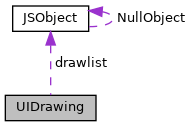

[Public Types](#pub-types) \| [Public Member Functions](#pub-methods) \| [Data Fields](#pub-attribs)

`#include <`<a href="gui_8h_source.md">gui.h</a>`>`

Collaboration diagram for UIDrawing:

\[<a href="graph_legend.md">legend</a>\]

|  |  |
|----|----|
| Public Types |  |
| enum   | { [FNT_NORMAL](#a61dadd085c1777f559549e05962b2c9ea1e72e3f751534bf27dece15f6b770019) =0x0, [FNT_ITALIC](#a61dadd085c1777f559549e05962b2c9ead76cc3a6f7d36f8f80dce5d14097afd7) =0x1, [FNT_BOLD](#a61dadd085c1777f559549e05962b2c9ea035c4130eccd09a8f45822c236e63558) =0x700 } |
| enum   | [ImageType](#a3154c405c975616503bac23f51b78fc0) {   [IMG_BMP](#a3154c405c975616503bac23f51b78fc0a0a634bdd89379d5120090a0e80ec45d3), [IMG_GIF](#a3154c405c975616503bac23f51b78fc0a0dfef49bed4214dafcf6a63785477f02), [IMG_JPEG](#a3154c405c975616503bac23f51b78fc0a48f8c0b524a8d46378191dee2a51b5f1), [IMG_PAM](#a3154c405c975616503bac23f51b78fc0ad42f35fa0c6e9f96391673f7cf0eb0e7),   [IMG_PBM](#a3154c405c975616503bac23f51b78fc0ad89815ea0efcdc3279590d18112f6b57), [IMG_PNG](#a3154c405c975616503bac23f51b78fc0a426fd3f746146b291a82f1b6ab982ea3), [IMG_RAW](#a3154c405c975616503bac23f51b78fc0a3343d245637efd4be5608dc8e79fd2ef) } |

|  |  |
|----|----|
| Public Member Functions |  |
|   | [UIDrawing](#a2ab6d96f1137c52f1a95b1b91b0037fe) () |
|   | [\~UIDrawing](#aa86b11228302584f65ea875540375cc5) () |
| void  | [reset](#ad20897c5c8bd47f5d4005989bead0e55) () |
| void  | [clear](#a0f765130b63c7d600afc2d63b7660ff6) (unsigned rgb) |
| void  | [color](#ac174a9927d723cebaa5a4f07d067b952) (unsigned rgb) |
| void  | [linewidth](#a778977ddf4a50829a3c9f970aa52ea4d) (int w) |
| void  | [line](#af35cd505959d6c6616cd6b56f7c5cf5b) (int x, int y, int x2, int y2) |
| void  | [pixel](#ac174b243eeff08a6717d7b2cf76f20d2) (int x, int y) |
| void  | [rect](#a37f4a5cdb3538080c3756d0d6110ae73) (int x, int y, int w, int h) |
| void  | [rectf](#a5703a83e2a7903a788a8658e6dd19115) (int x, int y, int w, int h) |
| void  | [trif](#a9c6193492a2208ebbe4f4646c82232a8) (int x, int y, int x2, int y2, int x3, int y3) |
| void  | [font](#aa941d7fde3f955734dddfcc7e45c2733) (const char \*name, int size, unsigned style=[FNT_NORMAL](#a61dadd085c1777f559549e05962b2c9ea1e72e3f751534bf27dece15f6b770019)) |
| void  | [font](#a758a3d91481b3d9d0a87d7c51e05fafe) (const std::string &name, int size, unsigned style=[FNT_NORMAL](#a61dadd085c1777f559549e05962b2c9ea1e72e3f751534bf27dece15f6b770019)) |
| void  | [text](#a56ec3ca6412b3ef3f1d9d6b7314170eb) (const char \*text, int x, int y) |
| void  | [text](#a385a0c9a39c4d8b3e675c1dd90b57b52) (const std::string &text, int x, int y) |
| void  | [image](#a09963d18152e78d8d9e62972d880b6f8) ([ImageType](#a3154c405c975616503bac23f51b78fc0) type, const void \*data, unsigned size, int x, int y, int w=0, int h=0) |
| void  | [image](#a79266e1880ad7805cc1f6308787f6494) (const char \*filename, int x, int y) |
| void  | [image](#af5f6a2e19af99de67c0a93d24df2ada3) (const std::string &filename, int x, int y) |

|  |  |
|----|----|
| Data Fields |  |
| <a href="namespacevfihtml.md#aae7be032793c509f7d46a8e251b0f0e5">vfihtml::JSObject</a>  | [drawlist](#a2fa9021ddb79df656b8f5d6199326e7f) |

## DetailedDescription {#detailed-description}

class for creating a drawing list

## MemberEnumeration Documentation {#member-enumeration-documentation}

## anonymousenum  {#anonymous-enum}

anonymous enum

font style, values can be combined by or-ing them together

| Enumerator  |                                       |
|-------------|---------------------------------------|
| FNT_NORMAL  | 
normal font
  |
| FNT_ITALIC  | 
italic style
 |
| FNT_BOLD    | 
bold style
   |

## ImageType 

enum [ImageType](#a3154c405c975616503bac23f51b78fc0)

image type

| Enumerator |  |
|----|----|
| IMG_BMP  | 
BMP image
 |
| IMG_GIF  | 
GIF image
 |
| IMG_JPEG  | 
JPEG image
 |
| IMG_PAM  | 
PAM image
 |
| IMG_PBM  | 
PBM image
 |
| IMG_PNG  | 
PNG image
 |
| IMG_RAW  | 
raw image data, the format is inferred from the size information of the data.
 |

## Constructor& Destructor Documentation

## UIDrawing() 

<a href="classvfigui_1_1_u_i_drawing.md">UIDrawing</a>

constructor

## \~UIDrawing() 

\~<a href="classvfigui_1_1_u_i_drawing.md">UIDrawing</a>

destructor

## MemberFunction Documentation {#member-function-documentation}

## clear() 

void clear

clear canvas

**Parameters**

\[in\] **rgb** 24-bit color value to be used for clearing the canvas

## color() 

void color

set current color for successive drawing commands

**Parameters**

\[in\] **rgb** 24-bit color value

## font()\[1/2\]  {#font-12}

void font

set the current font

**Parameters**

\[in\] **name** font name \[in\] **size** nominal font height \[in\] **style** font style

## font()\[2/2\]  {#font-22}

void font

set the current font

**Parameters**

\[in\] **name** font name \[in\] **size** nominal font height \[in\] **style** font style

## image()\[1/3\]  {#image-13}

void image

draw image data to screen

**Parameters**

\[in\] **filename** image file name \[in\] **x** x-coordinate \[in\] **y** y-coordinate

## image()\[2/3\]  {#image-23}

void image

draw image data to screen

**Parameters**

\[in\] **filename** image file name \[in\] **x** x-coordinate \[in\] **y** y-coordinate

## image()\[3/3\]  {#image-33}

void image

draw image data to screen

**Parameters**

\[in\] **type** image type \[in\] **data** image data (format depends on type) \[in\] **size** number of bytes in data \[in\] **x** x-coordinate \[in\] **y** y-coordinate \[in\] **w** width of the image, only used for IMG_RAW \[in\] **h** height of the image, only used for IMG_RAW


In case of IMG_RAW the number of bytes per pixel is determined from size and w\*h. Depending on the number of bytes per pixel the image format is considered to be as follows: \[unsupported block\]


## line() 

void line

draw line between the given points

**Parameters**

\[in\] **x** x-coodinate first point \[in\] **y** y-coodinate first point \[in\] **x2** x-coodinate second point \[in\] **y2** y-coodinate second point

## linewidth() 

void linewidth

set line width for line and rect

**Parameters**

\[in\] **w** line width in pixels, 0 is default

## pixel() 

void pixel

draw single pixel pixel

**Parameters**

\[in\] **x** x-coodinate \[in\] **y** y-coodinate

## rect() 

void rect

draw rectangle

**Parameters**

\[in\] **x** x-coodinate \[in\] **y** x-coodinate \[in\] **w** width \[in\] **h** height

## rectf() 

void rectf

draw filled rectangle

**Parameters**

\[in\] **x** x-coodinate \[in\] **y** x-coodinate \[in\] **w** width \[in\] **h** height

## reset() 

void reset

reset drawing

## text()\[1/2\]  {#text-12}

void text

draw text using current font and color

**Parameters**

\[in\] **text** text \[in\] **x** x-coodinate first point \[in\] **y** y-coodinate first point


Coordinates refer to the starting point of the base line, e.g. drawing an \'A\', x/y refers to the leftmost bottom pixel of \'A\'.


## text()\[2/2\]  {#text-22}

void text

draw text using current font and color

**Parameters**

\[in\] **text** text \[in\] **x** x-coodinate first point \[in\] **y** y-coodinate first point


Coordinates refer to the starting point of the base line, e.g. drawing an \'A\', x/y refers to the leftmost bottom pixel of \'A\'.


## trif() 

void trif

draw filled triangle given by three points

**Parameters**

\[in\] **x** x-coodinate first point \[in\] **y** y-coodinate first point \[in\] **x2** x-coodinate second point \[in\] **y2** y-coodinate second point \[in\] **x3** x-coodinate third point \[in\] **y3** y-coodinate third point

## FieldDocumentation {#field-documentation}

## drawlist 

<a href="namespacevfihtml.md#aae7be032793c509f7d46a8e251b0f0e5">vfihtml::JSObject</a> drawlist

------------------------------------------------------------------------

The documentation for this class was generated from the following file:

- guiprt/src/html/<a href="gui_8h_source.md">gui.h</a>
