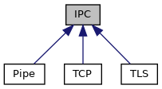

[Public Member Functions](#pub-methods) \| [Static Public Member Functions](#pub-static-methods) \| [Protected Member Functions](#pro-methods) \| [Protected Attributes](#pro-attribs)

`#include <`<a href="ipc_8h_source.md">ipc.h</a>`>`

Inheritance diagram for IPC:

\[<a href="graph_legend.md">legend</a>\]

|  |  |
|----|----|
| Public Member Functions |  |
| virtual  | [\~IPC](#a2de5cc01b541095acf2fa6d8f1efcefd) () |
| virtual bool  | [eof](#a044713f1fcbdbec24aae467186a95481) () |
| virtual bool  | [error](#a090dfa7806330da64843832e3985ebdf) () |
| virtual <a href="classvfiipc_1_1_i_p_c.md">IPC</a> \*  | [accept](#ad05fb9ec7fd0b49be32e902bf5f485cd) (int timeout_msec=-1) |
| virtual void  | [close](#a47feccb1873356363e4d0e302bc3822c) () |
| virtual bool  | [write](#a04f753a2a5691e2d36266e2ff084a217) (const void \*data, int size) |
| virtual int  | [read](#aa04744c17ae9eec2b37fb8c476a8c62d) (void \*data, int maxsize, int timeout_msec, int timeout_msec2) |
| virtual int  | [read](#a69117eaa93a4a8bff9cb28df51abc50b) (void \*data, int maxsize, int timeout_msec=-1) |
| int  | [peek](#abe719544c505e175fe68e0c616f9742d) (void \*data, int maxsize, int timeout_msec=-1) |
| virtual bool  | [write_msg](#aa847963eee355eaa6d9054510fb66b65) (unsigned prefix, int msg_id, const void \*msg, int size) |
| virtual bool  | [write_msg](#adf0117598edfaf3ed682337421457956) (unsigned prefix, int msg_id, const std::vector\< unsigned char \> &msg) |
| virtual bool  | [write_msg](#a0e36d031eb96fa532e70d99dd6454864) (unsigned prefix, int msg_id, const std::vector\< char \> &msg) |
| virtual bool  | [read_msg](#a5fc3e8a54237502339f9483465730704) (unsigned prefix, int &msg_id, std::vector\< unsigned char \> &msg, int size_limit, int timeout_msec=-1) |
| virtual bool  | [read_msg](#af9b26f735493cab66dbb7bbffe6d2190) (unsigned prefix, int &msg_id, std::vector\< char \> &msg, int size_limit, int timeout_msec=-1) |
| virtual bool  | [poll_in](#aae3d66ed5454894b1ace225e51de8674) (int timeout_msec=-1) |
| virtual const char \*  | [remote_addr](#af5c43ffa916e2d7662a667b33646493a) () const |
| int  | [getFD](#a2da953859d766be3eb7a8409fc9a6b02) () const |
| virtual bool  | [set_callback](#aa73e8080bdf5412792220bbb47cd2f4d) (<a href="namespacevfiipc.md#ad81e4165dd387a02aacdb8a57c4fdd4f">ipcCallback</a> cb, void \*data=0) |
| virtual bool  | [write_msg](#aa3ade24ef1ee0c1c277e735e10288bea) (unsigned prefix, int msg_id, const std::string &msg) |
| virtual bool  | [read_msg](#a12475d631dd0313083d53b72d007a07a) (unsigned prefix, int &msg_id, std::string &msg, int size_limit, int timeout_msec=-1) |
| virtual bool  | [is_server](#acdfdf57c1c76dcccb680e6dabdfdf59e) () |
| virtual const char \*  | [local_addr](#aa992c5725a59c6d865dc28415862eb1e) () const |

|  |  |
|----|----|
| Static Public Member Functions |  |
| static <a href="libseccmd-comp_8h.md#ac1e8a42306d8e67cb94ca31c3956ee78">DEPRECATED</a> void  | [set_callback_stacksize](#a78d252e52f513e6ddfb13d8e4a5ebb6d) (int size=-1) |
| static const char \*  | [getVersion](#add90ed6ce299e1afd9cf2ddf23e3b722) () |
| static const char \*  | [ipc_GetVersion](#adbb74a0c7649adcd2699a37099e67407) () |

|  |  |
|----|----|
| Protected Member Functions |  |
|   | [IPC](#a8ad54b08db43652b4d971a7ae17e1634) (IpcPrivate \*\_d) |
| virtual bool  | [read_msg](#a566bc069efbaf8b7c6d7639cf6a0a7ea) (unsigned prefix, int &msg_id, IpcBuffer &msg, int size_limit, int timeout_msec=-1) |

|                      |                                         |
|----------------------|-----------------------------------------|
| Protected Attributes |                                         |
| IpcPrivate \*        | [d](#a40526579f289c2f9a91bde432367b54b) |

## DetailedDescription {#detailed-description}

base class for inter process communication. Both stream and message based operation is supported. For messages the message format is as follows:
\<4 bytes prefix\> \<4 bytes message size\> \<4 bytes message ID\> \<message\>
All numbers are in big endian format. Size includes the size of the message ID. The prefix is used for checking synchronization of sender and receiver and is used to re-synchronize in case synchonization has been lost: The receiver discards data until a valid prefix has been found.

## Constructor& Destructor Documentation

## IPC() 

<a href="classvfiipc_1_1_i_p_c.md">IPC</a>

protected

constructor

## \~IPC() 

virtual \~<a href="classvfiipc_1_1_i_p_c.md">IPC</a>

virtual

destructor

## MemberFunction Documentation {#member-function-documentation}

## accept() 

virtual <a href="classvfiipc_1_1_i_p_c.md">IPC</a>\* accept

inlinevirtual

accept an incoming connection for *timeout_msec* milliseconds. A negative value means wait forever. Please note that [accept()](#ad05fb9ec7fd0b49be32e902bf5f485cd) only works for <a href="classvfiipc_1_1_i_p_c.md">IPC</a> objecst in server mode (e.g. see <a href="classvfiipc_1_1_t_c_p.md#ae4ffb5366b5b327f89b3b4624823e4c4">TCP::listen()</a> or <a href="classvfiipc_1_1_pipe.md#a29ad40613be45421828668eb96335a0c">Pipe::listen()</a>). If an incoming connection has been accepted a pointer to an object to this connection is returned that has been allocated using new. The caller takes over ownership for this object and if it is not needed any longer it must be released using delete.

**Parameters**

\[in\] **timeout_msec** timeout to wait for a new connection in milliseconds. A negative timeout means wait forever.

### Returns

pointer to a new <a href="classvfiipc_1_1_i_p_c.md">IPC</a> object on success, else NULL in case of timeout or error

Reimplemented in <a href="classvfiipc_1_1_pipe.md#a95b94113c8b49766182f98a1b5ed14fe">Pipe</a>, <a href="classvfiipc_1_1_t_c_p.md#a95b94113c8b49766182f98a1b5ed14fe">TCP</a>, and <a href="classvfiipc_1_1_t_l_s.md#a95b94113c8b49766182f98a1b5ed14fe">TLS</a>.

## close() 

virtual void close

virtual

close any open internal file descriptors

Reimplemented in <a href="classvfiipc_1_1_pipe.md#a5ae591df94fc66ccb85cbb6565368bca">Pipe</a>, <a href="classvfiipc_1_1_t_c_p.md#a5ae591df94fc66ccb85cbb6565368bca">TCP</a>, and <a href="classvfiipc_1_1_t_l_s.md#a5ae591df94fc66ccb85cbb6565368bca">TLS</a>.

## eof() 

virtual bool eof

virtual

returns true, if <a href="classvfiipc_1_1_i_p_c.md">IPC</a> has indicated an EOF (end of file) and connection was closed. Invoke [close()](#a47feccb1873356363e4d0e302bc3822c) function for re-use of this <a href="classvfiipc_1_1_i_p_c.md">IPC</a> object.

Reimplemented in <a href="classvfiipc_1_1_t_l_s.md#a044713f1fcbdbec24aae467186a95481">TLS</a>.

## error() 

virtual bool error

virtual

returns true, <a href="classvfiipc_1_1_i_p_c.md">IPC</a> has indicated an error (e.g. connection is distrubed). Invoke [close()](#a47feccb1873356363e4d0e302bc3822c) function for re-use of this <a href="classvfiipc_1_1_i_p_c.md">IPC</a> object.

Reimplemented in <a href="classvfiipc_1_1_t_l_s.md#a090dfa7806330da64843832e3985ebdf">TLS</a>.

## getFD() 

int getFD

obtain the file descriptor used for reading/writing data

### Returns

file descriptor

## getVersion() 

static const char\* getVersion

static

returns a zero-terminated string with version and build information of libvfiipc

### Returns

version string

## ipc_GetVersion() 

static const char\* ipc_GetVersion

static

returns a zero-terminated string with version and build information of libvfiipc in ADK version string format: \<major\>.\<minor\>.\<patch\>-\<build\>, e.g. \"1.2.3-4\"

### Returns

version string

## is_server() 

virtual bool is_server

virtual

returns true, if this <a href="classvfiipc_1_1_i_p_c.md">IPC</a> object is a server instance, on which <a href="classvfiipc_1_1_t_c_p.md#ae4ffb5366b5b327f89b3b4624823e4c4">TCP::listen()</a> or <a href="classvfiipc_1_1_pipe.md#a29ad40613be45421828668eb96335a0c">Pipe::listen()</a> was called. \\ return true if this <a href="classvfiipc_1_1_i_p_c.md">IPC</a> is used as server

Reimplemented in <a href="classvfiipc_1_1_t_l_s.md#acdfdf57c1c76dcccb680e6dabdfdf59e">TLS</a>.

## local_addr() 

virtual const char\* local_addr

virtual

For IPC::TCP objects: This function always returns the IP address and session port of the local interface used for the connection, string format is: \"&lt;IP address\>:&lt;port\>\". For IPC::Pipe objects: In difference to [IPC::remote_addr()](#af5c43ffa916e2d7662a667b33646493a), this function always returns an empty string. Use OS functions to get information for local PID, UID and GID.

### Returns

local information string or an empty string

Reimplemented in <a href="classvfiipc_1_1_t_l_s.md#aa992c5725a59c6d865dc28415862eb1e">TLS</a>.

## peek() 

int peek

read data from the stream without removing it, the eof and error flags are not updated to not break a consecutive read.

**Parameters**

\[out\] **data** buffer that will receive the read bytes \[in\] **maxsize** maximum number of bytes to be read. \[in\] **timeout_msec** timeout for reading in milliseconds. A negative timeout means wait forever.

### Returns

number of bytes read. A short read does not indicate EOF, it just means that there is no more data to look at, 0 means EOF, -1 means error, -2 means timeout.


Unlike read this function returns as soon as some data is available, it does not try to wait until maxsize bytes can be read.


This is no virtual function to maintain ABI compatibility.


## poll_in() 

virtual bool poll_in

virtual

check for availability of incoming data on the stream. In case of an error or an EOF this function also returns true and sets the internal flags for functions [IPC::eof()](#a044713f1fcbdbec24aae467186a95481) and [IPC::error()](#a090dfa7806330da64843832e3985ebdf).

**Parameters**

\[in\] **timeout_msec** timeout to wait for available data in milliseconds. A negative timeout means wait forever.

### Returns

true in case of data is available (or EOF/error), else false

Reimplemented in <a href="classvfiipc_1_1_t_l_s.md#aae3d66ed5454894b1ace225e51de8674">TLS</a>.

## read()\[1/2\]  {#read-12}

virtual int read

virtual

read data from the stream

**Parameters**

\[out\] **data** buffer that will receive the read bytes \[in\] **maxsize** number of bytes to be read. \[in\] **timeout_msec** timeout for reading in milliseconds. A negative timeout means wait forever. \[in\] **timeout_msec2** timeout for reading after at least one byte has been read in milliseconds. A negative timeout means wait forever.

### Returns

number of bytes read. A short read indicates EOF, timeout or error

Reimplemented in <a href="classvfiipc_1_1_t_l_s.md#aa04744c17ae9eec2b37fb8c476a8c62d">TLS</a>.

## read()\[2/2\]  {#read-22}

virtual int read

inlinevirtual

read data from the stream

**Parameters**

\[out\] **data** buffer that will receive the read bytes \[in\] **maxsize** number of bytes to be read. \[in\] **timeout_msec** timeout for reading in milliseconds. A negative timeout means wait forever.

### Returns

number of bytes read. A short read indicates EOF, timeout or error

## read_msg()\[1/4\]  {#read_msg-14}

virtual bool read_msg

protectedvirtual

base function for reading messages

## read_msg()\[2/4\]  {#read_msg-24}

virtual bool read_msg

virtual

read message from the stream.

**Parameters**

\[in\] **prefix** The data stream is checked to start with prefix. This is used to re-synchronize on the incoming data stream if required. \[out\] **msg_id** message ID \[out\] **msg** received message. \[in\] **size_limit** size limit to prevent exhaustive memory allocations in case corrupt data has been received. \[in\] **timeout_msec** timeout for reading in milliseconds. A negative timeout means wait forever.

### Returns

true in case of success, else false

Reimplemented in <a href="classvfiipc_1_1_t_l_s.md#a12475d631dd0313083d53b72d007a07a">TLS</a>.

## read_msg()\[3/4\]  {#read_msg-34}

virtual bool read_msg

virtual

read message from the stream.

**Parameters**

\[in\] **prefix** The data stream is checked to start with prefix. This is used to re-synchronize on the incoming data stream if required. \[out\] **msg_id** message ID \[out\] **msg** received message. \[in\] **size_limit** size limit to prevent exhaustive memory allocations in case corrupt data has been received. \[in\] **timeout_msec** timeout for reading in milliseconds. A negative timeout means wait forever.

### Returns

true in case of success, else false

Reimplemented in <a href="classvfiipc_1_1_t_l_s.md#af9b26f735493cab66dbb7bbffe6d2190">TLS</a>.

## read_msg()\[4/4\]  {#read_msg-44}

virtual bool read_msg

virtual

read message from the stream.

**Parameters**

\[in\] **prefix** The data stream is checked to start with prefix. This is used to re-synchronize on the incoming data stream if required. \[out\] **msg_id** message ID \[out\] **msg** received message. \[in\] **size_limit** size limit to prevent exhaustive memory allocations in case corrupt data has been received. \[in\] **timeout_msec** timeout for reading in milliseconds. A negative timeout means wait forever.

### Returns

true in case of success, else false

Reimplemented in <a href="classvfiipc_1_1_t_l_s.md#a5fc3e8a54237502339f9483465730704">TLS</a>.

## remote_addr() 

virtual const char\* remote_addr

virtual

For IPC::TCP objects: This function always returns the IP address and session port of the connected client or server, string format is: \"&lt;IP address\>:&lt;port\>\". For IPC::Pipe objects: This function always returns PID, UID and GID of the remote process (string format: \"&lt;pid\> &lt;uid\> &lt;gid\>\"). Since credential information is obtained from underlying OS, it is no longer necessary to enable <a href="classvfiipc_1_1_pipe.md#a892ce29b9c853749e7c4551f44fe2603a5f770eff268e3423ae7f928a3819e9cf">Pipe::PC_EnableCredentials</a>, which is deprecated since removal of Verix eVo.

### Returns

remote information string or an empty string

Reimplemented in <a href="classvfiipc_1_1_t_l_s.md#af5c43ffa916e2d7662a667b33646493a">TLS</a>.

## set_callback() 

virtual bool set_callback

virtual

register a callback function for this <a href="classvfiipc_1_1_i_p_c.md">IPC</a> object, which is invoked, if incoming data is pending and that <a href="classvfiipc_1_1_i_p_c.md">IPC</a> functions [read()](#aa04744c17ae9eec2b37fb8c476a8c62d) or [read_msg()](#a5fc3e8a54237502339f9483465730704) can be called to read the data. Set cb to NULL to unregister the callback for this <a href="classvfiipc_1_1_i_p_c.md">IPC</a> object.

**Parameters**

\[in\] **cb** callback function, which is invoked, if has been received. Passing a NULL pointer will unregister the callback. \[in\] **data** data pointer, which is passed to callback function cb

### Returns

true for success, else callback couldn\'t be registered/unregistered.

Reimplemented in <a href="classvfiipc_1_1_t_l_s.md#aa73e8080bdf5412792220bbb47cd2f4d">TLS</a>.

## set_callback_stacksize() 

static <a href="libseccmd-comp_8h.md#ac1e8a42306d8e67cb94ca31c3956ee78">DEPRECATED</a> void set_callback_stacksize

static

callbacks configured with function [IPC::set_callback()](#aa73e8080bdf5412792220bbb47cd2f4d) are invoked in context of a seperate thread that is started with first invocation of this function.


This function is deprecated since removal of Verix eVo. It is not recommended to modify thread stacksizes on other systems!
 **Parameters**

\[in\] **size** stacksize of the thread (in bytes) invoking callback function registered with IPC::set_callback(). Please note that minimal required stacksize depends on the application code that is placed to the callback function. Minimal value is PTHREAD_STACK_MIN and sizes below this limit will set this minmal value. A negative size means the usage of the system default stacksize (default).


This function has no effect, if the callback thread was already started by calling [IPC::set_callback()](#aa73e8080bdf5412792220bbb47cd2f4d). A running callback thread is not restarted with another stacksize.


## write() 

virtual bool write

virtual

write data to the stream

**Parameters**

\[in\] **data** data to be written \[in\] **size** number of bytes to be written

### Returns

true in case of success, else false

Reimplemented in <a href="classvfiipc_1_1_t_l_s.md#a04f753a2a5691e2d36266e2ff084a217">TLS</a>.

## write_msg()\[1/4\]  {#write_msg-14}

virtual bool write_msg

inlinevirtual

write a message to the stream. The message is prefixed by *prefix* and the size of the message (big endian).

**Parameters**

\[in\] **prefix** prefix of the message \[in\] **msg_id** message ID \[in\] **msg** message to be sent

### Returns

true in case of success, else false

Reimplemented in <a href="classvfiipc_1_1_t_l_s.md#aa3ade24ef1ee0c1c277e735e10288bea">TLS</a>.

## write_msg()\[2/4\]  {#write_msg-24}

virtual bool write_msg

inlinevirtual

write a message to the stream. The message is prefixed by *prefix* and the size of the message (big endian).

**Parameters**

\[in\] **prefix** prefix of the message \[in\] **msg_id** message ID \[in\] **msg** message to be sent

### Returns

true in case of success, else false

Reimplemented in <a href="classvfiipc_1_1_t_l_s.md#a0e36d031eb96fa532e70d99dd6454864">TLS</a>.

## write_msg()\[3/4\]  {#write_msg-34}

virtual bool write_msg

inlinevirtual

write a message to the stream. The message is prefixed by *prefix* and the size of the message (big endian).

**Parameters**

\[in\] **prefix** prefix of the message \[in\] **msg_id** message ID \[in\] **msg** message to be sent

### Returns

true in case of success, else false

Reimplemented in <a href="classvfiipc_1_1_t_l_s.md#adf0117598edfaf3ed682337421457956">TLS</a>.

## write_msg()\[4/4\]  {#write_msg-44}

virtual bool write_msg

virtual

write a message to the stream. The message is prefixed by *prefix* and the size of the message (including msg_id, big endian) and by 4 bytes message ID.

**Parameters**

\[in\] **prefix** prefix of the message \[in\] **msg_id** message ID \[in\] **msg** message to be sent \[in\] **size** size of the message

### Returns

true in case of success, else false

Reimplemented in <a href="classvfiipc_1_1_t_l_s.md#aa847963eee355eaa6d9054510fb66b65">TLS</a>.

## FieldDocumentation {#field-documentation}

## d 

IpcPrivate\* d

protected

pointer to private implementation data of class <a href="classvfiipc_1_1_i_p_c.md">IPC</a>

------------------------------------------------------------------------

The documentation for this class was generated from the following file:

- ipc/src/ipc/<a href="ipc_8h_source.md">ipc.h</a>
