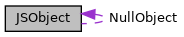

[Public Types](#pub-types) \| [Public Member Functions](#pub-methods) \| [Static Public Member Functions](#pub-static-methods) \| [Protected Member Functions](#pro-methods) \| [Protected Attributes](#pro-attribs) \| [Static Protected Attributes](#pro-static-attribs)

`#include <`<a href="ipc_2src_2ipc_2jsobject_8h_source.md">jsobject.h</a>`>`

Collaboration diagram for JSObject:

\[<a href="graph_legend.md">legend</a>\]

|  |  |
|----|----|
| Public Types |  |
| enum   | [JSType](#ab828a4e860944557526a55ef30823ccd) {   [JSTNull](#ab828a4e860944557526a55ef30823ccdae47b4ba28511bbdb8e1db98068e50a16), [JSTBool](#ab828a4e860944557526a55ef30823ccdabadc4a21481c8b0656a97c442293bd2c), [JSTString](#ab828a4e860944557526a55ef30823ccda5c60bc073f6e82886b81a2a790c9e78a), [JSTInt](#ab828a4e860944557526a55ef30823ccda5844cd46a83be94bdb694e55769d29f4),   [JSTFloat](#ab828a4e860944557526a55ef30823ccda16e8558c7dc0deb8bf97cef6c1f93ac6), [JSTObject](#ab828a4e860944557526a55ef30823ccda4b128017db424c13b089fb79be0194f4), [JSTArray](#ab828a4e860944557526a55ef30823ccdaf7f7068d38f3df9830e13ca7e1f46d9f) } |
| typedef std::map\< std::string, <a href="classvfiipc_1_1_j_s_object.md">JSObject</a> \>::[iterator](#a2461a07959327022e9902d864108d52a)  | [iterator](#a2461a07959327022e9902d864108d52a) |
| typedef std::map\< std::string, <a href="classvfiipc_1_1_j_s_object.md">JSObject</a> \>::[const_iterator](#acc0ff3bdd55907a8760ba4d75c76dbe9)  | [const_iterator](#acc0ff3bdd55907a8760ba4d75c76dbe9) |

|  |  |
|----|----|
| Public Member Functions |  |
|   | [JSObject](#a6f50f742d8c1061c3ba765bb66739786) () |
| [JSType](#ab828a4e860944557526a55ef30823ccd)  | [type](#afb0876c9b353dd9ff698f21b95d94f90) () const |
| bool  | [isNull](#abada6dfb33f4cbafe1e443a5cf8dc8d0) () const |
| bool  | [isBool](#a0da75049a5cbd55b8b4993a21faa3e92) () const |
| bool  | [isString](#abc9dc0708ec1aae2309621664fa8e5a4) () const |
| bool  | [isNumber](#a1680baf2428512b1a45060f52f3ade28) () const |
| bool  | [isObject](#a13b605b2c9876ab317e21637b8646def) () const |
| bool  | [isArray](#aefe7cc24045c3560d7550ba662375ce4) () const |
| std::string  | [getString](#a23bdc20544ca28878b1ffea144ac2730) () const |
| std::string  | [getString](#a6f6f9bb51deef63755570065719f2397) (const char \*defaultval) const |
| const std::string \*  | [getStringP](#a10edaf0aeadea3f07327ed46c2af5b29) () const |
| std::string \*  | [getStringP](#a93449dcbdf948b5914b5ac97e92051d7) () |
| double  | [getNumber](#ae13f760a4b1aefdc15749b6bad43c94b) () const |
| long  | [getInt](#ad92f7d678ccdce0556cf713e622247df) () const |
| long long  | [getInt64](#a77739d2eeb6bd9069ba1065e5e9abf09) () const |
| bool  | [getBool](#a56e70a2d753746f23f8bfb677a030086) () const |
|   | [operator bool](#a67b76affb3b5d35fa419ac234144038b) () const |
|   | [operator std::string](#a3888dcd59dd5acd1ca5b9bee4c2e252a) () const |
|   | [operator char](#a561b4a60cc640710c3b9220d692de07d) () const |
|   | [operator unsigned char](#a891f3d5b152d0bd0b8bc27726d45a491) () const |
|   | [operator short](#a11840cd2d3ee7968aaf9b04a0af3bec0) () const |
|   | [operator unsigned short](#a6207df99f12600860d669651bdef19a2) () const |
|   | [operator int](#a48d27bd92e68c69527589ea65a9af69f) () const |
|   | [operator unsigned](#a7fa77e07b31af13679aa65b9cd60e548) () const |
|   | [operator long](#ad7ce59321a0dd63e7f1fab6dceabe53b) () const |
|   | [operator unsigned long](#acafb5c7caec25508a24cb4800beb18f9) () const |
|   | [operator long long](#aa83077b8f499dae99948d972af2dc8c6) () const |
|   | [operator unsigned long long](#a3a81249f06665fa9c35153447216b96d) () const |
|   | [operator float](#abc4ec9f715112697477f2f425122ce21) () const |
|   | [operator double](#a3c5a46ebe31a3699f441668931f2978e) () const |
| void  | [clear](#ac8bb3912a3ce86b15842e79d0b421204) () |
| <a href="classvfiipc_1_1_j_s_object.md">JSObject</a> &  | [operator=](#a43459568fdb12f82e584b913c8d1e5de) (bool val) |
| <a href="classvfiipc_1_1_j_s_object.md">JSObject</a> &  | [operator=](#a4aa66b0ffe1e8cb65f93f9351b619a4e) (char \*val) |
| <a href="classvfiipc_1_1_j_s_object.md">JSObject</a> &  | [operator=](#a6f1f3e207dd40bdf36c020646365fbe1) (const char \*val) |
| <a href="classvfiipc_1_1_j_s_object.md">JSObject</a> &  | [operator=](#a4002743e58ba79ea8ee76608c232879a) (const std::string &val) |
| <a href="classvfiipc_1_1_j_s_object.md">JSObject</a> &  | [operator=](#a9a01f4e696108a2417a609acc5fe0774) (double val) |
| <a href="classvfiipc_1_1_j_s_object.md">JSObject</a> &  | [operator=](#a089e5cdce4247bda2d13d6dc9bccc927) (float val) |
| <a href="classvfiipc_1_1_j_s_object.md">JSObject</a> &  | [operator=](#a0449adc6bd1cb61f5b391ba96952eeb3) (long long val) |
| <a href="classvfiipc_1_1_j_s_object.md">JSObject</a> &  | [operator=](#aad0b987d7bf9eb161d82b48c6e8cb42d) (unsigned long long val) |
| template\<typename T \> |  |
| <a href="classvfiipc_1_1_j_s_object.md">JSObject</a> &  | [operator=](#a902193b21078f3dd232d3f59dee932e1) (T val) |
| bool  | [exists](#aa4ea356b09aecedf90ac050e63244569) (const char \*elem) const |
| bool  | [exists](#a2614ad8ed799aa08eaf6cea3a4dd049b) (const std::string &elem) const |
| void  | [erase](#a552d9cee9942f9a9bfaa70fccfc0cd7f) (const char \*elem) |
| void  | [erase](#a70155eead834a4ae28044fd0ecc1b770) (const std::string &elem) |
| <a href="classvfiipc_1_1_j_s_object.md">JSObject</a> &  | [operator()](#a63ecdacd09dde22fe5e9e714797e0e48) (const char \*elem) |
| const <a href="classvfiipc_1_1_j_s_object.md">JSObject</a> &  | [operator()](#aac02c77f75e6b5286a7586f123b8be04) (const char \*elem) const |
| <a href="classvfiipc_1_1_j_s_object.md">JSObject</a> &  | [operator()](#a588f2beb383a3d21a5d3496bf4229fc1) (const std::string &elem) |
| const <a href="classvfiipc_1_1_j_s_object.md">JSObject</a> &  | [operator()](#a14a2d8ec267172a2041d0e1dacfc3477) (const std::string &elem) const |
| <a href="classvfiipc_1_1_j_s_object.md">JSObject</a> &  | [operator\[\]](#a8451ee98a6e574b789704f17607f58c3) (int idx) |
| const <a href="classvfiipc_1_1_j_s_object.md">JSObject</a> &  | [operator\[\]](#a5aa712ae49eab08fd8627a34844280e8) (int idx) const |
| unsigned  | [size](#a126a73e6d140f9e2a7b795c20fa42f70) () const |
| void  | [resize](#acfb8c37cf59bd178bd65f8a0b79ddb23) (unsigned new_size) |
| [iterator](#a2461a07959327022e9902d864108d52a)  | [begin](#ad69bd11391be1a1dba5c8202259664f8) () |
| [iterator](#a2461a07959327022e9902d864108d52a)  | [end](#acad38d52497a975bfb6f2f6acd76631f) () |
| [const_iterator](#acc0ff3bdd55907a8760ba4d75c76dbe9)  | [begin](#a29305669b60ca1680752e2fc3592ba99) () const |
| [const_iterator](#acc0ff3bdd55907a8760ba4d75c76dbe9)  | [end](#accf9a4bd0c34d4a5f6a7dab66ea10cdc) () const |
| bool  | [load](#a5dc8013bd6fdf9ccb6104890a00094ab) (const std::string &s) |
| std::string  | [dump](#a7de861082da81700dd1481385268c4ff) () const |
| void  | [dump](#af6c3be6bee9fde34c52d760c53ee8d1a) (std::string &s) const |
| void  | [swap](#ab75690d8a8f33b103b5eade8cad28fcb) (<a href="classvfiipc_1_1_j_s_object.md">JSObject</a> &o) |
| std::string  | [logdump](#ab63bf59be55ae542e947b74e540beb1a) (bool(\*filter_cb)(const std::string &key)) const |
| void  | [prettyDump](#aaefb0c5c8394d84951a799c4a324366a) (std::string &s) const |

|  |  |
|----|----|
| Static Public Member Functions |  |
| static const char \*  | [getVersion](#add90ed6ce299e1afd9cf2ddf23e3b722) () |

|  |  |
|----|----|
| Protected Member Functions |  |
| int  | [parse](#af76852f0ba85b4b1f82963010fe69a9d) (const char \*s) |
| int  | [parse](#acb76ac639a09bb9e344db7941630cff6) (const char \*s, unsigned nestinglevel) |
| void  | [dump](#a535976112a5480b2957b0030cff36b68) (std::string &s, bool(\*filter_cb)(const std::string &key)) const |
| void  | [prettyDump](#ab0b7ca083f44a96cb892aff6067d295b) (std::string &out, int indent) const |

|  |  |
|----|----|
| Protected Attributes |  |
| [JSType](#ab828a4e860944557526a55ef30823ccd)  | [v_type](#aad536a3a1237a4b46786904773932208) |
| bool  | [v_bool](#a020ed6eb37682aee4ae3f1e4bcb6b8c5) |
| std::string  | [v_string](#a09d8b873d54daf98b453a6f7dc665424) |
| double  | [v_floatnum](#a7ec7bd12b4d230930939f0fb455a834c) |
| long  | [v_intnum](#a89df9086666890ff4dd4d0e2cbbb138f) |
| std::map\< std::string, <a href="classvfiipc_1_1_j_s_object.md">JSObject</a> \>  | [v_object](#af2e996a867e112c27c632ccfe3aa6dcd) |
| std::vector\< <a href="classvfiipc_1_1_j_s_object.md">JSObject</a> \>  | [v_array](#aacdee8498c2df06e73afbe615b305b0a) |

|  |  |
|----|----|
| Static Protected Attributes |  |
| static <a href="classvfiipc_1_1_j_s_object.md">JSObject</a>  | [NullObject](#a5bed94dbfa2edac2a0cdf1196e5e24c2) |

## DetailedDescription {#detailed-description}

class for reading / writing JSON data

### Examples

<a href="demo-sysinfo_8cpp-example.md#_a185">demo-sysinfo.cpp</a>, <a href="mac_demo1_8cpp-example.md#_a3">mac_demo1.cpp</a>, <a href="mac_demo2_8cpp-example.md#_a2">mac_demo2.cpp</a>, <a href="mac_demo3_8cpp-example.md#_a1">mac_demo3.cpp</a>, and <a href="pm-demo_8cpp-example.md#_a7">pm-demo.cpp</a>.

## MemberTypedef Documentation {#member-typedef-documentation}

## const_iterator 

typedef std::map\<std::string,<a href="classvfiipc_1_1_j_s_object.md">JSObject</a>\>::[const_iterator](#acc0ff3bdd55907a8760ba4d75c76dbe9) [const_iterator](#acc0ff3bdd55907a8760ba4d75c76dbe9)

## iterator 

typedef std::map\<std::string,<a href="classvfiipc_1_1_j_s_object.md">JSObject</a>\>::[iterator](#a2461a07959327022e9902d864108d52a) [iterator](#a2461a07959327022e9902d864108d52a)

iterator type for iterating over the direct members of an object, the iterator type has two members:

- first name of the member
- second content of the member

## MemberEnumeration Documentation {#member-enumeration-documentation}

## JSType 

enum [JSType](#ab828a4e860944557526a55ef30823ccd)

type of the contained data element

| Enumerator |                                                      |
|------------|------------------------------------------------------|
| JSTNull    | 
null (empty object)
         |
| JSTBool    | 
boolean value
               |
| JSTString  | 
string value
                |
| JSTInt     | 
integer value 
 |
| JSTFloat   | 
float value
                 |
| JSTObject  | 
object value
                |
| JSTArray   | 
array value
                 |

## Constructor& Destructor Documentation

## JSObject() 

<a href="classvfiipc_1_1_j_s_object.md">JSObject</a>

inline

constructor, creates an empty object

## MemberFunction Documentation {#member-function-documentation}

## begin()\[1/2\]  {#begin-12}

[iterator](#a2461a07959327022e9902d864108d52a) begin

inline

### Returns

iterator for beginning of members

## begin()\[2/2\]  {#begin-22}

[const_iterator](#acc0ff3bdd55907a8760ba4d75c76dbe9) begin

inline

### Returns

iterator for beginning of members

## clear() 

void clear

inline

reset value to null (empty object)

## dump()\[1/3\]  {#dump-13}

std::string dump

export data as JSON encoded string

### Returns

exported data

## dump()\[2/3\]  {#dump-23}

void dump

export data as JSON encoded string and append to provided string

**Parameters**

\[out\] **s** exported data is appended to this string

## dump()\[3/3\]  {#dump-33}

void dump

protected

### Examples

<a href="mac_demo1_8cpp-example.md#a33">mac_demo1.cpp</a>, <a href="mac_demo2_8cpp-example.md#a13">mac_demo2.cpp</a>, <a href="mac_demo3_8cpp-example.md#a6">mac_demo3.cpp</a>, and <a href="pm-demo_8cpp-example.md#a57">pm-demo.cpp</a>.

## end()\[1/2\]  {#end-12}

[iterator](#a2461a07959327022e9902d864108d52a) end

inline

### Returns

iterator for end of members

## end()\[2/2\]  {#end-22}

[const_iterator](#acc0ff3bdd55907a8760ba4d75c76dbe9) end

inline

### Returns

iterator for end of members

## erase()\[1/2\]  {#erase-12}

void erase

remove element from object

## erase()\[2/2\]  {#erase-22}

void erase

remove element from object

## exists()\[1/2\]  {#exists-12}

bool exists

check if this object has a member *elem*

**Parameters**

\[in\] **elem** member to test for

### Returns

true if the object has the named member

## exists()\[2/2\]  {#exists-22}

bool exists

check if this object has a member *elem*

**Parameters**

\[in\] **elem** member to test for

### Returns

true if the object has the named member

## getBool() 

bool getBool

### Returns

obtain value as boolean, conversion is applied if required

## getInt() 

long getInt

### Returns

obtain value as integer, conversion is applied if required

## getInt64() 

long long getInt64

### Returns

obtain value as 64 bit integer, conversion is applied if required

## getNumber() 

double getNumber

### Returns

obtain value as number, conversion is applied if required

## getString()\[1/2\]  {#getstring-12}

std::string getString

### Returns

obtain value as string, conversion is applied if required

### Examples

<a href="mac_demo1_8cpp-example.md#a67">mac_demo1.cpp</a>.

## getString()\[2/2\]  {#getstring-22}

std::string getString

inline

### Returns

obtain value as string, return *defaultval*, if object is null

## getStringP()\[1/2\]  {#getstringp-12}

std::string\* getStringP

Obtain content of string without copying the data

### Returns

pointer to string if value is of type string, else NULL


The pointer stays valid until the <a href="classvfiipc_1_1_j_s_object.md">JSObject</a> is modified or released


## getStringP()\[2/2\]  {#getstringp-22}

const std::string\* getStringP

Obtain content of string without copying the data

### Returns

pointer to string if value is of type string, else NULL


The pointer stays valid until the <a href="classvfiipc_1_1_j_s_object.md">JSObject</a> is modified or released


## getVersion() 

static const char\* getVersion

static

returns a zero-terminated string with version and build information of libvfijson

### Returns

version string

## isArray() 

bool isArray

inline

check type for array

### Returns

true if type is JSTArray

### Examples

<a href="demo-sysinfo_8cpp-example.md#a224">demo-sysinfo.cpp</a>.

## isBool() 

bool isBool

inline

check type for boolean

### Returns

true if type is JSTBool

## isNull() 

bool isNull

inline

check type for null

### Returns

true if type is JSTNull

## isNumber() 

bool isNumber

inline

check type for number

### Returns

true if type is JSTInt or JSTFloat

## isObject() 

bool isObject

inline

check type for object

### Returns

true if type is JSTObject

### Examples

<a href="demo-sysinfo_8cpp-example.md#a223">demo-sysinfo.cpp</a>.

## isString() 

bool isString

inline

check type for string

### Returns

true if type is JSTString

## load() 

bool load

inline

import JSON encoded string

**Parameters**

\[in\] **s** string to be imported

### Returns

true if import was successful, false if an error occurred

### Examples

<a href="demo-sysinfo_8cpp-example.md#a222">demo-sysinfo.cpp</a>.

## logdump() 

std::string logdump

export data as JSON string for logging

**Parameters**

\[in\] **filter_cb** filter callback function. The callback is invoked with the name of the JSON member. If the callback returns true, the value is replaced by \"\<\<HIDDEN\>\>\"

### Returns

data for logging

## operatorbool()  {#operator-bool}

operator bool

inline

### Returns

obtain value as boolean, conversion is applied if required

## operatorchar()  {#operator-char}

operator char

inline

### Returns

obtain value as char, conversion is applied if required

## operatordouble()  {#operator-double}

operator double

inline

### Returns

obtain value as double, conversion is applied if required

## operatorfloat()  {#operator-float}

operator float

inline

### Returns

obtain value as float, conversion is applied if required

## operatorint()  {#operator-int}

operator int

inline

### Returns

obtain value as integer, conversion is applied if required

## operatorlong()  {#operator-long}

operator long

inline

### Returns

obtain value as long, conversion is applied if required

## operatorlong long()  {#operator-long-long}

operator long long

inline

### Returns

obtain value as long long, conversion is applied if required

## operatorshort()  {#operator-short}

operator short

inline

### Returns

obtain value as short, conversion is applied if required

## operatorstd::string()  {#operator-stdstring}

operator std::string

inline

### Returns

obtain value as string, conversion is applied if required

## operatorunsigned()  {#operator-unsigned}

operator unsigned

inline

### Returns

obtain value as unsigned, conversion is applied if required

## operatorunsigned char()  {#operator-unsigned-char}

operator unsigned char

inline

### Returns

obtain value as unsigned char, conversion is applied if required

## operatorunsigned long()  {#operator-unsigned-long}

operator unsigned long

inline

### Returns

obtain value as unsigned long, conversion is applied if required

## operatorunsigned long long()  {#operator-unsigned-long-long}

operator unsigned long long

inline

### Returns

obtain value as unsigned long long, conversion is applied if required

## operatorunsigned short()  {#operator-unsigned-short}

operator unsigned short

inline

### Returns

obtain value as unsigned short, conversion is applied if required

## operator()()\[1/4\]  {#operator-14}

<a href="classvfiipc_1_1_j_s_object.md">JSObject</a>& operator()

access the member *elem* of this object. If the member does not exist, it is created

**Parameters**

\[in\] **elem** member to access

### Returns

reference to the accessed member.

## operator()()\[2/4\]  {#operator-24}

const <a href="classvfiipc_1_1_j_s_object.md">JSObject</a>& operator()

access the member *elem* of this object.

**Parameters**

\[in\] **elem** member to access

### Returns

reference to the accessed member or reference to null object if the member does not exist

## operator()()\[3/4\]  {#operator-34}

<a href="classvfiipc_1_1_j_s_object.md">JSObject</a>& operator()

access the member *elem* of this object. If the member does not exist, it is created

**Parameters**

\[in\] **elem** member to access

### Returns

reference to the accessed member.

## operator()()\[4/4\]  {#operator-44}

const <a href="classvfiipc_1_1_j_s_object.md">JSObject</a>& operator()

access the member *elem* of this object.

**Parameters**

\[in\] **elem** member to access

### Returns

reference to the accessed member or reference to null object if the member does not exist

## operator=()\[1/9\]  {#operator-19}

<a href="classvfiipc_1_1_j_s_object.md">JSObject</a>& operator=

inline

assingment operator

### Returns

reference to current object

## operator=()\[2/9\]  {#operator-29}

<a href="classvfiipc_1_1_j_s_object.md">JSObject</a>& operator=

inline

assingment operator

### Returns

reference to current object

## operator=()\[3/9\]  {#operator-39}

<a href="classvfiipc_1_1_j_s_object.md">JSObject</a>& operator=

inline

assingment operator

### Returns

reference to current object

## operator=()\[4/9\]  {#operator-49}

<a href="classvfiipc_1_1_j_s_object.md">JSObject</a>& operator=

inline

assingment operator

### Returns

reference to current object

## operator=()\[5/9\]  {#operator-59}

<a href="classvfiipc_1_1_j_s_object.md">JSObject</a>& operator=

inline

assingment operator

### Returns

reference to current object

## operator=()\[6/9\]  {#operator-69}

<a href="classvfiipc_1_1_j_s_object.md">JSObject</a>& operator=

inline

assingment operator

### Returns

reference to current object

## operator=()\[7/9\]  {#operator-79}

<a href="classvfiipc_1_1_j_s_object.md">JSObject</a>& operator=

inline

assingment operator

### Returns

reference to current object

## operator=()\[8/9\]  {#operator-89}

<a href="classvfiipc_1_1_j_s_object.md">JSObject</a>& operator=

inline

assingment operator

### Returns

reference to current object

## operator=()\[9/9\]  {#operator-99}

<a href="classvfiipc_1_1_j_s_object.md">JSObject</a>& operator=

inline

assingment operator

### Returns

reference to current object

## operator\[\]()\[1/2\]  {#operator-12}

<a href="classvfiipc_1_1_j_s_object.md">JSObject</a>& operator\[\]

access the array entry with index *idx*, the array is resized if required.

**Parameters**

\[in\] **idx** array index

### Returns

reference to the element in the array or reference to null object if idx\<0

## operator\[\]()\[2/2\]  {#operator-22}

const <a href="classvfiipc_1_1_j_s_object.md">JSObject</a>& operator\[\]

access the array entry with index *idx*

**Parameters**

\[in\] **idx** array index

### Returns

reference to the element in the array or reference to null object if idx out of range

## parse()\[1/2\]  {#parse-12}

int parse

protected

## parse()\[2/2\]  {#parse-22}

int parse

protected

## prettyDump()\[1/2\]  {#prettydump-12}

void prettyDump

protected

## prettyDump()\[2/2\]  {#prettydump-22}

void prettyDump

export data as JSON encoded string formatted for easy reading by humans

**Parameters**

\[out\] **s** exported data is appended to this string

## resize() 

void resize

resize array

**Parameters**

\[in\] **new_size** new size


If the object is not an array, it is cleared and then converted to array


## size() 

unsigned size

inline

determine size of an array

### Returns

size of the array. For non-arrays 0 is returned

### Examples

<a href="demo-sysinfo_8cpp-example.md#a225">demo-sysinfo.cpp</a>.

## swap() 

void swap

swap content with other object

**Parameters**

\[in,out\] **o** other object

## type() 

[JSType](#ab828a4e860944557526a55ef30823ccd) type

inline

read type

### Returns

type

## FieldDocumentation {#field-documentation}

## NullObject 

<a href="classvfiipc_1_1_j_s_object.md">JSObject</a> NullObject

staticprotected

## v_array 

std::vector\<<a href="classvfiipc_1_1_j_s_object.md">JSObject</a>\> v_array

protected

## v_bool 

bool v_bool

protected

## v_floatnum 

double v_floatnum

protected

## v_intnum 

long v_intnum

protected

## v_object 

std::map\<std::string,<a href="classvfiipc_1_1_j_s_object.md">JSObject</a>\> v_object

protected

## v_string 

std::string v_string

protected

## v_type 

[JSType](#ab828a4e860944557526a55ef30823ccd) v_type

protected

------------------------------------------------------------------------

The documentation for this class was generated from the following file:

- ipc/src/ipc/<a href="ipc_2src_2ipc_2jsobject_8h_source.md">jsobject.h</a>
