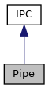

[Public Types](#pub-types) \| [Public Member Functions](#pub-methods)

`#include <`<a href="ipc_8h_source.md">ipc.h</a>`>`

Inheritance diagram for Pipe:

\[<a href="graph_legend.md">legend</a>\]

Collaboration diagram for Pipe:

\[<a href="graph_legend.md">legend</a>\]

|  |  |
|----|----|
| Public Types |  |
| enum   | [PipeConfig](#a892ce29b9c853749e7c4551f44fe2603) { [PC_None](#a892ce29b9c853749e7c4551f44fe2603a5e329e902a710243361d9b592c2db2f3) =0, [PC_EnableCredentials](#a892ce29b9c853749e7c4551f44fe2603a5f770eff268e3423ae7f928a3819e9cf) =1 } |

|  |  |
|----|----|
| Public Member Functions |  |
|   | [Pipe](#a7f52bc182c1b34d2394c2bce2ebaa7ee) () |
|   | [Pipe](#adf594aa0b9ee61ae3de72ac122dbd052) (int config) |
|   | [\~Pipe](#a7333d6adde6f99ef81d4db7a640805e7) () |
| bool  | [connect](#a120d2f1c13062e416c1d19b82da84a29) (const char \*pipe) |
| bool  | [listen](#a29ad40613be45421828668eb96335a0c) (const char \*pipe) |
| <a href="classvfiipc_1_1_i_p_c.md">IPC</a> \*  | [accept](#a95b94113c8b49766182f98a1b5ed14fe) (int timeout_msec=-1) |
| void  | [close](#a5ae591df94fc66ccb85cbb6565368bca) () |
|  Public Member Functions inherited from <a href="classvfiipc_1_1_i_p_c.md">IPC</a> |  |
| virtual  | <a href="classvfiipc_1_1_i_p_c.md#a2de5cc01b541095acf2fa6d8f1efcefd">~IPC</a> () |
| virtual bool  | <a href="classvfiipc_1_1_i_p_c.md#a044713f1fcbdbec24aae467186a95481">eof</a> () |
| virtual bool  | <a href="classvfiipc_1_1_i_p_c.md#a090dfa7806330da64843832e3985ebdf">error</a> () |
| virtual bool  | <a href="classvfiipc_1_1_i_p_c.md#a04f753a2a5691e2d36266e2ff084a217">write</a> (const void \*data, int size) |
| virtual int  | <a href="classvfiipc_1_1_i_p_c.md#aa04744c17ae9eec2b37fb8c476a8c62d">read</a> (void \*data, int maxsize, int timeout_msec, int timeout_msec2) |
| virtual int  | <a href="classvfiipc_1_1_i_p_c.md#a69117eaa93a4a8bff9cb28df51abc50b">read</a> (void \*data, int maxsize, int timeout_msec=-1) |
| int  | <a href="classvfiipc_1_1_i_p_c.md#abe719544c505e175fe68e0c616f9742d">peek</a> (void \*data, int maxsize, int timeout_msec=-1) |
| virtual bool  | <a href="classvfiipc_1_1_i_p_c.md#aa847963eee355eaa6d9054510fb66b65">write_msg</a> (unsigned prefix, int msg_id, const void \*msg, int size) |
| virtual bool  | <a href="classvfiipc_1_1_i_p_c.md#adf0117598edfaf3ed682337421457956">write_msg</a> (unsigned prefix, int msg_id, const std::vector\< unsigned char \> &msg) |
| virtual bool  | <a href="classvfiipc_1_1_i_p_c.md#a0e36d031eb96fa532e70d99dd6454864">write_msg</a> (unsigned prefix, int msg_id, const std::vector\< char \> &msg) |
| virtual bool  | <a href="classvfiipc_1_1_i_p_c.md#a5fc3e8a54237502339f9483465730704">read_msg</a> (unsigned prefix, int &msg_id, std::vector\< unsigned char \> &msg, int size_limit, int timeout_msec=-1) |
| virtual bool  | <a href="classvfiipc_1_1_i_p_c.md#af9b26f735493cab66dbb7bbffe6d2190">read_msg</a> (unsigned prefix, int &msg_id, std::vector\< char \> &msg, int size_limit, int timeout_msec=-1) |
| virtual bool  | <a href="classvfiipc_1_1_i_p_c.md#aae3d66ed5454894b1ace225e51de8674">poll_in</a> (int timeout_msec=-1) |
| virtual const char \*  | <a href="classvfiipc_1_1_i_p_c.md#af5c43ffa916e2d7662a667b33646493a">remote_addr</a> () const |
| int  | <a href="classvfiipc_1_1_i_p_c.md#a2da953859d766be3eb7a8409fc9a6b02">getFD</a> () const |
| virtual bool  | <a href="classvfiipc_1_1_i_p_c.md#aa73e8080bdf5412792220bbb47cd2f4d">set_callback</a> (<a href="namespacevfiipc.md#ad81e4165dd387a02aacdb8a57c4fdd4f">ipcCallback</a> cb, void \*data=0) |
| virtual bool  | <a href="classvfiipc_1_1_i_p_c.md#aa3ade24ef1ee0c1c277e735e10288bea">write_msg</a> (unsigned prefix, int msg_id, const std::string &msg) |
| virtual bool  | <a href="classvfiipc_1_1_i_p_c.md#a12475d631dd0313083d53b72d007a07a">read_msg</a> (unsigned prefix, int &msg_id, std::string &msg, int size_limit, int timeout_msec=-1) |
| virtual bool  | <a href="classvfiipc_1_1_i_p_c.md#acdfdf57c1c76dcccb680e6dabdfdf59e">is_server</a> () |
| virtual const char \*  | <a href="classvfiipc_1_1_i_p_c.md#aa992c5725a59c6d865dc28415862eb1e">local_addr</a> () const |

|  |  |
|----|----|
| Additional Inherited Members |  |
|  Static Public Member Functions inherited from <a href="classvfiipc_1_1_i_p_c.md">IPC</a> |  |
| static <a href="libseccmd-comp_8h.md#ac1e8a42306d8e67cb94ca31c3956ee78">DEPRECATED</a> void  | <a href="classvfiipc_1_1_i_p_c.md#a78d252e52f513e6ddfb13d8e4a5ebb6d">set_callback_stacksize</a> (int size=-1) |
| static const char \*  | <a href="classvfiipc_1_1_i_p_c.md#add90ed6ce299e1afd9cf2ddf23e3b722">getVersion</a> () |
| static const char \*  | <a href="classvfiipc_1_1_i_p_c.md#adbb74a0c7649adcd2699a37099e67407">ipc_GetVersion</a> () |
|  Protected Member Functions inherited from <a href="classvfiipc_1_1_i_p_c.md">IPC</a> |  |
|   | <a href="classvfiipc_1_1_i_p_c.md#a8ad54b08db43652b4d971a7ae17e1634">IPC</a> (IpcPrivate \*\_d) |
| virtual bool  | <a href="classvfiipc_1_1_i_p_c.md#a566bc069efbaf8b7c6d7639cf6a0a7ea">read_msg</a> (unsigned prefix, int &msg_id, IpcBuffer &msg, int size_limit, int timeout_msec=-1) |
|  Protected Attributes inherited from <a href="classvfiipc_1_1_i_p_c.md">IPC</a> |  |
| IpcPrivate \*  | <a href="classvfiipc_1_1_i_p_c.md#a40526579f289c2f9a91bde432367b54b">d</a> |

## DetailedDescription {#detailed-description}

class for inter process communication via named pipes

## MemberEnumeration Documentation {#member-enumeration-documentation}

## PipeConfig 

enum [PipeConfig](#a892ce29b9c853749e7c4551f44fe2603)

<a href="classvfiipc_1_1_pipe.md">Pipe</a> configuration options (bit mask)

| Enumerator |  |
|----|----|
| PC_None  | 
no configuration
 |
| PC_EnableCredentials  | 
deprecated (just for compatibility reasons)
 |

## Constructor& Destructor Documentation

## Pipe()\[1/2\]  {#pipe-12}

<a href="classvfiipc_1_1_pipe.md">Pipe</a>

default constructor, equals config constructor Pipe(::PC_None)

## Pipe()\[2/2\]  {#pipe-22}

<a href="classvfiipc_1_1_pipe.md">Pipe</a>

config constructor

## \~Pipe() 

\~<a href="classvfiipc_1_1_pipe.md">Pipe</a>

destructor

## MemberFunction Documentation {#member-function-documentation}

## accept() 

<a href="classvfiipc_1_1_i_p_c.md">IPC</a>\* accept

virtual

accepts the first connection on the queue of pending connections on the listen pipe. Please note that [accept()](#a95b94113c8b49766182f98a1b5ed14fe) only works for <a href="classvfiipc_1_1_i_p_c.md">IPC</a> object in server mode (see [Pipe::listen()](#a29ad40613be45421828668eb96335a0c)). If an incoming connection has been accepted a pointer to an object to this connection is returned that has been allocated using new. The caller takes over ownership for this object and if it is not needed any longer it must be released using delete.

**Parameters**

\[in\] **timeout_msec** timeout to wait for a new connection in milliseconds. A negative timeout means wait forever.

### Returns

pointer to a new <a href="classvfiipc_1_1_i_p_c.md">IPC</a> object on success, else NULL in case of timeout or error

Reimplemented from <a href="classvfiipc_1_1_i_p_c.md#ad05fb9ec7fd0b49be32e902bf5f485cd">IPC</a>.

## close() 

void close

virtual

closes the session and all pipe handles for this object

Reimplemented from <a href="classvfiipc_1_1_i_p_c.md#a47feccb1873356363e4d0e302bc3822c">IPC</a>.

## connect() 

bool connect

initiate a connection to an <a href="classvfiipc_1_1_i_p_c.md">IPC</a> server via a named pipe

**Parameters**

\[in\] **pipe** name of the pipe, which the server has opened before with Pipe::listen()

### Returns

true in case that connection was established successfully, else false

## listen() 

bool listen

creates a named pipe for server mode to listen and accept new incomming connections with [Pipe::accept()](#a95b94113c8b49766182f98a1b5ed14fe).

**Parameters**

\[in\] **pipe** name of the pipe used for the listening

### Returns

true in case that the listen pipe was created successfully, else false

------------------------------------------------------------------------

The documentation for this class was generated from the following file:

- ipc/src/ipc/<a href="ipc_8h_source.md">ipc.h</a>
