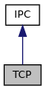

[Public Member Functions](#pub-methods)

`#include <`<a href="ipc_8h_source.md">ipc.h</a>`>`

Inheritance diagram for TCP:

\[<a href="graph_legend.md">legend</a>\]

Collaboration diagram for TCP:

\[<a href="graph_legend.md">legend</a>\]

|  |  |
|----|----|
| Public Member Functions |  |
|   | [TCP](#a5186565bb474c25238f9b3257dffaff1) () |
|   | [\~TCP](#a543db1715408b64b52b8ed52640c1145) () |
| bool  | [connect](#aad0f8976771a46b2b8e617b3cd152a5c) (const char \*hostname, unsigned short port, int timeout_msec=-1) |
| bool  | [listen](#ae4ffb5366b5b327f89b3b4624823e4c4) (unsigned short port, const char \*listen_address=0) |
| <a href="classvfiipc_1_1_i_p_c.md">IPC</a> \*  | [accept](#a95b94113c8b49766182f98a1b5ed14fe) (int timeout_msec=-1) |
| void  | [close](#a5ae591df94fc66ccb85cbb6565368bca) () |
| bool  | [setFD](#a20009b56850402ae67b25304a83d5845) (int socket_fd) |
| bool  | [setKeepalive](#a918896ee41acc286142a52dec7fa26be) (int cnt, int interval) |
|  Public Member Functions inherited from <a href="classvfiipc_1_1_i_p_c.md">IPC</a> |  |
| virtual  | <a href="classvfiipc_1_1_i_p_c.md#a2de5cc01b541095acf2fa6d8f1efcefd">~IPC</a> () |
| virtual bool  | <a href="classvfiipc_1_1_i_p_c.md#a044713f1fcbdbec24aae467186a95481">eof</a> () |
| virtual bool  | <a href="classvfiipc_1_1_i_p_c.md#a090dfa7806330da64843832e3985ebdf">error</a> () |
| virtual bool  | <a href="classvfiipc_1_1_i_p_c.md#a04f753a2a5691e2d36266e2ff084a217">write</a> (const void \*data, int size) |
| virtual int  | <a href="classvfiipc_1_1_i_p_c.md#aa04744c17ae9eec2b37fb8c476a8c62d">read</a> (void \*data, int maxsize, int timeout_msec, int timeout_msec2) |
| virtual int  | <a href="classvfiipc_1_1_i_p_c.md#a69117eaa93a4a8bff9cb28df51abc50b">read</a> (void \*data, int maxsize, int timeout_msec=-1) |
| int  | <a href="classvfiipc_1_1_i_p_c.md#abe719544c505e175fe68e0c616f9742d">peek</a> (void \*data, int maxsize, int timeout_msec=-1) |
| virtual bool  | <a href="classvfiipc_1_1_i_p_c.md#aa847963eee355eaa6d9054510fb66b65">write_msg</a> (unsigned prefix, int msg_id, const void \*msg, int size) |
| virtual bool  | <a href="classvfiipc_1_1_i_p_c.md#adf0117598edfaf3ed682337421457956">write_msg</a> (unsigned prefix, int msg_id, const std::vector\< unsigned char \> &msg) |
| virtual bool  | <a href="classvfiipc_1_1_i_p_c.md#a0e36d031eb96fa532e70d99dd6454864">write_msg</a> (unsigned prefix, int msg_id, const std::vector\< char \> &msg) |
| virtual bool  | <a href="classvfiipc_1_1_i_p_c.md#a5fc3e8a54237502339f9483465730704">read_msg</a> (unsigned prefix, int &msg_id, std::vector\< unsigned char \> &msg, int size_limit, int timeout_msec=-1) |
| virtual bool  | <a href="classvfiipc_1_1_i_p_c.md#af9b26f735493cab66dbb7bbffe6d2190">read_msg</a> (unsigned prefix, int &msg_id, std::vector\< char \> &msg, int size_limit, int timeout_msec=-1) |
| virtual bool  | <a href="classvfiipc_1_1_i_p_c.md#aae3d66ed5454894b1ace225e51de8674">poll_in</a> (int timeout_msec=-1) |
| virtual const char \*  | <a href="classvfiipc_1_1_i_p_c.md#af5c43ffa916e2d7662a667b33646493a">remote_addr</a> () const |
| int  | <a href="classvfiipc_1_1_i_p_c.md#a2da953859d766be3eb7a8409fc9a6b02">getFD</a> () const |
| virtual bool  | <a href="classvfiipc_1_1_i_p_c.md#aa73e8080bdf5412792220bbb47cd2f4d">set_callback</a> (<a href="namespacevfiipc.md#ad81e4165dd387a02aacdb8a57c4fdd4f">ipcCallback</a> cb, void \*data=0) |
| virtual bool  | <a href="classvfiipc_1_1_i_p_c.md#aa3ade24ef1ee0c1c277e735e10288bea">write_msg</a> (unsigned prefix, int msg_id, const std::string &msg) |
| virtual bool  | <a href="classvfiipc_1_1_i_p_c.md#a12475d631dd0313083d53b72d007a07a">read_msg</a> (unsigned prefix, int &msg_id, std::string &msg, int size_limit, int timeout_msec=-1) |
| virtual bool  | <a href="classvfiipc_1_1_i_p_c.md#acdfdf57c1c76dcccb680e6dabdfdf59e">is_server</a> () |
| virtual const char \*  | <a href="classvfiipc_1_1_i_p_c.md#aa992c5725a59c6d865dc28415862eb1e">local_addr</a> () const |

|  |  |
|----|----|
| Additional Inherited Members |  |
|  Static Public Member Functions inherited from <a href="classvfiipc_1_1_i_p_c.md">IPC</a> |  |
| static <a href="libseccmd-comp_8h.md#ac1e8a42306d8e67cb94ca31c3956ee78">DEPRECATED</a> void  | <a href="classvfiipc_1_1_i_p_c.md#a78d252e52f513e6ddfb13d8e4a5ebb6d">set_callback_stacksize</a> (int size=-1) |
| static const char \*  | <a href="classvfiipc_1_1_i_p_c.md#add90ed6ce299e1afd9cf2ddf23e3b722">getVersion</a> () |
| static const char \*  | <a href="classvfiipc_1_1_i_p_c.md#adbb74a0c7649adcd2699a37099e67407">ipc_GetVersion</a> () |
|  Protected Member Functions inherited from <a href="classvfiipc_1_1_i_p_c.md">IPC</a> |  |
|   | <a href="classvfiipc_1_1_i_p_c.md#a8ad54b08db43652b4d971a7ae17e1634">IPC</a> (IpcPrivate \*\_d) |
| virtual bool  | <a href="classvfiipc_1_1_i_p_c.md#a566bc069efbaf8b7c6d7639cf6a0a7ea">read_msg</a> (unsigned prefix, int &msg_id, IpcBuffer &msg, int size_limit, int timeout_msec=-1) |
|  Protected Attributes inherited from <a href="classvfiipc_1_1_i_p_c.md">IPC</a> |  |
| IpcPrivate \*  | <a href="classvfiipc_1_1_i_p_c.md#a40526579f289c2f9a91bde432367b54b">d</a> |

## DetailedDescription {#detailed-description}

class for inter process communication via <a href="classvfiipc_1_1_t_c_p.md">TCP</a>

## Constructor& Destructor Documentation

## TCP() 

<a href="classvfiipc_1_1_t_c_p.md">TCP</a>

constructor

## \~TCP() 

\~<a href="classvfiipc_1_1_t_c_p.md">TCP</a>

destructor

## MemberFunction Documentation {#member-function-documentation}

## accept() 

<a href="classvfiipc_1_1_i_p_c.md">IPC</a>\* accept

virtual

accepts the first connection on the queue of pending connections on the listen <a href="classvfiipc_1_1_t_c_p.md">TCP</a> socket. Please note that [accept()](#a95b94113c8b49766182f98a1b5ed14fe) only works for <a href="classvfiipc_1_1_i_p_c.md">IPC</a> object in server mode (see [TCP::listen()](#ae4ffb5366b5b327f89b3b4624823e4c4)). If an incoming connection has been accepted a pointer to an object to this connection is returned that has been allocated using new. The caller takes over ownership for this object and if it is not needed any longer it must be released using delete.

**Parameters**

\[in\] **timeout_msec** timeout to wait for a new connection in milliseconds. A negative timeout means wait forever.

### Returns

pointer to a new <a href="classvfiipc_1_1_i_p_c.md">IPC</a> object on success, else NULL in case of timeout or error

Reimplemented from <a href="classvfiipc_1_1_i_p_c.md#ad05fb9ec7fd0b49be32e902bf5f485cd">IPC</a>.

## close() 

void close

virtual

closes the session and all <a href="classvfiipc_1_1_t_c_p.md">TCP</a> socket sockets for this object

Reimplemented from <a href="classvfiipc_1_1_i_p_c.md#a47feccb1873356363e4d0e302bc3822c">IPC</a>.

## connect() 

bool connect

initiate a connection to a remote <a href="classvfiipc_1_1_i_p_c.md">IPC</a> server via a <a href="classvfiipc_1_1_t_c_p.md">TCP</a> socket

**Parameters**

\[in\] **hostname** name or IP address of the destination host with an optional port number (\<name:port\> or \<\[IPV6\]:port\>) \[in\] **port** port of the destination host. If 0, get the port from hostname. \[in\] **timeout_msec** connect timeout in milliseconds. A negative timeout means using default OS timeout.

### Returns

true in case that connection was established successfully, else false


Providing two port numbers, one in *hostname* and one in *port* is not supported.


## listen() 

bool listen

creates a <a href="classvfiipc_1_1_t_c_p.md">TCP</a> listen socket for server mode to accept incomming connections with [TCP::accept()](#a95b94113c8b49766182f98a1b5ed14fe).

**Parameters**

\[in\] **port** port of the TCP listen socket. If port is 0, then the system chooses one, the application can determine it using local_addr(). \[in\] **listen_address** IP address of adapter that should be used to accept the connection Default listen_address=0 means acceptance of connections on all available adapters. Use \"127.0.0.1\" for local loopback device to avoid that external connections are accepted.

### Returns

true in case that the <a href="classvfiipc_1_1_t_c_p.md">TCP</a> listen socket was created successfully, else false

## setFD() 

bool setFD

Couples an external socket file descriptor to this <a href="classvfiipc_1_1_i_p_c.md">IPC</a> object. The socket should belong to an active connection.

**Parameters**

\[in\] **socket_fd** socket file descriptor

### Returns

true in case that socket was coupled successful else false


If this <a href="classvfiipc_1_1_i_p_c.md">IPC</a> object already is using another socket, the old socket is closed and *socket_fd* is used as new endpoint. Please note that this <a href="classvfiipc_1_1_i_p_c.md">IPC</a> object takes over the ownership of the socket and application MUST call <a href="classvfiipc_1_1_i_p_c.md#a47feccb1873356363e4d0e302bc3822c">IPC::close()</a> to close the socket. In addition, <a href="classvfiipc_1_1_i_p_c.md#af5c43ffa916e2d7662a667b33646493a">IPC::remote_addr()</a> will not provide any remote information for this <a href="classvfiipc_1_1_i_p_c.md">IPC</a> object (empty string), after IPC::setFD() was invoked.


## setKeepalive() 

bool setKeepalive

configure keepalives

**Parameters**

\[in\] **cnt** number of keepalive probes before dropping the connection. 0 disables keepalives \[in\] **interval** time in seconds between sending probes

### Returns

true in case of success, else false


Keepalives are only supported on Linux based platforms. It sets TCP_KEEPCNT=cnt, TCP_KEEPIDLE=TCP_KEEPINTVL=interval and TCP_USER_TIMEOUT=cnt\*interval\*1000.


------------------------------------------------------------------------

The documentation for this class was generated from the following file:

- ipc/src/ipc/<a href="ipc_8h_source.md">ipc.h</a>
