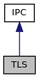

[Public Types](#pub-types) \| [Public Member Functions](#pub-methods) \| [Static Public Member Functions](#pub-static-methods) \| [Protected Member Functions](#pro-methods) \| [Friends](#friends)

`#include <`<a href="tls_8h_source.md">tls.h</a>`>`

Inheritance diagram for TLS:

\[<a href="graph_legend.md">legend</a>\]

Collaboration diagram for TLS:

\[<a href="graph_legend.md">legend</a>\]

|  |  |
|----|----|
| Public Types |  |
| enum   | [Error](#a2c3e4bb40f36b262a5214e2da2bca9c5) {   [OK](#a2c3e4bb40f36b262a5214e2da2bca9c5a2bc49ec37d6a5715dd23e85f1ff5bb59), [ERR_HOST](#a2c3e4bb40f36b262a5214e2da2bca9c5a49b4659ab34e5808bae4b43669ae5689), [ERR_PORT](#a2c3e4bb40f36b262a5214e2da2bca9c5ae2590a9116d0e64c0d011a7dddedb141), [ERR_SOCKET](#a2c3e4bb40f36b262a5214e2da2bca9c5a8e593677a42340431dde3c8c6a80cd7d),   [ERR_UNKNOWN_HOST](#a2c3e4bb40f36b262a5214e2da2bca9c5a95847da56fb6dea0be47b2b8126901ac), [ERR_CONNECT](#a2c3e4bb40f36b262a5214e2da2bca9c5a1680e220936ae0a13c6b5064cca769c8), [ERR_TIMEOUT](#a2c3e4bb40f36b262a5214e2da2bca9c5ac568baeb6407ef5e2630084ccbc34be8), [ERR_AUTHENTICATION](#a2c3e4bb40f36b262a5214e2da2bca9c5a7dd9a153fe10c7a21a2566e7ba44d73b),   [ERR_FAIL](#a2c3e4bb40f36b262a5214e2da2bca9c5a7c727caca2883143309d0d5a920e4da2) } |
| enum   | [CheckConfig](#ab7d7d4b3b6730f30ac858fcc375cb9b6) {   [IGNORE_NONE](#ab7d7d4b3b6730f30ac858fcc375cb9b6ad0f7243da8aa7c7d8ff1d3ec921a40b4) =0, [IGNORE_ALL](#ab7d7d4b3b6730f30ac858fcc375cb9b6af7c955e60a4be532c62453d5819f5d4a) =1, [IGNORE_SELF_SIGNED](#ab7d7d4b3b6730f30ac858fcc375cb9b6a97dbcc7e30dfa6fbcce9a076e7f3492b) =2, [IGNORE_EXPIRED](#ab7d7d4b3b6730f30ac858fcc375cb9b6a2c93c548857c53e82fe961012c93e6bb) =4,   [IGNORE_NOT_YET_VALID](#ab7d7d4b3b6730f30ac858fcc375cb9b6af36813f4d76dc80288696f7e57d181eb) =8, [IGNORE_HOSTNAME](#ab7d7d4b3b6730f30ac858fcc375cb9b6a7bcd1645552e9dd803c96280b7b1b24b) =16 } |

|  |  |
|----|----|
| Public Member Functions |  |
|   | [TLS](#a1478e215d0f5a58180ae98703e9f2377) () |
|   | [\~TLS](#a4a1962cd3600dde034b4c19563dbf8bf) () |
| virtual bool  | [eof](#a044713f1fcbdbec24aae467186a95481) () |
| virtual bool  | [error](#a090dfa7806330da64843832e3985ebdf) () |
| [Error](#a2c3e4bb40f36b262a5214e2da2bca9c5)  | [TLSError](#a5e0030ca1fbfa22c41a7d88e2ecde6f6) (std::string \*err) |
| void  | [setKeyCert](#ae964fcae76a97db22c3e2a6128c4aaad) (const char \*key, const char \*cert) |
| void  | [addCA](#abb883a6a0b925027e194bb4cbf69ed65) (const char \*filename, const char \*path) |
| void  | [setCA](#a4084c8652036e45c21b56d78f5bf07ee) (const char \*filename, const char \*path) |
| void  | [addDefaultCA](#a1d5b277e0047de1e35b4bfcda136bb11) () |
| void  | [setClientAuth](#a3f9d5450bdb44150cd43cc294bb93649) (bool on) |
| void  | [setCheckConfig](#abf220980740e94fc5ab5263c305dfd44) (unsigned check_flags) |
| bool  | [connect](#aad0f8976771a46b2b8e617b3cd152a5c) (const char \*hostname, unsigned short port, int timeout_msec=-1) |
| bool  | [listen](#ae4ffb5366b5b327f89b3b4624823e4c4) (unsigned short port, const char \*listen_address=0) |
| <a href="classvfiipc_1_1_i_p_c.md">IPC</a> \*  | [accept](#a95b94113c8b49766182f98a1b5ed14fe) (int timeout_msec=-1) |
| void  | [close](#a5ae591df94fc66ccb85cbb6565368bca) () |
| virtual bool  | [write](#a04f753a2a5691e2d36266e2ff084a217) (const void \*data, int size) |
| virtual int  | [read](#aa04744c17ae9eec2b37fb8c476a8c62d) (void \*data, int maxsize, int timeout_msec, int timeout_msec2) |
| virtual bool  | [write_msg](#aa847963eee355eaa6d9054510fb66b65) (unsigned prefix, int msg_id, const void \*msg, int size) |
| virtual bool  | [write_msg](#adf0117598edfaf3ed682337421457956) (unsigned prefix, int msg_id, const std::vector\< unsigned char \> &msg) |
| virtual bool  | [write_msg](#a0e36d031eb96fa532e70d99dd6454864) (unsigned prefix, int msg_id, const std::vector\< char \> &msg) |
| virtual bool  | [write_msg](#aa3ade24ef1ee0c1c277e735e10288bea) (unsigned prefix, int msg_id, const std::string &msg) |
| virtual bool  | [read_msg](#a5fc3e8a54237502339f9483465730704) (unsigned prefix, int &msg_id, std::vector\< unsigned char \> &msg, int size_limit, int timeout_msec=-1) |
| virtual bool  | [read_msg](#af9b26f735493cab66dbb7bbffe6d2190) (unsigned prefix, int &msg_id, std::vector\< char \> &msg, int size_limit, int timeout_msec=-1) |
| virtual bool  | [poll_in](#aae3d66ed5454894b1ace225e51de8674) (int timeout_msec=-1) |
| virtual const char \*  | [remote_addr](#af5c43ffa916e2d7662a667b33646493a) () const |
| int  | [getFD](#a2da953859d766be3eb7a8409fc9a6b02) () const |
| virtual bool  | [set_callback](#aa73e8080bdf5412792220bbb47cd2f4d) (<a href="namespacevfiipc.md#ad81e4165dd387a02aacdb8a57c4fdd4f">ipcCallback</a> cb, void \*data=0) |
| virtual bool  | [read_msg](#a12475d631dd0313083d53b72d007a07a) (unsigned prefix, int &msg_id, std::string &msg, int size_limit, int timeout_msec=-1) |
| virtual bool  | [is_server](#acdfdf57c1c76dcccb680e6dabdfdf59e) () |
| virtual const char \*  | [local_addr](#aa992c5725a59c6d865dc28415862eb1e) () const |
|  Public Member Functions inherited from <a href="classvfiipc_1_1_i_p_c.md">IPC</a> |  |
| virtual  | <a href="classvfiipc_1_1_i_p_c.md#a2de5cc01b541095acf2fa6d8f1efcefd">~IPC</a> () |
| virtual int  | <a href="classvfiipc_1_1_i_p_c.md#a69117eaa93a4a8bff9cb28df51abc50b">read</a> (void \*data, int maxsize, int timeout_msec=-1) |
| int  | <a href="classvfiipc_1_1_i_p_c.md#abe719544c505e175fe68e0c616f9742d">peek</a> (void \*data, int maxsize, int timeout_msec=-1) |
| int  | <a href="classvfiipc_1_1_i_p_c.md#a2da953859d766be3eb7a8409fc9a6b02">getFD</a> () const |

|  |  |
|----|----|
| Static Public Member Functions |  |
| static bool  | [hasAuthEx](#ac4660b9dda0672220272fc39b597e208) () |
|  Static Public Member Functions inherited from <a href="classvfiipc_1_1_i_p_c.md">IPC</a> |  |
| static <a href="libseccmd-comp_8h.md#ac1e8a42306d8e67cb94ca31c3956ee78">DEPRECATED</a> void  | <a href="classvfiipc_1_1_i_p_c.md#a78d252e52f513e6ddfb13d8e4a5ebb6d">set_callback_stacksize</a> (int size=-1) |
| static const char \*  | <a href="classvfiipc_1_1_i_p_c.md#add90ed6ce299e1afd9cf2ddf23e3b722">getVersion</a> () |
| static const char \*  | <a href="classvfiipc_1_1_i_p_c.md#adbb74a0c7649adcd2699a37099e67407">ipc_GetVersion</a> () |

|  |  |
|----|----|
| Protected Member Functions |  |
| void  | [setLink](#a824831a28e1803e17819312e31c6cfb5) (void \*l) |
| void  | [getAddr](#a2e77e5ae7c5f124195cf778ad6f6821c) (char \*&remote, char \*&local) |
| virtual bool  | [read_msg](#a733df1c12fa0f8606e452dae657e1d66) (unsigned prefix, int &msg_id, IPC::IpcBuffer &msg, int size_limit, int timeout_msec=-1) |
|  Protected Member Functions inherited from <a href="classvfiipc_1_1_i_p_c.md">IPC</a> |  |
|   | <a href="classvfiipc_1_1_i_p_c.md#a8ad54b08db43652b4d971a7ae17e1634">IPC</a> (IpcPrivate \*\_d) |
| virtual bool  | <a href="classvfiipc_1_1_i_p_c.md#a566bc069efbaf8b7c6d7639cf6a0a7ea">read_msg</a> (unsigned prefix, int &msg_id, IpcBuffer &msg, int size_limit, int timeout_msec=-1) |

|         |                                                  |
|---------|--------------------------------------------------|
| Friends |                                                  |
| class   | [TLSPrivate](#a2132c97889da5fb0343ed202cd1114ac) |

|  |  |
|----|----|
| Additional Inherited Members |  |
|  Protected Attributes inherited from <a href="classvfiipc_1_1_i_p_c.md">IPC</a> |  |
| IpcPrivate \*  | <a href="classvfiipc_1_1_i_p_c.md#a40526579f289c2f9a91bde432367b54b">d</a> |

## DetailedDescription {#detailed-description}

Class for inter process communication via SSL/TLS

## MemberEnumeration Documentation {#member-enumeration-documentation}

## CheckConfig 

enum [CheckConfig](#ab7d7d4b3b6730f30ac858fcc375cb9b6)

Certificate checking configuration

| Enumerator |  |
|----|----|
| IGNORE_NONE  | 
default: all checks are performed
 |
| IGNORE_ALL  | 
disable all server certificate checks
 |
| IGNORE_SELF_SIGNED  | 
allow self-signed server certificates
 |
| IGNORE_EXPIRED  | 
allow expired certificates
 |
| IGNORE_NOT_YET_VALID  | 
allow not yet valid certificates
 |
| IGNORE_HOSTNAME  | 
disable hostname check on the server certificate
 |

## Error 

enum [Error](#a2c3e4bb40f36b262a5214e2da2bca9c5)

<a href="classvfiipc_1_1_t_l_s.md">TLS</a> error codes

| Enumerator          |                                                    |
|---------------------|----------------------------------------------------|
| OK                  | 
no error
                  |
| ERR_HOST            | 
invalid host name
         |
| ERR_PORT            | 
invalid port
              |
| ERR_SOCKET          | 
failed to allocate socket
 |
| ERR_UNKNOWN_HOST    | 
unknown host
              |
| ERR_CONNECT         | 
failed to connect
         |
| ERR_TIMEOUT         | 
timeout
                   |
| ERR_AUTHENTICATION  | 
failed authentication
     |
| ERR_FAIL            | 
other error
               |

## Constructor& Destructor Documentation

## TLS() 

<a href="classvfiipc_1_1_t_l_s.md">TLS</a>

constructor

## \~TLS() 

\~<a href="classvfiipc_1_1_t_l_s.md">TLS</a>

destructor

## MemberFunction Documentation {#member-function-documentation}

## accept() 

<a href="classvfiipc_1_1_i_p_c.md">IPC</a>\* accept

virtual

accept an incoming connection for *timeout_msec* milliseconds. A negative value means wait forever. Please note that [accept()](#a95b94113c8b49766182f98a1b5ed14fe) only works for <a href="classvfiipc_1_1_i_p_c.md">IPC</a> objecst in server mode (e.g. see <a href="classvfiipc_1_1_t_c_p.md#ae4ffb5366b5b327f89b3b4624823e4c4">TCP::listen()</a> or <a href="classvfiipc_1_1_pipe.md#a29ad40613be45421828668eb96335a0c">Pipe::listen()</a>). If an incoming connection has been accepted a pointer to an object to this connection is returned that has been allocated using new. The caller takes over ownership for this object and if it is not needed any longer it must be released using delete.

**Parameters**

\[in\] **timeout_msec** timeout to wait for a new connection in milliseconds. A negative timeout means wait forever.

### Returns

pointer to a new <a href="classvfiipc_1_1_i_p_c.md">IPC</a> object on success, else NULL in case of timeout or error

Reimplemented from <a href="classvfiipc_1_1_i_p_c.md#ad05fb9ec7fd0b49be32e902bf5f485cd">IPC</a>.

## addCA() 

void addCA

add CA used for verifying certificates

**Parameters**

\[in\] **filename** file name containing CA certificates or NULL \[in\] **path** directory containing CA certificates or NULL


The CA file may contain more than once CA certificate.


## addDefaultCA() 

void addDefaultCA

add system default CA paths for verifying certificates

## close() 

void close

virtual

closes the session and all <a href="classvfiipc_1_1_t_l_s.md">TLS</a> socket sockets for this object

Reimplemented from <a href="classvfiipc_1_1_i_p_c.md#a47feccb1873356363e4d0e302bc3822c">IPC</a>.

## connect() 

bool connect

initiate a connection to a remote <a href="classvfiipc_1_1_i_p_c.md">IPC</a> server via a <a href="classvfiipc_1_1_t_l_s.md">TLS</a> socket

**Parameters**

\[in\] **hostname** name or IP address of the destination host with an optional port number (\<name:port\> or \<\[IPV6\]:port\>) \[in\] **port** port of the destination host. If 0, get the port from hostname. \[in\] **timeout_msec** connect timeout in milliseconds. A negative timeout means using default OS timeout.

### Returns

true in case that connection was established successfully, else false


Providing two port numbers, one in *hostname* and one in *port* is not supported.


There is a difference in the flow of operation between <a href="classvfiipc_1_1_t_l_s.md">TLS</a> 1.2 and <a href="classvfiipc_1_1_t_l_s.md">TLS</a> 1.3 when using client authentication. With <a href="classvfiipc_1_1_t_l_s.md">TLS</a> up to 1.2 [connect()](#aad0f8976771a46b2b8e617b3cd152a5c) fails if a client certificate is missing or is invalid. This is no longer the case with <a href="classvfiipc_1_1_t_l_s.md">TLS</a> 1.3. With <a href="classvfiipc_1_1_t_l_s.md">TLS</a> 1.3 [connect()](#aad0f8976771a46b2b8e617b3cd152a5c) will return success but successive calls to read/write will fail with an error. This is due to changes in the control flow of the <a href="classvfiipc_1_1_t_l_s.md">TLS</a> handshake and the failed client certificate check cannot be detected in [connect()](#aad0f8976771a46b2b8e617b3cd152a5c).


## eof() 

virtual bool eof

virtual

returns true, if <a href="classvfiipc_1_1_i_p_c.md">IPC</a> has indicated an EOF (end of file) and connection was closed. Invoke [close()](#a5ae591df94fc66ccb85cbb6565368bca) function for re-use of this <a href="classvfiipc_1_1_i_p_c.md">IPC</a> object.

Reimplemented from <a href="classvfiipc_1_1_i_p_c.md#a044713f1fcbdbec24aae467186a95481">IPC</a>.

## error() 

virtual bool error

virtual

returns true, <a href="classvfiipc_1_1_i_p_c.md">IPC</a> has indicated an error (e.g. connection is distrubed). Invoke [close()](#a5ae591df94fc66ccb85cbb6565368bca) function for re-use of this <a href="classvfiipc_1_1_i_p_c.md">IPC</a> object.

Reimplemented from <a href="classvfiipc_1_1_i_p_c.md#a090dfa7806330da64843832e3985ebdf">IPC</a>.

## getAddr() 

void getAddr

protected

## getFD() 

int getFD

Get file descriptor, only supported when listening for incoming connections

### Returns

listening file descriptor

## hasAuthEx() 

static bool hasAuthEx

static

test for valid AuthEx key/certificate

### Returns

true if a valid AuthEx key/certificate is available, false if not

## is_server() 

virtual bool is_server

virtual

returns true, if this <a href="classvfiipc_1_1_i_p_c.md">IPC</a> object is a server instance, on which <a href="classvfiipc_1_1_t_c_p.md#ae4ffb5366b5b327f89b3b4624823e4c4">TCP::listen()</a> or <a href="classvfiipc_1_1_pipe.md#a29ad40613be45421828668eb96335a0c">Pipe::listen()</a> was called. \\ return true if this <a href="classvfiipc_1_1_i_p_c.md">IPC</a> is used as server

Reimplemented from <a href="classvfiipc_1_1_i_p_c.md#acdfdf57c1c76dcccb680e6dabdfdf59e">IPC</a>.

## listen() 

bool listen

creates a <a href="classvfiipc_1_1_t_l_s.md">TLS</a> listen socket for server mode to accept incomming connections with [TLS::accept()](#a95b94113c8b49766182f98a1b5ed14fe).

**Parameters**

\[in\] **port** port of the TLS listen socket. If port is 0, then the system chooses one, the application can determine it using local_addr(). \[in\] **listen_address** IP address of adapter that should be used to accept the connection Default listen_address=0 means acceptance of connections on all available adapters. Use \"127.0.0.1\" for local loopback device to avoid that external connections are accepted.

### Returns

true in case that the <a href="classvfiipc_1_1_t_l_s.md">TLS</a> listen socket was created successfully, else false

## local_addr() 

virtual const char\* local_addr

virtual

For IPC::TCP objects: This function always returns the IP address and session port of the local interface used for the connection, string format is: \"&lt;IP address\>:&lt;port\>\". For IPC::Pipe objects: In difference to <a href="classvfiipc_1_1_i_p_c.md#af5c43ffa916e2d7662a667b33646493a">IPC::remote_addr()</a>, this function always returns an empty string. Use OS functions to get information for local PID, UID and GID.

### Returns

local information string or an empty string

Reimplemented from <a href="classvfiipc_1_1_i_p_c.md#aa992c5725a59c6d865dc28415862eb1e">IPC</a>.

## poll_in() 

virtual bool poll_in

virtual

check for availability of incoming data on the stream. In case of an error or an EOF this function also returns true and sets the internal flags for functions <a href="classvfiipc_1_1_i_p_c.md#a044713f1fcbdbec24aae467186a95481">IPC::eof()</a> and <a href="classvfiipc_1_1_i_p_c.md#a090dfa7806330da64843832e3985ebdf">IPC::error()</a>.

**Parameters**

\[in\] **timeout_msec** timeout to wait for available data in milliseconds. A negative timeout means wait forever.

### Returns

true in case of data is available (or EOF/error), else false

Reimplemented from <a href="classvfiipc_1_1_i_p_c.md#aae3d66ed5454894b1ace225e51de8674">IPC</a>.

## read() 

virtual int read

virtual

read data from the stream

**Parameters**

\[out\] **data** buffer that will receive the read bytes \[in\] **maxsize** number of bytes to be read. \[in\] **timeout_msec** timeout for reading in milliseconds. A negative timeout means wait forever. \[in\] **timeout_msec2** timeout for reading after at least one byte has been read in milliseconds. A negative timeout means wait forever.

### Returns

number of bytes read. A short read indicates EOF, timeout or error

Reimplemented from <a href="classvfiipc_1_1_i_p_c.md#aa04744c17ae9eec2b37fb8c476a8c62d">IPC</a>.

## read_msg()\[1/4\]  {#read_msg-14}

virtual bool read_msg

protectedvirtual

base function for reading messages

## read_msg()\[2/4\]  {#read_msg-24}

virtual bool read_msg

virtual

read message from the stream.

**Parameters**

\[in\] **prefix** The data stream is checked to start with prefix. This is used to re-synchronize on the incoming data stream if required. \[out\] **msg_id** message ID \[out\] **msg** received message. \[in\] **size_limit** size limit to prevent exhaustive memory allocations in case corrupt data has been received. \[in\] **timeout_msec** timeout for reading in milliseconds. A negative timeout means wait forever.

### Returns

true in case of success, else false

Reimplemented from <a href="classvfiipc_1_1_i_p_c.md#a12475d631dd0313083d53b72d007a07a">IPC</a>.

## read_msg()\[3/4\]  {#read_msg-34}

virtual bool read_msg

virtual

read message from the stream.

**Parameters**

\[in\] **prefix** The data stream is checked to start with prefix. This is used to re-synchronize on the incoming data stream if required. \[out\] **msg_id** message ID \[out\] **msg** received message. \[in\] **size_limit** size limit to prevent exhaustive memory allocations in case corrupt data has been received. \[in\] **timeout_msec** timeout for reading in milliseconds. A negative timeout means wait forever.

### Returns

true in case of success, else false

Reimplemented from <a href="classvfiipc_1_1_i_p_c.md#af9b26f735493cab66dbb7bbffe6d2190">IPC</a>.

## read_msg()\[4/4\]  {#read_msg-44}

virtual bool read_msg

virtual

read message from the stream.

**Parameters**

\[in\] **prefix** The data stream is checked to start with prefix. This is used to re-synchronize on the incoming data stream if required. \[out\] **msg_id** message ID \[out\] **msg** received message. \[in\] **size_limit** size limit to prevent exhaustive memory allocations in case corrupt data has been received. \[in\] **timeout_msec** timeout for reading in milliseconds. A negative timeout means wait forever.

### Returns

true in case of success, else false

Reimplemented from <a href="classvfiipc_1_1_i_p_c.md#a5fc3e8a54237502339f9483465730704">IPC</a>.

## remote_addr() 

virtual const char\* remote_addr

virtual

For IPC::TCP objects: This function always returns the IP address and session port of the connected client or server, string format is: \"&lt;IP address\>:&lt;port\>\". For IPC::Pipe objects: This function always returns PID, UID and GID of the remote process (string format: \"&lt;pid\> &lt;uid\> &lt;gid\>\"). Since credential information is obtained from underlying OS, it is no longer necessary to enable <a href="classvfiipc_1_1_pipe.md#a892ce29b9c853749e7c4551f44fe2603a5f770eff268e3423ae7f928a3819e9cf">Pipe::PC_EnableCredentials</a>, which is deprecated since removal of Verix eVo.

### Returns

remote information string or an empty string

Reimplemented from <a href="classvfiipc_1_1_i_p_c.md#af5c43ffa916e2d7662a667b33646493a">IPC</a>.

## set_callback() 

virtual bool set_callback

virtual

register a callback function for this <a href="classvfiipc_1_1_i_p_c.md">IPC</a> object, which is invoked, if incoming data is pending and that <a href="classvfiipc_1_1_i_p_c.md">IPC</a> functions [read()](#aa04744c17ae9eec2b37fb8c476a8c62d) or [read_msg()](#a5fc3e8a54237502339f9483465730704) can be called to read the data. Set cb to NULL to unregister the callback for this <a href="classvfiipc_1_1_i_p_c.md">IPC</a> object.

**Parameters**

\[in\] **cb** callback function, which is invoked, if has been received. Passing a NULL pointer will unregister the callback. \[in\] **data** data pointer, which is passed to callback function cb

### Returns

true for success, else callback couldn\'t be registered/unregistered.

Reimplemented from <a href="classvfiipc_1_1_i_p_c.md#aa73e8080bdf5412792220bbb47cd2f4d">IPC</a>.

## setCA() 

void setCA

same as addCA, just provided for backwards compatibility

## setCheckConfig() 

void setCheckConfig

set certificate check configuration

**Parameters**

\[in\] **check_flags** bitwise or-ed flags from CheckConfig

## setClientAuth() 

void setClientAuth

enable/disable client authentication

**Parameters**

\[in\] **on** true to enable, false to disable client authentication

## setKeyCert() 

void setKeyCert

set key and certificate to be used for the connection.

**Parameters**

\[in\] **key** file name containing the SSL key or NULL \[in\] **cert** file containing the SSL certificate or NULL

## setLink() 

void setLink

protected

## TLSError() 

[Error](#a2c3e4bb40f36b262a5214e2da2bca9c5) TLSError

obtain last <a href="classvfiipc_1_1_t_l_s.md">TLS</a> error

**Parameters**

\[out\] **err** if not NULL, fill in the error description

### Returns

error code;

## write() 

virtual bool write

virtual

write data to the stream

**Parameters**

\[in\] **data** data to be written \[in\] **size** number of bytes to be written

### Returns

true in case of success, else false

Reimplemented from <a href="classvfiipc_1_1_i_p_c.md#a04f753a2a5691e2d36266e2ff084a217">IPC</a>.

## write_msg()\[1/4\]  {#write_msg-14}

virtual bool write_msg

inlinevirtual

write a message to the stream. The message is prefixed by *prefix* and the size of the message (big endian).

**Parameters**

\[in\] **prefix** prefix of the message \[in\] **msg_id** message ID \[in\] **msg** message to be sent

### Returns

true in case of success, else false

Reimplemented from <a href="classvfiipc_1_1_i_p_c.md#aa3ade24ef1ee0c1c277e735e10288bea">IPC</a>.

## write_msg()\[2/4\]  {#write_msg-24}

virtual bool write_msg

inlinevirtual

write a message to the stream. The message is prefixed by *prefix* and the size of the message (big endian).

**Parameters**

\[in\] **prefix** prefix of the message \[in\] **msg_id** message ID \[in\] **msg** message to be sent

### Returns

true in case of success, else false

Reimplemented from <a href="classvfiipc_1_1_i_p_c.md#a0e36d031eb96fa532e70d99dd6454864">IPC</a>.

## write_msg()\[3/4\]  {#write_msg-34}

virtual bool write_msg

inlinevirtual

write a message to the stream. The message is prefixed by *prefix* and the size of the message (big endian).

**Parameters**

\[in\] **prefix** prefix of the message \[in\] **msg_id** message ID \[in\] **msg** message to be sent

### Returns

true in case of success, else false

Reimplemented from <a href="classvfiipc_1_1_i_p_c.md#adf0117598edfaf3ed682337421457956">IPC</a>.

## write_msg()\[4/4\]  {#write_msg-44}

virtual bool write_msg

virtual

write a message to the stream. The message is prefixed by *prefix* and the size of the message (including msg_id, big endian) and by 4 bytes message ID.

**Parameters**

\[in\] **prefix** prefix of the message \[in\] **msg_id** message ID \[in\] **msg** message to be sent \[in\] **size** size of the message

### Returns

true in case of success, else false

Reimplemented from <a href="classvfiipc_1_1_i_p_c.md#aa847963eee355eaa6d9054510fb66b65">IPC</a>.

## FriendsAnd Related Function Documentation {#friends-and-related-function-documentation}

## TLSPrivate 

friend class TLSPrivate

friend

------------------------------------------------------------------------

The documentation for this class was generated from the following file:

- ipc/src/ipc/<a href="tls_8h_source.md">tls.h</a>
