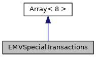

[Public Member Functions](#pub-methods)

`#include <`<a href="sdiapi_2src_2sdiapi_2sdi__emv_8h_source.md">sdi_emv.h</a>`>`

Inheritance diagram for EMVSpecialTransactions:

\[<a href="graph_legend.md">legend</a>\]

Collaboration diagram for EMVSpecialTransactions:

\[<a href="graph_legend.md">legend</a>\]

|  |  |
|----|----|
| Public Member Functions |  |
|   | [EMVSpecialTransactions](#a526af424c8deb1dbe45d55c784a22cb0) () |
|   | [EMVSpecialTransactions](#ac6d535b08d2ce6ec76bf30524510dcf6) (const unsigned char val\[8\]) |
| void  | [setReversal](#a463b0218d3cb6df1b8967aa44058e3b7) (<a href="namespacevfisdi.md#a527db2ffc0b36ba51722a4cbffabfbde">EMVSpecialReversal</a> r) |
| <a href="namespacevfisdi.md#a527db2ffc0b36ba51722a4cbffabfbde">EMVSpecialReversal</a>  | [getReversal](#a2fb4e33e0d89967d3e85448dd7639aed) () const |
| void  | [setRefund](#a04b4ef84c1f3129d4536b0334a73bc24) (<a href="namespacevfisdi.md#af7bea3fccf8be5b2d31451b707e6482f">EMVSpecialRefund</a> r) |
| <a href="namespacevfisdi.md#af7bea3fccf8be5b2d31451b707e6482f">EMVSpecialRefund</a>  | [getRefund](#aa7167b8eb3f85aa62851dd700ba6094f) () const |
| void  | [setReservation](#a196b8bc692847c375ff04f12e65f010a) (<a href="namespacevfisdi.md#ab7c67488b7dd812c5f2cc5872c34777b">EMVSpecialReservation</a> r) |
| <a href="namespacevfisdi.md#ab7c67488b7dd812c5f2cc5872c34777b">EMVSpecialReservation</a>  | [getReservation](#af122a93d669a3ceb083a74ca53f98f64) () const |
| void  | [setTip](#a308121299b0136e236cc11acc217ddda) (<a href="namespacevfisdi.md#a20ab3a697c1685e061a84894e9b516a4">EMVSpecialTip</a> r) |
| <a href="namespacevfisdi.md#a20ab3a697c1685e061a84894e9b516a4">EMVSpecialTip</a>  | [getTip](#a648f6b05528746210ddb905300d21516) () const |
| void  | [setReferral](#a1ff0115d7fb5e5cfbc6ff005e425c7a0) (<a href="namespacevfisdi.md#a39670f95eb414c48a2049dcaebfa18c9">EMVSpecialReferral</a> r) |
| <a href="namespacevfisdi.md#a39670f95eb414c48a2049dcaebfa18c9">EMVSpecialReferral</a>  | [getReferral](#a8c24a78081835875e8e045849ed4fecf) () const |
| void  | [setVoice](#aeb6a585651f7cb3fdff04b708a1fd6ce) (<a href="namespacevfisdi.md#a083fabcbd2e52934956f5585fb965eb4">EMVSpecialVoice</a> r) |
| <a href="namespacevfisdi.md#a083fabcbd2e52934956f5585fb965eb4">EMVSpecialVoice</a>  | [getVoice](#a9d68543a1315d3adf0ee087fa53a25c1) () const |
| void  | [setFallback](#a4597cac75ee93234e835588cbbbd6425) (<a href="namespacevfisdi.md#a454ea136b6e46b397bfca4f946045ed2">EMVSpecialFallback</a> r) |
| <a href="namespacevfisdi.md#a454ea136b6e46b397bfca4f946045ed2">EMVSpecialFallback</a>  | [getFallback](#a4c142ada18a0cafda6d22c35d55593a9) () const |
| void  | [setIgnoreCard](#a3bdb96f4bda3f18eca6ac4d55f885b6e) (<a href="namespacevfisdi.md#a73e96cba144044a23b797a5a1d67dc98">EMVSpecialIgnoreCard</a> r) |
| <a href="namespacevfisdi.md#a73e96cba144044a23b797a5a1d67dc98">EMVSpecialIgnoreCard</a>  | [getIgnoreCard](#a9e9f47b3d03a5fb814f1e4abb004c760) () const |
|  Public Member Functions inherited from <a href="structvfisdi_1_1_array.md">Array< 8 ></a> |  |
|   | <a href="structvfisdi_1_1_array.md#af9474cac29f3177edf5e8d72ea4a440c">Array</a> () |
|   | <a href="structvfisdi_1_1_array.md#ab3c8fb1a6457936fef9d4071026c9041">Array</a> (const unsigned char val\[N\]) |
|   | <a href="structvfisdi_1_1_array.md#aa66b20fdbfba3c4325bd668e8e3cc15c">Array</a> (const char val\[N\]) |
|   | <a href="structvfisdi_1_1_array.md#aa9824990fb0f57ad8a84879613260d45">Array</a> (unsigned long val) |
|   | <a href="structvfisdi_1_1_array.md#a01cf37d57ed94955ac7758d79fc05592">Array</a> (int val) |
| void  | <a href="structvfisdi_1_1_array.md#a136c19d9b00e1b17c64b56f49b908612">set</a> (const unsigned char val\[N\]) |
| void  | <a href="structvfisdi_1_1_array.md#a75fa559c702f25c24c11ba2bdbf427b3">set</a> (unsigned long val) |
| void  | <a href="structvfisdi_1_1_array.md#ac8bb3912a3ce86b15842e79d0b421204">clear</a> () |
| unsigned  | <a href="structvfisdi_1_1_array.md#a126a73e6d140f9e2a7b795c20fa42f70">size</a> () const |
| unsigned char &  | <a href="structvfisdi_1_1_array.md#ac06afde48b738c3e9c9470486c7f8cda">operator[]</a> (unsigned idx) |
| const unsigned char &  | <a href="structvfisdi_1_1_array.md#a2a6ca96009e73f504bf02d0acad72cf4">operator[]</a> (unsigned idx) const |

|  |  |
|----|----|
| Additional Inherited Members |  |
|  Data Fields inherited from <a href="structvfisdi_1_1_array.md">Array< 8 ></a> |  |
| unsigned char  | <a href="structvfisdi_1_1_array.md#a2874e15a65e17beacb9aa719cda33753">v</a> \[N\] |

## DetailedDescription {#detailed-description}

EMV special transactions

## Constructor& Destructor Documentation

## EMVSpecialTransactions()\[1/2\]  {#emvspecialtransactions-12}

<a href="classvfisdi_1_1_e_m_v_special_transactions.md">EMVSpecialTransactions</a>

inline

constructor, initializes all values to 0

## EMVSpecialTransactions()\[2/2\]  {#emvspecialtransactions-22}

<a href="classvfisdi_1_1_e_m_v_special_transactions.md">EMVSpecialTransactions</a>

inline

constructor, initializes special transactions with provided data from byte array,

**Parameters**

\[in\] **val** initialization values

## MemberFunction Documentation {#member-function-documentation}

## getFallback() 

<a href="namespacevfisdi.md#a454ea136b6e46b397bfca4f946045ed2">EMVSpecialFallback</a> getFallback

inline

read fallback configuration

### Returns

fallback configuration

## getIgnoreCard() 

<a href="namespacevfisdi.md#a73e96cba144044a23b797a5a1d67dc98">EMVSpecialIgnoreCard</a> getIgnoreCard

inline

read ignore card configuration

### Returns

ignore card configuration

## getReferral() 

<a href="namespacevfisdi.md#a39670f95eb414c48a2049dcaebfa18c9">EMVSpecialReferral</a> getReferral

inline

read voice referral configuration

### Returns

voice referral configuration

## getRefund() 

<a href="namespacevfisdi.md#af7bea3fccf8be5b2d31451b707e6482f">EMVSpecialRefund</a> getRefund

inline

read refund configuration

### Returns

refund configuration

## getReservation() 

<a href="namespacevfisdi.md#ab7c67488b7dd812c5f2cc5872c34777b">EMVSpecialReservation</a> getReservation

inline

read reservation configuration

### Returns

reservation configuration

## getReversal() 

<a href="namespacevfisdi.md#a527db2ffc0b36ba51722a4cbffabfbde">EMVSpecialReversal</a> getReversal

inline

read manual reversal configuration

### Returns

manual reversal configuration

## getTip() 

<a href="namespacevfisdi.md#a20ab3a697c1685e061a84894e9b516a4">EMVSpecialTip</a> getTip

inline

read tip configuration

### Returns

tip configuration

## getVoice() 

<a href="namespacevfisdi.md#a083fabcbd2e52934956f5585fb965eb4">EMVSpecialVoice</a> getVoice

inline

read voice authorization configuration

### Returns

voice authorization configuration

## setFallback() 

void setFallback

inline

write fallback configuration

**Parameters**

\[in\] **r** fallback configuration

## setIgnoreCard() 

void setIgnoreCard

inline

write ignore card configuration

**Parameters**

\[in\] **r** ignore card configuration

## setReferral() 

void setReferral

inline

write voice referral configuration

**Parameters**

\[in\] **r** voice referral configuration

## setRefund() 

void setRefund

inline

write refund configuration

**Parameters**

\[in\] **r** refund configuration

## setReservation() 

void setReservation

inline

write reservation configuration

**Parameters**

\[in\] **r** reservation configuration

## setReversal() 

void setReversal

inline

write manual reversal configuration

**Parameters**

\[in\] **r** manual reversal configuration

## setTip() 

void setTip

inline

write tip configuration

**Parameters**

\[in\] **r** tip configuration

## setVoice() 

void setVoice

inline

write voice authorization configuration

**Parameters**

\[in\] **r** voice authorization configuration

------------------------------------------------------------------------

The documentation for this class was generated from the following file:

- sdiapi/src/sdiapi/<a href="sdiapi_2src_2sdiapi_2sdi__emv_8h_source.md">sdi_emv.h</a>
