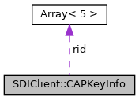

[Data Structures](#nested-classes) \| [Public Types](#pub-types) \| [Public Member Functions](#pub-methods) \| [Static Public Member Functions](#pub-static-methods) \| [Protected Types](#pro-types) \| [Protected Member Functions](#pro-methods) \| [Static Protected Member Functions](#pro-static-methods) \| [Protected Attributes](#pro-attribs)

`#include <`<a href="sdi_8h_source.md">sdi.h</a>`>`

|  |  |
|----|----|
| Data Structures |  |
| struct   | <a href="group__sdiemvct.md#structvfisdi_1_1_s_d_i_client_1_1_additional_card_tag">AdditionalCardTag</a> |
| struct   | [CAPKeyInfo](#structvfisdi_1_1_s_d_i_client_1_1_c_a_p_key_info) |
| struct   | <a href="group__sdisystem.md#structvfisdi_1_1_s_d_i_client_1_1_component_version">ComponentVersion</a> |
| struct   | <a href="group__sdiemvct.md#structvfisdi_1_1_s_d_i_client_1_1_c_t_candidate">CTCandidate</a> |
| struct   | <a href="group__sdiemvct.md#structvfisdi_1_1_s_d_i_client_1_1_c_t_candidate_data">CTCandidateData</a> |
| struct   | <a href="group__sdiemvctls.md#structvfisdi_1_1_s_d_i_client_1_1_c_t_l_s_candidate_data">CTLSCandidateData</a> |
| struct   | <a href="group__sdidata.md#structvfisdi_1_1_s_d_i_client_1_1_matching">Matching</a> |
| struct   | <a href="group__sdinfc.md#structvfisdi_1_1_s_d_i_client_1_1_n_f_c_card">NFCCard</a> |
| struct   | <a href="group__sdinfc.md#structvfisdi_1_1_s_d_i_client_1_1_n_f_c_card_count">NFCCardCount</a> |
| struct   | <a href="group__sdinfc.md#structvfisdi_1_1_s_d_i_client_1_1_n_f_c_card_ext">NFCCardExt</a> |
| struct   | <a href="group__sdidata.md#structvfisdi_1_1_s_d_i_client_1_1_place_holder">PlaceHolder</a> |
| struct   | <a href="group__sdicrd.md#structvfisdi_1_1_s_d_i_client_1_1_plugin_result">PluginResult</a> |
| struct   | <a href="group__sdicrd.md#structvfisdi_1_1_s_d_i_client_1_1_t_e_c_options">TECOptions</a> |
| struct   | [TouchButton](#structvfisdi_1_1_s_d_i_client_1_1_touch_button) |

|  |  |
|----|----|
| Public Types |  |
| enum   | [ProtocolType](#a2b99fb4e4914a533566284f2ed3b0186) { [PROTOCOL_B](#a2b99fb4e4914a533566284f2ed3b0186a1047589f56e6de0f5cd3dada0723fdab), [PROTOCOL_C](#a2b99fb4e4914a533566284f2ed3b0186a6aa928c13ed99c74ac4969146cf1a92f) } |
| enum   | <a href="group__sdidisplay.md#gacdffce6b62c4db2a50dd9cdae6caba78">IdleScreenMode</a> { <a href="group__sdidisplay.md#ggacdffce6b62c4db2a50dd9cdae6caba78a4f3405ef030cb85be40c62851dedd293">IDLE_HOTKEY_ADMIN</a> =0, <a href="group__sdidisplay.md#ggacdffce6b62c4db2a50dd9cdae6caba78a43e3b94725d1c312edc4bb14576ab9ee">IDLE_NO_ADMIN</a> =1, <a href="group__sdidisplay.md#ggacdffce6b62c4db2a50dd9cdae6caba78a27549d2e45dc641b812b29bf0c3ac692">IDEL_SHOW_ADMIN</a> =2 } |
| typedef std::vector\< unsigned char \>  | [bytevector](#a64b5be62be31dcda165d2c6c3c262fb5) |
| typedef void(\*  | [LogCallback](#a1662fee6a6241f5c824ea55bdc1bac92)) (void \*data, const char \*file, int line, const char \*format, va_list ap) |

|  |  |
|----|----|
| Public Member Functions |  |
|   | <a href="group__sdisetup.md#ga55fe10473f030082d296a204e2cbf0ec">SDIClient</a> () |
| virtual  | <a href="group__sdisetup.md#ga5f736363bff55bdf1e71c8a0fcfc6fae">~SDIClient</a> () |
| void  | <a href="group__sdisetup.md#gab5e31e9de33ab7fcc6694fed46316476">setProtocol</a> ([ProtocolType](#a2b99fb4e4914a533566284f2ed3b0186) proto) |
| void  | <a href="group__sdisetup.md#gafa075c0e3920b23acdb73134144fa09a">setTrace</a> (void \*data, void(\*trace_cb)(void \*data, const char \*format,\...)) |
| template\<typename R , typename T \> |  |
| void  | <a href="group__sdisetup.md#ga3b744ccb84fd14d5cc03de91164474df">setTrace</a> (T \*data, R(\*trace)(T \*data, const char \*format,\...)) |
| int  | <a href="group__sdisetup.md#gaadabac17c905f50d1379d3ba5fbdd0e6">connect</a> (const char \*host, unsigned short port=12000) |
| int  | <a href="group__sdisetup.md#ga08726c29f247dc150549abdcd3067090">connect</a> (<a href="classvfiipc_1_1_i_p_c.md">vfiipc::IPC</a> \*link) |
| bool  | <a href="group__sdisetup.md#gaa0fd96bc25e3d509fb54028c2e4b91f6">connected</a> () const |
| void  | <a href="group__sdisetup.md#ga5ae591df94fc66ccb85cbb6565368bca">close</a> () |
| int  | <a href="group__sdilowlevel.md#ga9469453c091c21eb8ea86f57891b7308">sendMessage</a> (unsigned short cmd, unsigned short p1p2, const [bytevector](#a64b5be62be31dcda165d2c6c3c262fb5) &data) |
| int  | <a href="group__sdilowlevel.md#ga45c151464c9a5da87cec4f15434eac64">sendMessage</a> (unsigned short cmd, const [bytevector](#a64b5be62be31dcda165d2c6c3c262fb5) &data) |
| int  | <a href="group__sdilowlevel.md#ga6c1ca6f917bb545fa12b98bafddeb839">receiveMessage</a> (unsigned short &sw1sw2, [bytevector](#a64b5be62be31dcda165d2c6c3c262fb5) &data) |
| int  | <a href="group__sdilowlevel.md#gaf1a6553edbb1cf8a3923c00549aaf322">sendReply</a> (unsigned short cmd, const [bytevector](#a64b5be62be31dcda165d2c6c3c262fb5) &data) |
| int  | <a href="group__sdilowlevel.md#ga6ecd2e2678b30d7eae0dee49978116a0">sendReceiveMessage</a> (unsigned short cmd, unsigned short p1p2, const [bytevector](#a64b5be62be31dcda165d2c6c3c262fb5) &sdata, unsigned short &sw1sw2, [bytevector](#a64b5be62be31dcda165d2c6c3c262fb5) &rdata) |
| int  | <a href="group__sdilowlevel.md#ga61e51cf697228a812dd47cd53e7ca3b0">sendReceiveMessage</a> (unsigned short cmd, const [bytevector](#a64b5be62be31dcda165d2c6c3c262fb5) &sdata, unsigned short &sw1sw2, [bytevector](#a64b5be62be31dcda165d2c6c3c262fb5) &rdata) |
| int  | <a href="group__sdisystem.md#gaaa584883946486751113f98b317623df">sysAbort</a> () |
| int  | <a href="group__sdisystem.md#ga7f25a798b839c063cbd06d44e0313613">sysGetConfig</a> (const [bytevector](#a64b5be62be31dcda165d2c6c3c262fb5) &req, [bytevector](#a64b5be62be31dcda165d2c6c3c262fb5) &out) |
| int  | <a href="group__sdisystem.md#gaf233502e71652c8d51917e15bc22a7e8">sysGetCPUID</a> (std::string &id) |
| int  | <a href="group__sdisystem.md#ga86c99be3edd67ee31ae80ebcd610aab0">sysGetSerialNumber</a> (std::string &sn) |
| int  | <a href="group__sdisystem.md#gae02f6e7a29647f0c172d4321370cecf0">sysGetBootSoftwareID</a> (std::string &id) |
| int  | <a href="group__sdisystem.md#gac2ec2c92bfb5beba8b26b7063798f292">sysGetApplicationSoftwareID</a> (std::string &id) |
| int  | <a href="group__sdisystem.md#ga49b22bbb731a1d9d16c0ca99802e1254">sysGetHardwareID</a> (std::string &id) |
| int  | <a href="group__sdisystem.md#gaf95a9d826bd2aeb89d1fb943e2ea3fce">sysGetIFMID</a> (std::string &id) |
| int  | <a href="group__sdisystem.md#gafa12882d0135fa7897f2f64982c33320">sysGetEMVL2ID</a> (std::string &id) |
| int  | <a href="group__sdisystem.md#ga8b4f5e6d6d12cf5760153114bc3d371f">sysGetStatus</a> (const [bytevector](#a64b5be62be31dcda165d2c6c3c262fb5) &req, [bytevector](#a64b5be62be31dcda165d2c6c3c262fb5) &out) |
| int  | <a href="group__sdisystem.md#ga41e7b1518505a9f0a34253a57c3e597f">sysGetDateTime</a> (unsigned short &year, unsigned char &month, unsigned char &day, unsigned char &hour, unsigned char &minute, unsigned char &second) |
| int  | <a href="group__sdisystem.md#gaab4470413c2c1cbdf6a25cca76795cfa">sysGetTamperStatus</a> (<a href="structvfisdi_1_1_array.md">Array</a>\< 9 \> &tamper) |
| int  | <a href="group__sdisystem.md#gacd3edebd1174d3398320769e6208a50c">sysGetBatteryStatus</a> (unsigned char &charge_level, unsigned char &charge_status) |
| int  | <a href="group__sdisystem.md#ga21ec43a34504219da1656b945530b231">sysGetBatteryVoltage</a> (unsigned short &voltage) |
| int  | <a href="group__sdisystem.md#ga5bfe0a8a267e7e674283b92e05de3cce">sysGetLanguage</a> (enum <a href="namespacevfisdi.md#a315ca917ad583797f709ea477dd28705">Language</a> &language) |
| int  | <a href="group__sdisystem.md#ga4f956cba60843a3b06d425f49fcd09d1">sysGetCVVDeactivation</a> (unsigned char &cfg) |
| int  | <a href="group__sdisystem.md#ga3fb40f1c66989d42fa78b046caa0b342">sysGetCardEntryMode</a> (unsigned char &mode) |
| int  | <a href="group__sdisystem.md#ga2e7b93e265700b9d778b01c11b95fe5f">sysSetDateTime</a> (unsigned short year, unsigned char month, unsigned char day, unsigned char hour, unsigned char minute, unsigned char second) |
| int  | <a href="group__sdisystem.md#gad78e48f51cb1c87de771a7ddd67b394e">sysSetLanguage</a> (enum <a href="namespacevfisdi.md#a315ca917ad583797f709ea477dd28705">Language</a> language) |
| int  | <a href="group__sdisystem.md#ga0ee790d0fb18e5083f51b13595cf497c">sysSetCVVDeactivation</a> (unsigned char deactivate) |
| int  | <a href="group__sdisystem.md#gab36d0bea0c486f3c6011bcb39e1f708c">sysSetCardEntryMode</a> (unsigned char mode) |
| int  | <a href="group__sdisystem.md#gaf0686bd5790182aa13c9bf357dcc7d7d">sysSetDisplayBacklight</a> (unsigned char backlight) |
| int  | <a href="group__sdisystem.md#ga967e25786eab08f36a0c0898b596f897">sysSetDisplayConstrast</a> (unsigned char contrast) |
| int  | <a href="group__sdisystem.md#ga39444f5aad6fae3dcbc7ca49bb7f169a">sysGetKSN</a> (<a href="namespacevfisdi.md#add4280440188ede2e1f6ea4397df6cfa">KSNSelection</a> which, [bytevector](#a64b5be62be31dcda165d2c6c3c262fb5) &out) |
| int  | <a href="group__sdisystem.md#ga5168e5e231b33ac39248376c92c84d83">sysAuthStep1</a> (const <a href="structvfisdi_1_1_array.md">Array</a>\< 16 \> &hostRandom, <a href="structvfisdi_1_1_array.md">Array</a>\< 32 \> &serverData, [bytevector](#a64b5be62be31dcda165d2c6c3c262fb5) &ksn) |
| int  | <a href="group__sdisystem.md#ga43f8cfaccb41c4b3e73ecacac524cc14">sysAuthStep2</a> (const <a href="structvfisdi_1_1_array.md">Array</a>\< 32 \> &hostData, <a href="structvfisdi_1_1_array.md">Array</a>\< 32 \> &serverData) |
| int  | <a href="group__sdisystem.md#gaaaf5929f91bcc56ce5e0c4e930b3eed6">sysSetIdleText</a> (const std::string &text) |
| int  | <a href="group__sdisystem.md#gabb0e1911d5072f1a3d14b313501d0a11">sysClearIdleText</a> () |
| int  | <a href="group__sdisystem.md#ga9f6703b20083d77a2bc09ae3e8741771">sysUploadBegin</a> (const std::string &filename, <a href="namespacevfisdi.md#af55973ce01a27acae146f17b4a0366fa">SYSUploadType</a> type=<a href="namespacevfisdi.md#af55973ce01a27acae146f17b4a0366faa45f06815e16da88212b9ee5ed2f3ddc8">SYS_UPLOAD_SOFTWARE_UPDATE</a>, int dest=1) |
| int  | <a href="group__sdisystem.md#gacba3dc1703d99fc2d4b7a5b763f2da10">sysUploadData</a> (const void \*packet, unsigned size, int packet_no, int dest=1) |
| int  | <a href="group__sdisystem.md#ga8ab36922e973801b2b45803208c0c4f9">sysUploadEnd</a> (const [bytevector](#a64b5be62be31dcda165d2c6c3c262fb5) \*md5=0, const [bytevector](#a64b5be62be31dcda165d2c6c3c262fb5) \*mac=0, int dest=1) |
| int  | <a href="group__sdisystem.md#ga358df855cbad214ec3340bb976dff4d9">sysUpload</a> (const std::string &filename, const [bytevector](#a64b5be62be31dcda165d2c6c3c262fb5) &data, <a href="namespacevfisdi.md#af55973ce01a27acae146f17b4a0366fa">SYSUploadType</a> type=<a href="namespacevfisdi.md#af55973ce01a27acae146f17b4a0366faa45f06815e16da88212b9ee5ed2f3ddc8">SYS_UPLOAD_SOFTWARE_UPDATE</a>, const [bytevector](#a64b5be62be31dcda165d2c6c3c262fb5) \*md5=0, const [bytevector](#a64b5be62be31dcda165d2c6c3c262fb5) \*mac=0, int dest=1) |
| int  | <a href="group__sdisystem.md#ga014fa2a5e800e62c61ce747292407e59">sysShutdown</a> () |
| int  | <a href="group__sdisystem.md#ga87aee721c6d116ee2f974db6efe85fe7">sysReboot</a> () |
| int  | <a href="group__sdisystem.md#ga52a26c8a62e227a00ec702bb9b3b2082">sysSleep</a> () |
| int  | <a href="group__sdisystem.md#ga0660fa6f7eecf4b5925d312333e358a4">sysHibernate</a> () |
| int  | <a href="group__sdisystem.md#ga4f3eacc3478548919e6a19cd20c5bf5d">sysShowMACDesktop</a> () |
| int  | <a href="group__sdisystem.md#gaa90a2a61e90239e655f5798fe8138929">sysSetPropertyString</a> (int property, const std::string &in, int dest=1) |
| int  | <a href="group__sdisystem.md#ga7c674016f7f7360cad04c180a9a2f687">sysSetPropertyInt</a> (int property, int in, int dest=1) |
| int  | <a href="group__sdisystem.md#gacc125e4c576a0e8d19bf03df8c198904">sysGetPropertyString</a> (int property, std::string &out, int dest=1) |
| int  | <a href="group__sdisystem.md#ga37e6626374e1fcd0e155ce8479c2ae68">sysGetPropertyInt</a> (int property, int &out, int dest=1) |
| int  | <a href="group__sdisystem.md#ga7f438fca0104c137edee4cdd3d5e22ae">sysInstallSponsorCert</a> (const [bytevector](#a64b5be62be31dcda165d2c6c3c262fb5) &cert) |
| int  | <a href="group__sdisystem.md#ga5bb253079c8feedc3ae93c855f721a15">sysGetSDIVersion</a> (std::vector\< <a href="group__sdisystem.md#structvfisdi_1_1_s_d_i_client_1_1_component_version">ComponentVersion</a> \> &info, unsigned char device=1) |
| int  | <a href="group__sdisystem.md#ga1782bace2e44b08df3f5bf98fa7e8e5f">sysInstallUpdate</a> (<a href="namespacevfisdi.md#ae85b937298c01c4202810ff9a3133b11">SYSUpdateType</a> type) |
| int  | <a href="group__sdisystem.md#ga38ac875ac5b4276dd3e6d3ba229c58b9">sysInstallResult</a> (std::string &result, unsigned char device=1) |
| int  | <a href="group__sdisystem.md#gadb6da218490ec0f55e357550362a7eb9">sysEnableEPP</a> (bool enable) |
| int  | <a href="group__sdisystem.md#gaf6cffadf0636bda10038b2569e76719a">sysFactoryReset</a> () |
| int  | <a href="group__sdisystem.md#ga2d26df79f3db64673a382881b653fcf5">sysReadCert</a> (const std::string &name, [bytevector](#a64b5be62be31dcda165d2c6c3c262fb5) &cert) |
| int  | <a href="group__sdisystem.md#gaca65ca02efc350a8ac4537dbdf32ca50">sysSetCurrencyDisplay</a> (enum <a href="namespacevfisdi.md#a59f74bf9ae55ffd390b8806b2559021c">Currency</a> currency, enum <a href="namespacevfisdi.md#ac8c9a7e6b9069dbf93c0520716472812">CurrencyDisplay</a> display) |
| int  | <a href="group__sdidisplay.md#ga440d80337e047a445a11d9c4a2e41de7">displayText</a> (int template_id, const std::string &data_name, const std::string &data_value, int timeout=0, bool confirm=false, bool beep=false, int dest=1) |
| int  | <a href="group__sdidisplay.md#ga3947b5121e12c60255720f0e4b65ade0">displayText</a> (int template_id, unsigned dialog_opt, const std::map\< std::string, std::string \> &<a href="_web_service_wrappers_8c.md#a6e248376c0290338633d8137822eb209">value</a>, const std::map\< std::string, std::string \> &key_actions, const char \*header_text=0, const char \*enter_text=0, const char \*clear_text=0, const char \*cancel_text=0, int timeout=0, int dest=1) |
| int  | <a href="group__sdidisplay.md#gacfe3552d7e940337249c23e10250e3f2">displayText</a> (const std::string &data_value, int timeout=0, bool confirm=false, bool beep=false, int dest=1) |
| int  | <a href="group__sdidisplay.md#ga1318cae26cf697940b77f5ae3cd7b836">displayInput</a> (std::string &out, <a href="namespacevfisdi.md#a5fc772c800c3d40d2b95564e8a839bab">InputType</a> type, <a href="namespacevfisdi.md#a315ca917ad583797f709ea477dd28705">Language</a> language=<a href="namespacevfisdi.md#a315ca917ad583797f709ea477dd28705aabdfcddde54087079139e916b59fe058">LANGUAGE_NO_LANGUAGE</a>, char maskchar=0, const std::string &altformat=\"\", int timeout=0, bool beep=false, int dest=1) |
| int  | <a href="group__sdidisplay.md#ga80ccc4543482b08097ff08df6b985758">displayInputTipWithAmount</a> (std::string &out, <a href="namespacevfisdi.md#a315ca917ad583797f709ea477dd28705">Language</a> language, const <a href="classvfisdi_1_1_b_c_d.md">BCD</a>\< 6 \> &amount, <a href="namespacevfisdi.md#a59f74bf9ae55ffd390b8806b2559021c">Currency</a> currency, char maskchar=0, const std::string &altformat=\"\", int timeout=0, bool beep=false, int dest=1) |
| int  | <a href="group__sdidisplay.md#ga2414de266c381974616ae16049a98f2b">displayMenu</a> (const std::string &prompt, const std::vector\< std::string \> &entries, int timeout=0, bool beep=false, int dest=1) |
| int  | <a href="group__sdidisplay.md#gacc10db22aa6042f969f329dbf0cad703">displayMenu</a> (unsigned dialog_opt, const std::string &prompt, const std::vector\< std::string \> &entries, int preselect, const std::map\< std::string, std::string \> &key_actions, const char \*header_text=0, const char \*enter_text=0, const char \*cancel_text=0, const char \*up_text=0, const char \*down_text=0, int timeout=0, int dest=1) |
| int  | <a href="group__sdidisplay.md#gaef4175d6f3f65d71489a32680a8fd61f">displayCardRequest</a> (unsigned char tec, unsigned char mode, const <a href="classvfisdi_1_1_b_c_d.md">BCD</a>\< 6 \> amount, int currency, int dest=1) |
| int  | <a href="group__sdidisplay.md#ga56f054652c2dcbe92fb6f52c819fd14f">displayCardRequest</a> (unsigned char tec, unsigned char mode, int dest=1) |
| int  | <a href="group__sdidisplay.md#gaea500b47f5c11b0fdb725dc88e409499">displayCardRequest</a> (unsigned char tec, unsigned char mode, const <a href="classvfisdi_1_1_b_c_d.md">BCD</a>\< 6 \> amount, int currency, enum <a href="namespacevfisdi.md#a36a1ebacbf82d10a5db76377f8e225fd">EMVTransaction</a> txn, int dest=1) |
| int  | <a href="group__sdidisplay.md#ga40b78a6727d9738c638b32e304aeee20">displayCardRequest</a> (unsigned char tec, unsigned char mode, enum <a href="namespacevfisdi.md#a36a1ebacbf82d10a5db76377f8e225fd">EMVTransaction</a> txn, int dest=1) |
| int  | <a href="group__sdidisplay.md#ga3465958027d8b0b80dd2eef84345d39d">displayIdleScreen</a> (int dest=1) |
| int  | <a href="group__sdidisplay.md#ga3c96a2b500a3a1a03298d44242c188c7">displayIdleScreenMode</a> (enum <a href="group__sdidisplay.md#gacdffce6b62c4db2a50dd9cdae6caba78">IdleScreenMode</a> mode, int dest=1) |
| int  | <a href="group__sdidisplay.md#gaf658018de94876a5d65e50f090fa5a63">displaySignatureCapture</a> (std::string &outformat, [bytevector](#a64b5be62be31dcda165d2c6c3c262fb5) &outdata, <a href="namespacevfisdi.md#a315ca917ad583797f709ea477dd28705">Language</a> lang, unsigned short timeout=0, int dest=1) |
| int  | <a href="group__sdidisplay.md#ga81bcd0770b43444e43fd6ab3c9489827">displayLEDs</a> (bool on) |
| int  | <a href="group__sdidisplay.md#ga0940e7bff1e3ca3f71e752e11e68e892">displayDialog</a> (const std::string &filename, std::map\< std::string, std::string \> &<a href="_web_service_wrappers_8c.md#a6e248376c0290338633d8137822eb209">value</a>, <a href="namespacevfisdi.md#a315ca917ad583797f709ea477dd28705">Language</a> lang=<a href="namespacevfisdi.md#a315ca917ad583797f709ea477dd28705aabdfcddde54087079139e916b59fe058">LANGUAGE_NO_LANGUAGE</a>, bool beep=false, int dest=1) |
| int  | <a href="group__sdidisplay.md#ga16d8bea3e5a11f7164e3ce225ece9500">displayDialog</a> (unsigned dialog_opt, const std::string &filename, std::map\< std::string, std::string \> &<a href="_web_service_wrappers_8c.md#a6e248376c0290338633d8137822eb209">value</a>, <a href="namespacevfisdi.md#a315ca917ad583797f709ea477dd28705">Language</a> lang=<a href="namespacevfisdi.md#a315ca917ad583797f709ea477dd28705aabdfcddde54087079139e916b59fe058">LANGUAGE_NO_LANGUAGE</a>, int dest=1) |
| int  | <a href="group__sdidisplay.md#gaaa69909a79a4a18a0cdacaa103a1ad77">displayGetAsyncResult</a> (enum <a href="namespacevfisdi.md#a948de32bb8a31f38655af1ad0f5a969c">DialogAsyncStatus</a> &status, int dest=1) |
| int  | <a href="group__sdiprinter.md#ga07602dcd5d2f313db6a92c97cf8081a5">printSetPropertyString</a> (int property, const std::string &in) |
| int  | <a href="group__sdiprinter.md#ga725f0fdf4822cac026c00aac86d49ce1">printSetPropertyInt</a> (int property, int in) |
| int  | <a href="group__sdiprinter.md#gab608770d63d6067562dcaa6c823c0015">printGetPropertyString</a> (int property, std::string &out) |
| int  | <a href="group__sdiprinter.md#ga92d545bf0f6984fe616d3b14f2ad5c82">printGetPropertyInt</a> (int property, int &out) |
| int  | <a href="group__sdiprinter.md#gaa8aec9712a3bd4364fe03f3dff2afa67">printHTML</a> (const std::string &html, bool landscape=false) |
| int  | <a href="group__sdiprinter.md#gaacfff92e849c75e30ca3598694998a9b">printBitmap</a> (int width, int height, const void \*bitmap, unsigned size) |
| int  | <a href="group__sdiprinter.md#ga434d14185df2e148a6e5a1bc3b809471">printBitmap</a> (int width, int height, const [bytevector](#a64b5be62be31dcda165d2c6c3c262fb5) &bitmap) |
| int  | <a href="group__sdimsr.md#gabdbafaf4249f4fb374be7d7f01e98b3b">msrRead</a> ([bytevector](#a64b5be62be31dcda165d2c6c3c262fb5) &pan, std::string &name, std::string &service, std::string &track2, int timeout_sec) |
| int  | <a href="group__sdimsr.md#ga11a801de57b1d8aca486f9080bf12687">msrRead</a> ([bytevector](#a64b5be62be31dcda165d2c6c3c262fb5) &pan, std::string &name, std::string &service, std::string &track2, <a href="structvfisdi_1_1_array.md">Array</a>\< 3 \> &track_status, int timeout_sec) |
| int  | <a href="group__sdimsr.md#gad11aef1f67eef218f267d2698e72c9c4">msrRead</a> ([bytevector](#a64b5be62be31dcda165d2c6c3c262fb5) &pan, std::string &name, std::string &service, std::string &track2, <a href="structvfisdi_1_1_array.md">Array</a>\< 3 \> &track_status, [bytevector](#a64b5be62be31dcda165d2c6c3c262fb5) &card_token, int timeout_sec, int removal_timeout_ms=-1) |
| int  | <a href="group__sdimsr.md#ga496e30db16843ea2d904676816530c9d">msrRead</a> ([bytevector](#a64b5be62be31dcda165d2c6c3c262fb5) &pan, std::string &name, std::string &service, std::string &track2, <a href="structvfisdi_1_1_array.md">Array</a>\< 3 \> &track_status, [bytevector](#a64b5be62be31dcda165d2c6c3c262fb5) &card_token, std::vector\< <a href="group__sdicrd.md#structvfisdi_1_1_s_d_i_client_1_1_plugin_result">PluginResult</a> \> &plugin_result, int timeout_sec, int removal_timeout_ms=-1) |
| int  | <a href="group__sdimsr.md#ga6410a972989772d341f0ce0c6be51349">msrRead</a> ([bytevector](#a64b5be62be31dcda165d2c6c3c262fb5) &pan, std::string &name, std::string &service, std::string &track1, std::string &track2, <a href="structvfisdi_1_1_array.md">Array</a>\< 3 \> &track_status, [bytevector](#a64b5be62be31dcda165d2c6c3c262fb5) &card_token, std::vector\< <a href="group__sdicrd.md#structvfisdi_1_1_s_d_i_client_1_1_plugin_result">PluginResult</a> \> &plugin_result, int timeout_sec, int removal_timeout_ms=-1) |
| int  | <a href="group__sdimsr.md#ga536aaf0bbc6c7b4640891698305828e0">msrCardDataEntry</a> (std::string &out, const std::vector\< [TouchButton](#structvfisdi_1_1_s_d_i_client_1_1_touch_button) \> &btn=std::vector\< [TouchButton](#structvfisdi_1_1_s_d_i_client_1_1_touch_button) \>()) |
| int  | <a href="group__sdimsr.md#ga629bbde0dafeb1ae091f4e803ec26060">msrCardDataEntry</a> (std::string &out, [bytevector](#a64b5be62be31dcda165d2c6c3c262fb5) &card_token, unsigned flags, const std::string &format=std::string(), const std::vector\< [TouchButton](#structvfisdi_1_1_s_d_i_client_1_1_touch_button) \> &btn=std::vector\< [TouchButton](#structvfisdi_1_1_s_d_i_client_1_1_touch_button) \>()) |
| int  | <a href="group__sdimsr.md#gafcb2779afee393b54acf2bf026f6ae06">msrCardDataEntry</a> (std::string &out, [bytevector](#a64b5be62be31dcda165d2c6c3c262fb5) &card_token, std::vector\< <a href="group__sdicrd.md#structvfisdi_1_1_s_d_i_client_1_1_plugin_result">PluginResult</a> \> &plugin_result, unsigned flags, const std::string &format=std::string(), const std::vector\< [TouchButton](#structvfisdi_1_1_s_d_i_client_1_1_touch_button) \> &btn=std::vector\< [TouchButton](#structvfisdi_1_1_s_d_i_client_1_1_touch_button) \>()) |
| int  | <a href="group__sdimsr.md#gaff624dc3d51ebf509d640ccb61ae6f26">msrCardDataEntry</a> (std::string &out, [bytevector](#a64b5be62be31dcda165d2c6c3c262fb5) &card_token, std::vector\< <a href="group__sdicrd.md#structvfisdi_1_1_s_d_i_client_1_1_plugin_result">PluginResult</a> \> &plugin_result, unsigned flags, int timeout, const std::string &format=std::string(), const std::vector\< [TouchButton](#structvfisdi_1_1_s_d_i_client_1_1_touch_button) \> &btn=std::vector\< [TouchButton](#structvfisdi_1_1_s_d_i_client_1_1_touch_button) \>()) |
| int  | <a href="group__sdimsr.md#ga390211192723333a89d150e364df5c5b">msrSetOptions</a> (unsigned options) |
| int  | <a href="group__sdimsr.md#gae45526e394f86bca38f676c11af31ea7">msrLED</a> (unsigned led1, unsigned led2, unsigned led3, unsigned timeout=0) |
| int  | <a href="group__sdimsr.md#ga182c41bec04e552a5ced7d070295700f">msrSetSensitivity</a> (unsigned char sensitivity, int dest=1) |
| int  | <a href="group__sdicrd.md#ga8bec880c02a24ab758781862e535f6e6">crdDetect</a> (unsigned char tec, const <a href="group__sdicrd.md#structvfisdi_1_1_s_d_i_client_1_1_t_e_c_options">TECOptions</a> &options, bool allow_cancel, unsigned timeout_ms, unsigned char &tec_out, <a href="structvfisdi_1_1_e_m_v_txn.md">EMVTxn</a> &emv_out, const [bytevector](#a64b5be62be31dcda165d2c6c3c262fb5) &appid=[bytevector](#a64b5be62be31dcda165d2c6c3c262fb5)(), unsigned char syncCard=0, unsigned char manual_mode=0, const std::string &format=\"\", [bytevector](#a64b5be62be31dcda165d2c6c3c262fb5) \*plugin_result=0) |
| int  | <a href="group__sdicrd.md#gac199163d2bc95feb16f8728301d5f067">crdDetect</a> (unsigned char tec, const <a href="group__sdicrd.md#structvfisdi_1_1_s_d_i_client_1_1_t_e_c_options">TECOptions</a> &options, bool allow_cancel, unsigned timeout_ms, unsigned char &tec_out, <a href="structvfisdi_1_1_e_m_v_txn.md">EMVTxn</a> &emv_out, std::vector\< <a href="group__sdicrd.md#structvfisdi_1_1_s_d_i_client_1_1_plugin_result">PluginResult</a> \> &plugin_result, const [bytevector](#a64b5be62be31dcda165d2c6c3c262fb5) &appid=[bytevector](#a64b5be62be31dcda165d2c6c3c262fb5)(), unsigned char syncCard=0, unsigned char manual_mode=0, const std::string &format=\"\", int removal_timeout_ms=-1) |
| int  | <a href="group__sdicrd.md#gaaa397799fb53215c5b5febbf78d4be54">crdWaitForRemoval</a> (unsigned short timeout=0) |
| int  | <a href="group__sdicrd.md#ga8bc5cd034d411e399f34a04030df30d5">crdStartDetect</a> (unsigned char tec, const <a href="group__sdicrd.md#structvfisdi_1_1_s_d_i_client_1_1_t_e_c_options">TECOptions</a> &options, unsigned timeout, bool use_cb=false, const [bytevector](#a64b5be62be31dcda165d2c6c3c262fb5) &appid=[bytevector](#a64b5be62be31dcda165d2c6c3c262fb5)(), unsigned char syncCard=0) |
| int  | <a href="group__sdicrd.md#ga20b2d4e611c8174a7c1caf9495236694">crdStartDetect</a> (unsigned char tec, const <a href="group__sdicrd.md#structvfisdi_1_1_s_d_i_client_1_1_t_e_c_options">TECOptions</a> &options, unsigned timeout, bool use_cb, const [bytevector](#a64b5be62be31dcda165d2c6c3c262fb5) &appid, unsigned char syncCard, int removal_timeout_ms=-1) |
| int  | <a href="group__sdicrd.md#ga832f6042c3fff724257309aa8f5b4cf2">crdPollDetect</a> (unsigned char &tec_out, <a href="structvfisdi_1_1_e_m_v_txn.md">EMVTxn</a> &emv_out, [bytevector](#a64b5be62be31dcda165d2c6c3c262fb5) \*plugin_result=0) |
| int  | <a href="group__sdicrd.md#ga0fde18f23d79784cd57999cebd88a47e">crdStopDetect</a> () |
| int  | <a href="group__sdicrd.md#gadd5984f4ff1e0ed900d076c9cf2f3583">crdAddTechnology</a> (unsigned char tec, const <a href="group__sdicrd.md#structvfisdi_1_1_s_d_i_client_1_1_t_e_c_options">TECOptions</a> &options, const [bytevector](#a64b5be62be31dcda165d2c6c3c262fb5) &appid=[bytevector](#a64b5be62be31dcda165d2c6c3c262fb5)(), unsigned char syncCard=0) |
| int  | <a href="group__sdicrd.md#ga3b6f80ede08e6b3496d31e17a661f714">crdRemoveTechnology</a> (unsigned char tec) |
| int  | <a href="group__sdicrd.md#ga3cc73177ae72e9d3e4b05b2195ab7325">crdProvideCallbackResponse</a> (<a href="structvfisdi_1_1_e_m_v_txn.md">EMVTxn</a> &in) |
| int  | <a href="group__sdiped.md#gab8571dbdf371d728c742476ba7de0c1d">pedGetPIN</a> (const std::vector\< [TouchButton](#structvfisdi_1_1_s_d_i_client_1_1_touch_button) \> &btn=std::vector\< [TouchButton](#structvfisdi_1_1_s_d_i_client_1_1_touch_button) \>(), bool bypass=false, int timeout=300, int navigator_mode=0, int min_digits=4, int max_digits=12, <a href="namespacevfisdi.md#a315ca917ad583797f709ea477dd28705">Language</a> lang=<a href="namespacevfisdi.md#a315ca917ad583797f709ea477dd28705aabdfcddde54087079139e916b59fe058">LANGUAGE_NO_LANGUAGE</a>) |
| int  | <a href="group__sdiped.md#ga78cb1f9e229489cf6c0ec6125d007350">pedGetPIN</a> (unsigned pin_options, const <a href="classvfisdi_1_1_b_c_d.md">BCD</a>\< 6 \> amount=0, int currency=-1, const char \*applabel=0, const char \*headline=0, unsigned pwd_char=0, const std::vector\< [TouchButton](#structvfisdi_1_1_s_d_i_client_1_1_touch_button) \> &btn=std::vector\< [TouchButton](#structvfisdi_1_1_s_d_i_client_1_1_touch_button) \>(), unsigned bypass=<a href="namespacevfisdi.md#a7f70949d162e40270307b2aaf481e2b2ac8b620f3612cc9f6539913ac47545459">BYPASS_DISABLED</a>, int timeout=300, int interchar_timeout=0, int min_digits=4, int max_digits=12, <a href="namespacevfisdi.md#a315ca917ad583797f709ea477dd28705">Language</a> lang=<a href="namespacevfisdi.md#a315ca917ad583797f709ea477dd28705aabdfcddde54087079139e916b59fe058">LANGUAGE_NO_LANGUAGE</a>) |
| int  | <a href="group__sdiped.md#gac3ae9329871381b96ffe300f58d54bf7">pedGetPIN</a> (bool bypass=false, int timeout=300, int min_digits=4, int max_digits=12, <a href="namespacevfisdi.md#a315ca917ad583797f709ea477dd28705">Language</a> lang=<a href="namespacevfisdi.md#a315ca917ad583797f709ea477dd28705aabdfcddde54087079139e916b59fe058">LANGUAGE_NO_LANGUAGE</a>) |
| int  | <a href="group__sdiped.md#gae0e5bc21aac331f55db87f5c8c32b779">pedSetPINTimeout</a> (unsigned short timeout_sec) |
| void  | <a href="group__sdiped.md#ga9b28c032314828db9f193eea6092001e">pedConfirmKey</a> () |
| int  | <a href="group__sdiped.md#ga8f85134183cb72f71870c6cf81a6f85e">pedStartPIN</a> (const std::vector\< [TouchButton](#structvfisdi_1_1_s_d_i_client_1_1_touch_button) \> &btn=std::vector\< [TouchButton](#structvfisdi_1_1_s_d_i_client_1_1_touch_button) \>(), int bypass_key=0, int navigator_mode=0, int minlen=4, int maxlen=12, bool clear_all=false, bool auto_enter=false) |
| int  | <a href="group__sdiped.md#ga47195163ef92790cfbaafaa129f02279">pedPollPIN</a> (<a href="namespacevfisdi.md#a7cb4a518b7083f951a212048cbf2db08">PINStatus</a> &pin, int &digits, int &status) |
| int  | <a href="group__sdiped.md#ga2ce1660af41bbb184509a29064ef5231">pedStopPIN</a> () |
| int  | <a href="group__sdiped.md#ga17e126450dd93ce68a12128c361141ea">pedSetPINInputParameter</a> (bool clear_all) |
| int  | <a href="group__sdiped.md#gaeed75236f49331fc270e3dfe04fe3f73">pedSetPINInputParameter</a> (unsigned pin_options, const char \*headline=0, unsigned pwd_char=0, unsigned bypass=<a href="namespacevfisdi.md#a7f70949d162e40270307b2aaf481e2b2ac8b620f3612cc9f6539913ac47545459">BYPASS_DISABLED</a>, int interchar_timeout=0, int min_digits=4, int max_digits=12, int dest=1) |
| int  | <a href="group__sdisec.md#ga26d5ebd1bb44ed4eb1c544138554a502">secOpen</a> (unsigned &handle, const std::string &hostname) |
| int  | <a href="group__sdisec.md#ga3107d7a75dcdb6e0afefd34f8899e069">secClose</a> (unsigned handle) |
| int  | <a href="group__sdisec.md#gaf3470782c87005ccde96353d1d35aea1">secEncrypt</a> (unsigned handle, const [bytevector](#a64b5be62be31dcda165d2c6c3c262fb5) &in, [bytevector](#a64b5be62be31dcda165d2c6c3c262fb5) &out, [bytevector](#a64b5be62be31dcda165d2c6c3c262fb5) \*iv=0, [bytevector](#a64b5be62be31dcda165d2c6c3c262fb5) \*ksn=0) |
| int  | <a href="group__sdisec.md#ga01037817b5b7c32ebbe6e457afc9bab5">secDecrypt</a> (unsigned handle, const [bytevector](#a64b5be62be31dcda165d2c6c3c262fb5) &in, [bytevector](#a64b5be62be31dcda165d2c6c3c262fb5) &out, const [bytevector](#a64b5be62be31dcda165d2c6c3c262fb5) \*iv=0, [bytevector](#a64b5be62be31dcda165d2c6c3c262fb5) \*ksn=0) |
| int  | <a href="group__sdisec.md#gae05e831512fd20882f1511af5fc239f1">secSign</a> (unsigned handle, const [bytevector](#a64b5be62be31dcda165d2c6c3c262fb5) &in, [bytevector](#a64b5be62be31dcda165d2c6c3c262fb5) &out, [bytevector](#a64b5be62be31dcda165d2c6c3c262fb5) \*iv=0, [bytevector](#a64b5be62be31dcda165d2c6c3c262fb5) \*ksn=0) |
| int  | <a href="group__sdisec.md#ga0a78a2ddef5285d52fddab789f413997">secVerify</a> (unsigned handle, const [bytevector](#a64b5be62be31dcda165d2c6c3c262fb5) &in, const [bytevector](#a64b5be62be31dcda165d2c6c3c262fb5) &sig, const [bytevector](#a64b5be62be31dcda165d2c6c3c262fb5) \*iv=0, [bytevector](#a64b5be62be31dcda165d2c6c3c262fb5) \*ksn=0) |
| int  | <a href="group__sdisec.md#ga8102b0dcd4ce6016fe741537838372d6">secUpdateKey</a> (unsigned handle, unsigned char keyType, const [bytevector](#a64b5be62be31dcda165d2c6c3c262fb5) &key, [bytevector](#a64b5be62be31dcda165d2c6c3c262fb5) \*prop=0, const unsigned char \*as2805=0, [bytevector](#a64b5be62be31dcda165d2c6c3c262fb5) \*key_kcv=0) |
| int  | <a href="group__sdisec.md#ga0b01d1a2365155b46cee88c6311dbbd2">secUpdateKey</a> (unsigned handle, unsigned char keyType, const [bytevector](#a64b5be62be31dcda165d2c6c3c262fb5) &key, [bytevector](#a64b5be62be31dcda165d2c6c3c262fb5) \*prop, const unsigned char \*as2805, [bytevector](#a64b5be62be31dcda165d2c6c3c262fb5) \*key_kcv, const [bytevector](#a64b5be62be31dcda165d2c6c3c262fb5) \*iv) |
| int  | <a href="group__sdisec.md#gacdf3389163b8110d856ab917e1e7f371">secSetKeySetID</a> (unsigned handle, unsigned id, unsigned master_id=0) |
| int  | <a href="group__sdisec.md#ga5ad9f7f5cdcf0be2a96ce65fa86e3cde">secGetEncryptedPIN</a> (unsigned handle, unsigned char fmt, [bytevector](#a64b5be62be31dcda165d2c6c3c262fb5) &pinblock, [bytevector](#a64b5be62be31dcda165d2c6c3c262fb5) &ksn, bool zero_pin=false) |
| int  | <a href="group__sdisec.md#ga62092608242068d13529fe03a3798b51">secGetKeyInventory</a> (unsigned handle, std::string &json) |
| int  | <a href="group__sdisec.md#ga727a0f15ca598fd9301e5bcc57bb032d">secGetKeyData</a> (unsigned handle, unsigned char keyType, [bytevector](#a64b5be62be31dcda165d2c6c3c262fb5) &out, bool kek_flag=false) |
| int  | <a href="group__sdisec.md#ga7d1710a7cfdfe6d76a8325a8d04024f8">secGetStatus</a> (unsigned handle, std::string &json) |
| int  | <a href="group__sdisec.md#gafa4b86bd1d87b20b687f392f4461d7d2">secGetStatus</a> (const std::string &hostname, std::string &json) |
| int  | <a href="group__sdisec.md#ga755cac8deb17e98f7b8ae18e0e1dad23">secGetStatus</a> (std::string &json) |
| int  | <a href="group__sdisec.md#ga49e04000a7b02afe6658905ff24529e3">secGetVersions</a> (std::string &version) |
| int  | <a href="group__sdidata.md#ga813d7fedf922c7951b19a9a6fdb2fd88">dataGetEncData</a> (unsigned handle, const [bytevector](#a64b5be62be31dcda165d2c6c3c262fb5) &taglist, const [bytevector](#a64b5be62be31dcda165d2c6c3c262fb5) &appdata, unsigned options, bool useStoredTX, [bytevector](#a64b5be62be31dcda165d2c6c3c262fb5) &out, [bytevector](#a64b5be62be31dcda165d2c6c3c262fb5) \*iv=0, [bytevector](#a64b5be62be31dcda165d2c6c3c262fb5) \*ksn=0) |
| int  | <a href="group__sdidata.md#ga74cc79cb0a1b2ea695b3a0586871aa2d">dataGetEncData</a> (unsigned handle, const [bytevector](#a64b5be62be31dcda165d2c6c3c262fb5) &taglist, const [bytevector](#a64b5be62be31dcda165d2c6c3c262fb5) &appdata, unsigned options, bool useStoredTX, [bytevector](#a64b5be62be31dcda165d2c6c3c262fb5) &out, [bytevector](#a64b5be62be31dcda165d2c6c3c262fb5) \*iv, [bytevector](#a64b5be62be31dcda165d2c6c3c262fb5) \*ksn, bool incrementKSN, unsigned keysetID=0, unsigned masterKeysetID=0) |
| int  | <a href="group__sdidata.md#ga324bf519eb120e81b5077c1c0172766b">dataGetEncMsgData</a> (unsigned handle, const [bytevector](#a64b5be62be31dcda165d2c6c3c262fb5) &msgtemplate, const std::vector\< <a href="group__sdidata.md#structvfisdi_1_1_s_d_i_client_1_1_place_holder">PlaceHolder</a> \> &placeholder, bool useStoredTX, [bytevector](#a64b5be62be31dcda165d2c6c3c262fb5) &out, [bytevector](#a64b5be62be31dcda165d2c6c3c262fb5) \*iv=0, [bytevector](#a64b5be62be31dcda165d2c6c3c262fb5) \*ksn=0) |
| int  | <a href="group__sdidata.md#gac30545f8a9195769f65fd4ec25cc333c">dataGetEncMsgData</a> (unsigned handle, const [bytevector](#a64b5be62be31dcda165d2c6c3c262fb5) &msgtemplate, const std::vector\< <a href="group__sdidata.md#structvfisdi_1_1_s_d_i_client_1_1_place_holder">PlaceHolder</a> \> &placeholder, bool useStoredTX, [bytevector](#a64b5be62be31dcda165d2c6c3c262fb5) &out, [bytevector](#a64b5be62be31dcda165d2c6c3c262fb5) \*iv, [bytevector](#a64b5be62be31dcda165d2c6c3c262fb5) \*ksn, bool incrementKSN, unsigned keysetID=0, unsigned masterKeysetID=0) |
| int  | <a href="group__sdidata.md#gaf256c50646cbcf1b70a58200d4b1b9ca">dataFetchTxnTags</a> (const std::vector\< unsigned \> &taglist, [bytevector](#a64b5be62be31dcda165d2c6c3c262fb5) &out, unsigned char mode=0, bool cleartext_date=false) |
| int  | <a href="group__sdidata.md#ga9acbbd4302cbf4267f71e086f0a56128">dataFetchTxnTags</a> (const std::vector\< unsigned \> &taglist, [bytevector](#a64b5be62be31dcda165d2c6c3c262fb5) &out, unsigned char mode, bool cleartext_date, unsigned options) |
| int  | <a href="group__sdidata.md#ga1b5cc34ed0f55220536c998e0c62ecbb">dataClearDataStore</a> () |
| int  | <a href="group__sdidata.md#ga8291925fbde8e8f922860f33853dbeee">dataGetMsgSignature</a> (unsigned handle, const [bytevector](#a64b5be62be31dcda165d2c6c3c262fb5) &msgtemplate, const std::vector\< <a href="group__sdidata.md#structvfisdi_1_1_s_d_i_client_1_1_place_holder">PlaceHolder</a> \> &placeholder, bool useStoredTX, [bytevector](#a64b5be62be31dcda165d2c6c3c262fb5) &out, [bytevector](#a64b5be62be31dcda165d2c6c3c262fb5) \*iv=0, [bytevector](#a64b5be62be31dcda165d2c6c3c262fb5) \*ksn=0) |
| int  | <a href="group__sdidata.md#gadf11aa6f505b091c986e050e6ee066bd">dataGetMsgSignature</a> (unsigned handle, const [bytevector](#a64b5be62be31dcda165d2c6c3c262fb5) &msgtemplate, const std::vector\< <a href="group__sdidata.md#structvfisdi_1_1_s_d_i_client_1_1_place_holder">PlaceHolder</a> \> &placeholder, bool useStoredTX, [bytevector](#a64b5be62be31dcda165d2c6c3c262fb5) &out, [bytevector](#a64b5be62be31dcda165d2c6c3c262fb5) \*iv, [bytevector](#a64b5be62be31dcda165d2c6c3c262fb5) \*ksn, bool incrementKSN, unsigned keysetID=0, unsigned masterKeysetID=0) |
| int  | <a href="group__sdidata.md#gaead51427c138526d80b25c6fd02752c6">dataPerformValidationChecks</a> (const <a href="structvfisdi_1_1_array.md">Array</a>\< 3 \> &date, <a href="group__sdidata.md#structvfisdi_1_1_s_d_i_client_1_1_matching">Matching</a> &match, std::vector\< <a href="group__sdidata.md#structvfisdi_1_1_s_d_i_client_1_1_matching">Matching</a> \> \*additional=0) |
| int  | <a href="group__sdidata.md#ga12fc3569f275c9430156069c0b08677e">dataPerformValidationChecks</a> (const <a href="structvfisdi_1_1_array.md">Array</a>\< 3 \> &date, const [bytevector](#a64b5be62be31dcda165d2c6c3c262fb5) &iin, <a href="group__sdidata.md#structvfisdi_1_1_s_d_i_client_1_1_matching">Matching</a> &match, std::vector\< <a href="group__sdidata.md#structvfisdi_1_1_s_d_i_client_1_1_matching">Matching</a> \> \*additional=0) |
| int  | <a href="group__sdidata.md#gae50b2968049b499ce55b7227c0602857">dataGetValidationInfo</a> (std::string &out) |
| int  | <a href="group__sdidata.md#ga45075f087fd2f85908653f8226074c91">dataGetEncTxnData</a> (const std::vector\< unsigned \> &taglist, [bytevector](#a64b5be62be31dcda165d2c6c3c262fb5) &encrypted) |
| int  | <a href="group__sdidata.md#ga01f90cbfe9791b31756c26a3025b6d9d">dataSetEncTxnData</a> (const [bytevector](#a64b5be62be31dcda165d2c6c3c262fb5) &encrypted) |
| int  | <a href="group__sdidata.md#gaf159af0b9e2c4bf00124ff3d56cfe126">dataEndEncTxnData</a> () |
| int  | <a href="group__sdidata.md#gab10031b5d21dc71c8661d0c5796e1225">dataGetEmvInfo</a> (<a href="structvfisdi_1_1_e_m_v_conf.md">EMVConf</a> &emv) |
| int  | <a href="group__sdivcl.md#ga0d731f9c0502d15cedeb1046c786b9f6">vclRegistartSRED</a> ([bytevector](#a64b5be62be31dcda165d2c6c3c262fb5) &track1, [bytevector](#a64b5be62be31dcda165d2c6c3c262fb5) &track2, [bytevector](#a64b5be62be31dcda165d2c6c3c262fb5) &track3) |
| int  | <a href="group__sdivcl.md#ga4c92d4827ccd8f9578afbda845178f41">vclStatusRequest</a> ([bytevector](#a64b5be62be31dcda165d2c6c3c262fb5) &status) |
| int  | <a href="group__sdivcl.md#gaff50c98f2540bf72ca092a0083c0daec">vclAdvanceDDK</a> ([bytevector](#a64b5be62be31dcda165d2c6c3c262fb5) &track1, [bytevector](#a64b5be62be31dcda165d2c6c3c262fb5) &track2, [bytevector](#a64b5be62be31dcda165d2c6c3c262fb5) &track3) |
| int  | <a href="group__sdivcl.md#gafceace21d5f29bc3aad1b18d02699bed">vclRequestEParms</a> ([bytevector](#a64b5be62be31dcda165d2c6c3c262fb5) &eparms) |
| int  | <a href="group__sdivcl.md#ga79e57d0c092f5a18c36d852ecf7c158c">vclGetDiagnostic</a> (unsigned format, unsigned page, std::string &diag) |
| int  | <a href="group__sdivcl.md#ga82c50ed2830bb5117e1fd87001159567">vclGetKeyStatus</a> (unsigned char &status) |
| int  | <a href="group__sdivcl.md#ga68094cdd24984184c90eb0a573fdceb3">vclOverrideMessageQuery</a> ([bytevector](#a64b5be62be31dcda165d2c6c3c262fb5) &track1, [bytevector](#a64b5be62be31dcda165d2c6c3c262fb5) &track2, [bytevector](#a64b5be62be31dcda165d2c6c3c262fb5) &track3) |
| int  | <a href="group__sdivcl.md#ga32d0357a802b9dd30b3cd5e7a3748315">vclKSNRequest</a> (std::string &ksn) |
| int  | <a href="group__sdivcl.md#ga1fbb4172e4c09faf39c3fdfdee9daef8">vclKmailinRequest</a> () |
| int  | <a href="group__sdiemvct.md#gad6711aee99833a043d48f3e8fee06bfe">emvCtInit</a> (int aidCount=0, unsigned options=0) |
| int  | <a href="group__sdiemvct.md#gae22aec496c1680b13a01aa24479ef01a">emvCtExit</a> (unsigned options=0) |
| int  | <a href="group__sdiemvct.md#gaff02863da38410b9eee8353969430986">emvCtSetTermData</a> (const <a href="structvfisdi_1_1_e_m_v_conf.md">EMVConf</a> &emv) |
| int  | <a href="group__sdiemvct.md#gaf1c30d9a23a3e9efa1be3a980b9dbaf9">emvCtGetTermData</a> (<a href="structvfisdi_1_1_e_m_v_conf.md">EMVConf</a> &emv) |
| int  | <a href="group__sdiemvct.md#gad482a37b1082d447a9e161ade0227866">emvCtSetAppData</a> (const [bytevector](#a64b5be62be31dcda165d2c6c3c262fb5) &aid, const <a href="structvfisdi_1_1_e_m_v_conf.md">EMVConf</a> &emv) |
| int  | <a href="group__sdiemvct.md#gabeb9eb402b2eb472d9669cb539d70c21">emvCtClearAppData</a> (const [bytevector](#a64b5be62be31dcda165d2c6c3c262fb5) &aid) |
| int  | <a href="group__sdiemvct.md#ga15d5acbf680a16bb9fa58146232bd53d">emvCtClearAllAppData</a> () |
| int  | <a href="group__sdiemvct.md#ga008b2dddcc79d3243e8e78d508c51831">emvCtSetTempAppData</a> (const <a href="structvfisdi_1_1_e_m_v_conf.md">EMVConf</a> &emv) |
| int  | <a href="group__sdiemvct.md#ga3dfc457cefe50113a11c938966acc7ca">emvCtGetAppData</a> (const [bytevector](#a64b5be62be31dcda165d2c6c3c262fb5) &aid, <a href="structvfisdi_1_1_e_m_v_conf.md">EMVConf</a> &emv) |
| int  | <a href="group__sdiemvct.md#ga0cdd403f2839699d757edbd1079f2996">emvCtGetAppData</a> (bool first, <a href="structvfisdi_1_1_e_m_v_conf.md">EMVConf</a> &emv) |
| int  | <a href="group__sdiemvct.md#ga25113df529675bc6620bd099ed4a0316">emvCtSetCAPKey</a> (const <a href="structvfisdi_1_1_array.md">Array</a>\< 5 \> &rid, unsigned char index, const [bytevector](#a64b5be62be31dcda165d2c6c3c262fb5) &key, unsigned char exp, const [bytevector](#a64b5be62be31dcda165d2c6c3c262fb5) &hash=[bytevector](#a64b5be62be31dcda165d2c6c3c262fb5)(), const [bytevector](#a64b5be62be31dcda165d2c6c3c262fb5) &revocationlist=[bytevector](#a64b5be62be31dcda165d2c6c3c262fb5)()) |
| int  | <a href="group__sdiemvct.md#ga3237b8c051cba8a9de6bb7b1deb2d9b4">emvCtClearCAPKey</a> (const <a href="structvfisdi_1_1_array.md">Array</a>\< 5 \> &rid, unsigned char index) |
| int  | <a href="group__sdiemvct.md#ga6acbc3afd9b3684c2408f33dc7adb511">emvCtClearAllCAPKey</a> () |
| int  | <a href="group__sdiemvct.md#ga6893b0ae2ebb1d3acdfd73f34257dedb">emvCtGetCAPKeys</a> (std::vector\< [CAPKeyInfo](#structvfisdi_1_1_s_d_i_client_1_1_c_a_p_key_info) \> &keys) |
| int  | <a href="group__sdiemvct.md#ga9fa6b39a32dac9e3dace2da24b13ef28">emvCtApplyConfig</a> (unsigned options=0) |
| int  | <a href="group__sdiemvct.md#gaed1f434e83f7bad87bd10297db1f46e1">emvCtAddVirtualMapEntry</a> (int transaction, int currency, unsigned char vterminal) |
| int  | <a href="group__sdiemvct.md#ga941c47f8f9d3650dadcc9da8eac4790f">emvCtClearVirtualMap</a> () |
| int  | <a href="group__sdiemvct.md#ga76e3cfe87f8b9f377bb3f513fe8b85a8">emvCtSmartDetect</a> (int timeout_ms) |
| int  | <a href="group__sdiemvct.md#ga1b64520292eb100379a66506410e1498">emvCtActivate</a> ([bytevector](#a64b5be62be31dcda165d2c6c3c262fb5) \*atr=0) |
| int  | <a href="group__sdiemvct.md#gaac201fa1058ad58716d5d71459689f26">emvCtActivate</a> (unsigned options, [bytevector](#a64b5be62be31dcda165d2c6c3c262fb5) \*atr=0) |
| int  | <a href="group__sdiemvct.md#gad4b483aedd67eed8acba2de9401a4e5e">emvCtDeactivate</a> () |
| int  | <a href="group__sdiemvct.md#gac72e99d5553cb089389f210f79a92148">emvCtDeactivate</a> (unsigned options) |
| int  | <a href="group__sdiemvct.md#ga7d82aeffa340e1da5b83f494b7814567">emvCtStartTransaction</a> (<a href="structvfisdi_1_1_e_m_v_txn.md">EMVTxn</a> &out, <a href="namespacevfisdi.md#a36a1ebacbf82d10a5db76377f8e225fd">EMVTransaction</a> type, const <a href="classvfisdi_1_1_b_c_d.md">BCD</a>\< 6 \> amount, const <a href="structvfisdi_1_1_array.md">Array</a>\< 3 \> &date, const <a href="structvfisdi_1_1_array.md">Array</a>\< 3 \> &time, const <a href="classvfisdi_1_1_b_c_d.md">BCD</a>\< 4 \> &counter, const <a href="structvfisdi_1_1_e_m_v_txn.md">EMVTxn</a> &optional=<a href="structvfisdi_1_1_e_m_v_txn.md">EMVTxn</a>()) |
| int  | <a href="group__sdiemvct.md#ga86ab37913621b426168287bd056b65e0">emvCtContinueOffline</a> (<a href="structvfisdi_1_1_e_m_v_txn.md">EMVTxn</a> &out, const <a href="structvfisdi_1_1_e_m_v_txn.md">EMVTxn</a> &optional=<a href="structvfisdi_1_1_e_m_v_txn.md">EMVTxn</a>()) |
| int  | <a href="group__sdiemvct.md#gaee89fc9dd333bb118002d81a31dd3dc0">emvCtContinueOnline</a> (<a href="structvfisdi_1_1_e_m_v_txn.md">EMVTxn</a> &out, bool onlineResult, const <a href="structvfisdi_1_1_array.md">Array</a>\< 2 \> &authResp=<a href="structvfisdi_1_1_array.md">Array</a>\< 2 \>(), const <a href="structvfisdi_1_1_e_m_v_txn.md">EMVTxn</a> &optional=<a href="structvfisdi_1_1_e_m_v_txn.md">EMVTxn</a>()) |
| int  | <a href="group__sdiemvct.md#ga6c8b8d13261c96bd437fe3d0d2276730">emvCtUpdateTxnTags</a> (unsigned options, const <a href="structvfisdi_1_1_e_m_v_txn.md">EMVTxn</a> &config) |
| int  | <a href="group__sdiemvct.md#gab395504ca5ba10279b3d2558d8f2f445">emvCtEndTransaction</a> (unsigned options=0) |
| int  | <a href="group__sdiemvct.md#ga6c08e41791ce0350c0d60cc3bff270c3">emvCtGetCandidateData</a> (std::vector\< <a href="group__sdiemvct.md#structvfisdi_1_1_s_d_i_client_1_1_c_t_candidate_data">CTCandidateData</a> \> &out) |
| int  | <a href="group__sdiemvct.md#ga747fff73942aeb4dd3044e21b92fe2f6">emvCtSendOfflinePIN</a> (unsigned short &chipresult) |
| int  | <a href="group__sdiemvct.md#gaefc0a540fb8dca7dc8963b38d12483dd">emvCtCheckSupportedAID</a> (const [bytevector](#a64b5be62be31dcda165d2c6c3c262fb5) &aid, unsigned char asi, const std::string &defaultLabel, std::vector\< <a href="group__sdiemvct.md#structvfisdi_1_1_s_d_i_client_1_1_c_t_candidate">CTCandidate</a> \> &candlist, unsigned short \*sw12=0, const std::vector\< <a href="group__sdiemvct.md#structvfisdi_1_1_s_d_i_client_1_1_additional_card_tag">AdditionalCardTag</a> \> \*adtCrdTags=0) |
| int  | <a href="group__sdiemvct.md#gaec12efc7ee796e4568cacad0563a8e4c">emvCtLED</a> (bool ledState) |
| int  | <a href="group__sdiemvct.md#gae7159a6fea1148a5b5cd55d5b92ada80">emvCtSendReceive</a> (unsigned options, const [bytevector](#a64b5be62be31dcda165d2c6c3c262fb5) &in, [bytevector](#a64b5be62be31dcda165d2c6c3c262fb5) &out) |
| int  | <a href="group__sdiemvctls.md#ga5d0d1ee0476110319706f7476480d31c">emvCtlsInit</a> (int aidCount=0, unsigned options=0) |
| int  | <a href="group__sdiemvctls.md#ga85aeca6437d27dca9eb0b6b6a1172d30">emvCtlsExit</a> (unsigned options=0) |
| int  | <a href="group__sdiemvctls.md#gab27565ffa61750c9ac8b8cca545c2a9b">emvCtlsSetTermData</a> (const <a href="structvfisdi_1_1_e_m_v_conf.md">EMVConf</a> &emv) |
| int  | <a href="group__sdiemvctls.md#gaf98a186dddd05201e43fb0367a502970">emvCtlsGetTermData</a> (<a href="structvfisdi_1_1_e_m_v_conf.md">EMVConf</a> &emv) |
| int  | <a href="group__sdiemvctls.md#gaa238762d5bd0c85c0a50b95678b8fb72">emvCtlsSetAppData</a> (unsigned kernel_id, const [bytevector](#a64b5be62be31dcda165d2c6c3c262fb5) &aid, const <a href="structvfisdi_1_1_e_m_v_conf.md">EMVConf</a> &emv) |
| int  | <a href="group__sdiemvctls.md#ga9b0b06aff8b4da1a78862aebf314bb19">emvCtlsClearAppData</a> (unsigned kernel_id, const [bytevector](#a64b5be62be31dcda165d2c6c3c262fb5) &aid) |
| int  | <a href="group__sdiemvctls.md#gac5b5a74d96f17842be87224b05e44848">emvCtlsClearAllAppData</a> () |
| int  | <a href="group__sdiemvctls.md#gacb9c40d93e7d5b69dfca505bfcfe5977">emvCtlsSetTempAppData</a> (unsigned kernel_id, const [bytevector](#a64b5be62be31dcda165d2c6c3c262fb5) &aid, const <a href="structvfisdi_1_1_e_m_v_conf.md">EMVConf</a> &emv) |
| int  | <a href="group__sdiemvctls.md#ga7d2ce83ac34e16de199bb35aad617aad">emvCtlsGetAppData</a> (unsigned kernel_id, const [bytevector](#a64b5be62be31dcda165d2c6c3c262fb5) &aid, <a href="structvfisdi_1_1_e_m_v_conf.md">EMVConf</a> &emv) |
| int  | <a href="group__sdiemvctls.md#ga42bb5335d41a03e5a0ab10ce578dacee">emvCtlsGetAppData</a> (bool first, <a href="structvfisdi_1_1_e_m_v_conf.md">EMVConf</a> &emv) |
| int  | <a href="group__sdiemvctls.md#gaf12ec57b22c2213232f119406a195858">emvCtlsSetCAPKey</a> (const <a href="structvfisdi_1_1_array.md">Array</a>\< 5 \> &rid, unsigned char index, const [bytevector](#a64b5be62be31dcda165d2c6c3c262fb5) &key, unsigned char exp, const [bytevector](#a64b5be62be31dcda165d2c6c3c262fb5) &hash=[bytevector](#a64b5be62be31dcda165d2c6c3c262fb5)(), const [bytevector](#a64b5be62be31dcda165d2c6c3c262fb5) &revocationlist=[bytevector](#a64b5be62be31dcda165d2c6c3c262fb5)()) |
| int  | <a href="group__sdiemvctls.md#ga40d2eb0dc5204e9cc36e1d3d01d9e60b">emvCtlsClearCAPKey</a> (const <a href="structvfisdi_1_1_array.md">Array</a>\< 5 \> &rid, unsigned char index) |
| int  | <a href="group__sdiemvctls.md#ga502ed08108d6332d81363fc91751c058">emvCtlsClearAllCAPKey</a> () |
| int  | <a href="group__sdiemvctls.md#ga8abad069d0a36ab402c44fa40a95e070">emvCtlsGetCAPKeys</a> (std::vector\< [CAPKeyInfo](#structvfisdi_1_1_s_d_i_client_1_1_c_a_p_key_info) \> &keys) |
| int  | <a href="group__sdiemvctls.md#gabe7c2da50e7c99edd0be362edc318f1f">emvCtlsApplyConfig</a> (unsigned options=7) |
| int  | <a href="group__sdiemvctls.md#ga9c9f0007a51a4e293e8f9111ad770eee">emvCtlsAddVirtualMapEntry</a> (int transaction, int currency, unsigned char vterminal) |
| int  | <a href="group__sdiemvctls.md#ga272423d3c7d96317935bf6776ede13cc">emvCtlsClearVirtualMap</a> () |
| int  | <a href="group__sdiemvctls.md#ga4f0949a8e60a80d1fe89ebfdd0e6229c">emvCtlsSetupTransaction</a> (<a href="structvfisdi_1_1_e_m_v_txn.md">EMVTxn</a> &out, <a href="namespacevfisdi.md#a36a1ebacbf82d10a5db76377f8e225fd">EMVTransaction</a> type, const <a href="classvfisdi_1_1_b_c_d.md">BCD</a>\< 6 \> amount, const <a href="structvfisdi_1_1_array.md">Array</a>\< 3 \> &date, const <a href="structvfisdi_1_1_array.md">Array</a>\< 3 \> &time, const <a href="classvfisdi_1_1_b_c_d.md">BCD</a>\< 4 \> &counter, const <a href="structvfisdi_1_1_e_m_v_txn.md">EMVTxn</a> &optional=<a href="structvfisdi_1_1_e_m_v_txn.md">EMVTxn</a>()) |
| int  | <a href="group__sdiemvctls.md#ga3d7af5b1abb9e82528090ea0b97af2a8">emvCtlsContinueOffline</a> (<a href="structvfisdi_1_1_e_m_v_txn.md">EMVTxn</a> &out, unsigned options=0) |
| int  | <a href="group__sdiemvctls.md#gae66d22e73cdca107e0ee26f75001909d">emvCtlsContinueOnline</a> (<a href="structvfisdi_1_1_e_m_v_txn.md">EMVTxn</a> &out, bool onlineResult, const <a href="structvfisdi_1_1_array.md">Array</a>\< 2 \> &authResp=<a href="structvfisdi_1_1_array.md">Array</a>\< 2 \>(), const <a href="structvfisdi_1_1_e_m_v_txn.md">EMVTxn</a> &optional=<a href="structvfisdi_1_1_e_m_v_txn.md">EMVTxn</a>()) |
| int  | <a href="group__sdiemvctls.md#ga89c6ff048d7205fd370105d28c7aa281">emvCtlsEndTransaction</a> (unsigned options=0) |
| int  | <a href="group__sdiemvctls.md#ga7aefe56baf8b79b66daa8ca540c18be1">emvCtlsGetCandidateData</a> (std::vector\< <a href="group__sdiemvctls.md#structvfisdi_1_1_s_d_i_client_1_1_c_t_l_s_candidate_data">CTLSCandidateData</a> \> &out) |
| int  | <a href="group__sdiemvctls.md#ga78bc595e2e18a724bcd058293f20f42a">emvCtlsBreak</a> () |
| int  | <a href="group__sdiemvctls.md#gab1319402726475d6fd9dfe3985d9f61b">emvCtlsSmartReset</a> (unsigned char readeropt=0, [bytevector](#a64b5be62be31dcda165d2c6c3c262fb5) \*atr=0) |
| int  | <a href="group__sdiemvctls.md#gaa7ec430ad86d4cf17bfcd83d65223e58">emvCtlsSmartPowerOff</a> (unsigned char options) |
| int  | <a href="group__sdiemvctls.md#ga2f3d0a09fde2adb4976b4de20b4960eb">emvCtlsCardRemoval</a> (unsigned timeout_ms) |
| int  | <a href="group__sdiemvctls.md#ga9d60e92ebb64869001ae8775d3bba79f">emvCtlsTransparentCommand</a> (const [bytevector](#a64b5be62be31dcda165d2c6c3c262fb5) &in, [bytevector](#a64b5be62be31dcda165d2c6c3c262fb5) &out) |
| int  | <a href="group__sdiemvctls.md#gad766e0414731ba8f65bb1893791ad088">emvCtlsTransparentSend</a> (const [bytevector](#a64b5be62be31dcda165d2c6c3c262fb5) &in) |
| int  | <a href="group__sdiemvctls.md#ga1624472f128b5045a8d9d5f8483b4c50">emvCtlsTransparentReceive</a> ([bytevector](#a64b5be62be31dcda165d2c6c3c262fb5) &out) |
| int  | <a href="group__sdiemvctls.md#ga63fc14bc59b3426b8a6e4dcd7a100c96">emvCtlsLEDMode</a> (unsigned char mode) |
| int  | <a href="group__sdiemvctls.md#gad24435024b28327d135c061151db741a">emvCtlsLED</a> (int led, unsigned char state) |
| int  | <a href="group__sdiemvctls.md#gac36d7c68fabaf8225c6acade1f4bfb1f">emvCtlsSendReceive</a> (const [bytevector](#a64b5be62be31dcda165d2c6c3c262fb5) &in, [bytevector](#a64b5be62be31dcda165d2c6c3c262fb5) &out) |
| int  | <a href="group__sdinfc.md#ga90c57226b537a74b5c9357df70bfc1a2">nfcInit</a> (unsigned char conn_type) |
| int  | <a href="group__sdinfc.md#ga3fc70eebef2f49bd93d0ab7bb08f6378">nfcPing</a> ([bytevector](#a64b5be62be31dcda165d2c6c3c262fb5) &raw) |
| int  | <a href="group__sdinfc.md#ga50992a2eed938a4b17e1643d115d2beb">nfcGetVersion</a> (std::string &version) |
| int  | <a href="group__sdinfc.md#gab52bb0d6ab152dbf267370bf2fe6bf84">nfcConfigInit</a> () |
| int  | <a href="group__sdinfc.md#gae1a17e48bafbed18e7ddf35594ddb7b3">nfcOpen</a> () |
| int  | <a href="group__sdinfc.md#gacc97d09c5adc4930391f51fd3d5e1958">nfcClose</a> () |
| int  | <a href="group__sdinfc.md#ga6c023513763ed591ab3d0cd6891b54ae">nfcFieldOn</a> () |
| int  | <a href="group__sdinfc.md#ga4e07c4d5452cffc8896ec366538a7113">nfcFieldOff</a> () |
| int  | <a href="group__sdinfc.md#ga481592aaac8fdb0cf2cf7e92906eaee9">nfcFieldPolling</a> (unsigned tech_bm, unsigned timeout, const [bytevector](#a64b5be62be31dcda165d2c6c3c262fb5) &in, unsigned char &return_code, <a href="group__sdinfc.md#structvfisdi_1_1_s_d_i_client_1_1_n_f_c_card_count">NFCCardCount</a> &card_count, [bytevector](#a64b5be62be31dcda165d2c6c3c262fb5) &out, std::vector\< <a href="group__sdinfc.md#structvfisdi_1_1_s_d_i_client_1_1_n_f_c_card">NFCCard</a> \> &cards) |
| int  | <a href="group__sdinfc.md#ga0f773a1596af025b096deb3f5367303b">nfcFieldPollingExt</a> (unsigned tech_bm, unsigned timeout, const [bytevector](#a64b5be62be31dcda165d2c6c3c262fb5) &in, unsigned char &return_code, <a href="group__sdinfc.md#structvfisdi_1_1_s_d_i_client_1_1_n_f_c_card_count">NFCCardCount</a> &card_count, [bytevector](#a64b5be62be31dcda165d2c6c3c262fb5) &out, std::vector\< <a href="group__sdinfc.md#structvfisdi_1_1_s_d_i_client_1_1_n_f_c_card_ext">NFCCardExt</a> \> &cards) |
| int  | <a href="group__sdinfc.md#ga6a60efabb56ef2499dc99c3543e5bf16">nfcFieldCancelPolling</a> () |
| int  | <a href="group__sdinfc.md#ga2c7c386897d84e93c119bec795c7c31b">nfcFieldActivation</a> (unsigned modulation, const [bytevector](#a64b5be62be31dcda165d2c6c3c262fb5) &info) |
| int  | <a href="group__sdinfc.md#ga6db25cbe2c6ab6c94b4d48b5993186a4">nfcFtechBaud</a> (unsigned char baud) |
| int  | <a href="group__sdinfc.md#ga5f11c79e6891f87fe57a141a1f12dfff">nfcMifareAuthenticate</a> (unsigned char blocknum, unsigned char keytype, const [bytevector](#a64b5be62be31dcda165d2c6c3c262fb5) &key) |
| int  | <a href="group__sdinfc.md#gafbd29075a9072ebb220b906c651f0491">nfcMifareRead</a> (unsigned char type, unsigned char startblock, unsigned char blockcount, [bytevector](#a64b5be62be31dcda165d2c6c3c262fb5) &out) |
| int  | <a href="group__sdinfc.md#ga20d7cccce43865ff57d3bab82019c6cc">nfcMifareWrite</a> (unsigned char type, unsigned char startblock, unsigned char blockcount, const [bytevector](#a64b5be62be31dcda165d2c6c3c262fb5) &in) |
| int  | <a href="group__sdinfc.md#gaa2dfd7a1663696da6e08d83e36720c4d">nfcMifareIncrement</a> (unsigned char block, unsigned char <a href="_web_service_wrappers_8c.md#a6e248376c0290338633d8137822eb209">value</a>) |
| int  | <a href="group__sdinfc.md#ga808a470b1bdfd6ecba40a74ab01c3271">nfcMifareDecrement</a> (unsigned char block, unsigned char <a href="_web_service_wrappers_8c.md#a6e248376c0290338633d8137822eb209">value</a>) |
| int  | <a href="group__sdinfc.md#ga5d1a0b3c3c8c1657a4010c90e792515d">nfcMifareIncrementOnly</a> (unsigned char block, unsigned char <a href="_web_service_wrappers_8c.md#a6e248376c0290338633d8137822eb209">value</a>) |
| int  | <a href="group__sdinfc.md#gadf248f668829a0e45410d8da4df35a3a">nfcMifareDecrementOnly</a> (unsigned char block, unsigned char <a href="_web_service_wrappers_8c.md#a6e248376c0290338633d8137822eb209">value</a>) |
| int  | <a href="group__sdinfc.md#ga79b9623744e2f7e68caf915ef64b881e">nfcMifareRestore</a> (unsigned char block) |
| int  | <a href="group__sdinfc.md#ga2a7c1fff0de7a01610c4ac3b27d58f13">nfcMifareTransfer</a> (unsigned char block) |
| int  | <a href="group__sdinfc.md#gae6f8ba4e80589e748b7f4c5da1d2849b">nfcFelicaSendReceive</a> (unsigned timeout, const [bytevector](#a64b5be62be31dcda165d2c6c3c262fb5) &in, [bytevector](#a64b5be62be31dcda165d2c6c3c262fb5) &out) |
| int  | <a href="group__sdinfc.md#gaaaff9ec57c95708d789871f7b5eb6690">nfcFelicaPolling</a> (unsigned poll_timeout, unsigned recv_timeout, unsigned short system_code, unsigned char req_code, unsigned char time_slot, <a href="structvfisdi_1_1_array.md">Array</a>\< 8 \> &uid, <a href="structvfisdi_1_1_array.md">Array</a>\< 8 \> &pad, unsigned short &system_code_out) |
| int  | <a href="group__sdinfc.md#gae418dc534ceeabbb6117dea269f6fc99">nfcApduSendReceive</a> (const [bytevector](#a64b5be62be31dcda165d2c6c3c262fb5) &in, [bytevector](#a64b5be62be31dcda165d2c6c3c262fb5) &out, unsigned short &cardsw1sw2) |
| int  | <a href="group__sdinfc.md#gacd1f1f0cfd1cc09b87adcc25db707d0b">nfcTxRx</a> (unsigned card_type, const [bytevector](#a64b5be62be31dcda165d2c6c3c262fb5) &in, [bytevector](#a64b5be62be31dcda165d2c6c3c262fb5) &out) |
| int  | <a href="group__sdivas.md#gaf0cc3c42dbe67a61120be93a0cb0bfd0">vasSetTerminalConfig</a> (const std::string &config) |
| int  | <a href="group__sdivas.md#ga0f4b1008a858641f0dc600b8e5f13398">vasGetTerminalConfig</a> (const std::string &appid, std::string &config) |
| int  | <a href="group__sdivas.md#gac85917981f00dbad710c46151a43197c">vasGetConfig</a> (const std::string &appid, std::string &config) |
| int  | <a href="group__sdivas.md#gaf126e697ae90b281c40f39f12da03a10">vasActivate</a> (const std::string &appid, const std::string &config, std::string &data) |
| int  | <a href="group__sdivas.md#gaa71f392b153b5bb901159a5953d06f55">vasCancel</a> () |
| int  | <a href="group__sdivas.md#gaa4d6d9c81879faf1a5385a6fc66f3181">vasUpdateConfig</a> (const std::string &appid, const std::string &config) |
| int  | <a href="group__sdivas.md#gae24680ea4deab35ba4a6e3124c5e0683">vasCancelConfig</a> (const std::string &appid) |
| int  | <a href="group__sdivas.md#ga2335b9dd2f80d75773117da7968f8635">vasPreload</a> (const std::string &appid, const std::string &config) |
| int  | <a href="group__sdivas.md#gae2a688f4a50c36632c5e690f86b9ec15">vasCancelPreload</a> (const std::string &appid) |
| int  | <a href="group__sdivas.md#ga34b42c5ac7267717ec6d59f4a4dfe325">vasDecrypt</a> (const std::string &appid, const std::string &cipher, std::string &plain) |
| int  | <a href="group__sdivas.md#gad286a6d53139efbfcecd1feb7217e348">vasAction</a> (const std::string &appid, const std::string &in, std::string &out) |
| void  | <a href="group__sdisetup.md#gaeefef07c14e42d4a2912f25e0c8c3839">setLogCallbacks</a> (void \*data, [LogCallback](#a1662fee6a6241f5c824ea55bdc1bac92) error, [LogCallback](#a1662fee6a6241f5c824ea55bdc1bac92) debug) |
| void  | <a href="group__sdicallback.md#gac5c6159718bd73d3bf80d320e0db5a08">setCallbackData</a> (void \*d) |
| void  | <a href="group__sdicallback.md#ga823e5713481277604b8e8740b7908953">setStatusCallback</a> (void(\*cb)(void \*data, int digits, std::string &display)) |
| void  | <a href="group__sdicallback.md#gaf1aa6cc653c07adc697e2cb2cc4fa6d4">setControlCallback</a> (int(\*cb)(void \*data, <a href="classvfisdi_1_1_t_l_v.md">TLV</a> &t)) |
| void  | <a href="group__sdicallback.md#ga6cb13ee0fa80d5816d673febab88e69b">setNotifyCallback</a> (void(\*cb)(void \*data, <a href="classvfisdi_1_1_t_l_v.md">TLV</a> &t)) |
| void  | <a href="group__sdicallback.md#ga1dfc34b165f679f65a6b6eac6e63837d">setNavigatorCallback</a> (void(\*cb)(void \*data, int status)) |
| void  | <a href="group__sdicallback.md#gafc4be5e72143f6ea12185dec087ef197">setCardDetectCallback</a> (void(\*cb)(void \*data, int retcode, unsigned char tec_out, <a href="structvfisdi_1_1_e_m_v_txn.md">EMVTxn</a> &emv_out, [bytevector](#a64b5be62be31dcda165d2c6c3c262fb5) &plugin_result)) |
| void  | <a href="group__sdicallback.md#ga30c8aba2dc67708b8880967576f7473a">setEMVCallback</a> (void(\*cb)(void \*data, unsigned type, <a href="structvfisdi_1_1_e_m_v_txn.md">EMVTxn</a> &in, <a href="structvfisdi_1_1_e_m_v_txn.md">EMVTxn</a> &out)) |
| void  | <a href="group__sdicallback.md#gae2dc52ee22f4abe358ca411baaeef759">setAsyncCardDetectEmvCallback</a> (void(\*cb)(void \*data, unsigned type, <a href="structvfisdi_1_1_e_m_v_txn.md">EMVTxn</a> &in)) |
| void  | <a href="group__sdicallback.md#gae7bce74819aa4fb698febc5d3bfd0121">setCardRemovalCallback</a> (void(\*cb)(void \*data)) |
| void  | <a href="group__sdicallback.md#gade9449ce1e2d63670d4e53f83d9fea1c">setDisconnectCallback</a> (void(\*cb)(void \*data)) |
| int  | <a href="group__sdiplugin.md#gacef96fd0fab889b9118f552421198b63">pluginCmd</a> (unsigned char plugin, unsigned char cmd, [bytevector](#a64b5be62be31dcda165d2c6c3c262fb5) &in, [bytevector](#a64b5be62be31dcda165d2c6c3c262fb5) &out) |

|  |  |
|----|----|
| Static Public Member Functions |  |
| static bool  | [isGenericError](#a51fd20d60adc360929804ef833ef7fb3) (int r) |
| static bool  | [isSystemError](#a9f43219565da632162ba70eb1f842e5f) (int r) |
| static bool  | [isCardreaderError](#a3c57f5639fe8862fd11f5d450ac97f44) (int r) |
| static bool  | [isDisplayError](#a191f55dfa11519913e916ce3ab6c0af8) (int r) |
| static bool  | [isPrinterError](#aaf8dd772eea76e93b4fd5e99367d2309) (int r) |
| static bool  | [isPluginError](#ad4b7eaad40b319fc75034c34a3a7947b) (int r) |
| static bool  | [isVCLError](#a65d49e7abd2bb202cb65cd1fc4fa3c1a) (int r) |
| static bool  | [isEMVError](#a7c26aa19b6e04325b0c979b7df652efc) (int r) |
| static bool  | [isPEDError](#a5ad36cedaba92d0b6d7ca1a950214b2d) (int r) |
| static bool  | [isNFCError](#ab4b3562da020e1880ea2b2d3055bddf0) (int r) |
| static bool  | [isVASError](#a239e5d8dd5d0a8c530d917ef8952c8b7) (int r) |
| static bool  | [isDataError](#ad536701f05e606af51d8410059c7810e) (int r) |
| static bool  | [isSECError](#aaf9bb8030f1c74783b4e2ddc3a1d2534) (int r) |

|  |  |
|----|----|
| Protected Types |  |
| enum   | { [STX](#a05589fbab0657f08285ebdfe93f5ec9eaab917a65dbf589917436528594e7dac2) =0x02, [ETX](#a05589fbab0657f08285ebdfe93f5ec9eae9728f665daeb16ebddd914aad281490) =0x03 } |

|  |  |
|----|----|
| Protected Member Functions |  |
| void  | [logError](#a142828439b66a12fa423d011de44fb5f) (const char \*file, int line, const char \*format,\...) |
| void  | [logDebug](#abdf9b17562a7484628e6f5e3e00651b1) (const char \*file, int line, const char \*format,\...) |
| int  | [sendMessage_nolock](#a5be7d23a1b987be07a297ba15a2db3a2) (unsigned short cmd, unsigned short p1p2, const [bytevector](#a64b5be62be31dcda165d2c6c3c262fb5) &data) |
| int  | [sendReply_nolock](#ac001258143490e89c2580e7ca6fbb5d2) (unsigned short cmd, const [bytevector](#a64b5be62be31dcda165d2c6c3c262fb5) &data) |
| void  | [close_nolock](#a573e9732525e323de31854efd2c71009) () |
| void  | [reader_thread](#a883e446d7e69ee2948b54f54823f1569) () |
| int  | [emvXExit](#af3fa6b2387f473f89c03a72190e57e47) (unsigned short cmd, unsigned options=0) |
| int  | [emvXSetTermData](#aeb798b31f221a67207179ac451e161b5) (unsigned short cmd, const <a href="structvfisdi_1_1_e_m_v_conf.md">EMVConf</a> &emv) |
| int  | [emvXGetTermData](#aa87ec169da1e1106453de322c46e2174) (unsigned short cmd, <a href="structvfisdi_1_1_e_m_v_conf.md">EMVConf</a> &emv) |
| int  | [emvXSetCAPKey](#a317109398756fb4ffd4bddcc5b54c5c6) (unsigned short cmd, const <a href="structvfisdi_1_1_array.md">Array</a>\< 5 \> &rid, unsigned char index, const [bytevector](#a64b5be62be31dcda165d2c6c3c262fb5) &key, unsigned char exp, const [bytevector](#a64b5be62be31dcda165d2c6c3c262fb5) &hash=[bytevector](#a64b5be62be31dcda165d2c6c3c262fb5)(), const [bytevector](#a64b5be62be31dcda165d2c6c3c262fb5) &revocationlist=[bytevector](#a64b5be62be31dcda165d2c6c3c262fb5)()) |
| int  | [emvXClearCAPKey](#a6e8be401d7fb3bda743d2ab7d1992093) (unsigned short cmd, const <a href="structvfisdi_1_1_array.md">Array</a>\< 5 \> &rid, unsigned char index) |
| int  | [emvXClearAllCAPKey](#aeb0d5db9f968c9ce1a25b80decaa4d38) (unsigned short cmd) |
| int  | [emvXGetCAPKeys](#ade0f9d6359fb25c09a7b8aab6e54ef37) (unsigned short cmd, std::vector\< [CAPKeyInfo](#structvfisdi_1_1_s_d_i_client_1_1_c_a_p_key_info) \> &keys) |
| int  | [emvXApplyConfig](#aaf5af7825495bd600e3295547e1c4c1b) (unsigned short cmd, unsigned options) |
| int  | [emvXAddVirtualMapEntry](#a87eded575f8dfe992b2b4450d2975d39) (unsigned short cmd, int transaction, int currency, unsigned char vterminal) |
| int  | [emvXClearVirtualMap](#a68a201c826326e8f017b02166e31607b) (unsigned short cmd) |
| int  | [emvXContinueOnline](#aed67d46a3c181ab6bc8e9228ee804739) (<a href="structvfisdi_1_1_e_m_v_txn.md">EMVTxn</a> &out, unsigned short cmd, bool onlineResult, const <a href="structvfisdi_1_1_array.md">Array</a>\< 2 \> &authResp, const <a href="structvfisdi_1_1_e_m_v_txn.md">EMVTxn</a> &optional) |
| int  | [emvXEndTransaction](#aa2dddfa77155612f0cdb7b3e8007571a) (unsigned short cmd, unsigned options) |
| int  | [emvCtlsSetAppData](#a429b96538cc47af616162b09593bde87) (unsigned kernel_id, const [bytevector](#a64b5be62be31dcda165d2c6c3c262fb5) &aid, const <a href="structvfisdi_1_1_e_m_v_conf.md">EMVConf</a> &emv, unsigned char config_cmd) |
| int  | [emvCtlsGetAppData](#a8cc8edc235bf6628f1afb8fb935ac3c0) (unsigned kernel_id, const [bytevector](#a64b5be62be31dcda165d2c6c3c262fb5) &aid, <a href="structvfisdi_1_1_e_m_v_conf.md">EMVConf</a> &emv, unsigned char config_cmd) |

|  |  |
|----|----|
| Static Protected Member Functions |  |
| static int  | [getResult](#a059df9871ee0750d7b378e45b2d8a764) (unsigned short sw12) |
| static int  | [getResult](#a2c73186425ba3c76cb75b68fbb739b0e) (unsigned short sw12, const [bytevector](#a64b5be62be31dcda165d2c6c3c262fb5) &reply, int error_offset) |
| static int  | [getResult](#a458134f4ed1c799ccebfacdfa34be20b) (unsigned short sw12, <a href="classvfisdi_1_1_t_l_v.md">TLV</a> &t, int error_offset) |
| static void \*  | [reader_thread](#ab8db052d9f8525a8e04179e4625f17ac) (void \*data) |

|                      |                                         |
|----------------------|-----------------------------------------|
| Protected Attributes |                                         |
| PrivateData \*       | [p](#a937bba97955e17e71a4bd0c26b70e9c8) |

## DetailedDescription {#detailed-description}

SDI client

------------------------------------------------------------------------

## DataStructure Documentation {#data-structure-documentation}

## vfisdi::SDIClient::CAPKeyInfo 

struct vfisdi::SDIClient::CAPKeyInfo

CAP key information

Collaboration diagram for SDIClient::CAPKeyInfo:

\[<a href="graph_legend.md">legend</a>\]

| Data Fields |  |  |
|----|----|----|
| unsigned char | index | 
key index
 |
| unsigned char | keyLength | 
key length
 |
| <a href="structvfisdi_1_1_array.md">Array</a>\< 5 \> | rid | 
key register identifier
 |

## vfisdi::SDIClient::TouchButton 

struct vfisdi::SDIClient::TouchButton

Touch coordinates for buttons on screen

| Data Fields |     |                                       |
|-------------|-----|---------------------------------------|
| char        | c   | 
ASCII code
   |
| int         | h   | 
height
       |
| int         | w   | 
width
        |
| int         | x   | 
x-coordinate
 |
| int         | y   | 
y-coordinate
 |

## MemberTypedef Documentation {#member-typedef-documentation}

## bytevector 

typedef std::vector\<unsigned char\> [bytevector](#a64b5be62be31dcda165d2c6c3c262fb5)

shorter name for std::vector\<unsigned char\>

## LogCallback 

typedef void(\* LogCallback(void \*data, const char \*file, int line, const char \*format, va_list ap)

log callback

**Parameters**

\[in\] **data** data pointer \[in\] **format** printf-like format string \[in\] **ap** variable args pointer

## MemberEnumeration Documentation {#member-enumeration-documentation}

## anonymousenum  {#anonymous-enum}

anonymous enum

protected

| Enumerator |     |
|------------|-----|
| STX        |     |
| ETX        |     |

## ProtocolType 

enum [ProtocolType](#a2b99fb4e4914a533566284f2ed3b0186)

SDI protocol

| Enumerator |  |
|----|----|
| PROTOCOL_B  | 
protocol type B, for main SDI server access
 |
| PROTOCOL_C  | 
protocol type C, for limited access concurrent to main application
 |

## MemberFunction Documentation {#member-function-documentation}

## close_nolock() 

void close_nolock

protected

## emvCtlsGetAppData() 

int emvCtlsGetAppData

protected

## emvCtlsSetAppData() 

int emvCtlsSetAppData

protected

## emvXAddVirtualMapEntry() 

int emvXAddVirtualMapEntry

protected

## emvXApplyConfig() 

int emvXApplyConfig

protected

## emvXClearAllCAPKey() 

int emvXClearAllCAPKey

protected

## emvXClearCAPKey() 

int emvXClearCAPKey

protected

## emvXClearVirtualMap() 

int emvXClearVirtualMap

protected

## emvXContinueOnline() 

int emvXContinueOnline

protected

## emvXEndTransaction() 

int emvXEndTransaction

protected

## emvXExit() 

int emvXExit

protected

## emvXGetCAPKeys() 

int emvXGetCAPKeys

protected

## emvXGetTermData() 

int emvXGetTermData

protected

## emvXSetCAPKey() 

int emvXSetCAPKey

protected

## emvXSetTermData() 

int emvXSetTermData

protected

## getResult()\[1/3\]  {#getresult-13}

static int getResult

staticprotected

## getResult()\[2/3\]  {#getresult-23}

static int getResult

staticprotected

## getResult()\[3/3\]  {#getresult-33}

static int getResult

staticprotected

## isCardreaderError() 

static bool isCardreaderError

inlinestatic

### Returns

true if error is a card reader error

## isDataError() 

static bool isDataError

inlinestatic

### Returns

true if error is a data error

## isDisplayError() 

static bool isDisplayError

inlinestatic

### Returns

true if error is a display error

## isEMVError() 

static bool isEMVError

inlinestatic

### Returns

true if error is a EMV error

## isGenericError() 

static bool isGenericError

inlinestatic

### Returns

true if error is a generic error

## isNFCError() 

static bool isNFCError

inlinestatic

### Returns

true if error is a NFC error

## isPEDError() 

static bool isPEDError

inlinestatic

### Returns

true if error is a PED error

## isPluginError() 

static bool isPluginError

inlinestatic

### Returns

true if error is a plugin error

## isPrinterError() 

static bool isPrinterError

inlinestatic

### Returns

true if error is a printer error

## isSECError() 

static bool isSECError

inlinestatic

### Returns

true if error is a SEC error

## isSystemError() 

static bool isSystemError

inlinestatic

### Returns

true if error is a system error

## isVASError() 

static bool isVASError

inlinestatic

deprecated: VAS methods share the NFC error codes

## isVCLError() 

static bool isVCLError

inlinestatic

### Returns

true if error is a VCL error

## logDebug() 

void logDebug

protected

## logError() 

void logError

protected

## reader_thread()\[1/2\]  {#reader_thread-12}

void reader_thread

protected

## reader_thread()\[2/2\]  {#reader_thread-22}

static void\* reader_thread

staticprotected

## sendMessage_nolock() 

int sendMessage_nolock

protected

## sendReply_nolock() 

int sendReply_nolock

protected

## FieldDocumentation {#field-documentation}

## p 

PrivateData\* p

protected

------------------------------------------------------------------------

The documentation for this class was generated from the following file:

- sdiapi/src/sdiapi/<a href="sdi_8h_source.md">sdi.h</a>
