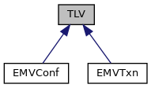
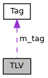

[Data Structures](#nested-classes) \| [Public Member Functions](#pub-methods) \| [Protected Member Functions](#pro-methods) \| [Protected Attributes](#pro-attribs)

`#include <`<a href="tlv_8h_source.md">tlv.h</a>`>`

Inheritance diagram for TLV:

\[<a href="graph_legend.md">legend</a>\]

Collaboration diagram for TLV:

\[<a href="graph_legend.md">legend</a>\]

|  |  |
|----|----|
| Data Structures |  |
| class   | <a href="classvfisdi_1_1_t_l_v_1_1_tag.md">Tag</a> |

|  |  |
|----|----|
| Public Member Functions |  |
|   | [TLV](#adadcd6e42174d9efaf5a865af404c110) (const char \*t) |
|   | [TLV](#a8a8f3aeb5d4c632ca8016ce176a21747) (unsigned t=0) |
|   | [TLV](#a88bf7d93f01d3f32956a08ab6f32f73c) (const <a href="classvfisdi_1_1_t_l_v_1_1_tag.md">Tag</a> &t) |
|   | [TLV](#aed2b08b3df2ad75ba400b3bf8dd774db) (const <a href="classvfisdi_1_1_t_l_v.md">TLV</a> &o) |
| <a href="classvfisdi_1_1_t_l_v.md">TLV</a> &  | [operator=](#a75d46eee22a46308f285eb71cae10157) (const <a href="classvfisdi_1_1_t_l_v.md">TLV</a> &o) |
| void  | [assign](#ae930d8b6374a5c5ec0bfd38daf6c1419) (const <a href="classvfisdi_1_1_t_l_v.md">TLV</a> &o) |
| void  | [tag](#a3eae1500a6c7de2686a8aa681ffda0f9) (const char \*t) |
| void  | [tag](#ab1ec860091384b859a71b54ecb0b4981) (unsigned t) |
| void  | [tag](#ad19dd4ec1fd1b22699e44b4fbb63a8cd) (const <a href="classvfisdi_1_1_t_l_v_1_1_tag.md">Tag</a> &t) |
| const <a href="classvfisdi_1_1_t_l_v_1_1_tag.md">Tag</a> &  | [tag](#ab329e76e88f49dd0d203def343e78adb) () const |
| void  | [operator=](#a82392f1ed229723c1c7df979f4e29087) (const std::string &data) |
| void  | [operator=](#a92d118aca55189a6549b6ce9c9117d97) (const char \*data) |
|   | [operator std::string](#a3888dcd59dd5acd1ca5b9bee4c2e252a) () const |
| std::string  | [getString](#a23bdc20544ca28878b1ffea144ac2730) () const |
| void  | [operator=](#a223ecb947b6d285e46543dab8042d2c5) (long data) |
| void  | [operator=](#a1a78e62dcebf1473663ab7952690f3ac) (int data) |
| void  | [operator=](#a77859fa0bdc7e0f43b79a26fe0da5c23) (unsigned data) |
|   | [operator long](#ad7ce59321a0dd63e7f1fab6dceabe53b) () const |
|   | [operator int](#a48d27bd92e68c69527589ea65a9af69f) () const |
|   | [operator unsigned](#a7fa77e07b31af13679aa65b9cd60e548) () const |
| long  | [getNumber](#af777e662a783ae11cf93d6b5d355277a) () const |
| unsigned long  | [getUnsigned](#a1ea25a489f43dcbe390a609ba912cbcb) () const |
| void  | [operator=](#afd260029cef89db3e86258c8ac847754) (bool data) |
|   | [operator bool](#a67b76affb3b5d35fa419ac234144038b) () const |
| bool  | [getBool](#a56e70a2d753746f23f8bfb677a030086) () const |
| void  | [operator=](#ad6daa5d828624745ba7e25921531f52f) (unsigned char data) |
|   | [operator unsigned char](#a891f3d5b152d0bd0b8bc27726d45a491) () const |
| unsigned char  | [getByte](#ad1a7498668250d5596044bf990ad35f5) () const |
| void  | [operator=](#a4d834054339da8c3b4f06c5b38dd5d30) (const std::vector\< unsigned char \> &data) |
| void  | [operator=](#a2ed0480b92a6c441073c7de9225f7b0c) (const std::vector\< char \> &data) |
| void  | [assign](#ab7fd53770bccecd3bde53277b9b53a29) (const void \*data, unsigned size) |
| std::vector\< unsigned char \> &  | [value](#a91ff9d66f21f0e4ec5fc1dc4a7f9a7e9) () |
| const std::vector\< unsigned char \> &  | [value](#a275964d772537b4db3c7bdec7d53f85c) () const |
| bool  | [load](#a34ae3b644043aa36d38f313a8d32217b) (const std::vector\< unsigned char \> &data, bool indefinite=false) |
| void  | [store](#ab49c30c493b589a012e3f6889baee8dd) (std::vector\< unsigned char \> &data, bool use_indefinite=false) const |
| bool  | [operator==](#adc704c269fd1ee99360afc447920358d) (const <a href="classvfisdi_1_1_t_l_v.md">TLV</a> &o) const |
| bool  | [operator!=](#a239917db00f9c13d7df8e323582532c8) (const <a href="classvfisdi_1_1_t_l_v.md">TLV</a> &o) const |
| void  | [dumptree](#a99aee2ed96208af2ef520b3d8e9c6d97) (bool use_indefinite=false, int indent=0, bool skip_toplevel_tag=true) |
| unsigned  | [count](#a5b0bf194cbc6562759f877a82aa5ad28) () const |
| <a href="classvfisdi_1_1_t_l_v.md">TLV</a> &  | [operator\[\]](#aea4f1a4a85b385f08634a6a8c6e317fa) (unsigned idx) |
| const <a href="classvfisdi_1_1_t_l_v.md">TLV</a> &  | [operator\[\]](#ada66e365c36d43f34151a9b7f5735c3e) (unsigned idx) const |
| void  | [erasepos](#ad1030ac85b7ccb1fe5e190a2d1b40c79) (unsigned idx) |
| <a href="classvfisdi_1_1_t_l_v.md">TLV</a> &  | [operator()](#a30b22ed76f2c6745d8a9d7d075917b72) (const char \*t, unsigned idx=0) |
| <a href="classvfisdi_1_1_t_l_v.md">TLV</a> &  | [operator()](#ad329e848a42ff3f39bd29a9f9c8c0b92) (unsigned t, unsigned idx=0) |
| <a href="classvfisdi_1_1_t_l_v.md">TLV</a> &  | [operator()](#ad406f97de0275e34b6516777846d2c3b) (const <a href="classvfisdi_1_1_t_l_v_1_1_tag.md">Tag</a> &t, unsigned idx=0) |
| unsigned  | [count](#a021f777c8da209f75e387bb78f1ddcbe) (const char \*t) const |
| unsigned  | [count](#a60bb5fe248b02ff1ccc01aacca577bd4) (unsigned t) const |
| unsigned  | [count](#a19377f556d4118d75da504a2159398e6) (const <a href="classvfisdi_1_1_t_l_v_1_1_tag.md">Tag</a> &t) const |
| unsigned  | [rename](#a4059a86d9d3afa2b94a53e8a7e428fd9) (const char \*from, const char \*to) |
| unsigned  | [rename](#ab78b6da71aa6afd0e5a46ada612c237f) (unsigned from, unsigned to) |
| unsigned  | [rename](#ad6fb714f198bc53716e9a713757076f0) (const <a href="classvfisdi_1_1_t_l_v_1_1_tag.md">Tag</a> &from, const <a href="classvfisdi_1_1_t_l_v_1_1_tag.md">Tag</a> &to) |
| bool  | [constructed](#a27abda24ad246b03c2244f695d7ba639) () const |
| <a href="classvfisdi_1_1_t_l_v.md">TLV</a> &  | [add](#aea80d57ebb1a89005665d685ded70bda) (const char \*t) |
| <a href="classvfisdi_1_1_t_l_v.md">TLV</a> &  | [add](#a9329215305b8bb3711fe9dbe73398aba) (unsigned t) |
| <a href="classvfisdi_1_1_t_l_v.md">TLV</a> &  | [add](#a272a220c4a8e3f194e6472586c6f1b60) (const <a href="classvfisdi_1_1_t_l_v_1_1_tag.md">Tag</a> &t) |
| void  | [clear](#ac8bb3912a3ce86b15842e79d0b421204) () |
| unsigned  | [erasetag](#a932be40e588c0287cb1fa38e4f3a152d) (const char \*t) |
| unsigned  | [erasetag](#a11104ed545ccded52eedb452b0150b08) (unsigned t) |
| unsigned  | [erasetag](#a13f15840dc0bdbf7c90020c6a4bc7ecc) (const <a href="classvfisdi_1_1_t_l_v_1_1_tag.md">Tag</a> &t) |

|  |  |
|----|----|
| Protected Member Functions |  |
| void  | [initSize](#a596d0da8a3f24918e1da061ab58e1ab3) (bool use_indefinite) |
| unsigned  | [storedSize](#a3cc82af912384a0099a9646cd0706815) (bool use_indefinite) const |
| void  | [storeAdd](#aeb3bb0b33fa1d0331fc810db5efddae0) (std::vector\< unsigned char \> &data, bool use_indefinite) const |
| bool  | [load](#af502026d9727fde52b81a3a64f3c620e) (const unsigned char \*&start, const unsigned char \*end, bool indefinite=false) |

|  |  |
|----|----|
| Protected Attributes |  |
| <a href="classvfisdi_1_1_t_l_v_1_1_tag.md">Tag</a>  | [m_tag](#a48ed14e787b1be6dd92a2782d11a4ff4) |
| std::vector\< unsigned char \>  | [m_data](#a4252108bbe731880b31e853b01cd16d0) |
| std::vector\< std::shared_ptr\< <a href="classvfisdi_1_1_t_l_v.md">TLV</a> \> \>  | [m_child](#afcc2734e12c53b8280390e586b4daf54) |
| unsigned  | [m_contentsize](#abf78ef14b931e61d33be622a0605f454) |

## DetailedDescription {#detailed-description}

class for handling X690 BER <a href="classvfisdi_1_1_t_l_v.md">TLV</a> encoding

A <a href="classvfisdi_1_1_t_l_v.md">TLV</a> object consists of a tag ID and value. The value can be either a primitive value or constructed from a list of <a href="classvfisdi_1_1_t_l_v.md">TLV</a> objects. Whether the object contains a primitive value or other objects is indicated by a flag in the tag ID and can be queried using the [TLV::constructed()](#a27abda24ad246b03c2244f695d7ba639) method. This flag is updated according to the acual use to prevent an inconsistent setting.

Contained <a href="classvfisdi_1_1_t_l_v.md">TLV</a> objects can be accessed by their index or by their tag ID (plus index). If the tag ID does not exist, it is created. If the index does not exist, a new index is added.

## Constructor& Destructor Documentation

## TLV()\[1/4\]  {#tlv-14}

<a href="classvfisdi_1_1_t_l_v.md">TLV</a>

inlineexplicit

constructor

**Parameters**

\[in\] **t** tag ID as string

## TLV()\[2/4\]  {#tlv-24}

<a href="classvfisdi_1_1_t_l_v.md">TLV</a>

inlineexplicit

constructor

**Parameters**

\[in\] **t** tag ID as number

## TLV()\[3/4\]  {#tlv-34}

<a href="classvfisdi_1_1_t_l_v.md">TLV</a>

inlineexplicit

constructor

**Parameters**

\[in\] **t** tag ID as tag object

## TLV()\[4/4\]  {#tlv-44}

<a href="classvfisdi_1_1_t_l_v.md">TLV</a>

copy constructor

## MemberFunction Documentation {#member-function-documentation}

## add()\[1/3\]  {#add-13}

<a href="classvfisdi_1_1_t_l_v.md">TLV</a>& add

inline

add tag to end of list

**Parameters**

\[in\] **t** tag ID as string

### Returns

reference to new tag object

## add()\[2/3\]  {#add-23}

<a href="classvfisdi_1_1_t_l_v.md">TLV</a>& add

add tag to end of list

**Parameters**

\[in\] **t** tag ID as tag object

### Returns

reference to new tag object

## add()\[3/3\]  {#add-33}

<a href="classvfisdi_1_1_t_l_v.md">TLV</a>& add

inline

add tag to end of list

**Parameters**

\[in\] **t** tag ID as number

### Returns

reference to new tag object

## assign()\[1/2\]  {#assign-12}

void assign

assign the content of *o*

**Parameters**

\[in\] **o** other element


Unlike the assignment operator, the tag is not copied to support the following use case: \[unsupported block\]


## assign()\[2/2\]  {#assign-22}

void assign

assign memory block

**Parameters**

\[in\] **data** start of memory block \[in\] **size** size of memory block

## clear() 

void clear

inline

clear value of current tag

## constructed() 

bool constructed

inline

### Returns

true if the current tag is constructed

## count()\[1/4\]  {#count-14}

unsigned count

inline

### Returns

number of children

## count()\[2/4\]  {#count-24}

unsigned count

inline

Determine the number of tags matching *t*

**Parameters**

\[in\] **t** tag ID as string

### Returns

number of tags

## count()\[3/4\]  {#count-34}

unsigned count

Determine the number of tags matching *t*

**Parameters**

\[in\] **t** tag ID as tag object

### Returns

number of tags

## count()\[4/4\]  {#count-44}

unsigned count

inline

Determine the number of tags matching *t*

**Parameters**

\[in\] **t** tag ID as number

### Returns

number of tags

## dumptree() 

void dumptree

print tree to stdout for debugging purposes

**Parameters**

\[in\] **use_indefinite** if true use indefinite length form, else use definite form \[in\] **indent** indentation level \[in\] **skip_toplevel_tag** skip toplevel tag, which is not part of the data

## erasepos() 

void erasepos

inline

erase child <a href="classvfisdi_1_1_t_l_v.md">TLV</a> object

**Parameters**

\[in\] **idx** child index, it must be in the range 0\...count()-1.


There is no range checking of *idx*, this must be handled by the caller


## erasetag()\[1/3\]  {#erasetag-13}

unsigned erasetag

inline

erase tag *t*

### Returns

number of erased tags

## erasetag()\[2/3\]  {#erasetag-23}

unsigned erasetag

erase tag *t*

### Returns

number of erased tags

## erasetag()\[3/3\]  {#erasetag-33}

unsigned erasetag

inline

erase tag *t*

### Returns

number of erased tags

## getBool() 

bool getBool

### Returns

value of primitive tag as boolean

## getByte() 

unsigned char getByte

### Returns

value of primitive tag as byte

## getNumber() 

long getNumber

### Returns

value of primitive tag as number

## getString() 

std::string getString

### Returns

value of primitive tag as string

## getUnsigned() 

unsigned long getUnsigned

### Returns

value of primitive tag as unsigned number

## initSize() 

void initSize

protected

recursively initialize m_contentsize

**Parameters**

\[in\] **use_indefinite** if true assume indefinite length form, else assume definite length form

## load()\[1/2\]  {#load-12}

bool load

inline

load binary <a href="classvfisdi_1_1_t_l_v.md">TLV</a> buffer into internal representation

**Parameters**

\[in\] **data** buffer containing TLV data \[in\] **indefinite** if true stop loading at terminating tag (00 00).

## load()\[2/2\]  {#load-22}

bool load

protected

load binary buffer to internal representation

**Parameters**

\[in,out\] **start** start of buffer, gets updated to position after parsing \[in\] **end** end of buffer \[in\] **indefinite** current tag uses indefinite length form, i.e. 0x00 0x00 will terminate current tag.

## operatorbool()  {#operator-bool}

operator bool

inline

### Returns

value of primitive tag as boolean

## operatorint()  {#operator-int}

operator int

inline

### Returns

value of primitive tag as number

## operatorlong()  {#operator-long}

operator long

inline

### Returns

value of primitive tag as number

## operatorstd::string()  {#operator-stdstring}

operator std::string

inline

### Returns

value of primitive tag as string

## operatorunsigned()  {#operator-unsigned}

operator unsigned

inline

### Returns

value of primitive tag as number

## operatorunsigned char()  {#operator-unsigned-char}

operator unsigned char

inline

### Returns

value of primitive tag as byte

## operator!=() 

bool operator!=

inline

compare two <a href="classvfisdi_1_1_t_l_v.md">TLV</a> objects

**Parameters**

\[in\] **o** other object

### Returns

true if not equal else false

## operator()()\[1/3\]  {#operator-13}

<a href="classvfisdi_1_1_t_l_v.md">TLV</a>& operator()

inline

access *idx-th* tag having tag value *t*

**Parameters**

\[in\] **t** tag ID as string \[in\] **idx** index of tag

### Returns

reference to tag object


If the tag is not found, it is created


## operator()()\[2/3\]  {#operator-23}

<a href="classvfisdi_1_1_t_l_v.md">TLV</a>& operator()

access *idx-th* tag having tag value *t*

**Parameters**

\[in\] **t** tag ID as tag object \[in\] **idx** index of tag

### Returns

reference to tag object


If the tag is not found, it is created


## operator()()\[3/3\]  {#operator-33}

<a href="classvfisdi_1_1_t_l_v.md">TLV</a>& operator()

inline

access *idx-th* tag having tag value *t*

**Parameters**

\[in\] **t** tag ID as number \[in\] **idx** index of tag

### Returns

reference to tag object


If the tag is not found, it is created


## operator=()\[1/10\]  {#operator-110}

void operator=

assign boolean

**Parameters**

\[in\] **data** value;

## operator=()\[2/10\]  {#operator-210}

void operator=

assign string value

**Parameters**

\[in\] **data** value

## operator=()\[3/10\]  {#operator-310}

void operator=

assign string value

**Parameters**

\[in\] **data** value

## operator=()\[4/10\]  {#operator-410}

void operator=

assign vector

**Parameters**

\[in\] **data** value

## operator=()\[5/10\]  {#operator-510}

void operator=

assign vector

**Parameters**

\[in\] **data** value

## operator=()\[6/10\]  {#operator-610}

<a href="classvfisdi_1_1_t_l_v.md">TLV</a>& operator=

assignment operator

### Returns

reference to this

## operator=()\[7/10\]  {#operator-710}

void operator=

inline

## operator=()\[8/10\]  {#operator-810}

void operator=

assign number

**Parameters**

\[in\] **data** value

## operator=()\[9/10\]  {#operator-910}

void operator=

assign unsigned char

**Parameters**

\[in\] **data** value;

## operator=()\[10/10\]  {#operator-1010}

void operator=

inline

## operator==() 

bool operator==

compare two <a href="classvfisdi_1_1_t_l_v.md">TLV</a> objects

**Parameters**

\[in\] **o** other object

### Returns

true if equal else false

## operator\[\]()\[1/2\]  {#operator-12}

<a href="classvfisdi_1_1_t_l_v.md">TLV</a>& operator\[\]

inline

access child <a href="classvfisdi_1_1_t_l_v.md">TLV</a> object

**Parameters**

\[in\] **idx** child index, it must be in the range 0\...count()-1.

### Returns

reference to child


There is no range checking of *idx*, this must be handled by the caller


## operator\[\]()\[2/2\]  {#operator-22}

const <a href="classvfisdi_1_1_t_l_v.md">TLV</a>& operator\[\]

inline

access child <a href="classvfisdi_1_1_t_l_v.md">TLV</a> object

**Parameters**

\[in\] **idx** child index, it must be in the range 0\...count()-1.

### Returns

const reference to child


There is no range checking of *idx*, this must be handled by the caller


## rename()\[1/3\]  {#rename-13}

unsigned rename

inline

Rename all tags matching *from* to *to*

### Returns

number of renamed tags

## rename()\[2/3\]  {#rename-23}

unsigned rename

Rename all tags matching *from* to *to*

### Returns

number of renamed tags

## rename()\[3/3\]  {#rename-33}

unsigned rename

inline

Rename all tags matching *from* to *to*

### Returns

number of renamed tags

## store() 

void store

store internal representation to binary <a href="classvfisdi_1_1_t_l_v.md">TLV</a> buffer

**Parameters**

\[out\] **data** output buffer \[in\] **use_indefinite** if true use indefinite length form, else use definite form

## storeAdd() 

void storeAdd

protected

add binary dump to buffer

**Parameters**

\[out\] **data** output buffer \[in\] **use_indefinite** if true assume indefinite length form, else assume definite length form

## storedSize() 

unsigned storedSize

protected

Determine size required for binary representation of this tag and value

**Parameters**

\[in\] **use_indefinite** if true assume indefinite length form, else assume definite length form

### Returns

size in bytes

## tag()\[1/4\]  {#tag-14}

const <a href="classvfisdi_1_1_t_l_v_1_1_tag.md">Tag</a>& tag

inline

get tag ID as tag object

## tag()\[2/4\]  {#tag-24}

void tag

inline

set tag ID

**Parameters**

\[in\] **t** tag ID as string


based on the contained constructed flag data or children are cleared.


## tag()\[3/4\]  {#tag-34}

void tag

set tag ID

**Parameters**

\[in\] **t** tag ID as tag object


based on the contained constructed flag data or children are cleared.


## tag()\[4/4\]  {#tag-44}

void tag

inline

set tag ID

**Parameters**

\[in\] **t** tag ID as number


based on the contained constructed flag data or children are cleared.


## value()\[1/2\]  {#value-12}

std::vector\<unsigned char\>& value

### Returns

reference to value of primitive tag as buffer


If the tag is not primitive, it is converted to primitive


It is allowed to update the value of the buffer


## value()\[2/2\]  {#value-22}

const std::vector\<unsigned char\>& value

### Returns

const reference to value of primitive tag as buffer

## FieldDocumentation {#field-documentation}

## m_child 

std::vector\<std::shared_ptr\<<a href="classvfisdi_1_1_t_l_v.md">TLV</a>\> \> m_child

protected

## m_contentsize 

unsigned m_contentsize

protected

## m_data 

std::vector\<unsigned char\> m_data

protected

## m_tag 

<a href="classvfisdi_1_1_t_l_v_1_1_tag.md">Tag</a> m_tag

protected

------------------------------------------------------------------------

The documentation for this class was generated from the following file:

- sdiapi/src/sdiapi/<a href="tlv_8h_source.md">tlv.h</a>
