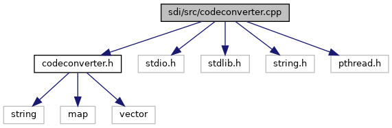

`#include "`<a href="codeconverter_8h_source.md">codeconverter.h</a>`"`
`#include <stdio.h>`
`#include <stdlib.h>`
`#include <string.h>`
`#include <pthread.h>`

Include dependency graph for codeconverter.cpp:

