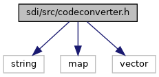
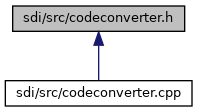

[Data Structures](#nested-classes)

`#include <string>`
`#include <map>`
`#include <vector>`

Include dependency graph for codeconverter.h:

This graph shows which files directly or indirectly include this file:

<a href="codeconverter_8h_source.md">Go to the source code of this file.</a>

|  |  |
|----|----|
| Data Structures |  |
| class   | <a href="class_code_converter.md">CodeConverter</a> |
