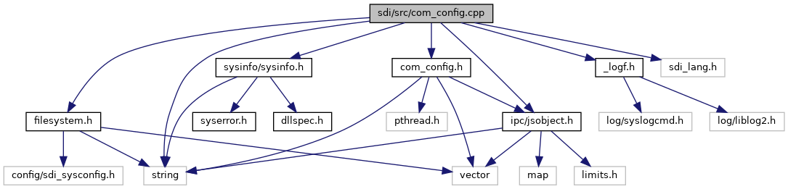

[Macros](#define-members)

`#include "`<a href="com__config_8h_source.md">com_config.h</a>`"`
`#include "`<a href="__logf_8h_source.md">_logf.h</a>`"`
`#include "`<a href="filesystem_8h_source.md">filesystem.h</a>`"`
`#include "`<a href="ipc_2src_2ipc_2jsobject_8h_source.md">ipc/jsobject.h</a>`"`
`#include "`<a href="sysinfo_8h_source.md">sysinfo/sysinfo.h</a>`"`

Include dependency graph for com_config.cpp:

|          |                                                                 |
|----------|-----------------------------------------------------------------|
| Macros   |                                                                 |
| #define  | [BT_NUM_PAIRED_DEFAULT](#a1c2bb05fa64e684d95adc08932df8368)   2 |

## MacroDefinition Documentation {#macro-definition-documentation}

## BT_NUM_PAIRED_DEFAULT 

#define BT_NUM_PAIRED_DEFAULT   2

