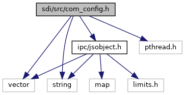
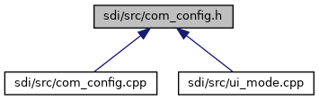

[Data Structures](#nested-classes)

`#include <vector>`
`#include <string>`
`#include <pthread.h>`
`#include "`<a href="ipc_2src_2ipc_2jsobject_8h_source.md">ipc/jsobject.h</a>`"`

Include dependency graph for com_config.h:

This graph shows which files directly or indirectly include this file:

<a href="com__config_8h_source.md">Go to the source code of this file.</a>

|                 |                                                      |
|-----------------|------------------------------------------------------|
| Data Structures |                                                      |
| class           | <a href="class_com_config.md">ComConfig</a> |
