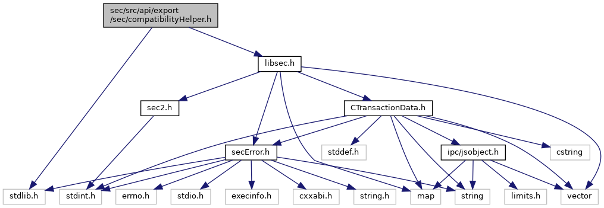
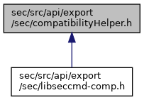

[Macros](#define-members) \| [Functions](#func-members)

ADK Security Service Compatibility Helper. [More\...](#details)

`#include <stdlib.h>`
`#include "`<a href="libsec_8h_source.md">libsec.h</a>`"`

Include dependency graph for compatibilityHelper.h:

This graph shows which files directly or indirectly include this file:

<a href="compatibility_helper_8h_source.md">Go to the source code of this file.</a>

|          |                                                  |
|----------|--------------------------------------------------|
| Macros   |                                                  |
| #define  | [DllSpecSEC](#abcde1739ffe76c2296e21ce0b20f0ad3) |

|  |  |
|----|----|
| Functions |  |
| <a href="seclogging_8h.md#abcde1739ffe76c2296e21ce0b20f0ad3">DllSpecSEC</a> <a href="namespacecom__adksec__cmd.md#af511ddd4237541a758df48299546d49a">secError</a>  | [secCompatiblity_getHandle](#ac79c8c0a41c9bba814b42995603baa22) (u_char oldHandle, <a href="namespacecom__adksec__cmd.md#acc01edab4b0f73c92142d9d43dc7a7f7">secHandle_t</a> &newHandle) |
| <a href="seclogging_8h.md#abcde1739ffe76c2296e21ce0b20f0ad3">DllSpecSEC</a> u_char  | [secCompatiblity_registerHandle](#a34b8aab2fb340e474a11575053b2ae8f) (<a href="namespacecom__adksec__cmd.md#acc01edab4b0f73c92142d9d43dc7a7f7">secHandle_t</a> handle, u_char hash=0) |
| <a href="seclogging_8h.md#abcde1739ffe76c2296e21ce0b20f0ad3">DllSpecSEC</a> <a href="namespacecom__adksec__cmd.md#af511ddd4237541a758df48299546d49a">secError</a>  | [secCompatiblity_deregisterHandle](#a623f6cdd66cdb0f2c00396f4437ab0a5) (u_char oldHandle) |

## DetailedDescription {#detailed-description}

ADK Security Service Compatibility Helper.

### Author

JensW

### Date

06.06.2016

## MacroDefinition Documentation {#macro-definition-documentation}

## DllSpecSEC 

#define DllSpecSEC

## FunctionDocumentation {#function-documentation}

## secCompatiblity_deregisterHandle() 

<a href="seclogging_8h.md#abcde1739ffe76c2296e21ce0b20f0ad3">DllSpecSEC</a> <a href="namespacecom__adksec__cmd.md#af511ddd4237541a758df48299546d49a">secError</a> secCompatiblity_deregisterHandle

## secCompatiblity_getHandle() 

<a href="seclogging_8h.md#abcde1739ffe76c2296e21ce0b20f0ad3">DllSpecSEC</a> <a href="namespacecom__adksec__cmd.md#af511ddd4237541a758df48299546d49a">secError</a> secCompatiblity_getHandle

## secCompatiblity_registerHandle() 

<a href="seclogging_8h.md#abcde1739ffe76c2296e21ce0b20f0ad3">DllSpecSEC</a> u_char secCompatiblity_registerHandle

