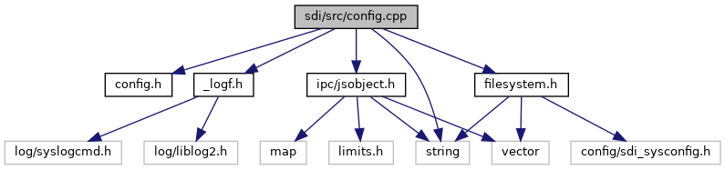

`#include "`<a href="config_8h_source.md">config.h</a>`"`
`#include "`<a href="__logf_8h_source.md">_logf.h</a>`"`
`#include <string>`
`#include "`<a href="ipc_2src_2ipc_2jsobject_8h_source.md">ipc/jsobject.h</a>`"`
`#include "`<a href="filesystem_8h_source.md">filesystem.h</a>`"`

Include dependency graph for config.cpp:

