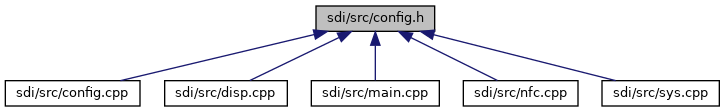

[Data Structures](#nested-classes)

This graph shows which files directly or indirectly include this file:

<a href="config_8h_source.md">Go to the source code of this file.</a>

|                 |                                               |
|-----------------|-----------------------------------------------|
| Data Structures |                                               |
| class           | <a href="class_config.md">Config</a> |
