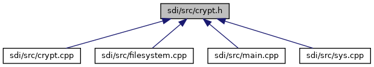

[Enumerations](#enum-members) \| [Functions](#func-members)

This graph shows which files directly or indirectly include this file:

<a href="crypt_8h_source.md">Go to the source code of this file.</a>

|  |  |
|----|----|
| Enumerations |  |
| enum   | [Inputype](#adcc10b90a6f6d8e58954648e01763711) { [INPUT_TYPE_FILE](#adcc10b90a6f6d8e58954648e01763711a3ea0caa77a66799987c3b1bed67f68e7), [INPUT_TYPE_BUFFER](#adcc10b90a6f6d8e58954648e01763711a79533d6f7db12575872d194e46769c03) } |
| enum   | [AuthStep](#ab97c53cf460f4280eb94c660cb5e357d) { [AuthStep_1](#ab97c53cf460f4280eb94c660cb5e357daaebd9d60a1ddde880987bf24245973c3) = 0, [AuthStep_2](#ab97c53cf460f4280eb94c660cb5e357dabec33001d7f7ca8a469ffcc2e449d20a) } |

|  |  |
|----|----|
| Functions |  |
| int  | [check_AuthScript](#aa132af50976d028410ad9789f5ec5aab) () |
| int  | [system_Auth](#a853e613db30d5f21771dd5b5ba76b989) (enum [AuthStep](#ab97c53cf460f4280eb94c660cb5e357d) as, unsigned char \*in, unsigned short in_size, unsigned char \*out, unsigned short \*out_size) |
| int  | [calculate_CMAC](#affad0aaba09298a627562b262e523d93) ([Inputype](#adcc10b90a6f6d8e58954648e01763711) type, const char \*fileToMAC, unsigned char \*dataToMAC, unsigned dataSize, unsigned char \*MAC) |
| int  | [check_CMAC](#a3242ff53cdc315266c6a352f86359c70) ([Inputype](#adcc10b90a6f6d8e58954648e01763711) type, const char \*filename, unsigned char \*data, unsigned dataSize, unsigned char \*MAC) |
| int  | [encrypt_Data](#a7e77c714fd81df4137cfc32dc7af3584) (unsigned char \*data, unsigned long dataSize, unsigned char \*encryptedData, unsigned long \*encryptedDataSize) |
| int  | [decrypt_Data](#ab52056b7a75e86920c5b03cf2d3730ad) (unsigned char \*data, unsigned long dataSize, unsigned char \*decryptedData, unsigned long \*decryptedDataSize) |
| int  | [calculate_MD5](#a9d396bd846d00eab3b94e9c2763236cc) (const char \*file, unsigned char \*checkSum) |

## EnumerationType Documentation {#enumeration-type-documentation}

## AuthStep 

enum [AuthStep](#ab97c53cf460f4280eb94c660cb5e357d)

| Enumerator  |                                                       |
|-------------|-------------------------------------------------------|
| AuthStep_1  | 
System Authentication Step 1
 |
| AuthStep_2  | 
System Authentication Step 2
 |

## Inputype 

enum [Inputype](#adcc10b90a6f6d8e58954648e01763711)

| Enumerator         |                                                    |
|--------------------|----------------------------------------------------|
| INPUT_TYPE_FILE    | 
Calculate MAC from file
   |
| INPUT_TYPE_BUFFER  | 
Calculate MAC from buffer
 |

## FunctionDocumentation {#function-documentation}

## calculate_CMAC() 

int calculate_CMAC

Calculate the CMAC value for the given data

**Parameters**

\[in\] **type** input type. can be a file or a data buffer \[in\] **fileToMAC** file name (when input type is INPUT_TYPE_FILE) \[in\] **dataToMAC** pointer to input message buffer (when input type is INPUT_TYPE_BUFFER) \[in\] **dataSize** size of the input message (when input type is INPUT_TYPE_BUFFER) \[in,out\] **MAC** pointer to the MAC value buffer

### Returns

RESULT_OK on success otherwise RESULT_FAIL

## calculate_MD5() 

int calculate_MD5

Compute and MD5 digest of file `file`

**Parameters**

\[in\] **file** file of which MD5 checksum shall be calculated \[out\] **checkSum** output buffer for calculated MD5 checksum, buffer must have at least 16 bytes

### Returns

1 for success, else 0 for error (e.g. file does not exist)

## check_AuthScript() 

int check_AuthScript

checks the status of VSS script used for SDI message integrity check (message MAC) and SDI message encryption

### Returns

RESULT_OK for success, else RESULT_FAIL for failure

## check_CMAC() 

int check_CMAC

Check the CMAC value of the given data

**Parameters**

\[in\] **type** input type. can be a file or a data buffer \[in\] **filename** file name (when input type is INPUT_TYPE_FILE) \[in\] **data** pointer to input message buffer (when input type is INPUT_TYPE_BUFFER) \[in\] **dataSize** size of the input message (when input type is INPUT_TYPE_BUFFER) \[in\] **MAC** pointer to the MAC value buffer

### Returns

RESULT_OK on success otherwise RESULT_FAIL

## decrypt_Data() 

int decrypt_Data

Decrypt the given data

**Parameters**

\[in\] **data** pointer to input message buffer \[in\] **dataSize** size of the input message \[in,out\] **decryptedData** pointer to decrypted data buffer \[in,out\] **decryptedDataSize** pointer to decrypted data buffer size

### Returns

RESULT_OK on success otherwise RESULT_FAIL

## encrypt_Data() 

int encrypt_Data

Encrypt the given data

**Parameters**

\[in\] **data** pointer to input message buffer \[in\] **dataSize** size of the input message \[in,out\] **encryptedData** pointer to encrypted data buffer \[in,out\] **encryptedDataSize** pointer to encrypted data buffer size

### Returns

RESULT_OK on success otherwise RESULT_FAIL

## system_Auth() 

int system_Auth

Process System Authentication step 1 or 2. With success of step 2, the SDI client (Server) is successfully authenticated against SDI server (E105). In addition, the session key (SK) was stored to vault successfully. This is the prerequisite that other functions [calculate_CMAC()](#affad0aaba09298a627562b262e523d93), [check_CMAC()](#a3242ff53cdc315266c6a352f86359c70), [encrypt_Data()](#a7e77c714fd81df4137cfc32dc7af3584) and [decrypt_Data()](#ab52056b7a75e86920c5b03cf2d3730ad) will work, since these functions use the session key (SK).

**Parameters**

\[in\] **as** For System Authentication Step 1: AuthStep_1 For System Authentication Step 2: AuthStep_2 Input and output data of this function depend on this parameter (see below). \[in\] **in** pointer to input data buffer For AuthStep_1 (16 bytes): 16 bytes (Server random, plain) For AuthStep_2 (32 bytes): \[16 bytes (E105 token) + 16 bytes (Server token)\] SK encrypted \[in\] **in_size** size of input buffer (depend on auth. step, see parameter in) \[out\] **out** pointer to output buffer For AuthStep_1 (42 bytes): \[16 bytes (E105 token) + 16 bytes (E105 token)\] DUKPT encrypted + 10 bytes (KSN) For AuthStep_2 (32 bytes): \[16 bytes (Server token) + 16 bytes (E105 serial number)\] SK encrypted \[in,out\] **out_size** in: size of output buffer out: size of output buffer data (depend on auth. step, see parameter out)

### Returns

RESULT_OK for success, else RESULT_FAIL for failure
