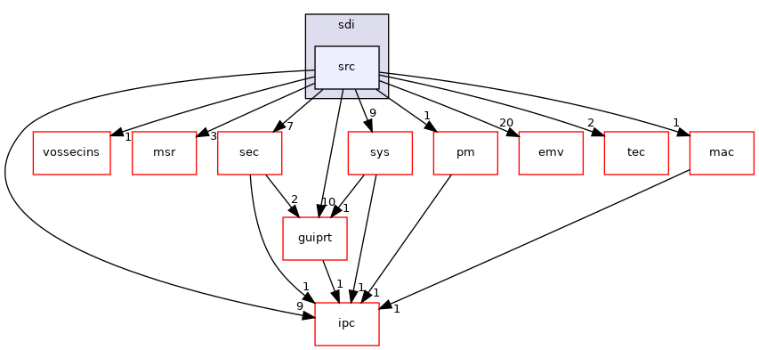

Directory dependency graph for src:

|  |  |
|----|----|
| Files |  |
| file   | <a href="__logf_8h.md">_logf.h</a> <a href="__logf_8h_source.md">[code]</a> |
| file   | <a href="btlv__helper_8h.md">btlv_helper.h</a> <a href="btlv__helper_8h_source.md">[code]</a> |
| file   | <a href="codeconverter_8cpp.md">codeconverter.cpp</a> |
| file   | <a href="codeconverter_8h.md">codeconverter.h</a> <a href="codeconverter_8h_source.md">[code]</a> |
| file   | <a href="com__config_8cpp.md">com_config.cpp</a> |
| file   | <a href="com__config_8h.md">com_config.h</a> <a href="com__config_8h_source.md">[code]</a> |
| file   | <a href="config_8cpp.md">config.cpp</a> |
| file   | <a href="config_8h.md">config.h</a> <a href="config_8h_source.md">[code]</a> |
| file   | <a href="crypt_8cpp.md">crypt.cpp</a> |
| file   | <a href="crypt_8h.md">crypt.h</a> <a href="crypt_8h_source.md">[code]</a> |
| file   | <a href="directory_8cpp.md">directory.cpp</a> |
| file   | <a href="directory_8h.md">directory.h</a> <a href="directory_8h_source.md">[code]</a> |
| file   | <a href="disp_8cpp.md">disp.cpp</a> |
| file   | <a href="disp_8h.md">disp.h</a> <a href="disp_8h_source.md">[code]</a> |
| file   | <a href="filesystem_8cpp.md">filesystem.cpp</a> |
| file   | <a href="filesystem_8h.md">filesystem.h</a> <a href="filesystem_8h_source.md">[code]</a> |
| file   | <a href="hexutil_8cpp.md">hexutil.cpp</a> |
| file   | <a href="sdi_2src_2hexutil_8h.md">hexutil.h</a> <a href="sdi_2src_2hexutil_8h_source.md">[code]</a> |
| file   | <a href="ipcserver_8h.md">ipcserver.h</a> <a href="ipcserver_8h_source.md">[code]</a> |
| file   | <a href="keypad_8cpp.md">keypad.cpp</a> |
| file   | <a href="keypad_8h.md">keypad.h</a> <a href="keypad_8h_source.md">[code]</a> |
| file   | <a href="keypad__k81_8cpp.md">keypad_k81.cpp</a> |
| file   | <a href="loadplugin_8cpp.md">loadplugin.cpp</a> |
| file   | <a href="loadplugin_8h.md">loadplugin.h</a> <a href="loadplugin_8h_source.md">[code]</a> |
| file   | <a href="madk__pp__protocol_8cpp.md">madk_pp_protocol.cpp</a> |
| file   | <a href="madk__pp__protocol_8h.md">madk_pp_protocol.h</a> <a href="madk__pp__protocol_8h_source.md">[code]</a> |
| file   | <a href="main_8cpp.md">main.cpp</a> |
| file   | <a href="main_8h.md">main.h</a> <a href="main_8h_source.md">[code]</a> |
| file   | <a href="md5_8cpp.md">md5.cpp</a> |
| file   | <a href="md5_8h.md">md5.h</a> <a href="md5_8h_source.md">[code]</a> |
| file   | <a href="nfc_8cpp.md">nfc.cpp</a> |
| file   | <a href="nfc_8h.md">nfc.h</a> <a href="nfc_8h_source.md">[code]</a> |
| file   | <a href="pathutil_8cpp.md">pathutil.cpp</a> |
| file   | <a href="pathutil_8h.md">pathutil.h</a> <a href="pathutil_8h_source.md">[code]</a> |
| file   | <a href="ped_8cpp.md">ped.cpp</a> |
| file   | <a href="sdi_2src_2ped_8h.md">ped.h</a> <a href="sdi_2src_2ped_8h_source.md">[code]</a> |
| file   | <a href="prt_8cpp.md">prt.cpp</a> |
| file   | <a href="sdi_2src_2prt_8h.md">prt.h</a> <a href="sdi_2src_2prt_8h_source.md">[code]</a> |
| file   | <a href="prt__bitmap_8h.md">prt_bitmap.h</a> <a href="prt__bitmap_8h_source.md">[code]</a> |
| file   | <a href="prt__bitmap__k81_8cpp.md">prt_bitmap_k81.cpp</a> |
| file   | <a href="prt__bitmap__png_8cpp.md">prt_bitmap_png.cpp</a> |
| file   | <a href="prt__bitmap__vos_8cpp.md">prt_bitmap_vos.cpp</a> |
| file   | <a href="pthreadutil_8c.md">pthreadutil.c</a> |
| file   | <a href="pthreadutil_8h.md">pthreadutil.h</a> <a href="pthreadutil_8h_source.md">[code]</a> |
| file   | <a href="sdi__lang_8cpp.md">sdi_lang.cpp</a> |
| file   | <a href="sdi__lang_8h.md">sdi_lang.h</a> <a href="sdi__lang_8h_source.md">[code]</a> |
| file   | <a href="src_2sdi__tags_8h.md">sdi_tags.h</a> <a href="src_2sdi__tags_8h_source.md">[code]</a> |
| file   | <a href="sdi__text_8cpp.md">sdi_text.cpp</a> |
| file   | <a href="sdi__text_8h.md">sdi_text.h</a> <a href="sdi__text_8h_source.md">[code]</a> |
| file   | <a href="sdi__timer_8cpp.md">sdi_timer.cpp</a> |
| file   | <a href="sdi__timer_8h.md">sdi_timer.h</a> <a href="sdi__timer_8h_source.md">[code]</a> |
| file   | <a href="sdikeyservice_8cpp.md">sdikeyservice.cpp</a> |
| file   | <a href="sdikeyservice_8h.md">sdikeyservice.h</a> <a href="sdikeyservice_8h_source.md">[code]</a> |
| file   | <a href="sdiplugin_8h.md">sdiplugin.h</a> <a href="sdiplugin_8h_source.md">[code]</a> |
| file   | <a href="sec_8cpp.md">sec.cpp</a> |
| file   | <a href="sec_8h.md">sec.h</a> <a href="sec_8h_source.md">[code]</a> |
| file   | <a href="sys_8cpp.md">sys.cpp</a> |
| file   | <a href="sys_8h.md">sys.h</a> <a href="sys_8h_source.md">[code]</a> |
| file   | <a href="thread_8cpp.md">thread.cpp</a> |
| file   | <a href="thread_8h.md">thread.h</a> <a href="thread_8h_source.md">[code]</a> |
| file   | <a href="timestamp_8cpp.md">timestamp.cpp</a> |
| file   | <a href="sdi_2src_2timestamp_8h.md">timestamp.h</a> <a href="sdi_2src_2timestamp_8h_source.md">[code]</a> |
| file   | <a href="titusstubs_8cpp.md">titusstubs.cpp</a> |
| file   | <a href="touch_8cpp.md">touch.cpp</a> |
| file   | <a href="touch_8h.md">touch.h</a> <a href="touch_8h_source.md">[code]</a> |
| file   | <a href="touch__demo_8cpp.md">touch_demo.cpp</a> |
| file   | <a href="touch__k81_8cpp.md">touch_k81.cpp</a> |
| file   | <a href="tracefilter_8cpp.md">tracefilter.cpp</a> |
| file   | <a href="tracefilter_8h.md">tracefilter.h</a> <a href="tracefilter_8h_source.md">[code]</a> |
| file   | <a href="ui_8cpp.md">ui.cpp</a> |
| file   | <a href="ui_8h.md">ui.h</a> <a href="ui_8h_source.md">[code]</a> |
| file   | <a href="ui__mode_8cpp.md">ui_mode.cpp</a> |
| file   | <a href="ui__mode_8h.md">ui_mode.h</a> <a href="ui__mode_8h_source.md">[code]</a> |
| file   | <a href="ui__priv_8cpp.md">ui_priv.cpp</a> |
| file   | <a href="util_8cpp.md">util.cpp</a> |
| file   | <a href="sdi_2src_2util_8h.md">util.h</a> <a href="sdi_2src_2util_8h_source.md">[code]</a> |
| file   | <a href="vcl__ser_8cpp.md">vcl_ser.cpp</a> |
| file   | <a href="vcl__ser_8h.md">vcl_ser.h</a> <a href="vcl__ser_8h_source.md">[code]</a> |
| file   | <a href="xmldoc_8c.md">xmldoc.c</a> |
| file   | <a href="xmldoc_8h.md">xmldoc.h</a> <a href="xmldoc_8h_source.md">[code]</a> |
