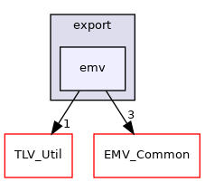

Directory dependency graph for emv:

|  |  |
|----|----|
| Files |  |
| file   | <a href="_e2_e___e_m_v___c_t___serialize_8h.md">E2E_EMV_CT_Serialize.h</a> <a href="_e2_e___e_m_v___c_t___serialize_8h_source.md">[code]</a> |
| file   | <a href="_e_m_v___c_t___interface_8h.md">EMV_CT_Interface.h</a> <a href="_e_m_v___c_t___interface_8h_source.md">[code]</a> |
|   | Interface of CT-Client.  |
| file   | <a href="_e_m_v___c_t___link_8h.md">EMV_CT_Link.h</a> <a href="_e_m_v___c_t___link_8h_source.md">[code]</a> |
| file   | <a href="_e_m_v___c_t___ser_interface_8h.md">EMV_CT_SerInterface.h</a> <a href="_e_m_v___c_t___ser_interface_8h_source.md">[code]</a> |
|   | Interface of CT-Framework.  |
| file   | <a href="_e_m_v___c_t___x_m_l_8h.md">EMV_CT_XML.h</a> <a href="_e_m_v___c_t___x_m_l_8h_source.md">[code]</a> |
