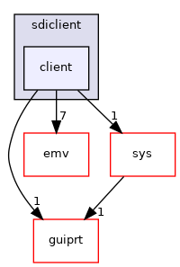

Directory dependency graph for client:

|  |  |
|----|----|
| Files |  |
| file   | <a href="sdi__data_8h.md">sdi_data.h</a> <a href="sdi__data_8h_source.md">[code]</a> |
| file   | <a href="sdiclient_2client_2sdi__emv_8h.md">sdi_emv.h</a> <a href="sdiclient_2client_2sdi__emv_8h_source.md">[code]</a> |
| file   | <a href="sdi__if_8h.md">sdi_if.h</a> <a href="sdi__if_8h_source.md">[code]</a> |
| file   | <a href="sdi__nfc_8h.md">sdi_nfc.h</a> <a href="sdi__nfc_8h_source.md">[code]</a> |
