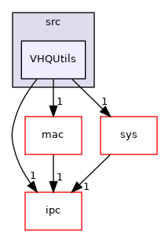

Directory dependency graph for VHQUtils:

|  |  |
|----|----|
| Files |  |
| file   | <a href="_v_h_q_debug_8c.md">VHQDebug.c</a> |
| file   | <a href="_v_h_q_utils___app_interface_8c.md">VHQUtils_AppInterface.c</a> |
| file   | <a href="_v_h_q_utils___content_8c.md">VHQUtils_Content.c</a> |
| file   | <a href="_v_h_q_utils___m_x_8c.md">VHQUtils_MX.c</a> |
| file   | <a href="_v_h_q_utils__shared_8c.md">VHQUtils_shared.c</a> |
| file   | <a href="_v_h_q_utils__shared__cpp_8cpp.md">VHQUtils_shared_cpp.cpp</a> |
| file   | <a href="_v_h_q_utils__timezone_8c.md">VHQUtils_timezone.c</a> |
