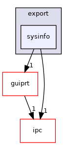

Directory dependency graph for sysinfo:

|  |  |
|----|----|
| Files |  |
| file   | <a href="dllspec_8h.md">dllspec.h</a> <a href="dllspec_8h_source.md">[code]</a> |
| file   | <a href="inifile_8h.md">inifile.h</a> <a href="inifile_8h_source.md">[code]</a> |
| file   | <a href="leds_8h.md">leds.h</a> <a href="leds_8h_source.md">[code]</a> |
| file   | <a href="sys_2export_2sysinfo_2netloader_8h.md">netloader.h</a> <a href="sys_2export_2sysinfo_2netloader_8h_source.md">[code]</a> |
| file   | <a href="sysbar_8h.md">sysbar.h</a> <a href="sysbar_8h_source.md">[code]</a> |
| file   | <a href="sysbase_8h.md">sysbase.h</a> <a href="sysbase_8h_source.md">[code]</a> |
| file   | <a href="sysbeep_8h.md">sysbeep.h</a> <a href="sysbeep_8h_source.md">[code]</a> |
| file   | <a href="syserror_8h.md">syserror.h</a> <a href="syserror_8h_source.md">[code]</a> |
| file   | <a href="sysinfo_8h.md">sysinfo.h</a> <a href="sysinfo_8h_source.md">[code]</a> |
| file   | <a href="sysinstall_8h.md">sysinstall.h</a> <a href="sysinstall_8h_source.md">[code]</a> |
| file   | <a href="syspm_8h.md">syspm.h</a> <a href="syspm_8h_source.md">[code]</a> |
| file   | <a href="sys_2export_2sysinfo_2util_8h.md">util.h</a> <a href="sys_2export_2sysinfo_2util_8h_source.md">[code]</a> |
| file   | <a href="sys_2export_2sysinfo_2zontalk_8h.md">zontalk.h</a> <a href="sys_2export_2sysinfo_2zontalk_8h_source.md">[code]</a> |
