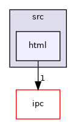

Directory dependency graph for html:

|  |  |
|----|----|
| Files |  |
| file   | <a href="gui_8h.md">gui.h</a> <a href="gui_8h_source.md">[code]</a> |
| file   | <a href="gui__error_8h.md">gui_error.h</a> <a href="gui__error_8h_source.md">[code]</a> |
| file   | <a href="gui__template_8h.md">gui_template.h</a> <a href="gui__template_8h_source.md">[code]</a> |
| file   | <a href="input__plugin_8h.md">input_plugin.h</a> <a href="input__plugin_8h_source.md">[code]</a> |
| file   | <a href="guiprt_2src_2html_2jsobject_8h.md">jsobject.h</a> <a href="guiprt_2src_2html_2jsobject_8h_source.md">[code]</a> |
| file   | <a href="jsproc_8h.md">jsproc.h</a> <a href="jsproc_8h_source.md">[code]</a> |
| file   | <a href="guiprt_2src_2html_2prt_8h.md">prt.h</a> <a href="guiprt_2src_2html_2prt_8h_source.md">[code]</a> |
| file   | <a href="scriptproc_8h.md">scriptproc.h</a> <a href="scriptproc_8h_source.md">[code]</a> |
| file   | <a href="guiprt_2src_2html_2timestamp_8h.md">timestamp.h</a> <a href="guiprt_2src_2html_2timestamp_8h_source.md">[code]</a> |
| file   | <a href="types_8h.md">types.h</a> <a href="types_8h_source.md">[code]</a> |
