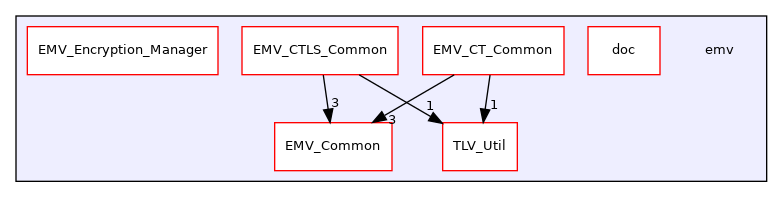

Directory dependency graph for emv:

|  |  |
|----|----|
| Directories |  |
| directory   | <a href="dir_7075036b6dd22f3e14168b8473975c83.md">doc</a> |
| directory   | <a href="dir_80881f393df249dc583814c3f321a110.md">EMV_Common</a> |
| directory   | <a href="dir_a8473f4b62cdc0a6141a040fa4015132.md">EMV_CT_Common</a> |
| directory   | <a href="dir_11dd2805a17b345163bcda0bbda50405.md">EMV_CTLS_Common</a> |
| directory   | <a href="dir_e6af11fce173b57b34845a2d306ca53e.md">EMV_Encryption_Manager</a> |
| directory   | <a href="dir_a10348dacfa670aa644c1e595a24cf25.md">TLV_Util</a> |
