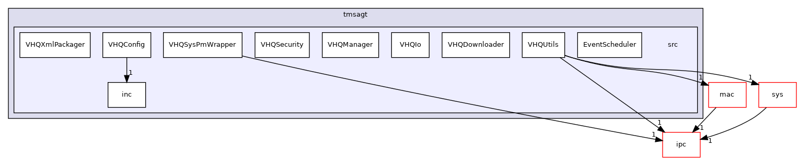

Directory dependency graph for src:

|  |  |
|----|----|
| Directories |  |
| directory   | <a href="dir_29538a2bbdfe557780da3549d4f67715.md">EventScheduler</a> |
| directory   | <a href="dir_a00d4a910169eda6e4cf562ea5c727be.md">inc</a> |
| directory   | <a href="dir_a30c4f39dab71242f2f35e237386a4d3.md">VHQConfig</a> |
| directory   | <a href="dir_58653564168e12e961bc5f04ca3375e0.md">VHQDownloader</a> |
| directory   | <a href="dir_e8da2933844aa72825eccee783cf08f3.md">VHQIo</a> |
| directory   | <a href="dir_4161ce7434f8485bfe001a92b4c405fb.md">VHQManager</a> |
| directory   | <a href="dir_7446380d78c4ab06b0f88c68276c07b1.md">VHQSecurity</a> |
| directory   | <a href="dir_2e151e0b75e9d9c1ff29ffca72564687.md">VHQSysPmWrapper</a> |
| directory   | <a href="dir_8067e1b9d01c079cf22ff7672b5922b3.md">VHQUtils</a> |
| directory   | <a href="dir_174da1da79813fe1707ddca9cdad46fc.md">VHQXmlPackager</a> |
