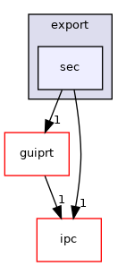

Directory dependency graph for sec:

|  |  |
|----|----|
| Files |  |
| file   | <a href="compatibility_helper_8h.md">compatibilityHelper.h</a> <a href="compatibility_helper_8h_source.md">[code]</a> |
|   | ADK Security Service Compatibility Helper.  |
| file   | <a href="_c_transaction_data_8h.md">CTransactionData.h</a> <a href="_c_transaction_data_8h_source.md">[code]</a> |
|   | ADK Security Service Transaction Data.  |
| file   | <a href="libsec_8h.md">libsec.h</a> <a href="libsec_8h_source.md">[code]</a> |
|   | ADK Security Service API.  |
| file   | <a href="libseccmd-comp_8h.md">libseccmd-comp.h</a> <a href="libseccmd-comp_8h_source.md">[code]</a> |
|   | ADK Security Service API (legacy)  |
| file   | <a href="sec2_8h.md">sec2.h</a> <a href="sec2_8h_source.md">[code]</a> |
|   | ADK Security Definitions.  |
| file   | <a href="sec_error_8h.md">secError.h</a> <a href="sec_error_8h_source.md">[code]</a> |
|   | ADK Security Service Error Codes.  |
| file   | <a href="seclogging_8h.md">seclogging.h</a> <a href="seclogging_8h_source.md">[code]</a> |
| file   | <a href="stacktrace_8h.md">stacktrace.h</a> <a href="stacktrace_8h_source.md">[code]</a> |
