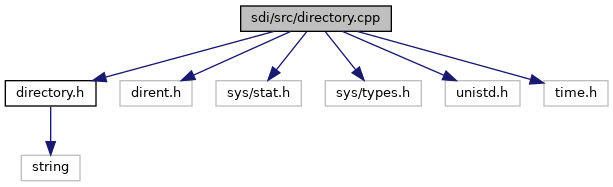

`#include "`<a href="directory_8h_source.md">directory.h</a>`"`
`#include <dirent.h>`
`#include <sys/stat.h>`
`#include <sys/types.h>`
`#include <unistd.h>`
`#include <time.h>`

Include dependency graph for directory.cpp:

