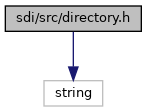
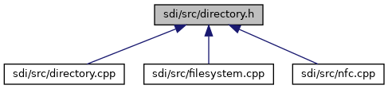

[Data Structures](#nested-classes)

`#include <string>`

Include dependency graph for directory.h:

This graph shows which files directly or indirectly include this file:

<a href="directory_8h_source.md">Go to the source code of this file.</a>

|  |  |
|----|----|
| Data Structures |  |
| class   | <a href="class_directory.md">Directory</a> |
| struct   | <a href="struct_directory_1_1_entry.md">Directory::Entry</a> |
