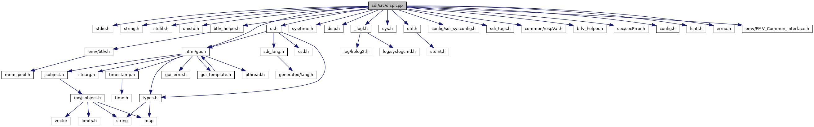

[Functions](#func-members)

`#include <stdio.h>`
`#include <string.h>`
`#include <stdlib.h>`
`#include <unistd.h>`
`#include "`<a href="btlv__helper_8h_source.md">btlv_helper.h</a>`"`
`#include "`<a href="gui_8h_source.md">html/gui.h</a>`"`
`#include "sys/time.h"`
`#include "`<a href="disp_8h_source.md">disp.h</a>`"`
`#include "`<a href="__logf_8h_source.md">_logf.h</a>`"`
`#include "`<a href="sys_8h_source.md">sys.h</a>`"`
`#include "`<a href="ui_8h_source.md">ui.h</a>`"`
`#include "`<a href="sdi_2src_2util_8h_source.md">util.h</a>`"`
`#include "config/sdi_sysconfig.h"`
`#include "`<a href="src_2sdi__tags_8h_source.md">sdi_tags.h</a>`"`
`#include "common/respVal.h"`
`#include "`<a href="config_8h_source.md">config.h</a>`"`
`#include <fcntl.h>`
`#include <errno.h>`
`#include "`<a href="_e_m_v___common___interface_8h_source.md">emv/EMV_Common_Interface.h</a>`"`

Include dependency graph for disp.cpp:

|  |  |
|----|----|
| Functions |  |
| void  | [handleDispCmd](#a5b3e410eb3656aac2880328377cd7eec) (unsigned short msgBufSize, unsigned char \*msg, unsigned long msgSize, unsigned short rspBufSize, unsigned char \*rsp, unsigned short \*rspSize) |

## FunctionDocumentation {#function-documentation}

## handleDispCmd() 

void handleDispCmd

Dispatch function to handle different Display commands

**Parameters**

\[in\] **msgBufSize** size of the input message buffer \[in\] **msg** pointer to the input message buffer \[in\] **msgSize** size of the input message \[in\] **rspBufSize** maximum size of the response buffer \[in,out\] **rsp** pointer to the response buffer \[in,out\] **rspSize** pointer to the response message size
